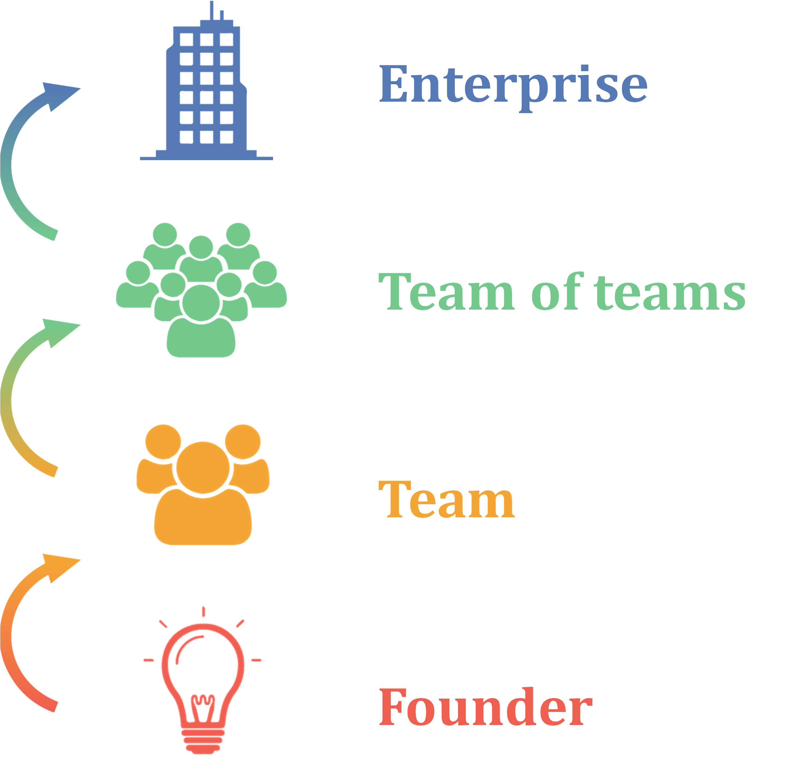

= The digital professional: Cloud, Agile, and DevOps from startup to enterprise (Collaborative Draft)
include::_masterAttrs.adoc[]
:instructor-ed:
:collaborator-draft:

ifdef::collaborator-draft[]

WARNING: This is the messy collaborative draft. It's full of notes and half-baked stuff. If you're not interested in this book's development, you should read (as appropriate) either: +
 +
the http://dm-academy.github.io/aitm/aitm-instructor.html[Instructor's Edition] +
 +
the http://dm-academy.github.io/aitm/index.html[Student Edition]

endif::collaborator-draft[]

include::_core.adoc[]
