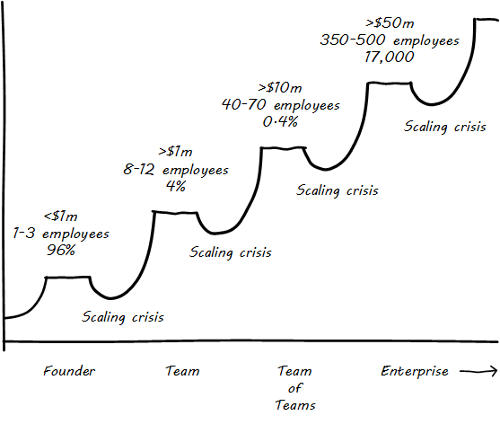

[[Introduction]]
=== Introduction

==== For the student
cite:[dummy]
This is a _survey_ text intended for the advanced undergraduate or graduate student interested in the general field of applied IT management. It is grounded in basic computing fundamentals but does not require any particular technical skills to understand. You do not need to have taken any courses in networking, security, or specific programming languages to understand this book. However, you will be presented with material on such topics, including fragments of programming languages and pseudocode, and you will need to be willing to invest the time and effort to understand.

This book makes frequent reference to digital startups—early stage companies bringing new products to market that are primarily delivered as some form of computer-based service. Whether or not you intend to pursue such endeavors, the startup journey is a powerful frame for your learning. Large information technology organizations in enterprises sometimes gain a reputation for losing sight of business value. IT seems to be acquired and operated for its own sake. Statements like “we need to align IT with the business!” are too often heard.

A digital startup exposes with great clarity the linkage between IT and “the business.” The success or failure of the company itself depends on the adept and responsive creation and deployment of the software-based systems. Market revenues arrive, or do not, based on digital product strategy and the priorities chosen. Features the market doesn’t need? You won’t have the money to stay in business. Great features, but your product is unstable and unreliable? Your customers will go to the competition.

The lessons that digital entrepreneurs have learned through this trial by fire shed great light on IT’s value to the business. Thinking about a startup allows us to consider the most fundamental principles as a sort of microcosm, a small laboratory model of the same problems that the largest enterprises face.

//cite:[dummy]
Verne Harnish, in the book _Scaling Up_ (cite:[VHarnish2014], pp. 25-26), describes how companies tend to cluster at certain levels of scale. (See <<fig-scaling-500-c>> footnote:[similar to cite:[VHarnish2014] (p. 25).)] The majority of firms never grow beyond a founder; a small percentage emerge as a viable team of 8-12, and even smaller numbers make it to the stable plateaus of 40-70 and 350-500. The "scaling crisis" is the challenge of moving from one major level to the next. (Harnish uses the more poetic term "Valley of Death.") This scaling model, and the needs that emerge as companies grow through these different stages, is the basis for this book's learning progression.

[[fig-scaling-500-c]]
.Organizations cluster at certain sizes

However, this is not a textbook (or course) on entrepreneurship. It remains IT-centric. *And, the book is also intended to be relevant to students entering directly into large, established enterprises.* In fact, it prepares the student for working in all stages of growth because it progresses through these four contexts:

* Individual (founder)
* Team
* Small company (team of teams)
* Enterprise

Whether in a startup or on a journey within a larger, established organization, you will (hopefully) become aware as you progress through a broadening context:

* Other team members
* Customers
* Suppliers
* Sponsors
* Necessary non-IT capabilities (finance, legal, HR, sales, marketing, etc.)
* Channel partners
* Senior executives and funders
* Auditors and regulators

Part of maturing in one’s career is understanding how all these relationships figure into your own overall system of value delivery. This will be a lifelong journey for the student; the author’s intent is to provide some useful tools.

anchor:reader-assumptions[]

==== Assumptions about the reader

* This book is written at the advanced undergraduate/graduate student level. It is currently available only in English.
* There is no assumption of deep IT experience, but it is assumed that the person will interact with computers in some capacity and has basic technical literacy. They should, for example, understand the concept of an operating system. An A+ certification, or an intro to programming class for example, would more than adequately prepare someone for this book.
* A person completely unfamiliar with computing will need to supplement their reading as suggested throughout the text. There is a wealth of free and accurate information on IT fundamentals (e.g., computing, storage, networking, programming, etc.), and this book seeks more to curate than replicate.

anchor:emergence-model[]

==== This book’s structure

In <<fig-emergence-400-c>> is a conceptual illustration of an IT management progression (read bottom to top):

[[fig-emergence-400-c]]
.IT management evolutionary model (read bottom to top)
image::images/emergence.png[emergence, 400]

Elaborating the above outline into chapters, we have:

..... *Founder*

. *IT value.* Why do we need computers? What can they do for us?
. *IT infrastructure.* We want to build something. We have to choose a platform first.
. *IT applications.* Let’s start building something of use to someone.

..... *Team*
[start=4]
. *Product management.* What exactly is it that we are building? What is the process of discovering our customer’s needs and quickly testing how to meet them? How do we better define the product vision, and the way of working towards it, for a bigger team?
. *Work management.* How do we keep track of what we are doing and communicate our progress and needs at the simplest level?
. *Operations management.* How do we sustain this surprisingly fragile digital service in its ongoing delivery of value?

WARNING: *The boundary between the “Team” and the “Team of Teams” is a challenging area, and industry responses remain incomplete and evolving.*
[start=3]
..... *Team of Teams*
[start=7]
. *Coordination.* When we have more than one team, they need to _coordinate_, which we define as "the process of managing dependencies among activities." There are many synchronization techniques to help us coordinate, including project and process management and Agile concepts. What is the future of process management as a delivery model?
. *Planning and investment.* We make investments in various products, programs, and/or projects, and we are now big enough that we have portfolios of them. How do we decide? How do we choose and work with our suppliers? How do we manage the finances of complex digital organizations? What is the future of project management as a delivery model?
. *Organization and culture.* We’re getting big. How do we deal with this?  How are we structured, and why that way? How can we benefit from increasing maturity and specialization while still maintaining a responsive digital product? How do we hire great people and get the most out of them? What are the unwritten values and norms in our company and how can we change them?

..... *Enterprise*
[start=10]
. *Governance, risk, security, and compliance.* We need to cope with structural and external forces (investors, directors, regulators, vendor partners, security adversaries, auditors) to whom we are ultimately accountable or who are otherwise defining our options. What are their motivations? How do we understand and control risk? How are we assured that our strategy, tactics, and operations are reasonable, sound, and thorough? And how do we protect ourselves from adversaries?
. *Enterprise information management.* We’ve been concerned with data, information, and knowledge since the earliest days of our journey. But at this scale, we have to formalize our approaches and understandings; without that, we will never capture the full value available with modern analytics and big data. Compliance issues are also compelling us to formalize here.
. *Architecture and portfolio.* We need to understand the big picture of interacting lifecycles, reduce technical debt and redundancy, accelerate development through establishing platforms, and obtain better economies of scale. We do so in part through applying techniques such as visualization, standardization, and portfolio management. We need to define our investment strategy based on a sound understanding of both business needs and technology limitations.

..... *Appendices*
. *The major frameworks*
. *Project management*
. *Process modeling*
//. *Towards a theory of IT management*
. *Recommended readings*
. *References*
. *Glossary*
. *Colophon*

anchor:formalization[]

==== Emergence means formalization
The emergence model seeks to define a likely order in which concerns are *formalized*. Any concern may of course arise at any time—the startup founder certainly is concerned with security! Formalization means at least one or more of the following:

* Dedicated resources
* Dedicated organization
* Defined policies and processes
* Automated tooling

In the author’s experience, for example, startups avoid formalized process and project management. To the extent the concerns exist, they are _tacit_ (understood or implied; suggested; implicit). Certainly, a small startup does not invest in an enterprise-class service desk tool supporting a full array of IT management processes or a full-blown project management office with its own vice president and associated portfolio automation. Simple work management, with a manual or automated Kanban board, is likely their choice for work management.

But by the time they are a team of teams, specialization has emerged and more robust processes and tools are required. Finally, the more complex, enterprise-scale concerns at the end of the book are presented as part of a logical progression.

The danger of course is that the formalization effort may be driven by its own logic and start to lose track of the all-critical business context. By carefully examining these stages of maturation, and the industry responses to them, it is the author’s hope that the student will have effective tools to critically engage with the problem of scaling the digital organization.
