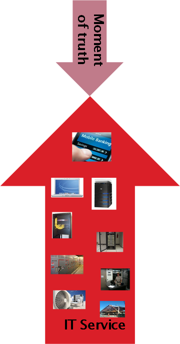

==== IT services, systems, and applications

===== Inside an IT service
.The basis of IT value footnote:[_Image credit https://www.flickr.com/photos/iicd/5348620457/, downloaded 2016-11-07, commercial use permitted_]
image::images/1_01-ITValue.png[alt="woman at computer", 400,, float="right"]

Let's examine our diner's value experience in more detail, without getting unnecessarily technical, and clarify some definitions along the way.  The first idea we need to cover is the "moment of truth." In terms of information technnology, this English-language cliché represents the user's experience of value.

ifdef::collaborator-draft[]
Not sure that "moment of truth" is quite appropriate - original definition could be interpreted as something relatively infrequent in the customer journey... perhaps "experience?"
endif::collaborator-draft[]

In the example, our friend seeking a relaxing night out had several moments of truth:

* Consulting her bank balance, and subsequent financial transactions also reflecting what was stated to her

* Making a reservation and having it honored on arrival at the restaurant

* Arriving on time to the restaurant, courtesy of the traffic application

* And most importantly, having a relaxed and refreshing time with her friends.

Each of these individual value experiences was co-created by our friend's desire for value, and the response of a set of IT resources.

IMPORTANT: The "moment of truth" represents the user's experience of value, from a product, good, or service.

In order to view her balance, our user is probably using an application downloaded from a "store" of applications made available to her device. On her device, this "app" is part of an intricate set of components performing functions such as:

* accepting "input" (user intent) through a screen or voice input
* processing that input through software and acting on her desire to see her bank balance
* connecting to the phone network
* securely connecting over the phone network to the Internet and then to the bank
* identifying the user to the bank's systems
* requesting the necessary information (in this case, an account balance)
* receiving that information and converting it to a form that can be represented on a screeen
* finally, displaying the information on the screen

The application, or "app," downloaded to the phone plays a primary role, but is enabled by:

* the phone's operating system and associated services
* the phone's hardware
* the telecommunications infrastructure (cell phone towers, long distance fiber optic cables, switching offices, and much more)

Of course, without the banking systems on the other end, there is no bank balance to transmit. These systems are similar, but on a much larger scale than our friend's device:

* Internet and middleware services to receive the request from the international network
* Application services to validate the user's identity and route the request to the appropriate handling service
* Data services to store the user's banking information (account identity and transactions) along with millions of other customers
* Many additional services to detect fraud and security attacks, report on utilization, identify any errors in the systems, and much more.
* Physical data centers full of computers and associated hardware including massive power and cooling infrastructure, and protected by security systems and personnel.

.The immensity of the IT stack
image::images/1_01-ITStack.png[technologies, 700,]

ifdef::collaborator-draft[]
 #designer to provide concept guidance, and/or re-draw
endif::collaborator-draft[]

Consider: what does all this mean to our user? Does she care about cell phone towers, or middleware, or triply-redundant industrial-strength Power Distribution Units? Usually, not in the least.

Therefore, as we study this world, we need to maintain awareness of her perspective. Our friend is seeking some value that IT uniquely can enable, but does not want to consider all the complexity that goes into it. She just wants to go out with friends. The moment of truth depends on the service; the service may contain great complexity, but part of its success lies in shielding the user from that complexity.

.The IT stack supports the moment of truth

ifdef::collaborator-draft[]
 #designer to provide concept guidance, and/or re-draw
endif::collaborator-draft[]

IMPORTANT: Always remember the user's experience. Information technology has a well deserved reputation for being too complicated for end users--for example, trying to do something that should be simple, and finding oneself in a technical conversation about network settings.

===== What versus how

This fundamental tension between *what* a system is supposed to do, versus *how* it does it, pervades IT management and will likely define your career. "Don't trouble me with the details, just give me the results" is the overall theme, and we encounter this reaction to complexity in many aspects of life.

Terminology is important. We need to have a more precise way of describing the information technology, beyond just saying there is "lots" of it. A variety of terms are used in this text:

* IT service
* Application
* IT system
* IT infrastructure

We also see discussion of components, resources, subsystems, assets, and many more terms.

WARNING: There are many debates around these definitions. Sometimes these debates are helpful in clarifying the terminology you want to use on your team. But sometimes the debates don't add any value. Beware of anyone who claims there is a "best practice" here.

In general, in this book, we will use the following definitions:

* An IT service is defined primarily in terms of WHAT not HOW
* Defining an IT system may include a discussion of both WHAT it does and HOW it does it
* An "application" usually means some IT service or system for end users who are not primarily concerned with IT other than wanting to get something done with it (e.g. go out to dinner)
* "Infrastructure" usually means some IT service or system that primarily supports OTHER IT services or systems (e.g. a network "service" is not usually useful to end users without additional application services.)

Finally, the concept of the "IT stack" is important. Notice how the different technology layers appear "stacked." Layered approaches to understanding IT are common; see Further Reading for useful references.

.Author's note: Service versus product
****
For the purposes of this book, "IT services" are equivalent to "products." You may in other contexts hear phrases like "products *versus* services" which imply that they are distinct. Usually, when products are contrasted with services, people are equating products with goods: a jar of peanut butter is a "product," while a haircut is a service.

However, when I worked at AT&T, the internal term for offerings like broadband networking access was not "service," but "product." Services, in this sense, *are* products.

In this book, we see products and services as roughly equivalent, but the two terms have some different connotations. Products usually imply an external market, where services can be either internal or external facing. While we certainly talk about "product marketing", the term "service marketing" is rarely seen. Furthermore,  some organizations such as Target have recently re-conceptualized internal services organizations as "product teams."
****
