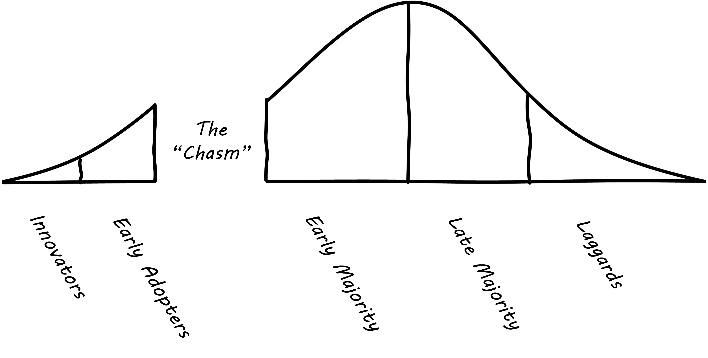
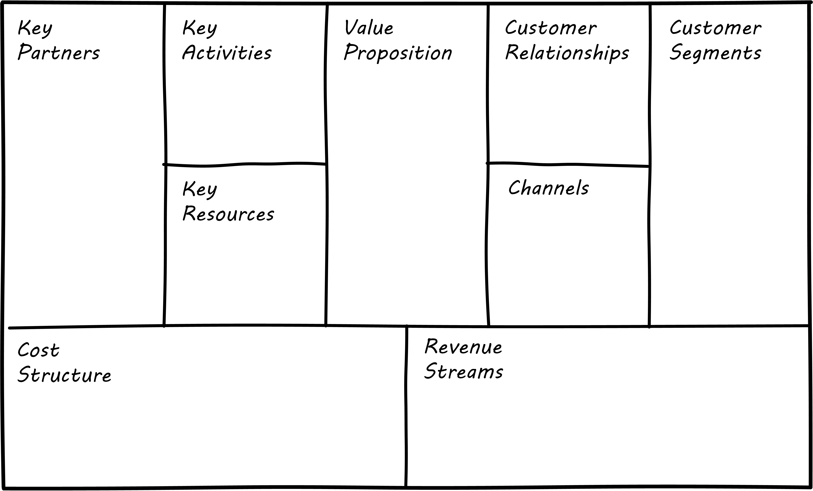
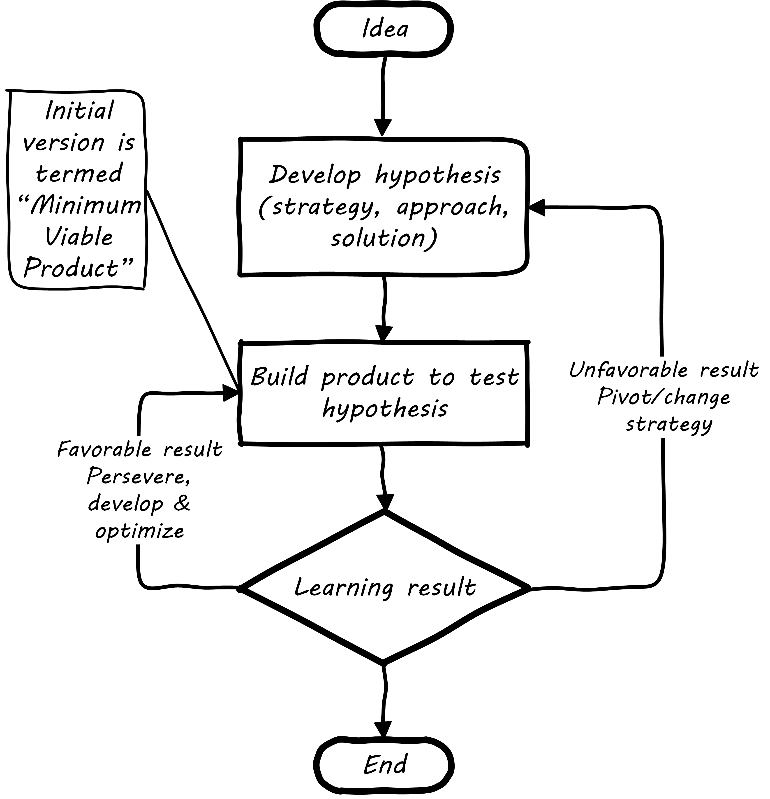

anchor:digital-context[]

==== Understanding digital context

[quote, Steve Blank, The Four Steps to the Epiphany]
most startups can only guess who their customers are and what markets they are in. cite:[Blank2013], p.37.

As you consider embarking on a journey of IT value, you need to orient to your surroundings and create an initial proposal or plan for how you will proceed. If you are actually a startup, you need a business plan. If you are working as an intrapreneur in a larger organization, you will still need some kind of formal proposal. This section describes some tools and thinking approaches that may be useful at this very earliest stage. There are more focused, product-specific approaches in the chapter 4 section on xref:prod-discovery-techniques[product discovery techniques].

===== Market facing, supporting, back office
In Chapter 1 we discussed the question of "who pays/who benefits" for the service, http://dm-academy.github.io/aitm/#_defining_consumer_customer_and_sponsor[proposing that] the service consumer, the service customer, and the service sponsor might be three distinct roles (sometimes collapsing into 2 or 1 individual.)

We see this again in how we can categorize the "customers" of IT services and systems. Roughly, such services can be:

* Directly market- and consumer-facing (e.g. Facebook), to be used by external consumers and paid for by either them or closely associated customers (e.g. Netflix, or an online banking system).
* Customer "supporting" systems, such as the online system that a bank teller uses when interacting with a customer. Customers do not interact directly with such systems, but customer-facing representatives do, and problems with such systems may be readily apparent to the end customer.
* Completely "back-office" systems (HR, payroll, marketing, etc)

Note however, that (especially in the current digitally transforming market) a service previously thought of as "back office" (when run internally) becomes "market-facing" when developed as a profit-seeking offering. For example, an HR system built internally is "back office," but Workday is a directly market-facing product, even though the two services may be similar in functionality.

In other words, it's all relative.

Especially when products are *not* market facing, we start to run into the problem of distinguishing xref:discovery-v-design[discovery versus design], as we discuss below.

===== Diffusion theory and other approaches

As you start to think about digital value, you must think about the context for your startup or product idea. What is the likelihood of its being adopted? Is it part of a broader "movement" of technological innovation? Where is the customer base in terms of its willingness to adopt the innovation? A well known approach is the idea of the "diffusion theory," first researched by Everett Rogers and proposed in his _Diffusion of Innovations,_ cite:[Rogers2003].

Rogers' research proposed the idea of "Adopter Categorization on the Basis of Innovativeness," with a well-known graphic (<<fig-diffusion-graph-500-c>>footnote:[Similar to cite:[Rogers2003] (figure 7-3, page 281)]):

[[fig-diffusion-graph-500-c]]
.Technology adoption categories
image::images/1_01a-adoption.png[diffusion-graph, 500, ,float="right"]

Rogers went on to characterize the various stages:

* Innovators: Venturesome risk-takers
* Early adopters: Opinion leaders
* Early majority: Deliberative, numerous
* Late majority: Skeptical, also numerous
* Laggards: Traditional, isolated, conservative

The above figure was popularized in the following variation by Geoffrey Moore cite:[Moore2014] in his bestseller _Crossing the Chasm_. footnote:[Similar to cite:[Moore2014] (p. 21)]

[[fig-chasm-500-c]]
.Purported "chasm" between adopter categories

You'll see this diagram often, but you should be aware that Rogers himself (the person who has researched the data) says that (p.282):

_Past research shows no support for this claim of a “chasm” between certain adopter categories. On the contrary, innovativeness, if measured properly, is a continuous variable and there are no sharp breaks or discontinuities between adjacent adopter categories (although there are important differences between them)_.

The idea of technology diffusion frames the problem for us, but we need more. Steve Blank, in his influential book _The Four Steps to Epiphany_ cite:[Blank2013], argues there are four categories for startups (p.31):

* Startups that are entering an existing market
* Startups that are creating an entirely new market
* Startups that want to re-segment an existing market as a low-cost entrant
* Startups that want to re-segment an existing market as a niche player

Understanding which category you are attempting is critical, because "the four types of startups have very different rates of customer adoption and acceptance."

Another related and well known categorization of competitive strategies comes from Michael Treacy and Fred Wiersma cite:[Treacy1997]:

* Customer intimacy
* Product leadership
* Operational excellence

It is not difficult to categorize well known brands in this way:

.Companies and their competitive strategies
[cols="3*", options="header"]
|====
|Customer intimacy|Product leadership|Operational excellence
|Nordstrom +
Home Depot
|Apple +
Nike
|Dell Technologies +
Walmart
|====

However, deciding which strategy to pursue as a startup may require some experimentation.

===== Business discovery approaches
[quote, Steve Blank, The Four Steps to Epiphany]
Startups that survive the first few tough years do not follow the traditional product-centric launch model espoused by product managers or the venture capital community...In particular, the winners invent and live by a process of customer learning and discovery. I call this process “Customer Development,” a sibling to “Product Development,” and each and every startup that succeeds recapitulates it, knowingly or not.

Let's start with two well known approaches that can help you bridge from an understanding of your product context, to an effective vision for building and sustaining a product:

* Alexander Osterwalder's Business Model Canvas
* Eric Ries' Lean Startup

anchor:biz-model-canvas[]

====== Business model canvas

One recent book that's been influential among enterpreneurs is Alex Osterwalder's _Business Model Generation_ cite:[Osterwalder2010].

This book is perhaps best known for introducing the concept of the Business Model Canvas, which it defines as "A shared language for describing, visualizing, assessing, and changing business models."

The Business Model Canvas uses 9 major categories to describe the business model:

* Key Partners
* Key Activities
* Value Proposition
* Customer Relationships
* Customer Segments
* Key Resources
* Channels
* Cost Structure
* Revenue Streams

and suggests they be visualized as in <<fig-BizModelCanvas-600-c>> footnote:[Similar to cite:[Osterwalder2010], p. 44]

[[fig-BizModelCanvas-600-c]]
.Business Model Canvas

The canvas is then used in collaborative planning, e.g. as a large format wall poster where the business team can brainstorm, discuss, and fill in the boxes (e.g., what is the main "Value Proposition"? Mobile bank account access?).

[[fig-BMC-example-600-c]]
.Rough approximation of author's Business Model Canvas
image::images/1_01-BMC-example.png[author's business model canvas, 600]

Osterwalder and his colleagues, in _Business Model Generation_ and the followup _Value Proposition Design_ cite:[Osterwalder2014], suggest a wide variety of imaginative and creative approaches to developing business models and value propositions, in terms of patterns, processes, design approaches, and overall strategy.

anchor:business-case-analysis[]

====== Business case analysis

There are a wide variety of analysis techniques for making a business case at a more detailed level. Donald Reifer, in _Making the Software Business Case_ cite:[Reifer2002], lists:

* Breakeven analysis
* Cause-and-effect analysis
* Cost/benefit analysis
* Value chain analysis
* Investment opportunity analysis
* Pareto analysis
* Payback analysis
* Sensitivity analysis
* Trend analysis

A primary theme of this book is that empirical, experimental approaches are essential to digital management. Any analysis, carried to an extreme without a sound basis in real data, risks becoming a "castle in the air." But when you are putting real money on the line (even the opportunity costs of the time you are spending on your startup), it is advisable to look at the decision from various perspectives. These techniques can be useful for that purpose. However, once you have some indication there might be business value in a given idea, applying Lean Startup techniques may be more valuable than continuing to analyze.

anchor:lean-startup[Lean Startup]

====== Lean Startup

[quote, Eric Ries, The Lean Startup]
The goal of a startup is to figure out the right thing to build— the thing customers want and will pay for— as quickly as possible. In other words, the Lean Startup is a new way of looking at the development of innovative new products that emphasizes fast iteration and customer insight, a huge vision, and great ambition, all at the same time.

[[fig-leanStartup-400-i]]
.Lean Startup flowchart

Lean Startup is a philosophy of entrepreneurship developed by Eric Ries cite:[Ries2011]. It is not specific to information technology; rather, it is broadly applicable to all attempts to understand a product and its market. (Remember according to our xref:prod-mgmt-definition[definition of product management] that a workable market position is essential to any product.)

The idea of the Lean Startup has had profound influence on product design, including market-facing and even internal IT systems. It is grounded in Agile concepts such as:

"Do the simplest thing that could possibly work."

Lean Startup calls for an iterative, "Build-Measure-Learn" cycle. Repeating this cycle frequently is the essential process of building a successful startup (whatever the digital proportion).

* Develop an idea for a Minimum Viable Product (MVP)
* Measure its effectiveness in the market (internal/external)
* Learn from the experiment
* Decide to persevere or pivot (change direction while leveraging momentum)
* New idea development, evolution of MVP

Flowcharts such as the one shown are often seen to describe the Lean Startup process. We will go into much more depth on product management in Chapter 4 and Part III.

ifdef::collaborator-draft[]

Bente notes that Broadbent and Kitzis (2005) distinguish three fundamental business outlooks- fighting for survival, maintaining competitiveness, breaking away

===== The enterprise context
 We will discuss in Chapter 12. For now, assume that your role and priorities are defined by some strategic planning and investment activities. You need to understand the mission to the best of your abilities, even as an individual contributor. This book will take you through the journey of understanding how such priorities are set.

 important - commentary on Agile Product Roadmap - arrow https://twitter.com/ScrumDan/status/786729964422909953

 when do they become explicit?

===== Current digital business trends

****
*Sidebar: The Digital Services Playbook*
Understand what people need
Address the whole experience, from start to finish
Make it simple and intuitive
Build the service using agile and iterative practices
Structure budgets and contracts to support delivery
Assign one leader and hold that person accountable
Bring in experienced teams
Choose a modern technology stack
Deploy in a flexible hosting environment
Automate testing and deployments
Manage security and privacy through reusable processes
Use data to drive decisions
Default to open
****

====== Apps

====== Big Data

====== Internet of Things

====== Platforms not products

 Bring in Rauser: Digital Strategy: A Guide to Digital Business Transformation, Rogers: The Digital Transformation Playbook: Rethink Your Business for the Digital Age, and Westerman various.

 "Post-industrialism turns brand management into a digital conversation between a company and its customers." cite:[Sussna2015]

 images

 https://www.flickr.com/photos/usnavy/28073762161

 * demand vs. supply
 * problem vs. solution
 * outside-in vs. inside-out thinking
 * service vs. system
 * black-box vs glass box

endif::collaborator-draft[]
