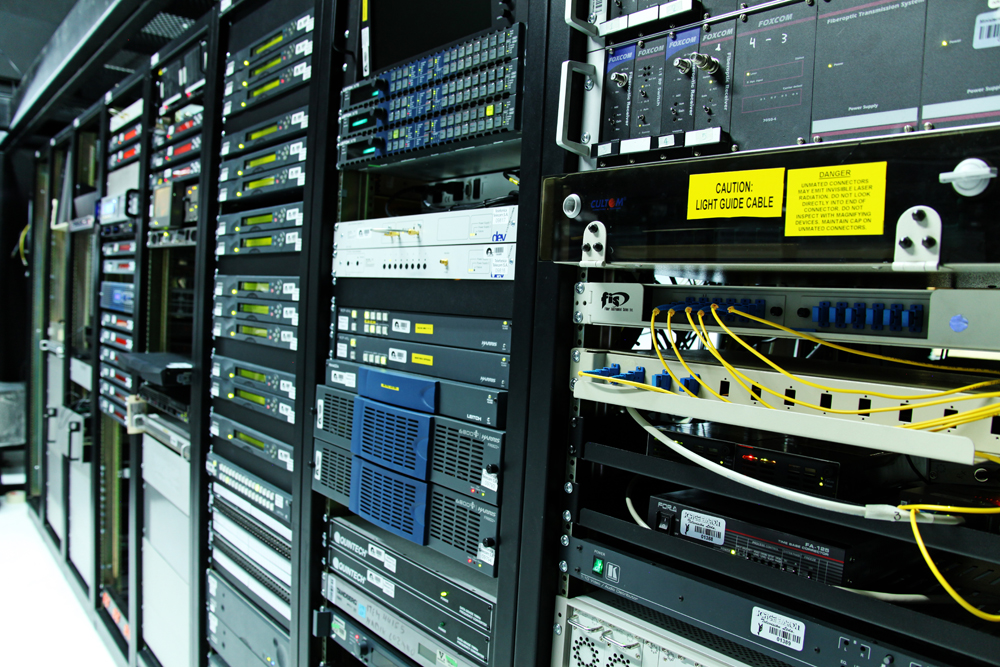

anchor:chapter-2[]

=== Chapter 2: Infrastructure Management

==== Introduction

ifdef::collaborator-draft[]

****
*Collaborative*

Status 2016-11-2016: This chapter is in "draft 1.5" - improved from original first draft completed in 2015.

_There is a wealth of material covering IT infrastructure in far more detail than possible here. We don't want to rewrite Morris, Allspaw or Limoncelli. Curating the most useful aspects for a survey text is the challenge._

_Note that Chapter 6 is dedicated to IT operations._

* Raise an link:https://github.com/dm-academy/aitm/issues[issue, window="_blank"] to comment
* link:https://raw.githubusercontent.com/dm-academy/aitm/master/book/PATH_TO_FILE.adoc[Github source, window="_blank"]
* link:https://github.com/dm-academy/aitm/blob/master/collaborator-instructions.adoc[Collaborator instructions, window="_blank"]

_Collaboration notes_

****

endif::collaborator-draft[]

.Racks in a data center footnote:[_Image credit https://www.flickr.com/photos/ministerio_tic/6812435353, downloaded 2016-11-12, commercial use permitted_]

As mentioned in the Part Introduction, you cannot start developing a product until you decide what you will build it with. (You may have a difficult time writing an app for a mobile phone if you choose the COBOL programming language!)  You also need to understand something of how computers are operated, enough so that you can make decisions on how your system will run. Most startups choose to run IT services on infrastructure owned by a Cloud provider, but there are other options. Certainly, as you scale up, you'll need to be more and more sophisticated in your understanding of your underlying IT services.

Configuring your base platform is one of the most important capabilities you will need to develop. You'll never stop doing it. The basis of modern configuration management is https://en.wikipedia.org/wiki/Version_control[version control], which we cover here.

This is one of the more technical chapters. Supplementary reading may be required for those completely unfamiliar with computing. See xref:_assumptions_of_the_reader[Assumptions of the Reader] for notes on the book's approach.

===== Chapter summary

* Introduction
** Chapter summary
** Learning objectives
* Infrastructure overview
** What is Infrastructure?
** Basic IT infrastructure concepts
* Choosing infrastructure
** From "physical" compute to Cloud
** Virtualization
** Why is virtualization important?
** Virtualization versus cloud
** Containers and looking ahead
* Infrastructure as code
** A simple infrastructure as code example
* Configuration management: the basics
** What is version control?
** Package management
** Deployment management
* Topics in IT infrastructure
** Configuration management, version control, and metadata
* Conclusion
** Discussion questions
** Research & practice
** Further reading

===== Learning objectives
* Understand fundamental principles of operating computers as infrastructure for a service
* Understand Cloud as a computing option
* Understand basic principles of "infrastructure as code"
* Understand the importance and basic practices of version control and why it applies to infrastructure management
