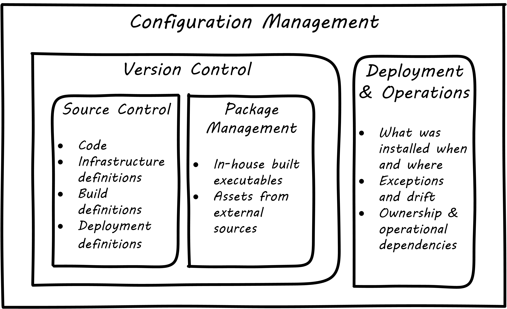

anchor:version-control[]

==== Configuration management: the basics
Configuration management is a critically important practice in digital systems, and has always been so. How it is performed has evolved over time. At this stage in our journey, we are one or two people in a startup, working with digital artifacts such as our xref:infra-code-example[iac.sh example] discussed in the previous section.

One or two people can achieve an impressive amount with modern digital platforms. But the work is complex. Tracking and controlling your work products as they evolve through change after change is important from day one of your efforts. It's not something you want to put off to "later when I have time." This applies to computer code, configurations, and increasingly even documentation (often written in a lightweight markup language like Markdown or Asciidoc). In terms of infrastructure, configuration management requires three capabilities:

* The ability to back up or archive a system's operational state (in general, not including the data it is processing - that is a different concern). Taking the backup should not require taking the system down.
* The ability to compare two versions of the system's state and identify differences
* The ability to restore the system to a previously archived operational state.

In this section, we will discuss the following topics:

* Version control
* Source control
* Package management
* Deployment management
* Configuration management

and their relationships.

===== What is version control?

[quote, Andrew Clay Shafer, Web Operations:Keeping the Data On Time]
In software development, version control is the foundation of every other Agile technical practice. Without version control, there is no build, no TDD, no continuous integration.

The Agile Alliance indicates “version control” as one of the https://www.agilealliance.org/agile101/subway-map-to-agile-practices/[four foundational areas of Agile] cite:[Alliance2016], along with team, iterative development, and incremental development. Why is this? Version control is critical for any kind of system with complex, changing content, especially when many people are working on that content. Version control provides the capability of seeing the exact sequence of a complex system's evolution and isolating any particular moment in its history, or providing detailed analysis on how two versions differ. With version control, we can understand what changed and when, which is essential to coping with complexity.

While version control was always deemed important for software artifacts, it has only recently become the preferred paradigm for managing infrastructure state as well.  Because of this, version control is possibly the first IT management system you should acquire and implement (perhaps as a cloud service, such as Github).

Version control in recent years increasingly distinguishes between source and package management (see <<fig-versionControlTypes-300-c>>): the management of binary files, as distinct from human-understandable symbolic files. There is also a need to understand what versions are installed on what computers; this can be termed "deployment management." (With the advent of containers, this is a particularly fast changing area.)

[[fig-versionControlTypes-300-c]]
.Types of version control
image::images/1_02-versionControlTypes.png[Version control types, 300,]

Version control works like an advanced file system with a memory. (Actual file systems that do this are called https://en.wikipedia.org/wiki/Versioning_file_system[_versioning_] file systems.) It can remember all the changes you make to its contents, tell you the differences between any two versions, and also bring back the version you had at any point in time. Version control is important - but how important? Survey research presented in the annual State of DevOps report indicates that version control is one of the most critical practices associated with high performing IT organizations cite:[Forsgren2016>>. Nicole Forsgren <<Forsgren2016a]  summarizes the practice of version control as:

* Our application code is in a version control system
* Our system configurations are in a version control system
* Our application configurations are in a version control system
* Our scripts for automating build and configuration are in a version control system.

====== Source control

Digital systems start with text files, typically encoded in https://en.wikipedia.org/wiki/ASCII[ASCII]. Text editors create source code, scripts, and configuration files. These may be transformed in defined ways (e.g. by compilers and build tools) but the human understandable end of the process is mostly based on text files. In the previous section, we described a xref:infra-code-example[simple script] that altered the state of a computer system. We care very much about when such a text file changes. One wrong character can completely alter the behavior of a large, complex system. Therefore, our configuration management approach must track to that level of detail.

Source control is at its most powerful when dealing with textual data. It is less useful in dealing with  binary data, such as image files. Text files can analyzed for their differences in an easy to understand way. If I change "abc" to "abcd" it is clear that the third character has been changed from “c” to “d.” On the other hand, if I take a picture (e.g. as a *.png file) and alter one pixel, and compare the resulting before and after binary files in terms of their data, it would be more difficult to understand what had changed. I might be able to easily tell that they are two different files, but they would look very similar and the difference in the binary data might be difficult to understand. Here is a detailed demonstration, using the command line in Ubuntu Linux. (Don't worry, we will explain what is going on.)

NOTE: In the below sequence, what you see after the "$" sign is what is being typed. If there is no "$" sign, it is what the system is saying in response.

First, we create a directory (similar to the xref:infra-code-example[iac.sh example script]):

 ~$ mkdir tmpgit

Then, we navigate to it:

 ~$ cd tmpgit/

And activate git source control:

 ~/tmpgit$ git init
 Initialized empty Git repository in /home/char/tmpgit/.git/

We create a simple program:

 ~/tmpgit$ echo 'print "hello world!";' > tmp.py

And run it:

 ~/tmpgit$ python tmp.py
 hello world!

We stage it for source control:

 ~/tmpgit$ git add . tmp.py

And commit it:

 ~/tmpgit$ git commit -m "first commit"
 [master (root-commit) cabdbe3] first commit
 1 file changed, 1 insertion(+)
 create mode 100644 tmp.py

The file is now under version control. We can change our working copy and run it:

 ~/tmpgit$ echo 'print "hello universe\n";' > tmp.py
 ~/tmpgit$ python tmp.py
 hello universe!

When the "echo" command is run with just one ">" it replaces the data in the target file completely. So we have completely replaced "hello world!" with "hello universe!"

And - *most critically* - we can see what we have changed!
....
~/tmpgit$ git diff
diff --git a/tmp.py b/tmp.py
index 0ecbd83..a203522 100644
--- a/tmp.py
+++ b/tmp.py
@@ -1 +1 @@
-print "hello world!";
+print "hello universe!";
....

Notice the "-" (minus) sign before 'print "hello world!";' -- that means it has been deleted. The "+" (plus) sign before 'print "hello universe!";' means that line has been added.

We can restore the original file (note that this eradicates the working change we made!)

 char@elsa:~/tmpgit$ git checkout .
 char@elsa:~/tmpgit$ python tmp.py
 hello world!

If you have access to a computer, try it! (You will need to install git, and if you are on Windows you should use WSL, the Windows Subsystem for Linux.)

In comparison, the following are two 10x10 gray-scale bitmap images being edited in the https://www.gimp.org/[Gimp image editor]. They are about as simple as you can get. Notice (in <<fig-bothPixels-500-c>>) that they are slightly different.

[[fig-bothPixels-500-c]]
.Bitmap
image::images/1_02-bothPixels.png[grid, 500]

If we save these in the *.png format, we can see they are different sizes (242 k vs 239k). But if we open them in a binary editor it is very difficult to understand how they differ (compare <<fig-pixelHex1-500-c>> with <<fig-pixelHex2-500-c>>).

[[fig-pixelHex1-500-c]]
.First file binary data
image::images/1_02-pixelHex1.png[data, 500]

[[fig-pixelHex2-500-c]]
.Second file binary data
image::images/1_02-pixelHex2.png[data, 500]

Even if we analyzed the differences, we would need to know much about the .png format in order to understand how the two images differ. We can still track both versions these files, of course, with the proper version control. But again, binary data is not ideal for source control tools like git.

====== The "commit" concept

Although implementation details may differ, all version control systems have some concept of “commit.” As stated in _Version Control with Git_ cite:[Loeliger2009]:

_In Git, a commit is used to record changes to a repository… Every Git commit represents a single, *atomic* changeset with respect to the previous state. Regardless of the number of directories, files, lines, or bytes that change with a commit… either all changes apply or none do._ [emphasis added]

NOTE: *Why "atomic"? The word atomic derives from the ancient Latin language, and means "indivisible." An atomic set of changes is either entirely applied, or entirely rejected. Atomicity is an important concept in computing, and transaction processing in particular. If our user tries to move money from her savings to her checking account, two operations are required: (1) reduce savings and (2) increase checking. Either both need to succeed, or both need to fail. That is the classic definition of an "atomic" transaction. Version control commits should be atomic.

The concept of a version or source control https://en.wikipedia.org/wiki/Commit_(data_management)[“commit”] is a rich foundation for IT management and governance. It both represents the state of the computing system as well as providing evidence of the human activity affecting it. As we will see in Chapter 3, the “commit” identifier is directly referenced by build activity, which in turn is referenced by the release activity, which is typically visible across the IT value chain.

Also, the concept of an atomic “commit” is essential to the concept of a “branch” - the creation of an experimental version, completely separate from the main version, so that various alterations can be tried without compromising the overall system stability. Starting at the point of a “commit,” the branched version also becomes evidence of human activity around a potential future for the system. In some environments, the branch is automatically created with the assignment of a requirement or story - again, more on this to come in chapter 3. In other environments, the very concept of branching is avoided.

anchor:package-mgmt[]

===== Package management

[quote, Puppet Labs 2015 State of DevOps report]
Implement version control for all production artifacts. cite:[PuppetLabs2015]

In some organizations, it was once common for compiled binaries to be stored in the same repositories as source code. However, this is no longer considered a best practice. Source and package management are now viewed as two separate things.  Source repositories should be reserved for text-based artifacts whose differences can be made visible in a human-understandable way. Package repositories in contrast are for binary artifacts that can be deployed.

Package repositories also can serve as a proxy to the external world of downloadable software. That is, they are a cache, an intermediate store of the software provided by various "upstream" sources. For example, developers may be told to download the approved Ruby on Rails version from the local package repository, rather than going to the getting the latest version, which may not be suitable for the environment.

Package repositories are also used to enable collaboration between teams working on large systems. Teams can check in their built components into the package repository for other teams to download. This is more efficient than everyone  always building all parts of the application from the source repository.

The boundary between source and package is not hard and fast, however. One does see binary files in source repositories, such as images used in an application. Also, when interpreted languages (such as Javascript) are "packaged," they still appear in the package as text files, perhaps compressed or otherwise incorporated into some larger containing structure.

anchor:deployment-mgmt[]

===== Deployment management

Version control is an important part of the overall concept of configuration management. But configuration management also covers the matter of how artifacts under version control are combined with other IT resources (such as virtual machines) to deliver services. The following illustration is one way to think about the relationships:

.Configuration management and its components

====== Deployment basics

Resources in version control in general are not yet active in any value-adding sense. In order for them to deliver experiences, they must be combined with computing resources: servers (physical or virtual), storage, nettworking, and the rest, whether owned by the organization or leased as xref:cloud[Cloud services]. The process of doing so is called deployment. Version control manages the state of the artifacts; deployment management (as another configuration management practice) manages the *combination of those artifacts with the needed resources for value delivery*.

anchor:policy-config[]

====== Imperative and Declarative

Before we turned to source control, we looked at a xref:infra-code-example[simple script] that changed the configuration of a computer. It did so in an _imperative_ fashion. Imperative and declarative are two important terms from computer science.

.A simple example of “declarative” vs “imperative”
****
*Declarative:* "Our refrigerator should always have a gallon of milk in it.”

*Imperative:* “Go out the door, take a right, take a left, go into the building with a big ‘SA’ on it, go in to the last aisle, take a left, go to the third case and take the first container on the fourth shelf from the bottom. Give money to the cashier and bring the container back home.”
****

In an imperative approach, we tell the computer specifically how we want to accomplish a task, e.g.:

. Create a directory
. Create some files
. Create another directory
. Create more files

And so on. Many traditional programming languages take an imperative approach. A script such as xref:infra-code-example[iac.sh example] is executed line by line, i.e., it is imperative. In configuring infrastructure, scripting is in general considered “imperative," but state of the art infrastructure automation frameworks are built using a “declarative,” policy-based approach, in which the object is to define the desired end state of the resource, not the steps needed to get there.  With such an approach, instead of defining a set of steps, we simply define the proper configuration as a target, saying (in essence) that "this computer should always have a directory structure thus; do what you need to do to make it so and keep it this way."

More practically, declarative approaches are used to ensure that the proper versions of software are always present on a system, and that configurations such as Internet ports and security settings do not vary from the intended specification.

This is a complex topic and there are advantages and disadvantages to each approach. (See "When and Where Order Matters" by Mark Burgess for an advanced discussion cite:[Burgess2016].) But policy-based approaches seem to have the upper hand for now.
