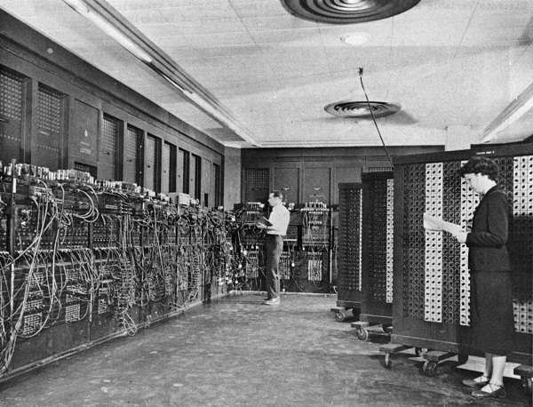

==== Basics of applications and their development

===== Defining "Application"

In keeping with our commitment to theory and first principles, we use an engineering definition of "application." To an electrical engineer, a toaster or a light bulb is an "application" of electricity. Similarly, a customer relationship management system, or a Web video on demand service, are "applications" of the core computer infrastructure we studied in the last chapter.

===== History of applications and application software

.The ENIAC -- "programmed" by cable reconfiguration. footnote:[_Image credit https://en.wikipedia.org/wiki/ENIAC, downloaded 2015-10-01, commercial use permitted_]

Without applications, computers would be merely a curiousity. Computers were first "applied" to military needs for codebreaking and artillery calculations. After World War II, ex-military officers like https://en.wikipedia.org/wiki/Edmund_Berkeley[Edmund Berkeley] at Prudential realized their potential if "applied" to problems like insurance record keeping. <<Akera2007>> At first, such systems required actual manual configuration (as in the ENIAC photo in this section), or painstaking programming in complex, tedious, and unforgiving https://en.wikipedia.org/wiki/Low-level_programming_language[low-level programming languages]. As the value of computers became obvious, investment was made in making programming easier through more powerful languages.

The  https://en.wikipedia.org/wiki/History_of_software[history of software] is well documented. Low level languages (https://en.wikipedia.org/wiki/Binary_code[binary] and https://en.wikipedia.org/wiki/Assembly_language[assembler]) were increasingly replaced by higher level languages (https://en.wikipedia.org/wiki/Fortran[FORTAN], https://en.wikipedia.org/wiki/COBOL[COBOL], https://en.wikipedia.org/wiki/C_(programming_language)[C]). Proprietary machine/language combinations were replaced by open standards and https://en.wikipedia.org/wiki/Compiler[compilers] that could take one kind of source code and build it for different hardware platforms. Many languages followed, such as https://en.wikipedia.org/wiki/Java_(programming_language)[Java], https://en.wikipedia.org/wiki/Visual_Basic[Visual Basic], and https://www.javascript.com/[Javascript]. Extensive middleware was developed to enable ease of programming, communication across networks, and standardize common functions.

Today, we have extensive frameworks like https://struts.apache.org/[Struts], https://projects.spring.io/spring-framework/[Spring], and http://rubyonrails.org/[Ruby on Rails], along with interpreted languages that take much of the friction out of building and testing code. But even today, the objective remains to create a https://en.wikipedia.org/wiki/Executable[binary executable] file or files that computer hardware can "execute," that is, turn into a computing-based value experience, mediated through devices such as workstations, laptops, smart phones, and their constituent components.

===== Applications and infrastructure: the old way

In the first decades of computing, any significant application of computing power to a new problem typically required its own xref:what-is-IT-infrastructure[infrastructure], often designed specifically for the problem. While awareness existed that computers in theory could be "general purpose," in practice this was not so easy. Military/aerospace needs differed from corporate information systems, which differed from scientific and technical uses. And major new applications required new compute capacity.

Take for example when a large organization in 1998 decided to replace its mainframe Human Resources system due to https://en.wikipedia.org/wiki/Year_2000_problem[Y2K concerns]. Such a system might need to support several thousand users around the world. At that time, PeopleSoft was a frequent choice of software. Implementing such a system was often led by consulting firms such as Deloitte or Andersen Consulting (where the author worked). A typical PeopleSoft package implementation would include:

* https://en.wikipedia.org/wiki/PeopleSoft[PeopleSoft] software, including the PeopleTools framework and various modules written in the framework (e.g. the well-regarded PeopleSoft HR system)
* https://en.wikipedia.org/wiki/Oracle_Database[Oracle database] software
* AT&T "Tuxedo" https://en.wikipedia.org/wiki/Transaction_processing[transaction manager]
* Autosys https://en.wikipedia.org/wiki/Job_scheduler[job scheduler]
* https://en.wikipedia.org/wiki/HP-UX[HP-UX operating system]
* HP-UX servers, perhaps 20 or so, comprising various "environments" including a production "cluster" consisting of application and database servers
* https://en.wikipedia.org/wiki/EMC_Corporation[EMC] storage array
* Various ancillary software and hardware: management utilities and scripts, backup, networking, etc.
* Customization of the PeopleSoft HR module and reports by hired consultants, to meet the requirements of the acquiring organization

The software and hardware needed to be specified in keeping with requirements, and acquiring it took lengthy negotiations and logistics and installation processes. Such a project from inception to production might take 9 months (on the short side) to 18 or more months.

Hardware was dedicated and rarely re-used. The HP servers compatible with PeopleSoft might have few other applications, if they became surplus. In fact, PeopleSoft would "certify" the infrastructure for compatibility. Upgrading the software might require also upgrading the hardware. In essence, this sort of effort had a strong component of https://en.wikipedia.org/wiki/Systems_engineering[systems engineering], as designing and optimizing the hardware component was a significant portion of the work.

===== Applications and infrastructure today
Today, matters are quite different, and yet echoes of the older model persist. As mentioned, ANY  compute workloads are going to incur economic cost. However, capacity is being used more efficiently and can be provisioned on demand. Currently, it is a significant application indeed that merits its own systems engineering.

NOTE: To "provision" in an IT sense means to make the needed resources or services available for a particular purpose or consumer.

Instead, a variety of mechanisms (as covered in the previous chapter's http://dm-academy.github.io/aitm/#_from_physical_compute_to_cloud[discussion of Cloud systems]) enable the sharing of compute capacity, the raw material of application development. The fungibility and agility of these mechanisms increase the velocity of creation and evolution of application software. For small and medium sized applications, the overwhelming trend is to xref:virtualization[virtualize]
 and run on  commodity hardware and operating systems. Even 15 years ago, non-trivial web sites with database integration would be hosted by internal https://en.wikipedia.org/wiki/Platform_as_a_service[PaaS] clusters at major enterprises (for example, Microsoft ASP, COM+, and SQL Server clusters could be managed as multi-tenant -- the author wrote systems on such a platform).

The general purpose capabilities of virtualized public and private Cloud today are robust. Assuming the organization has the financial capability to purchase computing capacity in anticipation of use, it can be instantly available when the need surfaces. Hardware engineering is more and more independent of the application lifecycle; the trend is towards providing compute as a service, carefully specified in terms of performance, but NOT particular hardware. Hardware physically dedicated to a single application is rarer, and even the largest engineered systems are more standardized so that they may one day benefit from Cloud approaches.  Application architectures have also become much more powerful. Interfaces (interaction points for applications to exchange information with each other, generally in an automated way) are increasingly standardized. Applications are designed to scale dynamically with workload and are more stable and reliable than in years past.

In the next chapter, we will discuss how the practices of application development have evolved to their current state.
