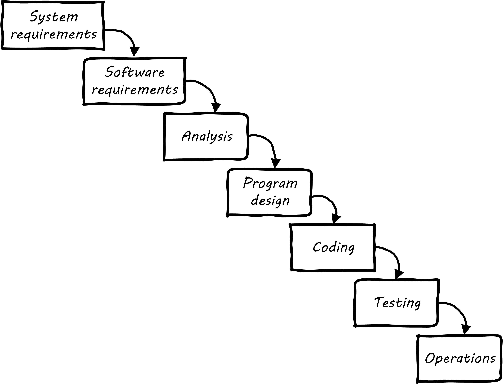
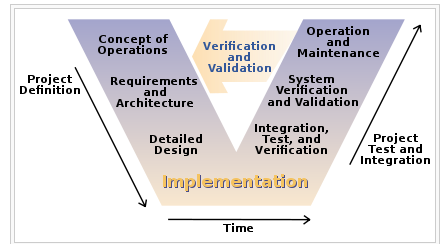
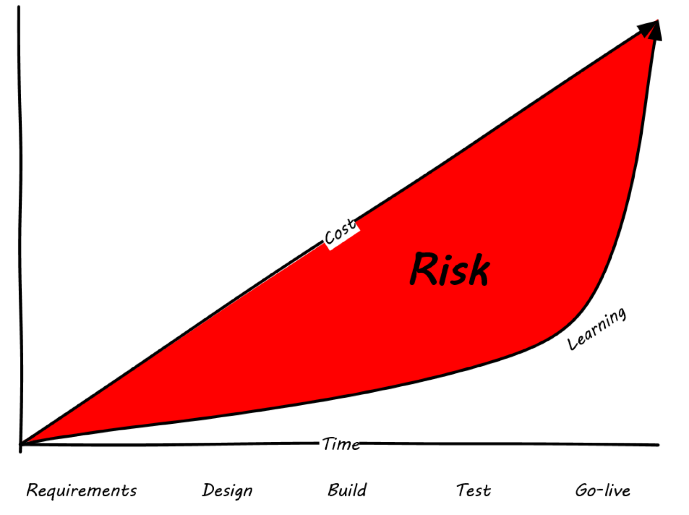
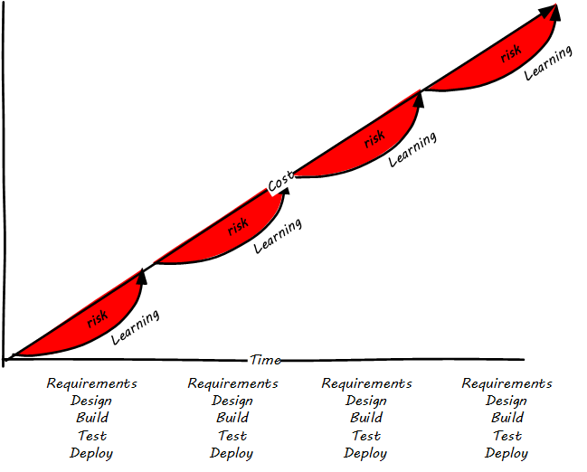

anchor:Agile-history[]

==== From waterfall to Agile

This is not a book on software development per se, nor on Agile development. There are hundreds of books available on those topics. But, no assumption is made that the reader has any familiarity with these topics, so some basic history is called for. (If you have taken an introductory course in software engineering, this will likely be review.)

When the author first joined Andersen Consulting (now Accenture) in 1998, we were schooled in something called the Business Integration Method, or BIM. The BIM was a classic expression of what is called “waterfall development".

What is waterfall development? It is a controversial question. The original theorist who coined the term named it in order to critique it cite:[Royce1970]. Military contracting and management consultancy practices, however, embraced it, as it provided an illusion of certainty. The fact that computer systems until recently included a substantial component of hardware systems engineering may also have contributed.

Waterfall development as a term has become associated with a number of practices. The original illustration was similar to <<fig-waterfall-500-c>> footnote:[similar to cite:[Royce1970]):

[[fig-waterfall-500-c]]
.Waterfall lifecycle

First, requirements need to be extensively captured and analyzed before the work of development should commence. So, the project team would develop enormous spreadsheets of requirements, spending weeks on making sure that they represented what “the customer” wanted. The objective was to get the customer’s signature. Any further alterations could be profitably billed as “change requests."

The analysis phase was used to develop a more structured understanding of the requirements, e.g. conceptual and logical data models, process models, business rules, and so forth.

In the design phase, the actual technical platforms would be chosen; major subsystems determined with their connection points, initial capacity analysis (_volumetrics_) translated into system sizing, and so forth. (Perhaps hardware would not be ordered until this point, leading to issues with developers now being “ready”, but hardware not being available for weeks or months yet).

Only AFTER extensive requirements, analysis, and design would coding take place (implementation). Furthermore, there were separation of duties between developers and testers. Developers would write code and testers would try to break it, filing bug reports that the developers would then need to respond to.

Another model sometimes encountered at this time was the V-model (see <<fig-vmodel-400-c>> footnote:[Image credit https://en.wikipedia.org/wiki/V-Model_(software_development), downloaded 2016-11-12, public domain]). This was intended to better represent the various levels of abstraction operating in the systems delivery activity. Requirements operate at various levels, from high level business intent through detailed specifications. It is all too possible that a system is “successfully” implemented at lower levels of specification, but fails to satisfy the original higher level intent.

[[fig-vmodel-400-c]]
.V-model

The failures of these approaches at scale are by now well known. Large distributed teams would wrestle with thousands of requirements. The customer would “sign off” on multiple large binders, with widely varying degrees of understanding of what they were agreeing to. Documentation became an end in itself, and yet did not meet its objectives of ensuring continuity if staff turned over. The development team would design and build extensive product implementations without checking the results with customers. They would also defer testing that various component parts would effectively interoperate until the very end of the project, when the time came to assemble the whole system.

Failure after failure of this approach is apparent in the historical record (cite:[Glass1998]). Recognition of such failures, dating from the 1960s, led to the perception of a “software crisis.”  (It should also be noted that many large systems were effectively constructed and operated during the "waterfall years", and that there are reasonable criticisms of the concept of a “software crisis” cite:[Bossavit2015]).

Successful development efforts existed back to the earliest days of computing (otherwise, we probably wouldn’t have computers, or at least not so many). Many of these successful efforts used prototypes and other means of building understanding and proving out approaches. But highly publicized failures continued, and a substantial movement against “waterfall” development started to take shape.

By the 1990s, a number of thought leaders in software development had noticed some common themes with what seemed to work and what didn’t. Kent Beck developed a methodology known as “eXtreme Programming,” or XP cite:[Beck2000]. XP pioneered the concepts of iterative, fast-cycle development with ongoing stakeholder feedback, coupled with test-driven development, ongoing refactoring, pair programming, and other practices. (More on the specifics of these in the next section.)

Various authors assembled in 2001 and developed the Agile Manifesto cite:[Alliance2001], which further emphasized an emergent set of values and practices:

****
*The Agile Manifesto*
We are uncovering better ways of developing
software by doing it and helping others do it.
Through this work we have come to value:

* Individuals and interactions over processes and tools
* Working software over comprehensive documentation
* Customer collaboration over contract negotiation
* Responding to change over following a plan

That is, while there is value in the items on
the right, we value the items on the left more.
****

The Manifesto authors further stated:

****
We follow these principles:

* Our highest priority is to satisfy the customer
through early and continuous delivery
of valuable software.

* Welcome changing requirements, even late in
development. Agile processes harness change for
the customer's competitive advantage.

* Deliver working software frequently, from a
couple of weeks to a couple of months, with a
preference to the shorter timescale.

* Business people and developers must work
together daily throughout the project.

* Build projects around motivated individuals.
Give them the environment and support they need,
and trust them to get the job done.

* The most efficient and effective method of
conveying information to and within a development
team is face-to-face conversation.

* Working software is the primary measure of progress.

* Agile processes promote sustainable development.
The sponsors, developers, and users should be able
to maintain a constant pace indefinitely.

* Continuous attention to technical excellence
and good design enhances agility.

* Simplicity--the art of maximizing the amount
of work not done--is essential.

* The best architectures, requirements, and designs
emerge from self-organizing teams.

* At regular intervals, the team reflects on how
to become more effective, then tunes and adjusts
its behavior accordingly.
****

See http://agilemanifesto.org/.

Agile methodologists emphasize that software development is a learning process. In general, learning (and the value derived from it) is not complete until the system is functioning to some degree of capability. Methods that postpone the actual, integrated verification of the system increase risk. Alistair Cockburn visualizes risk as the gap between the ongoing expenditure of funds and the lag in demonstrating valuable learning (see <<fig-waterfall-risk-500-c>> footnote:[similar to cite:[Cockburn2012]]).

[[fig-waterfall-risk-500-c]]
.Waterfall risk

Because Agile approaches emphasize delivering smaller batches of complete functionality, this risk gap is minimized (<<fig-agile-risk-500-c>> footnote:[similar to cite:[Cockburn2012]]).

[[fig-agile-risk-500-c]]
.Agile risk

The Agile models for developing software aligned with the rise of Cloud and Web-scale IT. As new customer-facing sites like Flickr, Amazon, Netflix, Etsy, and Facebook scaled to massive proportions, it become increasingly clear that waterfall approaches were incompatible with their needs. Because these systems were directly user-facing, delivering monetized value in fast-moving competitive marketplaces, they required a degree of responsiveness previously not seen in “back-office” IT or military-aerospace domains (the major forms that large scale system development had taken to date). We will talk more of product-centricity and the overall DevOps movement in the next section.

This new world did not think in terms of large requirements specifications. Capturing a requirement, analyzing and designing to it, implementing it, testing that implementation, and deploying the result to the end user for feedback became something that needed to happen at speed, with high repeatability. Requirements "backlogs" were (and are) never "done," and increasingly were the subject of ongoing re-prioritization, without high-overhead project "change" barriers.

Web-based systems integrate the software development lifecycle tightly with operational concerns. The development of new functionality is moved rapidly into a user-facing state, as opposed to previous models where software development was more distant in time and personnel from operations staff. The sheer size and complexity of these systems required much more incremental and iterative approaches to delivery, as the system could never be taken offline for the "next major release" to be installed.

Software was moving more directly into an operational state, and developers and operators were part of the same economic concern (contract software development never gained favor in the Silicon Valley web-scale community). So, it was possible to start breaking down the walls between “development” and “operations,” and that is just what happened.

Large scale systems are complex and unpredictable. New features are never fully understood until they are deployed at scale to the real end user base. Therefore, large scale web properties also started to “test in production” (more on this in Chapter 6) in the sense that they would deploy new functionality to only some of their users. Rather than trying to increase testing to better understand things before deployment, these new firms accepted a seemingly higher level of risk in exposing new functionality sooner. (Part of their belief is that it actually is lower risk, because the impacts are never fully understood in any event.)

We'll return to Agile and its various dimensions throughout the rest of this book.
