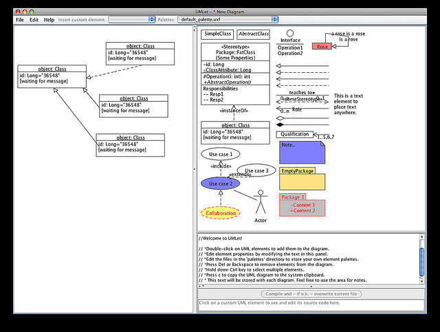

==== Application development topics

===== Application architecture

.Software architecture tool footnote:[_Image credit https://www.flickr.com/photos/osde-info/2786012027, downloaded 2016-11-13, Creative commons license]

The design and architecture of applications is a large topic (see e.g. <<Gamma1995>> and <<Fowler2003>>) and this text only touches lightly on it. http://www.iso-architecture.org/ieee-1471/defining-architecture.html[ISO/IEC 41010] defines architecture as “the fundamental organization of a system, embodied in its components, their relationships to each other and the environment, and the principles governing its design and evolution.”

A computer program can be as simple as https://en.wikipedia.org/wiki/%22Hello,_World!%22_program["Hello World."] Such a program requires only one or a few files to compile and execute. However, significant applications such as an online video streaming service require hardware and software configurations of http://techblog.netflix.com/search/label/cloud%20architecture[tremendous complexity].  Specialized visual notations are used to describe this complexity, as in the image above. We will discuss this further in Chapter 12.

===== Applications and project management
Because the initial applications were implemented as a kind of systems engineering, and were expensive to build and maintain, the technique of choice was https://en.wikipedia.org/wiki/Project_management[project management]. Project management will not be covered in this book until Part III, as it is not appropriate to the earlier stages of this book's http://dm-academy.github.io/aitm/#_a_process_of_emergence[emergence model].

This history of project managed systems engineering produced any number of successes, but by the early 1990s there were significant concerns with the rate of large project failures <<Glass1998>>, which occurred despite seemingly extensive and rigorous bureaucratic overhead, evidenced by frameworks such as https://en.wikipedia.org/wiki/Capability_Maturity_Model_Integration[CMMI] and https://en.wikipedia.org/wiki/Project_Management_Body_of_Knowledge[PMBOK]. footnote:[Both project management and CMMI have come in for significant criticism <<Koskela2002>>, <<Keefer2006>>, and will be discussed further in Sections 3 and 4.]

ifdef::collaborator-draft[]
_Second draft ideas_

 QA beyond test driven development - big oversight

 ===== SOA, APIs and microservices

* Microservices

 [this section needs to be written]

  add discussion of patterns/antipatterns and link throughout.

 ===== When waterfall may be appropriate
  [Packaged software acquisition - relatively more sequential - but open-loop approaches are always more risky - open loop not defined yet - ]

  * Pairing, swarming, mobbing http://www.jrothman.com/mpd/project-management/2014/07/how-pairing-swarming-work-why-they-will-improve-your-products/

endif::collaborator-draft[]
