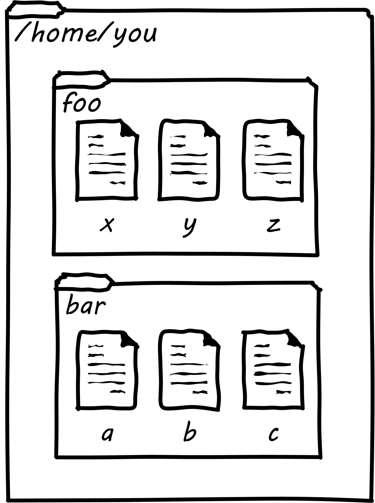

anchor:infracode[]

==== Infrastructure as code

So, what is infrastructure as code?

As cloud infrastructures have scaled, there has been an increasing need to configure many servers identically. Auto-scaling (adding more servers in response to increasing load) has become a widely used strategy as well. Both call for increased automation in the provisioning of IT infrastructure. It is simply not possible for a human being to be hands on at all times in configuring and enabling such infrastructures, so automation is called for.

In years past, infrastructure administrators relied on ad-hoc issuance of commands either at an operations console, or via a GUI-based application. Shell scripts might be used for various repetitive processes, but administrators by tradition and culture were empowered to issue arbitrary commands to alter the state of the running system directly.

The following passage from The Phoenix Project captures some of the issues. The speaker is Wes, the infrastructure manager, who is discussing a troubleshooting scenario:

_“Several months ago, we were three hours into a Sev 1 outage, and we bent over backward not to escalate to Brent. But eventually, we got to a point where we were just out of ideas, and we were starting to make things worse. So, we put Brent on the problem.” He shakes his head, recalling the memory, “He sat down at the keyboard, and it’s like he went into this trance. Ten minutes later, the problem is fixed. Everyone is happy and relieved that the system came back up. But then someone asked, ‘How did you do it?’ And I swear to God, Brent just looked back at him blankly and said, ‘I have no idea. I just did it.’”_

<<Kim2013>>, p. 116.

Obviously, “close your eyes and go into a trance” is not a repeatable process. It is not a procedure or operation that can be archived and distributed across multiple servers. So, shell scripts or more advanced forms of automation are written and increasingly, all actual server configuration is based on such pre-developed specification. It is becoming more and more rare for a systems administrator to actually “log in” to a server and execute configuration-changing commands in an ad-hoc manner (as Brent).

In fact, because virtualization is becoming so powerful, servers increasingly are destroyed and rebuilt at the first sign of any trouble. In this way, it is certain that the server’s configuration is as intended. This again is a relatively new practice.

Previously, because of the expense and complexity of bare-metal servers, and the cost of having them offline, great pains were taken to fix troubled servers. Systems administrators would spend hours or days troubleshooting obscure configuration problems, such as residual settings left by removed software. Certain servers might start to develop “personalities.” Industry practice has changed dramatically here since around 2010.

anchor:infra-code-example[]

===== A simple infrastructure as code example

*Note, the below section is illustrative only, and is not intended as a lab. The associated lab for this book goes into much more depth on these topics.*

In presenting infrastructure as code at its simplest, we will start with the concept of a shell script. While this is not a deep Linux book (there are many others out there, starting with the excellent O’Reilly lineup), some basic technical literacy is assumed in this book.
Consider the following set of commands:

 $ mkdir foo
 $ cd foo
 $ touch x y z
 $ cd ..
 $ mkdir bar
 $ cd bar
 $ touch a b c

What does this do? It tells the computer, “Create two directories, one named foo and one named bar. In the one named foo, create three blank files named x,y, and z; in the one named bar, create three blank files, named a, b, and c.”

If you find yourself (with the appropriate permissions) at a Unix command prompt, and run those commands, you will wind up with a configuration that could be visualized as this:

(If you don’t understand this, you should probably spend a couple hours with a Linux tutorial).

Configuration, you ask? Something this trivial? Yes, directory and file layouts count as configuration and in some cases are critical.

Now, what if we take that same set of commands, and put them in a file thus:

 #!/bin/bash
 mkdir foo
 cd foo
 touch x y z
 cd ..
 mkdir bar
 cd bar
 touch a b c

We might name that file iac.sh, set its permissions correctly, and run it (so that the computer executes all the commands for us, rather than us running them one at a time at the console).  If we did so in an empty directory, we’d again wind up with that same configuration. (If we did it in a directory already containing foo and bar directories, we’d get errors. More on this to come.)

NOTE: The state of the art in infrastructure configuration is not to use shell scripts at all but rather policy-based infrastructure management approaches, which we discuss subsequently.

This will be familiar material to many of you, including the fact that beyond creating directories and files we can use shell scripts to create and destroy virtual servers, install and remove software, set up and delete users, check on the status of running processes, and much more.

Sophisticated infrastructure as code techniques are are essential part of modern site reliability engineering practices such as used by Google. Auto-scaling, self-healing systems, fast deployments of new features all require that infrastructure be represented as code for maximum speed and reliability of creation.

Let’s return to our iac.sh file. It’s valuable. It documents our intentions for how this configuration should look. We can reliably run it on thousands of machines and it will always give us two directories and six files. In terms of the previous section, we might choose to run it on every new server we create. We want to establish it as a known resource in our technical ecosystem. This is where version control and the broader concept of configuration management come in.

.Cattle not pets?
****
In 20XX, Cloud analyst Randy Bias coined the saying, "Servers are cattle, not pets." Previously, servers (that is, computers managed on a distributed network) were usually configured without virtualization. They arrived from the manufacturer unconfigured, and would be painstakingly "built" by the systems administrator: the operating system would be installed, key software packages (such as Java) installed, and then the organization's customer software installed.

At best, the systems administrators, or server engineers, might have written guidelines or perhaps some shell scripts that would be run on the server to configure it in a semi-consistent way. But that documentation would often be out of date, the scripts would be unique to a given administrator, and there would be great reluctance to "rebuild the box" - that is, to delete everything on it and do a "clean re-install." Instead, if there were problems, the administrator would try to fix the server by going in and adjusting particular settings (typically by changing configuration files and restarting services), or deleting software packages and re-installing them.

The problem with this is that modern computing systems are so complex that deleting software can be difficult; if the uninstall process fails in some way, the server can be left in a compromised state. Similarly, one-time configuration adjustments made to one server means that it may be inconsistent with similar devices, and this can cause problems. For example, if the first systems administrator is on vacation, their substitute may expect the server to be configured in a certain way and make adjustments that have unexpected effects. Or the first systems administrator themselves may forget exactly what it is they did.

As people started to work more and more with virtualization, they realized it was easier to rebuild virtual servers from scratch, rather than trying to fix them. Automated configuration management tools helped by promoting a consistent process for rebuilding. Randy Bias, noting this, put forth the provocative idea that "servers are cattle, not pets." That is, when a pet is sick, one takes it to the vet, but a sick cow might simply  be taken out and shot.

I prefer the saying that "servers are fleet vehicles, not collectible cars" as it seems less cruel, and Bias overlooked the fact that large animal veterinarians are routinely employed in the cattle industry.
****
