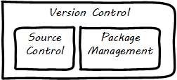

anchor:version-control[]

==== Configuration management: the basics
Configuration management is a critically important practice in digital systems, and has always been so. How it is performed has evolved over time. At this stage in our journey, we are one or two people in a startup, working with digital artifacts such as our iac.sh file discussed in the previous section.

One or two people can achieve an impressive amount with modern digital platforms. But the work is complex. Tracking and controlling your work products as they evolve through change after change is important from day one of your efforts. It's not something you want to put off to "later when I have time." This applies to computer code, configurations, and increasingly even documentation (often written in a lightweight markup language like Markdown or Asciidoc).

In this section, we will discuss the following topics:

* Version control
* Source control
* Package management
* Configuration management

and their relationships.

===== What is version control?

[quote, Andrew Clay Shafer, Web Operations:Keeping the Data On Time]
In software development, version control is the foundation of every other Agile technical practice. Without version control, there is no build, no TDD, no continuous integration.

The concept of a software version control system (variously known as source control, revision control, software configuration management, and other terms) is our first major software system for the “business of IT.” (The virtualization architecture previously discussed is what is under management; the source control system is part of the management architecture.)

The evolution of version control systems to the pivotal role they now hold has been somewhat unexpected. While version control was always deemed important for software artifacts, it has only recently become the preferred paradigm for managing infrastructure state as well.  Because of this, a version control system is easily and without question the first IT management system you should acquire and implement (perhaps as a cloud service, such as Github).

The Agile Alliance indicates “version control” as one of the http://guide.agilealliance.org/subway.html[four foundational areas of Agile], along with team, iterative development, and incremental development.

"Version control" also includes what we will cover as package management: the management of binary files, as distinct from human-understandable symbolic files. There is also a need to understand what versions are installed on what computers; this can be termed "deployment management." (With the advent of containers, this is a particularly fast changing area.)

.Types of version control

Version control works like an advanced file system with a memory. (Actual file systems that do this are called https://en.wikipedia.org/wiki/Versioning_file_system[_versioning_] file systems.) It can remember all the changes you make to its contents, tell you the differences between any two versions, and also bring back the version you had at any point in time.

In the previous section, we described a simple script that altered the state of a computer system.

As mentioned previously, there are numerous sources available to you to learn Linux scripting, policy-based configuration management of infrastructure, and source control. Competency with source control is essential to your career and you should devote some serious time to it.

Source control, as you may imagine, is critical for any kind of system with complex, changing content, especially when many people are working on that content, and there is a need to see the exact sequence of its evolution and isolate any particular moment in its history, or provide detailed analysis on how two versions differ.

You can find many references to source control on the Internet and in books such as _Pro Git_ by Scott Chacon and Ben Straub <<Chacon2009>>. As it is the most important foundational technology for professional IT, whether in a garage or in the largest corporations, you need to have a deep familiarity with it.

Source control is at its most powerful when dealing with symbolic data, which we usually see as text files. It is less useful in dealing with  binary data, such as image files. Symbolic files can analyzed for their differences in an easy to understand way. If I change “abc” to “abd” it is clear that the third character has been changed from “c” to “d.”

On the other hand, if I take a picture (e.g. as a JPEG file) and alter one pixel, and compare the resulting before and after binary files in terms of their data, it would be more difficult to understand what had changed. I would be able to easily tell that they are two different files (they would have different checksums), but they would look very similar.

Digital systems start with symbolic files. Text editors create source code, scripts, and configuration files. These may be transformed in defined ways (e.g. by compilers and build tools) but the human understandable end of the process is mostly based on text files.

We care very much about when a text file changes. One wrong character can completely alter the behavior of a large, complex system. Therefore, our configuration management approach must track to that level of detail.

===== The "commit" concept

Although implementation details may differ, all version control systems have some concept of “commit.”
As stated in Version Control with Git <<Loeliger2009>>:

_In Git, a commit is used to record changes to a repository  . . . Every Git commit represents a single, *atomic* changeset with respect to the previous state. Regardless of the number of directories, files, lines, or bytes that change with a commit… either all changes apply or none do. In terms of the underlying object model, atomicity just makes sense: A commit snapshot represents the total set of modified files and directories…

Git doesn’t care why files are changing. That is, the content of the changes doesn’t matter. As the developer, you might move a function from here to there and expect this to be handled as one unitary move. But you could, alternatively, commit the removal and then later commit the addition. Git doesn’t care. It has nothing to do with the semantics of what is in the files._ [emphasis added]

The concept of a version or source control https://en.wikipedia.org/wiki/Commit_(data_management)[“commit”] is a rich foundation for IT management and governance. It both represents the state of the computing system as well as providing evidence of the human activity affecting it.

As we will see in Chapter 3, the “commit” identifier is directly referenced by build activity, which in turn is referenced by the release activity, which is typically visible across the IT value chain.

Also, the concept of an atomic “commit” is essential to the concept of a “branch” - the creation of an experimental version, completely separate from the main version, so that various alterations can be tried without compromising the overall system stability. Starting at the point of a “commit,” the branched version also becomes evidence of human activity around a potential future for the system. In some environments, the branch is automatically created with the assignment of a requirement or story - again, more on this to come in chapter 3. In other environments, the very concept of branching is avoided.

ifdef::collaborator-draft[]
  Discussion of branching & merging?
  source control versus package management
endif::collaborator-draft[]

anchor:commit-as-metadata[]

===== Package management

[quote, Puppet Labs 2015 State of DevOps report]
Implement version control for all production artifacts.

Version control is important - but how important? Survey research presented in the annual State of DevOps report indicates that version control is one of the most critical practices associated with high performing IT organizations <<Forsgren2016>>. Nicole Forsgren <<Forsgren2016a>>  summarizes the practice of version control as:

* Our application code is in a version control system
* Our system configurations are in a version control system
* Our application configurations are in a version control system
* Our scripts for automating build and configuration are in a version control system.

anchor:policy-config[]

==== Configuration management

Version control is an important part of configuration management,

Before we turned to source control, we looked at a simple script that changed the configuration of a computer. It did so in an _imperative_ fashion.

===== Imperative and Declarative

Imperative and declarative are two important terms from computer science. In an imperative approach, we tell the computer specifically how we want to accomplish a task. Many traditional programming languages take an imperative approach. Whereas with a declarative approach, we tell the computer the task we want to accomplish and let the computer figure out the best way to do it. Structured Query Language (SQL) statements are a good example of a declarative approach. We can provide a database system with a set of SQL statements, and the database will generate an execution plan to provide us with the data we are seeking. Functional languages such as Lisp and Erlang are considered declarative.

A script such as iac.sh is executed line by line, i.e., it is imperative. But in policy-based approaches, the object is to define the desired end state of the resource, not the steps needed to get there.

Chef, Puppet, Salt Stack, and Ansible are all declarative to some degree.

This is a complex topic and there are advantages and disadvantages to each approach. (See http://markburgess.org/blog_order.html["When and Where Order Matters"] by Mark Burgess for an advanced discussion.) But policy-based approaches seem to have the upper hand for now.

_describe modern infra managers, policy management, auto-scaling as an example, provide an example Chef script.._

===== Configuration management, version control, and metadata
Version control, in particular source control, is where we start to see the emergence of an _architecture of IT management_. It is in the source control system that we first start to see _metadata_ emerge as an independent concern. Metadata is a tricky term, that tends to generate confusion. The term “meta” implies a concept that is somehow self-referential, and/or operating at a higher level of abstraction. So,

* the term meta-discussion is a discussion about the discussion;
* meta-cognition is cognition about cognition, and
* meta-data (aka metadata) is data about data.

Some examples:

* In traditional data management, metadata is the description of the data structures, especially from a business point of view. A database column might be named “CUST_L_NM,” but the business description or metadata would be “The last, family, or surname of the customer.”
* In document management, the document metadata is the record of who created the document and when, when it was last updated, and so forth. Failure to properly sanitize document metadata has led to various privacy and data security related issues.
* In telephony,  “data” is the actual call signal — the audio of the phone conversation, nowadays usually digitally encoded. Metadata on the other hand is all the information about the call: from who to who, when, how long, and so forth.

In computer systems, metadata can be difficult to isolate. Sometimes, computing professionals will speak of a “metadata” layer that may define physical database structures, data extracts, business process behavior, even file locations. The trouble is, from a computer’s point of view, a processing instruction is an instruction, and the prefix “meta” has no real meaning.

Because of this, this book favors a principle that *metadata is by definition non-runtime.* It is documentation, usually represented as structured or semi-structured data, but not usually a primary processing input or output. It might be “digital exhaust” - log files are a form of metadata. It is not executable. If it’s  executable (directly or indirectly), it’s digital logic or configuration, plain and simple.

So what about our infrastructure as code example? The artifact - the configuration file, the script - is NOT metadata, because it is executable. But the source repository commit IS metadata. It has no meaning for the script. The dependency is one way - without the artifact, the commit ID is meaningless, but the artifact is completely ignorant of the commit. However, the commit may become an essential data point for human beings trying to make sense of the state of a resource defined by that artifact.

*In this microcosm, we see the origins of IT management.*
It is not always easy to apply this approach in practice. There can be edge cases. But *the concept of metadata provides a basis for distinguishing the _management_ of information technology from the actual _practice_ of information technology.*
