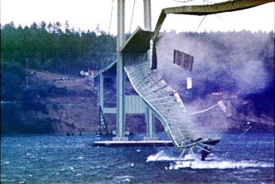

anchor:systems-thinking[]

=== Special section: Systems thinking and feedback

[quote, Peter Senge,  The Fifth Discipline]
"The harder you push, the harder the system pushes back."

anchor:feedback[]

==== A brief introduction to feedback

While the term "information systems (IS)" was widely replaced by "information technology (IT)" in the 1990s, do not be fooled. Enterprise IT is a complex https://en.wikipedia.org/wiki/Sociotechnical_system[sociotechnical system], that delivers the digital services to support a myriad of other complex sociotechnical systems.

Merriam-Webster http://www.merriam-webster.com/dictionary/system[defines a system] as "a regularly interacting or interdependent group of items forming a unified whole". These interactions and relationships quickly take center stage as you move from individual work to team efforts. Consider that while a 2 member team only has 1 relationship to worry about, a 10 member team has 45, and a 100 person team has 4,950!

As the Senge quote implies, brute force does not scale well within the context of a system. Systems tend to make their own rules. Within the bounds of the system, actions lead to outcomes, which in turn affect future actions. This *feedback* often becomes amplified and re-amplified through the systems' interactions with itself, until an overload occurs, such as the horrible screeching of a microphone too close to a speaker. In the business world, these feedback loops can manifest themselves in rigid platforms, brittle applications, or even a toxic work culture that sabotages success.

A thorough discussion of systems theory is beyond the scope of this book. However, many of the ideas that follow are informed by it. Obtaining a working knowledge of systems theory will not only enhance your understanding of this book, it can also be an essential tool for managing uncertainty in your future career, teams, and organizations. If you are interested in this topic, you might start with _An Introduction to General Systems Thinking_ by Gerald Weinberg cite:[Weinberg2001].

Feedback is a loaded term. We hear terms like positive feedback and negative feedback, and associate it quickly with performance coaching and management discipline. That is not the sense of feedback in this book. The definition of feedback as used in this book is based on engineering. There is considerable related theory in general engineering and especially https://en.wikipedia.org/wiki/Control_theory[control theory] and the reader is encouraged to investigate some of these foundations if unfamiliar.

In <<fig-feedback-400-c>>) we see the classic illustration of a reinforcing feedback loop:

[[fig-feedback-400-c]]
.Reinforcing feedback loop

For example (as in <<fig-rabbits-700-c>>), we can consider “rabbit reproduction” as a process with a reinforcing feedback loop.

[[fig-rabbits-700-c]]
.Reinforcing (positive?) feedback, with rabbits

The more rabbits, the faster they reproduce, and the more rabbits. This is sometimes called a “positive” feedback loop, although Mr. MacGregor the local gardener may not agree, given that they are eating all his cabbages!! This is why feedback experts (e.g. cite:[Sterman2000]) prefer to call this “reinforcing” feedback, because there is not necessarily anything “positive” about it.

We can also consider feedback as the relationship between TWO processes (see <<fig-balancing-350-c>>).

[[fig-balancing-350-c]]
.Balancing feedback between two processes

In our rabbit example, what if Process B is fox reproduction, that is, the birth rate of foxes (who eat rabbits) (<<fig-rabbitfox-700-c>>)?

[[fig-rabbitfox-700-c]]
.Balancing (negative?) feedback, with rabbits and foxes

More rabbits equals more foxes (notice the “+” symbol on the line), because there are more rabbits to eat! But what does this do to the rabbits? It means LESS rabbits. Which, ultimately, means less foxes… and at some point, the populations balance. This is classic negative feedback. However, the local foxes don’t see it as negative (nor do the local gardeners!)  That is why feedback experts prefer to call this “balancing” feedback.

ifndef::aitm-pdf[]

.Reinforcing and balancing feedback animations
image::https://upload.wikimedia.org/wikipedia/commons/d/d8/CLD_links_ANI.gif[]
Linked from https://en.wikipedia.org/wiki/Causal_loop_diagram[Wikipedia]

endif::aitm-pdf[]

Wikipedia has good articles on https://en.wikipedia.org/wiki/Causal_loop_diagram[Causal Loop Diagramming] and https://en.wikipedia.org/wiki/System_dynamics[Systems Dynamics] (with cool dynamic visuals.) cite:[Sterman2000] is the definitive text with applications.

NOTE: Still confused? Think about the last time you saw a "reply-all" email storm. The first accidental mass send generates feedback (emails saying "take me off this list"), which generate more emails ("stop emailing the list") and so on. This does not continue indefinitely; management intervention, common sense and fatigue eventually damp the storm down.

==== What does systems thinking have to do with IT?

In an engineering sense, positive feedback is often dangerous and a topic of concern. The classic example of bad positive feedback in engineering is the collapse of the Tacoma Narrows bridge, "Galloping Gertie" (see <<fig-bridge-400-o>> footnote:[Image credit https://en.wikipedia.org/w/index.php?curid=23093518, downloaded 2016-10-31, By Barney Elliott; The Camera Shop - Screenshot taken from 16MM Kodachrome motion picture film by Barney Elliott. Fair use. There is debate about whether the collapse of this bridge is a good example of feedback; another case would be appreciated.])

[[fig-bridge-400-o]]
."Galloping Gertie"

As with bridges, at a technical level, reinforcing feedback can be a very bad thing in IT systems. In general, any process that is self-amplified without any balancing feedback will eventually consume all available resources, just like rabbits will eat all the food available to them. So, if you create a process (e.g. write and run a computer program) that recursively spawns itself, it will sooner or later crash the computer as it devours memory and CPU. See http://osr507doc.sco.com/en/HANDBOOK/runaway_proc.html[Runaway processes.]

Balancing feedback, on the other hand, is critical to make sure you are “staying on track.” Engineers use concepts of https://en.wikipedia.org/wiki/Control_theory[control theory], for example https://en.wikipedia.org/wiki/Damping[damping], to keep bridges from falling down.

Remember in Chapter 1 we talked of the user's http://dm-academy.github.io/aitm/images/1_01-ITStack2.png[value experience], and also how services http://dm-academy.github.io/aitm/#_the_it_service_lifecycle[evolve over time in a lifecycle]? In terms of the xref:dual-axis-vc[dual-axis value chain], there are two primary digital value experiences:

- The value the user derives from the service (e.g. account lookups, or a flawless navigational experience)
- The value the investor derives from monetizing the product, or comparable incentives (e.g. nonprofit missions)

Additionally, the product team derives career value. This becomes more of a factor later in the game. We will discuss this further in chapter 7 on organization, and Part IV on architecture lifecycles & technical debt.

The product team receives feedback from both value experiences. The day to day interactions with the service (e.g. help desk and operations) are understood, and (typically on a more intermittent basis) the portfolio investor also feeds back the information to the product team (the boss's boss comes for a visit).

Balancing feedback in a business and IT context takes a wide variety of forms:

* The results of a product test in the marketplace, for example do the users prefer a drop down box or check boxes on a form?
* The product owner clarifying for developers their user experience vision for the product, based on a demonstration of developer work in process
* The end users calling to tell you the “system is slow” (or down)
* The product owner or portfolio sponsor calling to tell you they are not satisfied with the system’s value

In short, we see these two basic kinds of feedback:

* Positive/Reinforcing, “do more of that”
* Negative/Balancing, “stop doing that,” “fix that”

You should consider:

* How you are accepting and executing on feedback signals
* How the feedback relationship with your investors is evolving, in terms of your product direction
* How the feedback relationship with your users is evolving, in terms of both operational criteria and product direction

One of the most important concepts related to feedback, one we will keep returning to, is that product value is based on feedback. We've discussed xref:lean-startup[Lean Startup], which represents a feedback loop intended to discover product value. Don Reinertsen, whose work we will discuss in this chapter, has written extensively on the importance of fast feedback to the product discovery process.

===== Positive feedback: the special case investors want

ifndef::aitm-pdf[]

.New product adoption dynamics
image::https://upload.wikimedia.org/wikipedia/commons/7/7c/Adoption_SFD_ANI_s.gif[]
Linked from https://en.wikipedia.org/wiki/System_dynamics[Wikipedia]

endif::aitm-pdf[]

At a business level, there is a special kind of reinforcing feedback that defines the successful business (see <<fig-biz-positive-600-c>>).

[[fig-biz-positive-600-c]]
.The reinforcing feedback businesses want

This is reinforcing feedback and positive for most people involved: investors, customers, employees. At some point, if the cycle continues, it will run into balancing feedback:

* Competition
* Market saturation
* Negative externalities (regulation, pollution, etc)

But those are problems the business wants to have.

anchor:open-loop[open loop]

===== Open versus closed loop systems

Finally, we should talk briefly about open loop versus closed loop systems.

* Open loop systems have no regulation, no balancing feedback
* Closed loop systems have some form of balancing feedback

In navigation terminology, the open-loop attempt to stick to a course without external information (e.g. navigating in the fog, without radar or communications) is known as " https://en.wikipedia.org/wiki/Dead_reckoning[dead reckoning]," in part because it can easily get you dead!

A good example of an open loop system is the children’s game “pin the tail on the donkey” (see <<fig-donkey-300-o>> footnote:[Image credit https://www.flickr.com/photos/portland_mike/5445434245/, downloaded 2016-11-13, mike krzeszak, Flickr, Creative Commons]). In “pin the tail on the donkey,” a person has to execute a process (pinning a paper or cloth "tail" onto a poster of a donkey - no live donkeys are involved!) while blindfolded, based on their memory of their location (and perhaps after being deliberately disoriented by spinning in circles). Since they are blindfolded, they have to move across the room and pin the tail without the ongoing corrective feedback of their eyes. (Perhaps they are getting feedback from their friends, but perhaps their friends are not reliable….)

[[fig-donkey-300-o]]
.Pin the tail on the donkey
image::images/2_00-donkey.jpg[donkey game, 300, float="right"]

Without the blindfold, it would be a closed loop system. The person would rise from their chair and, through the ongoing feedback of their eyes to their central nervous system, would move towards the donkey and pin the tail in the correct location. In the context of a children's game, the challenges of open-loop may seem obvious, but an important aspect of IT management over the past decades has been the struggle to overcome open-loop practices. Reliance on open-loop practices is arguably an indication of a dysfunctional culture. An IT team that is designing and delivering without sufficient corrective feedback from its stakeholders is an ineffective, open-loop system. Mark Kennaley cite:[Kennaley2010] applies these principles to software development in much greater depth, and is recommended.

NOTE: No system can ever be fully "open loop" indefinitely.  Sooner or later, you take off the blindfold, or wind up on the rocks.

Engineers of complex systems use feedback techniques extensively. Complex systems do not work without them.

anchor:OODA[]

===== OODA

After the Korean War, the US Air Force wished to clarify why its pilots had performed in a superior manner to the opposing pilots who were flying aircraft viewed as more capable. A colonel named John Boyd was tasked with researching the problem. His conclusions are based in the concept of feedback cycles, and how fast humans can execute them.  determined that humans go through a defined process in building their mental model of complex and dynamic situations. This has been formalized in the concept of the OODA loop. Standing for:

* Observe
* Orient
* Decide
*	Act

Because the US fighters were lighter, more maneuverable, and had better visibility, their pilots were able to execute the OODA loop more quickly than their opponents, leading to victory. Boyd and others have extended this concept into various other domains including business strategy. The concept of the OODA feedback loop is frequently mentioned in presentations on Agile methods. Tightening the OODA loop accelerates the discovery of product value and is highly desirable.

ifdef::collaborator-draft[]

_Second draft ideas_

 ==== Quality management
 Deming and Juran.

endif::collaborator-draft[]
