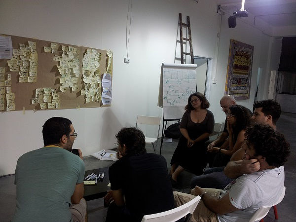

anchor:product-mgmt[]

==== Why product management?

===== The product vision

NOTE: You should review the xref:digital-context[digital context] material in Chapter 1.

Before work, before operations, there must be a vision of product. You already established a preliminary vision in Chapter 1, but now as your organization grows, you need to consider further how you will sustain that vision and establish an ongoing capability for realizing it. Like many other topics in this book, product management is a significant field in and of itself. Historically, product management has *not* been a major theme in enterprise IT management. Digital changes this.

IT systems started by serving narrow purposes, often “back office” functions such as accounting or https://en.wikipedia.org/wiki/Material_requirements_planning[materials planning]. Mostly, such systems were managed as projects assembled on a temporary basis, resulting in the creation of a system to be “thrown over the wall” to operations. Product management, on the other hand, is concerned with the entire lifecycle. The product manager (or owner, in Scrum terms) cares about the vision, its execution, the market reaction to the vision (even if an internal market), the health, care and feeding of the product, and the product’s eventual sunset or replacement.

In the enterprise IT world, "third party" vendors (e.g. IBM) providing the back office systems had product management approaches, but these were *external* to the IT operations. Nor were IT-based product companies as numerous forty years ago as they are today; as noted in chapter 1, the digital component of modern products xref:digital-transformation[continues to increase] to the point where it's often not clear whether a product is "IT" or not.

[[fig-design-500-i]]
.Product design session

Reacting to market feedback and adapting product direction is an essential role of the product owner. In the older model, feedback was often unwelcome, as the project manager typically was committed to the xref:open-loop[open-loop dead reckoning] of the project plan and changing scope or direction was seen as a failure, more often than not.

Now, it’s accepted that systems evolve, perhaps in unexpected directions. Rapidly testing, failing fast, learning, and pivoting direction are all part of the lexicon, at least for market-facing IT-based products. And even back-office IT systems with better understood scope are being managed more as systems (or products) with lifecycles, as opposed to transient projects. (See the xref:amazon-productization[Amazon discussion], below.)

So, what is product management and what does it mean for your team? footnote:[Image credit https://www.flickr.com/photos/daonb/6223628837, downloaded 2016-09-14, commercial use permitted]

anchor:prod-mgmt-definition[]

===== Defining Product Management

In order to define product management, we first need to define product. In Chapter 1, we established that products are goods, services, or some combination, with some feature that provides value for some consumer. BusinessDictionary.com http://www.businessdictionary.com/definition/product.html[defines it thus]:

[quote, BusinessDictionary.com]
[A Product is] A good, idea, method, information, object or service created as a result of a process and serves a need or satisfies a want. It has a combination of tangible and intangible attributes (benefits, features, functions, uses) that a seller offers a buyer for purchase. For example a seller of a toothbrush not only offers the physical product but also the idea that the consumer will be improving the health of their teeth . . . A good or service [must] closely meet the requirements of a particular market and yield enough profit to justify its continued existence.

Product _management_, according to the http://www.businessdictionary.com/definition/product-management.html#ixzz3bHCVkoWj[same source], is

[quote, BusinessDictionary.com]
The organizational structure within a business that manages the development, marketing and sale of a product or set of products throughout the product life cycle. It encompasses the broad set of activities required to get the product to market and to support it thereafter.

Product management in the general sense often reports to the Chief Marketing Officer (CMO). It represents the fundamental strategy of the firm, in terms of its value proposition and viability. The product needs to reflect the enterprise’s strategy for creating and maintaining customers.

Product strategy for *internally-facing* products is usually *not* defined by the enterprise CMO. If it is a back-office product, then “business within a business” thinking may be appropriate. (Even the payroll system run by IT for HR is a “product,” in this view.) In such cases, there still is a need for someone to function as an "internal CMO" to the external "customers."

NOTE: As a field, product management has a professional association, the http://www.pdma.org[Product Development and Marketing Association], which publishes an extensive and continuously-refined handbook, and supports local chapters, training and certification, and other activities typical of a mature professional organization.

With xref:digital-transformation[digital transformation], all kinds of industrial products have increasing amounts of “IT” in them. This means that an understanding of IT, and ready access to any needed IT specialty skills, is increasingly important to the general field of product management. Product management includes research and development, which means that there is considerable uncertainty. This is of course also true of IT systems development.

Perhaps the most important aspect of product design is focusing on the user, and what she or he needs. The concept of *outcome* is key. This is easier said than done. The general problem area is considered Marketing, a core business school topic. Entire books have been written on the various tools and techniques for doing this, from  focus groups to ethnographic analysis.

anchor:product-mgmt-v-marketing[]

However, Marty Cagan warns against confusing Product Management and Product Marketing. He defines the two as follows:

_The product manager is responsible for defining—in detail—the product to be built, and validating that product with real customers and users. The product marketing person is responsible for telling the world about that product, including positioning, messaging and pricing, managing the product launch, providing tools for the sales channel to market and sell the product, and for leading key programs such as online marketing and influencer marketing programs._ cite:[Cagan2008], pp. 10-11.

We discuss some criticisms of overly marketing-driven approaches xref:jobs-to-be-done[below].

anchor:process-project-product[]

===== Process, project, and product management
In the remainder of this book, we will continually encounter three major topics:

* Product Management (Chapter 4)
* Project Management (covered in Chapters 8 and 9)
* Process Management (covered in Chapter 9)

They have an important commonality: *all of them are concepts for driving results across organizations.*

The Appendices have brief discussions of xref:project-mgmt[project management] and xref:process-modeling[process modeling]. Here are some of the key differences between process, project and product management in the context of digital services and systems:

.Process, project, and product management
[cols="3*", options="header"]
|====
|Process|Project|Product
|Task oriented|Deliverable oriented|Outcome oriented
|Repeatable with a high degree of certainty |Executable with a medium degree of certainty |Significant component of research and development, less certain of outcome - empirical approaches required
|Fixed time duration, relatively brief (weeks/months)|Limited time duration, often scoped to a year or less
|No specific time duration; lasts as long as there is a need
|Fixed in form, no changes usually tolerated|Difficult to change scope or direction, unless specifically set up to accommodate
|Must accommodate market feedback and directional change
|Used to deliver service value and operate system (the "Ops" in DevOps) |Often concerned with system design and construction, but typically not with operation (the "Dev" in DevOps)
|Includes service concept and system design, construction, operations, and retirement (both "Dev" and "Ops")
|Process owners concerned with adherence and continuous improvement of process. Otherwise can be narrow in perspective.|Project managers are trained in resource and timeline management, dependencies & scheduling. They are not typically incented to adopt a long-term perspective.
|Product managers need to have project management skills as well as understanding market dynamics, feedback, building long-term organizational capability
|Resource availability and fungibility is assumed
|Resources are specifically planned for but their commitment is temporary (team is "brought to the work")
|Resources are assigned long-term to the product (work is "brought to the team")
|====

The above distinctions are deliberately exaggerated and there are of course exceptions (short projects, processes that take years). However, it is in the friction between these perspectives we see some of the major problems in modern IT management. For example, an activity, which may be a one-time task or a repeatable process, results in some work product--perhaps an artifact (see <<fig-process-400-c>>).

[[fig-process-400-c]]
.Activities create work products

The consumer or stakeholder of that work product might be a Project Manager.

Project management includes concern for both the activities, AND the resources (people, assets, software) required to produce some deliverable (see <<fig-project-500-c>>).

[[fig-project-500-c]]
.Projects create deliverables with resources and activities

The consumer of that deliverable might be a Product Manager. Product management includes concern for projects and their deliverables, and their ultimate *outcomes*, either in the external market or internally (see <<fig-product-500-c>>).

[[fig-product-500-c]]
.Product management  may use projects

Notice that product management may directly access activities and resources. In fact, earlier-stage companies often do not formalize project management (see <<fig-productNoProject-600-c>>).

[[fig-productNoProject-600-c]]
.Product management sometimes does not use projects

In our scenario, you are now on a tight-knit, collaborative team. You should think in terms of developing and sustaining a product. However, projects still exist, and sometimes you may find yourself on a team that is funded and operated on that basis. You also will encounter the concept of "process" even on a single team; more on that in Chapter 5. We will go further into projects and process management in Part III.

anchor:amazon-productization[]

===== Productization as a strategy at Amazon
Amazon (the online bookseller) is an important influence in the modern trend towards product-centric IT management. First, the founder Jeff Bezos mandated that all software development should be http://apievangelist.com/2012/01/12/the-secret-to-amazons-success-internal-apis/[service-oriented]. That means that some form of standard API (Application Programming Interface) was required for all application to communicate with each other. By some accounts, Bezos threatened to fire anyone who did not do this. Second, all teams are to assume that the functionality being built might at some point be offered to external customers cite:[Lane2012].

[[fig-pizzas-500-i]]
.Two pizzas, one team

Third, a widely reported practice at Amazon.com is the http://www.fastcompany.com/3037542/productivity-hack-of-the-week-the-two-pizza-approach-to-productive-teamwork[limitation of product teams to between 5-7 people], the number that can be fed by “two pizzas” (depending on how hungry they are) cite:[Gillett2014] (see <<fig-pizzas-500-i>> footnote:[Image credit https://www.flickr.com/photos/ramblinbears/7937873272, downloaded 2016-09-20, commercial use permitted]). It has long been recognized in software and IT management that larger teams do not necessarily result in higher productivity. The best known statement of this is Fred Brooks’ rule from The Mythical Man-Month, that “adding people to a late project will make it later” cite:[Brooks1975].

NOTE: Fred Brooks' _The Mythical Man-Month_, derived in part from his experiences leading the IBM OS-360 project, is one of the timeless classics in software engineering and IT management writing. Serious IT professionals, whether or not they are actually programmers, should have it on their bookshelves.

The reasons for "Brooks' Law" have been studied and analyzed (see e.g. cite:[Madachy2008], cite:[Choi2016]) but in general it is due to the increased communication overhead of expanded teams. Product design work (of which software development is one form) is creative and highly dependent on tacit knowledge, interpersonal interactions, organizational culture, and other “soft” factors. Products, especially those with a significant IT component, can  be understood as socio-technical systems, often complex. This means that small changes to their components or interactions can have major effects on their overall behavior and value.

This in turn means that newcomers to a product development organization can have a profound impact on the product. Getting them “up to speed” with the culture, mental models, and tacit assumptions of the existing team can be challenging and rarely is simple. And the bigger the team, the bigger the problem. The net result of these two practices at Amazon (and now xref:fowler-quote[General Electric and many other companies]) is the creation of multiple nimble services that are decoupled from each other, constructed and supported by teams appropriately sized for optimal high-value interactions.
