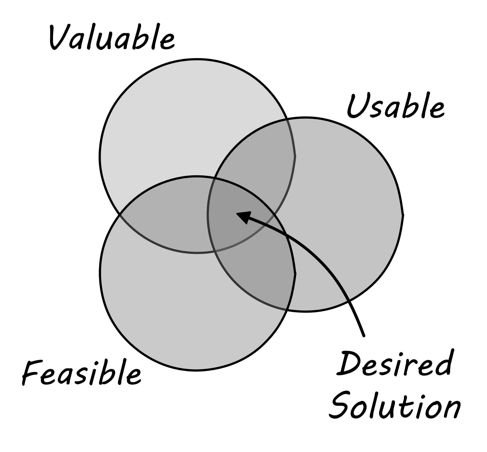

anchor:the-product-team[]

==== Organizing the product team

You are a team now. Your founder and co-founder have found enough interest to sustain a larger organization.

How are you going to organize? How are you going to work? Events move quickly, and you don't have much time to think about these things. But getting things right at the team level is essential as your organization scales up. Bad habits (like accepting too much work in the system, or tolerating toxic individuals) will be more and more difficult to overcome as you grow.

===== The concept of collaboration
[quote, Agile Manifesto]
Individuals and interactions over processes and tools. +
 +
The most efficient and effective method of conveying information to and within a development team is face-to-face conversation.

IMPORTANT: We will discuss culture in more depth in future chapters. But this chapter  is the first discussion of "how are we with each other." Culture requires attention at the earliest stages, as it can be very difficult to change later.

Team collaboration is one of the key values of Agile. The Agile Alliance states that

_A "team" in the Agile sense is a small group of people, assigned to the same project or effort, nearly all of them on a full-time basis._

Teams are multi-skilled, share accountability, and individuals on the team may play multiple roles. cite:[Alliance2015]

anchor:psych-safety[]

[[fig-psych-safety-450-o]]
.Psychological safety supports collaboration

Face to face interactions, usually enabled by giving the team its own space, are seen as essential for collaboration. While there are various approaches to Agile, all concur that tight-knight, collaborative teams deliver the highest value outcomes. However, collaboration does not happen just because people are fed pizzas and work in a room together. Google has established that the most significant predictor of team performance is a sense of psychological safety (see sidebar). Research by Anita Woolley and colleagues suggests that three factors drive team performance cite:[Woolley2015]:

* Equal contribution to team discussions (no dominant individuals)
* Emotional awareness - being able to infer other team members' emotional states
* Teams with a higher proportion of women tended to perform better (the researchers inferred this was due to women generally having higher emotional awareness)

Other research shows that diverse team and organizations are more innovative and deliver better results; such teams may tend to focus more on facts (as opposed to groupthink) cite:[Rock2016]. Certainly, a sense of psychological safety (<<fig-psych-safety-450-o>> footnote:[Image credit https://www.flickr.com/photos/marckjerland/4633544440, downloaded 2016-09-20, commercial use permitted]) is critical to the success of diverse teams, who may come from different cultures and backgrounds that don't inherently trust each other.

IMPORTANT: The collective problem-solving talent of a diverse group of individuals who are given space to self-organize and solve problems creatively is immense, and very possibly the highest value resource known to the modern organization.

.Google's Project Aristotle
****
Around 2012, Google became interested in answering the question:

*_What makes a Google team effective?_*

Based on 200+ interviews across 180+ teams, they determined that "Who is on a team matters less than how the team members interact, structure their work, and view their contributions."

They identified five "key dynamics":

. Psychological safety: team members feel safe to take risks with each other
. Dependability: team members can be counted on
. Structure and clarity: roles, plans and goals are clear
. Meaning of work: work is personally important
. Impact of work: the work matters

Of the 5, psychological safety was the most significant. Teams that cultivate this enable collaboration and creativity, which lead to product value and improved organizational performance. cite:[Rozovsky2015]
****

We turn to two current schools of thought with much to say about collaboration: Lean UX and Scrum.

===== Lean UX
[quote, Jeff Gothelf, Lean UX]
Lean UX is the practice of bringing the true nature of a product to light faster, in a collaborative, cross-functional way that reduces the emphasis on thorough documentation while increasing the focus on building a shared understanding of the actual product experience being designed.

Lean UX is a term coined by author and consultant Jeff Gothelf cite:[Gothelf2013], which draws on three major influences:

* Design thinking
* Agile software development
* Lean Startup

We briefly discussed xref:lean-startup[Lean Startup] in Chapter 1, and the history and motivations for xref:Agile-history[Agile software development] in Chapter 3. We'll look in more depth at product discovery techniques, and xref:design[design and design thinking] in the next chapter section. However, Lean UX has much to say about forming the product team, suggesting (among others) the following principles for forming and sustaining teams:

* Dedicated, cross-functional teams
* Outcome (not deliverable/output) focus
* Cultivating a sense of shared understanding
* Avoiding toxic individuals (so-called "rockstars, gurus, and ninjas")
* Permission to fail

(Other Lean UX principles such as small batch sizes and visualizing work will be discussed elsewhere; there is significant overlap between Lean UX and other schools of thought covered in this book.)

Lean UX is an influential work among digital firms and summarizes modern development practices well, especially for small, team-based organizations with minimal external dependencies. It is a broad and conceptual, principles-based framework open for interpretation in multiple ways. We continue with more "prescriptive" methods and techniques, such as Scrum.

anchor:scrum[]

===== Scrum

[quote, Chris Sims/Hillary L. Johnson, Scrum: A Breathtakingly Brief and Agile Introduction]
Scrum is a lightweight framework designed to help small, close-knit teams of people develop complex products.

[quote, Jeff Sutherland, Scrum: The Art of Doing Twice the Work in Half the Time]
There Are No Tasks; There Are Only Stories.

One of the first prescriptive Agile methodologies you are likely to encounter as a practitioner is Scrum. There are many books, classes, and websites where you can learn more about this framework; cite:[Sims2012] is a good brief introduction, and cite:[Rubin2012] is well suited for more in-depth study.

NOTE: "Prescriptive" means detailed and precise. A doctor's prescription is specific as to what medicine to take, how much, and when. A prescriptive method is similarly specific. "Agile software development" is not prescriptive; as currently published by the Agile Alliance, it is a collection of principles and ideas you may or may not use. +
 +
By comparison, Scrum is prescriptive; it states roles and activities specifically and trainers and practitioners in general seek to follow the method completely and accurately.

Scrum is appropriate to this chapter, as it is product-focused. It calls for the roles of:

* Product owner
* Scrum master
* Team member

and avoids further elaboration of roles.

The Scrum product owner is responsible for holding the product vision and seeing that the team executes the highest value work. To do this, the potential features for the product are maintained in a "backlog" that can be re-prioritized as necessary (rather than a large, fixed-scope project). The product owner also defines acceptance criteria for the backlog items. The Scrum Master, on the other hand, acts as a team coach, "guiding the team to ever-higher levels of cohesiveness, self-organization, and performance." cite:[Sims2012]. To quote Roman Pichler:

_The product owner and ScrumMaster roles complement each other: The product owner is primarily responsible for the "what"—creating the right product. The ScrumMaster is primarily responsible for the "how"—using Scrum the right way_ cite:[Pichler2010], p. 9.

Scrum uses specific practices and artifacts such as sprints, standups, reviews, the above-mentioned concept of backlog, burndown charts, and so forth. We will discuss some of these further in Chapter 5 (Work Management) and Chapter 9 (Execution Management) along with Kanban, another popular approach for executing work.

In Scrum, there are three roles:

* The product owner sets overall direction.
* The Scrum Master coaches and advocates for the team
* The development team is defined as those who are committed to the development work

There are seven activities:

* The “sprint” is a defined time period, typically two to four weeks, in which the development team executes on an agreed scope
* Backlog grooming is when the product backlog is examined and refined into increments that can be moved into the sprint backlog
* Sprint Planning is where the scope is agreed
* The Daily Scrum is traditionally held standing up, to maintain focus and ensure brevity
* Sprint Execution is the development activity within the sprint
* Sprint Review is the “public end of the sprint” when the stakeholders are invited to view the completed work
* The Sprint Retrospective is held to identify lessons learned from the sprint and how to apply them in future work.

There are a number of artifacts:

* The product backlog is the overall “to-do” list for the product.
* The sprint backlog is the to-do list for the current sprint
* Potentially shippable product increment is an important concept used to decouple the team’s development activity from downstream business planning. A PSI is a cohesive unit of functionality that *could* be delivered to the customer, but doing so is the decision of the product owner.

Scrum is well grounded in various theories (process control, human factors), although Scrum team members do not need to understand theory to succeed with it. Like Lean UX, Scrum emphasizes high-bandwidth collaboration, dedicated multi-skilled teams, a product focus, and so forth.

The concept of having an empowered product owner readily available to the team is attractive, especially for digital professionals who may have worked on teams where direction was unclear. Roman Pichler identifies a number of common mistakes, however, that diminish the value of this approach cite:[Pichler2010], pp. 17-20:

* Product owner lacks authority
* Product owner is overworked
* Product ownership is split across individuals
* Product owner is "distant" - not co-located or readily available to team

****
*Sidebar: Scrum and shu-ha-ri*

In the Japanese martial art of aikido, there is the concept of shu-ha-ri, a form of learning progression.

* Shu: The student follows the rules of a given method precisely, without addition or alteration
* Ha: The student learns theory and principle of the technique
* Ri: The student creates own approaches and adapts technique to circumstance

Scrum at its most prescriptive can be seen as a shu-level practice; it gives detailed guidance that has been shown to work.

(See cite:[Fowler2006] and cite:[Cockburn2007], pp. 17-18.)
****

===== More on product team roles

[quote, Mike Cohn, Succeeding with Agile Software Development Using Scrum]
Boundaries are provided by the product owner and often come in the form of constraints, such as * I need it by June. * We need to reduce the per-unit cost by half. * It needs to run at twice the speed.
* It can use only half the memory of the current version.

anchor:vuf[]

Marty Cagan suggests that the product team has three primary concerns, requiring three critical roles cite:[Cagan2008], (ch.12):

* Value: Product Owner/Manager
* Feasibility: Engineering
* Usability: User Experience Design

Jeff Patton represents these concepts as a Venn diagram (see <<fig-VUF-350-i>> footnote:[similar to cite:[Patton2014]).

[[fig-VUF-350-i]]
.The 3 views of the product team

anchor:prod-mgr-v-own[]

Finally, a word on the product manager. xref:scrum[Scrum] is prescriptive around the product *owner* role, but does not identify a role for product *manager*. This can lead to two people performing product management: a marketing-aligned "manager" responsible for high-level requirements, with the Scrum "product owner" attempting to translate them for the team. Marty Cagan warns against this approach, recommending instead that the product manager and owner be the same person, separate from marketing cite:[Cagan2008], pp. 7-8.

In the next chapter, we will consider the challenge of product discovery -- at a product level, what practices do we follow to generate the creative insights that will result in customer value?

ifdef::collaborator-draft[]
 more on self-organization

endif::collaborator-draft[]
