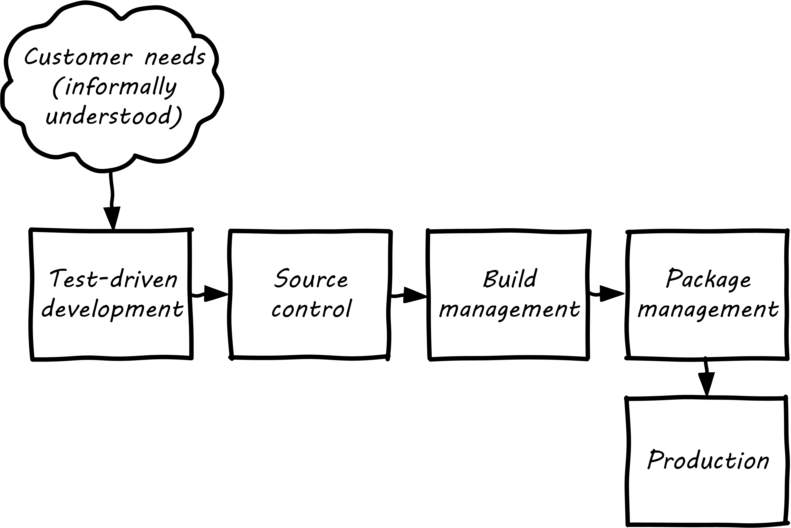
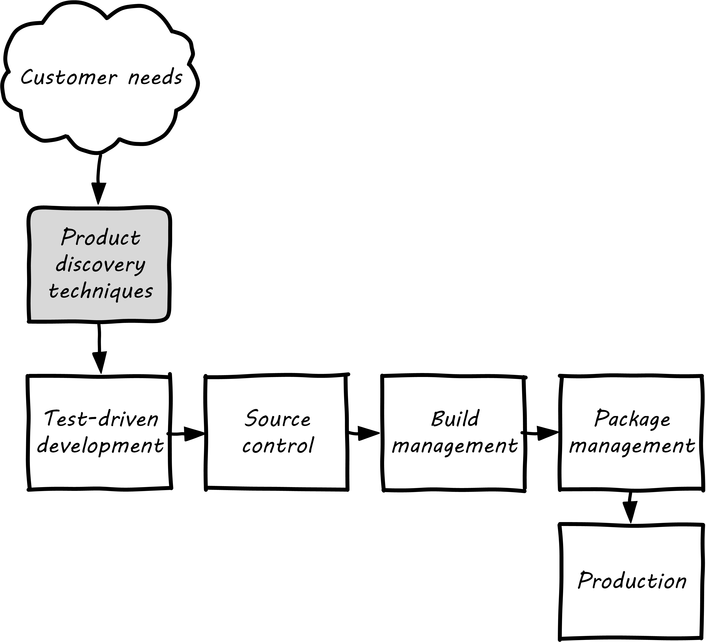
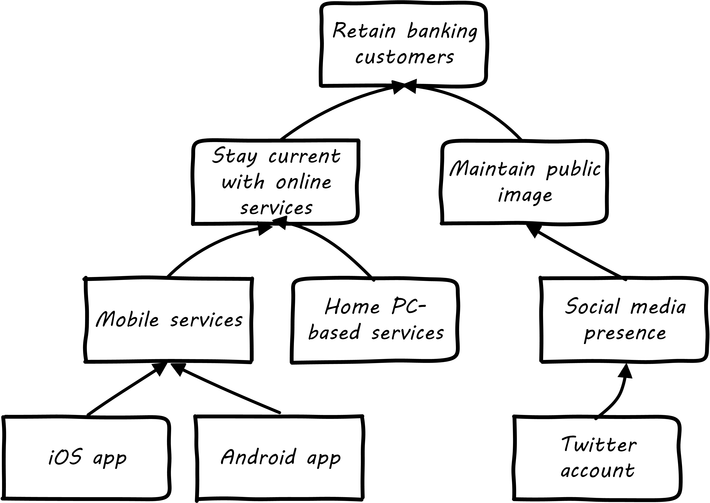

anchor:prod-discovery[]

==== Product discovery

[quote, Jacques Murphy, Pragmatic Marketing]
 What is a Product Manager? A Product Manager is the one person in the whole organization who owns the product Requirements effort. Requirements focuses on the WHAT, which means it isn't Development, which focuses on the HOW. And Marketing traditionally talks about the WHAT, but cannot necessarily decide what the WHAT should be. At least not at any useful level of detail. <<Murphy2007>>

Now that we have discussed the overall concept of product management and why it is important, and how product teams are formed, we can turn more specifically to the topic of product discovery and design. We have previously discussed the overall xref:digital-context[digital business context], as a startup founder might think of the problem. But the process of discovery continues as the product idea is refined, new business problems are identified, and solutions (such as specific feature ideas) are designed and tested for outcomes.

NOTE: In this book, we favor the idea that products are "discovered" as much or more than they are "designed." But you will see both terms used throughout this chapter. See the parable xref:flower-and-cog[the Flower and the Cog] for an illustration of the difference.

The presence of a section entitled "product discovery" in this book is a  departure from other IT management textbooks. "Traditional" models of IT delivery focus on projects and deliverables, concepts we touched on in the  xref:process-project-product[last chapter section] but that we will not explore in depth until later in the book. However, the idea of "product discovery" *within* the large company is receiving more and more attention. Even large companies xref:fowler-quote[benefit] when products are developed with tight-knit teams using fast feedback.

NOTE: The term "intrapreneurship," credited to Gifford Pinchot, means "entrepreneurship inside a large company."

For our discussion here, the challenge with the ideas of projects and deliverables is that they represent approaches that are more xref:open-loop[open loop], or at least delayed in xref:feedback[feedback]. Design processes do not perform well when feedback is delayed. xref:system-intent[System intent], captured as a user story or requirement, is only an hypothesis until tested via implementation and user confirmation.

anchor:prod-discovery-techniques[]

===== Formalizing product discovery

[quote, Ronnie Kohavi, Online Experimentation at Microsoft]
It is humbling to see how bad experts are at estimating the value of features (us included).

In Chapter 3, we needed to consider the means for describing  xref:system-intent[system intent]. Even as a bare-bones startup, some formalization of this starts to emerge, at the very least in the form of test-driven development:

.Product discovery tacit

But, the assumption in our emergence model is that more formalized product management emerges with the formation of a team. As a team, we now need to expand "upstream" of the core delivery pipeline, so that we can collaborate and discover more effectively. Notice the grey box in the following:

.Product discovery explicit

anchor:HIPPO[]

The most important foundation for your newly formalized product discovery capability is that it must be *empirical and hypothesis-driven*. Too often, product strategy is based on the HIPPO: The Highest Paid Person's Opinion.

.Beware of HIPPO-based product discovery footnote:[_Image credit https://www.flickr.com/photos/puliarfanita/6002022840, downloaded 2016-09-22, commercial use permitted_]

The problem with relying on "gut feel" or personal opinions is that people -- regardless of experience or seniority -- perform poorly in assessing the likely outcome of their product ideas. Some well known research on this topic was conducted by Microsoft's Ronny Kohavi. In this research, Kohavi and team determined that "only about 1/3 of ideas improve the metrics they were designed to improve." <<Kohavi2009>> As background, the same report cites that:

* "Netflix considers 90% of what they try to be wrong"
* "75 percent of important business decisions and business improvement ideas either have no impact on performance or actually hurt performance" according to Qualpro (a consultancy specializing in controlled experiments)

.Amazon Shopping Cart Recommendations
****
A well known story of the power of experimentation is told by Greg Linden, who was a product developer for early versions of the Amazon shopping cart. Linden had an idea of making recommendations to people based on what was already in their shopping cart. (While this is common across e-commerce sites now, at one point it was a new idea.) While grocery stores "recommnend" impulse purchases (candy, gum) in the checkout lane, an ecommerce provider can recommend anything in the store, so the idea is even more powerful. Linden developed a prototype, and while it got some favorable reactions, one senior vice president was against it -- his view was that it might distract people and lead them to abandon the cart.

As Linden says, "I was forbidden to work on this any further." But he went ahead and prepared the feature anyways. The SVP was furious, but Amazon already had a data-driven culture and even senior executives couldn't block tests. The feature was then pushed out to a small set of Amazon customers.  In this way, they could compare the behavior of customers who did receive shopping cart recommendations to those who didn't (otherwise known as a controlled experiment.) The results were dramatic - the feature outperformed the control of not having it by such a large margin that, as Linden says, "not having it live was costing Amazon a notable chunk of change."

It's unknown what happened to the SVP. Challenging senior executives can be bad for your career, but if you find yourself in a place run by HiPPOs who don't want to experiment, you might want to consider how long that organization will be in business.
<<Linden2006>>
****

It is therefore critical to establish a strong practice of data-driven experimentation when forming a product team, and avoid any cultural acceptance of "gut feel" or deferring to HIPPOs. This can be a difficult transition for the company founder, who has until now served as the _de facto_ product manager.

anchor:DIBB[]

A useful framework, similar to xref:lean-startup[Lean Startup] is proposed by Spotify, in the "DIBB" model:

* Data
* Insight
* Belief
* Bet

Data leads to insight, which leads to a hypothesis that can be tested (i.e., "bet" on - testing hypotheses is not free). We discuss issues of prioritization further in Chapter 5, in the section on xref:cost-of-delay[Cost of Delay].

anchor:beneficial-variability[]

Don Reinertsen (who we will read more about in the next chapter) emphasizes that such experimentation is inherently _variable_. We can't develop experiments with any sort of expectation that they will always succeed. We might run 50 experiments, and only have 2 succeed. But if the cost of each experiment is $10,000, and the two that succeeded earned us $1 million each, we gained:

 $ 2,000,000
 $ - 480,000
 -----------
 $ 1,520,000

Not a bad return on investment! (See <<Reinertsen2009>>, Chapter 4, for a detailed, mathematical discussion, based on options and information theory.) Roman Pichler, in _Agile Product Management with Scrum_, describes "old-school" versus "new-school" product management this way:

.Old school versus new school product management footnote:[summarized from <<Pichler2010>>, p. xxi ]
[cols="2*", options="header"]
|====
|Old school|New school
|Shared responsibility|Single product owner
|Detached project manager|PM belongs to Scrum team
|Extensive up-front research|Minimal up-front work to define rough vision
|Requirements frozen early|Dynamic backlog
|Late feedback due to lengthy release cycle |Early & frequent releases drive fast feedback, resulting in customer value
|====

===== Product discovery techniques

There are a wide variety of techniques and even "schools" of product discovery and design; we will consider a few representatives in this chapter section. Of course, when you first started your journey in Chapter 1, you might also have used some of these techniques. But now that you are a team, you are formalizing and relying on these techniques. These techniques are not mutually exclusive; they may be complementary. But at the more detailed, digital product level, how do we develop hypotheses for testing, in terms of our products/services? We briefly mentioned User Story Mapping in our discussion of xref:system-intent[system intent.] In product discovery terms, User Story Mapping is a form of persona analysis. But that is only one of many techniques. Roman Pichler mentions "Vision Box and Trade Journal Review" and the "Kano Model" (<<Pichler2010>>, p. 39). Here, let's discuss:

* "Jobs to be done" analysis
* Impact mapping
* Business analysis & architecture

anchor:jobs-to-be-done[]

====== Job to Be Done
[quote, Theodore Levitt]
Customers don't want a quarter-inch drill. They want a quarter-inch hole.

[quote, Henry Ford, (apocryphal)]
If I'd asked the customer what they wanted, they would have said "faster horses."

The "Jobs to be Done" framework was created by noted Harvard professor Clayton Christensen, in part as a reaction against conventional xref:product-mgmt-v-marketing[marketing] techniques that

_"frame customers by attributes—using age ranges, race, marital status, and other categories that ultimately create products and entire categories too focused on what companies want to sell, rather than on what customers actually need."_ <<Christensen2015>>

"Some products are better defined by the job they do than the customers they serve," in other words. <<Traynor2016>> This is in contrast to many kinds of business and requirements analysis that focus on identifying different user personas (e.g. 45-55 married Black woman with children in the house). Jobs to be Done advocates argue that "The job, not the customer, is the fundamental unit of analysis" and that customer "hire" products to do a certain job. <<Christensen2006>>

To apply the Job to Be done approach, Des Traynor suggests filling in the blanks in the following <<Traynor2016>> :

*Why do people hire your product?*

People hire your product to do the job of --------  every ---------- when ----------. The other applicants for this job are --------, --------, and --------, but your product will always get the job because of --------.

Understanding the alternatives people have is key. It's possible that the job can be fulfilled in multiple different ways. For example, people may want certain software run. This job can be undertaken through owning a computer (e.g. having a data center). It can also be managed by hiring someone else's computer (e.g. using a Cloud provider). If one is not attentive and creative in thinking about the diverse ways jobs can be done, one is at risk for disruption.

anchor:impact-mapping[]

====== Impact mapping

Understanding the relationship of a given feature or component to business objectives is critical. Too often, technologists (e.g software professionals) are accused of wanting "technology for technology's sake."

Showing the "line of sight" from technology to a business objective is therefore critical. Ideally, this starts by identifying the business objective. Gojko Adzic's _Impact Mapping: Making a big impact with software products and projects_ <<Adzic2012>> describes a technique for doing so:

_An impact map is a visualisation of scope and underlying assumptions, created collaboratively by senior technical and business people._

Starting with some general goal or hypothesis (e.g. generated through Lean Startup thinking), one builds a "map" of how the goal can be achieved, or hypothesis can be measured. A simple graphical approach can be used:

.Impact map

NOTE: Impact mapping is similar to mind mapping, and some drawing tools such as Microsoft Visio come with "Mind Mapping" templates.

The most important part of the impact map is to answer the question "Why are we doing this?" The impact map is intended to help keep the team focused on the most important objectives, and avoid less valuable activities and investments.

For example, in the above diagram, we see that a bank may have an overall business goal of customer retention. (It is much more expensive to gain a new customer, than to retain an existing one, and retention is a metric carefully measured and tracked at the highest levels of the business.)

Through focus groups and surveys, the bank may determine that staying current with online services is important to retaining customers. Some of these services are accessed by home PCs, but increasingly customers want access via mobile devices.

These business drivers lead to the decision to invest in online banking applications for both the Apple and Android mobile platforms. This decision in turn will lead to further discovery, analysis, and design of the mobile applications.

anchor:biz-analysis-ch1[]

====== The Business Analysis Body of Knowledge

One well-established method for product discovery is that of business analysis, formalized in the _Business Analysis Body of Knowledge_ (BABOK), from the International Institute of Business Analysis <<IIBA2015>>

The Business Analysis Body of Knowledge (BABOK) defines business analysis as (p. 442):

_The practice of enabling change in the context of an enterprise
by defining needs and recommending solutions that deliver value to
stakeholders_.

BABOK is centrally concerned with the concept of requirements, and classifies them thus:

* Business requirements
* Stakeholder requirements
* Solution requirements
** Functional requirements
** Non-functional requirements
* Transition requirements

BABOK also provides a framework for understanding and managing the work of business analysts; in general it assumes that a BA capability will be established and that maturing such a capability is a desirable thing. This may run counter to the Scrum ideal of cross-functional, multi-skilled teams. Also as noted xref:system-intent[above], the term "requirements" has fallen out of favor with some Agile thought leaders.
