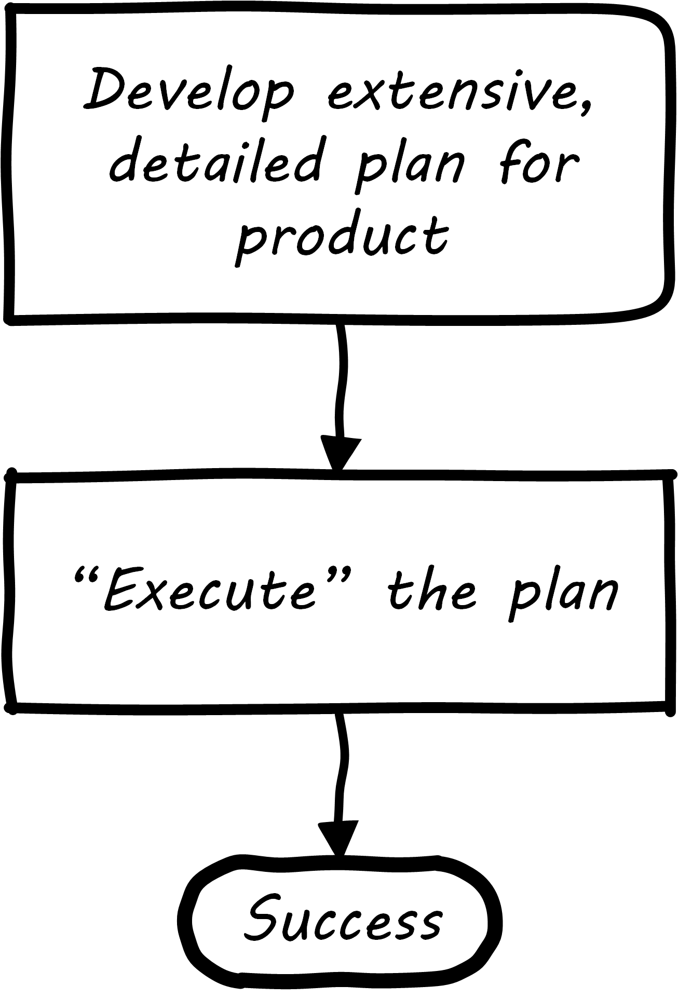
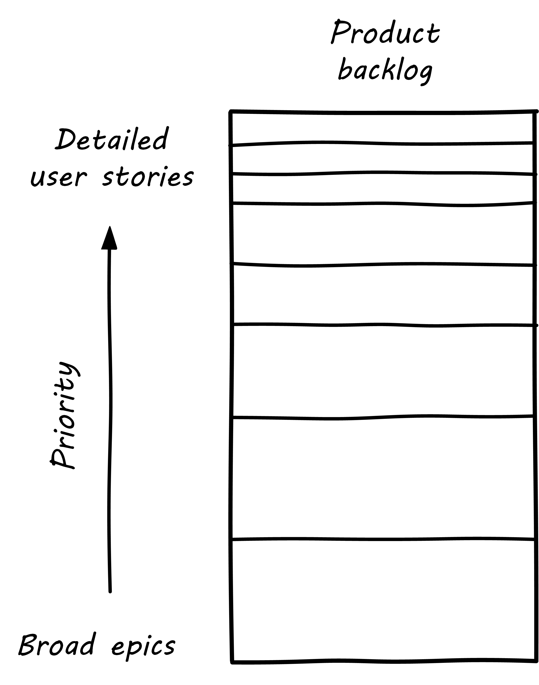

anchor:product-roadmapping[]

==== Product planning

===== Product roadmapping and release planning
[quote, Don Reinertsen, Managing the Design Factory]
Some companies may notice that every specification they have ever prepared in the history of their company has had to change during product development, but they attribute this to human error and lack of discipline. They deeply believe that they can produce a good specification if only they try hard enough. You may recognize this as the classic thinking of an xref:open-loop[open loop] control system...

Creating effective plans in complex situations is hard. Planning a new product is one of the most challenging endeavors, one in which failure is common. As the Don Reinertsen quote above reflects, the historically failed approach (call it the "planning fallacy") is to develop overly detailed (sometimes called "rigorous") plans and then assume that achieving them is simply a matter of "correct execution" (see <<fig-plan-driven-250-o>>).

[[fig-plan-driven-250-o]]
.Planning fallacy

Contrast the planning fallacy with xref:lean-startup[Lean Startup], which emphasizes ongoing confirmation of product direction through experimentation. In complex efforts, ongoing validation of assumptions and direction is essential, which is why overly plan-driven approaches are falling out of favor. However, some understanding of time frames and mapping goals against the calendar is still important. Exactly how much effort to devote to such forecasting remains a controversial topic with digital product management professionals, one we will return to throughout this book.

Minimally, a high level product roadmap is usually called for: without at least this, it may be difficult to secure the needed investment to start product work. Roman Pichler recommends the product roadmap contain:

* Major versions
* Their projected launch dates
* Target customers and needs
* Top three to five features for each version (cite:[Pichler2010], p. 41.)

More detailed understanding is left to the xref:scrum[product backlog], which is subject to ongoing "grooming" (re-evaluation in light of xref:feedback[feedback]).

anchor:backlog-estimation-prioritization[]

===== Backlog, estimation, and prioritization

[quote, Don Reinertsen, Principles of Product Development Flow]
_companies often create complex prioritization algorithms that produce precise priorities based on very imprecise input data. I prefer the simple approach. To select between two almost equivalent choices creates great difficulty and little payoff. Instead, we should try to prevent the big, stupid mistakes. This does not require precision_ (cite:[Reinertsen2009] p 192).

The product discovery and roadmapping activity ultimately generates a more detailed view or list of the work to be done. As we previously mentioned, in xref:Scrum[Scrum] (and other Agile methods) this is often termed a backlog. Both Mike Cohn and Roman Pichler use the DEEP acronym to describe backlog qualities (cite:[Cohn2010], p. 243, cite:[Pichler2010] p. 48):

* Detailed appropriately
* Estimated
* Emergent (feedback such as new or changed stories are readily accepted)
* Prioritized

[[fig-backlog-300-i]]
.Backlog granularity & priority

The backlog should receive ongoing "grooming" to support these qualities, which means several things:

* Addition of new items
* Re-prioritization of items
* Elaboration (decomposition, estimation and refinement)

When "detailed appropriately," items in the backlog are not all the same scale. Scrum and Agile thinkers generally agree on the core concept of "story," but stories vary in size (see <<fig-backlog-300-i>> footnote:[similar to cite:[Pichler2010]), with the largest stories often termed "epics." The backlog is ordered in terms of priority (what will be done next) but, critically, it is also understood that the lower-priority items in general can be larger grained. In other words, if we visualize the backlog as a stack, with the highest priority on the top, the size of the stories increases as we go down. (Reinertsen terms this _progressive specification_; see cite:[Reinertsen1997], pp. 176-177 for a detailed discussion.)

Estimating user stories is a standard practice in Scrum and Agile methods more generally. Agile approaches are wary of false precision and accept the fact that estimation is an uncertain practice at best. However, without some overall estimate or roadmap for when a product might be ready for use, it is unlikely that the investment will be made to create it. It is difficult to establish the economic value of developing a product feature at a particular time, if you have no idea of the cost and/or effort involved to bring it to market.

At a more detailed level, it is common practice for product teams to estimate detailed stories using "points." Mike Cohn emphasizes, "Estimate size, derive duration" (cite:[Cohn2006] p. xxvii). Points are a relative form of estimation, valid within the boundary of one team. Story point estimating strives to avoid false precision, often restricting the team's estimate of the effort to a modified Fibonacci sequence, or even T-shirt or dog sizes (cite:[Cohn2006], p. 37) as shown in <<tbl-agile-est>>. footnote:[Similar to cite:[Cohn2006], p. 37)]

Mike Cohn emphasizes that estimates are best done by the teams performing the work ()cite:[Cohn2006] p.51). We'll discuss the mechanics of maintaining backlogs in xref:work-management[Chapter 5, Work Management].

[[tbl-agile-est]]
.Agile estimating scales
[cols="3*", options="header"]
|====
|Story point|T-shirt|Dog
|1|XXS|Chihauha
|2|XS|Dachshund
|3|S|Terrier
|5|M|Border collie
|8|L|Bulldog
|13|XL|Labrador retriever
|20|XXL|Mastiff
|40|XXXL|Great Dane
|====

Backlogs require prioritization. In order to prioritize, we must have some kind of common understanding of what we are prioritizing *for*. Mike Cohn, in _Agile Estimating and Planning_, proposes that there are four major factors in understanding product value:

* The financial value of having the features
* The cost of developing and supporting the features
* The value of the learning created by developing the features
* The amount of risk reduced by developing the features cite:[Cohn2006], p80.

In Chapter 5 we will discuss additional tools for managing and prioritizing work, and we will return to the topic of estimation in Chapter 8.
