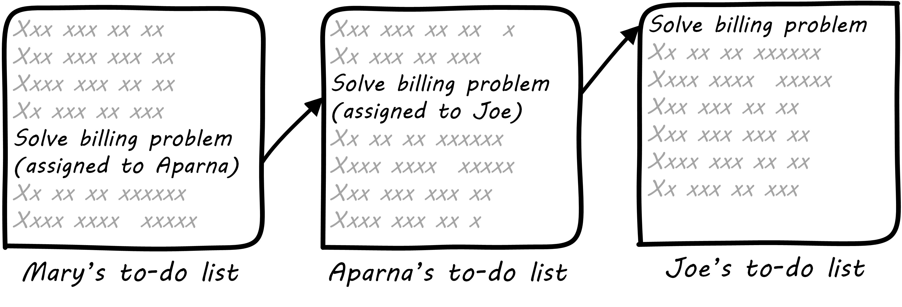
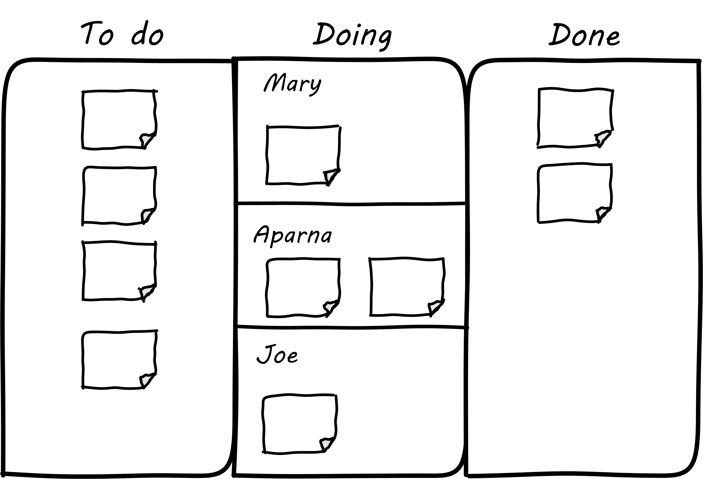

anchor:task-mgmt[]

==== Task management

[quote, Wikipedia, Task Management]
Task management is the process of managing a task through its life cycle. It involves planning, testing, tracking and reporting. Task management can help either individuals achieve goals, or groups of individuals collaborate and share knowledge for the accomplishment of collective goals.

The product development process drives a wide variety of work activities. As your product matures, you encounter both routine and non-routine work. Some of the work depends on other work getting done. Sometimes you do not realize this immediately. All of this work needs to be tracked.

Work management may start with verbal requests, emails, even postal mail. If you ask your colleague to do one thing, and she doesn’t have anything else to do, it’s likely that the two of you will remember. If you ask her to do four things over a few days, you *might* both still remember. But if you are asking for new things every day, it is likely that some things will get missed. You each might start keeping your own “to do” list, and this mechanism can handle a dozen or two dozen tasks. Consider an example of three people, each with their own to do list:

.Work flowing across 3 to-do lists

In this situation, each person has their own “mental model” of what needs to be done, and their own tracking mechanism. We don’t know how the work is being transmitted: emails, phone calls, hallway conversations (”Say Joe, there is an issue with Customer X’s bill, can you please look into it?”)

.Task handoffs present risk footnote:[_Image credit https://www.flickr.com/photos/chrisbrooks/42588998, downloaded 2016-10-07, commercial use permitted_]
image::images/2.05-handoff.jpg[Handoff,, float="right"]

But what happens when there are three of you? Mary asks Aparna to do something and in order to complete it she needs something from Joe, whom Mary is also asking to complete other tasks. As an organization scales, this can easily lead to confusion and "dropped balls."

At some point, you need to formalize your model of the work, how it is described, and how it flows. This is such a fundamental problem in human society that many different systems, tools, and processes have been developed over the centuries to address it.
Probably the most important is the shared task reference point. What does this mean? The “task” is made "real" by associating it with a common, agreed-on artifact.

anchor:representation[]

For example, a “ticket” may be created, or a "work order". Or a “story,” written down on a sticky note. At our current level of understanding, there is little difference between these concepts. *The important thing they have in common is an independent existence.* That is, Mary, Aparna, and Joe might all change jobs, but the artifact persists independently of them. Notice also that the artifact - the ticket, the post-it note - is *not* the actual task, which is an intangible, consensus concept. It is a _representation_ of this intangible "intent to perform." We will discuss these issues of representation further in Chapter 11.

A complex IT-based system is not needed, if you are all in the same room! (Nor for that matter a complex process framework, such as xref:ITIL[ITIL] or xref:COBIT[COBIT]. There is risk in using such frameworks at this stage of evolution - they add too much overhead for your level of growth.) It's also still too early for formal project management. The "project team" would be most or all of the organization, so what would be the point? A shared white board in a public location might be all that is needed. This gives the team a “shared mental model” of who is doing what.

.Common list
image::images/2.05-commonList.png[common list, 500]

The design of the task board above has some issues, however. After the team gets tired of erasing and rewriting the tasks and their current assignments, they might adopt something more like this:

anchor:card-wall[]

.Simple task board

The board itself might be a white board, or a cork bulletin board with push pins. The notes could be sticky, or index cards. There are automated solutions as well. The tool doesn’t really matter. The important thing is that, at a glance, the entire team can see its flow of work and who is doing what.

This is sometimes called a “Kanban board," although David Anderson (originator of the Kanban software method) himself terms the basic technique a "card wall." It also has been called a "Scrum Board." The board at its most basic is not specific to either methodology. The term "Kanban" itself derives from Lean manufacturing principles; we will cover this in depth in the next section. The basic board is widely used because it is a powerful artifact. Behind its deceptive simplicity is considerable industrial experience and relevant theory from operations management and human factors. However, it has scalability limitations. What if the team is not all in the same room? We will cover this and related issues in Part III.
