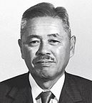

==== Learning from manufacturing

Eliyahu Moshe Goldratt was an Israeli physicist and management consultant, best known for his pioneering work in management theory, including  _The Goal_, which is a best-selling business novel frequently assigned in MBA programs. It and Goldratt's other novels have had a tremendous effect on industrial theory, and now, digital management. One of the best known stories in _The Goal_ centers around a Boy Scout march. Alex, the protagonist struggling to save his manufacturing plant, takes a troop of Scouts on a ten mile hike. The troop has hikers of various speeds, yet the goal is to arrive simultaneously. As Alex tries to keep the Scouts together, he discovers that the slowest, most overweight scout (Herbie) also has packed an unusually heavy backpack. The contents of Herbie's pack are redistributed, speeding up both Herbie and the troop.

This story summarizes the Goldratt approach: finding the "constraint" to production (his work as a whole is called the Theory of Constraints). In Goldratt's view, a system is only as productive as its constraint. At Alex's factory, it's found that the "constraint" to the overall productivity issues is the newest computer-controlled machine tool -- one that could (in theory) do the work of several older models but was now jeopardizing the entire plant's survival. This novelization parallels in important regards actual Lean case studies on the often-negative impact of such capital-intensive approaches to production.

There is a tremendous wealth of material available on Lean history and theory, and the IT student is urged to become familiar with it. Often, IT professionals resist drawing lessons from non-IT fields, because of a perception that these other fields (especially manufacturing) are “deterministic” while IT systems development is too “uncertain.” In reality, manufacturing is less deterministic than IT professionals often perceive, while software development is, at its most uncertain, just another form of https://en.wikipedia.org/wiki/New_product_development[new product development], and/or https://en.wikipedia.org/wiki/Research_and_development[research and development] and therefore can be managed on that basis. Furthermore, much IT work is not R&D (e.g. infrastructure provisionings), and that kind of work is even more suited for the application of manufacturing insights.

.Author's note: Gene Kim and The Phoenix Project
****

.Gene Kim

Between 2005 and 2012, I was a lead enterprise architect at Wells Fargo Bank, primarily concerned with IT delivery capabilities such as portfolio and service management. One day around 2007, I arrived at my office to find an envelope from my friend Gene Kim, then CTO of Tripwire. Gene and I had been corresponding for some years on high-performing IT, IT process improvement, and related topics. In the envelope was a copy of a book called _The Goal_, by Eli Goldratt. I was a little mystified, but after reading the book I began to understand.

Gene saw the potential of the Theory of Constraints in understanding certain aspects of information technology management, and used it as a template to write another remarkable and influential book, _The Phoenix Project_ <<Kim2013>>. Rather than a manufacturing plant, the Phoenix Project centers on the struggles of the IT team at a medium-sized automotive parts manufacturer and retailer. From a state of chaos, uncontrolled work in process and resource constraints, the team applies Lean, Agile, and DevOps techniques to great effect. In my view, _The Phoenix Project_ is one of the most important works in the history of IT and digital management, and is also an enjoyable novel. I am honored to have been one of the original reviewers. If you are considering a career in IT or digital, it is essential reading. See especially Chapter 30 for an interesting discussion of manufacturing lessons in an IT context.
****

anchor:2.05.02-kanban[]
anchor:lean[]

===== Kanban and its Lean origins

.Lean pioneer Taichi Ohno footnote:[_By Source (WP:NFCC#4), Fair use, https://en.wikipedia.org/w/index.php?curid=46971844_]

To understand Kanban let's discuss Lean briefly. We've had passing mention of Lean already in this book. But what is it?

Lean is a term invented by some American researchers who investigated Japanese industrial practices and their success in the 20th century. After the end of World War II, no-one expected the Japanese economy to recover the way it did. The recovery is credited to practices invented by  https://en.wikipedia.org/wiki/Taiichi_Ohno[Taiichi Ohno] and https://en.wikipedia.org/wiki/Shigeo_Shingo[Shigeo Shingo] at https://en.wikipedia.org/wiki/Toyota[Toyota]. These practices included:

* Respect for people
* Limiting work in process
* Small batch sizes (driving towards "single piece flow")
* Just-in-time production
* Decreased cycle time

Credit for Lean is also given to U.S. thinkers such as W.E. Deming, Peter Juran, and the theorists behind the Training Within Industry methodology, who all played influential roles in shaping the industrial practices of post-war Japan.

IMPORTANT: Lean is important. Regardless of your intended career path, it is advisable to read the great Lean classics, including http://www.goodreads.com/book/show/93903.Machine_That_Changed_the_World[The Machine That Changed the World], http://www.goodreads.com/book/show/289467.Lean_Thinking[Lean Thinking], http://www.goodreads.com/book/show/161789.The_Toyota_Way[The Toyota Way], and Ohno's own http://www.goodreads.com/book/show/376237.Toyota_Production_System[Toyota Production System]. http://www.goodreads.com/book/show/6736366-toyota-kata[Toyota Kata] is a more recent, in-depth analysis of Toyota's culture.

Kanban is a term originating from Lean and the Toyota Production System. Originally, it signified a “pull” technique in which materials would only be transferred to a given workstation on a definite signal that the workstation required the materials. This was in contrast to “push” approaches where work was allowed to accumulate on the shop floor, on the (now discredited) idea that it was more “efficient” to operate workstations at maximum capacity.

Factories operating on a "push" model found themselves with massive amounts of inventory (work in process) in their facilities. This tied up operating capital and resulted in long delays to shipment, because of the queueing issues. Japanese companies did not have the luxury of large amounts of operating capital, so they started experimenting with "single-piece flow." This led to a number of related innovations, such as the ability to re-configure manufacturing machinery much more quickly than U.S. factories were capable of.

David J. Anderson was a product manager at Microsoft who was seeking a more effective approach to managing software development. In consultation with Don Reinertsen (introduced in the xref:queuing[previous section]) he applied the original concept of Kanban to his software development activities <<Anderson2010>>.

xref:scrum[Scrum] (covered in the previous chapter) is based on a rhythm with its scheduled sprints, for example every two weeks. In contrast, Kanban is a continuous process with no specified rhythm (also known as _cadence_). Work is “pulled” from backlog into active attention as resources are freed from previous work. This is perhaps the most important aspect of Kanban - the idea that *work is not accepted until there is capacity to perform it.*

You may have a white board covered with sticky notes, but if they are stacked on top of each other with no concern for worker availability, you are not doing Kanban. You are accepting too much work in process and you are likely to encounter a "high-queue state" in which work becomes slower and slower to get done.

===== Queues and limiting work in process
[quote, Don Reinertsen, Principles of Product Development Flow]
Queues matter because they are economically important, they are poorly managed, and they have the potential to be much better managed. Queues profoundly affect the economic of product development. They cause valuable work products to sit idle, waiting to access busy resources. This idle time increases inventory, which is the root cause of many other economic problems...queues hurt cycle time, quality, and
efficiency.

[[queuing]]
.A queue footnote:[_Image credit https://www.flickr.com/photos/hktang/4243300265, downloaded 2016-10-07, commercial use permitted_]
image::images/2.05-queue.jpg[alt text, 300, 200, float="right"]

Even at this stage of our evolution, with just one co-located collaborative team, it’s important to consider work in progress and how to limit it. One topic we will emphasize throughout the rest of this book is _queuing_. What is a queue? A queue, intuitively, is a collection of tasks to be done, being serviced by some worker or resource in some sequence.

IMPORTANT: Queuing theory is an important branch of mathematics used extensively in computing, operations research, networking, and other fields. It's a topic getting much attention of late in the Agile and related movements, especially as it relates to development team productivity.

Lean manufacturing has been an important movement throughout the 20th century, and one of its central principles is to limit work in process. Work in process is obvious on a shop floor, because physical raw materials (inventory) are quite visible.

[[wip]]
.Physical Work in Process footnote:[_Image credit https://www.flickr.com/photos/jayburkhalter/6679328027/, downloaded 2016-10-07, commercial use permitted_]
image::images/2.05-wip.jpg[alt text, 300, 200, float="left"]

Don Reinertsen, quoted above, developed the insight that product design and development had an *invisible* inventory of "Work in Process" that he called Design in Process (DIP). Just as managing physical work in process on the factory floor is key to a factory's success, so correctly understanding and managing design in process is essential to all kinds of research and development organizations -- *including digital product development.* In fact, because digital systems are largely invisible even when finished, understanding their work in process is even more challenging.

It is easy and tempting for a product development team to accumulate excessive amounts of work in process. And, to some degree, having a rich backlog of ideas is an asset. But, just as some inventory (e.g. groceries) is perishable, so are design ideas. They have a limited time in which they might be relevant to a customer or a market. Therefore, accumulating too many of them at any point in time can be wasteful.

What does this have to do with queuing? Design in process is one form of queue seen in the digital organization. Other forms include unplanned work (incidents and defects), implementation work, and many other concepts we'll discuss in this chapter.

Regardless of whether it is a "Requirement," a "User Story," an "Epic," "Defect,", "Issue," or "Service Request," you should remember it's *all just work.* It needs to be logged, prioritized, assigned, and tracked to completion. Queues are the fundamental concept for doing this, and it's critical that digital management specialists understand this.

We will revisit the topic of queuing in Chapter 9. For now, some rules of thumb:

* Finish what you start, if you can, before starting anything else. When you work on three things at once, the multi-tasking wastes time and it takes you three times longer to get any one of the things done. (More on xref:multi-tasking[multi-tasking] in this chapter.)
* Infinitely long to-do lists (backlog) sap motivation. Consider limiting backlog as well as work in process.
* Visibility into work in progress is important for the collective mental model of the team.

There are deeper philosophical and cultural qualities to Kanban beyond workflow and queuing. Anderson and his colleagues continue to evolve Kanban into a more ambitious framework. Mike Burrows <<Burrows2014>> identifies the following key principles

* Start with what you do now.
* Agree to pursue evolutionary change.
* Initially, respect current processes, roles, responsibilities, and job titles.
* Encourage acts of leadership at every level in your organization —from individual contributor to senior management.
* Visualize.
* Limit Work-in-Progress (WIP).
* Manage flow.
* Make policies explicit.
* Implement feedback loops.
* Improve collaboratively, evolve experimentally (using models and the scientific method).

===== Scrum, Kanban, or both?

So, do you choose Scrum, Kanban, both, or neither?

We can see in comparing Scrum and Kanban that their areas of focus are somewhat different.

* Scrum is widely adopted in industry and has achieve a level of formalization, which is why Scrum training is widespread and generally consistent in content.
* Kanban is seen as more flexible but this comes at a cost of more management overhead. It requires more interpretation to translate to a given organization’s culture and practices.
* As Scrum author Ken Rubin notes, “Scrum is not well suited to highly interrupt-driven work.” <<Rubin2012>>. (But if your company is too small, it may be difficult to segregate out interrupt-driven work! We will discuss the issues around interrupt-driven work further in Chapter 6.)
* Finally, hybrids exist (Ladas' “Scrumban,” <<Ladas2009>>).

Ultimately, instead of talking too much  about "Scrum" or "Kanban," the student is encouraged to look more deeply into their fundamental differences. We will return to this topic in the section on Lean Product Development.
