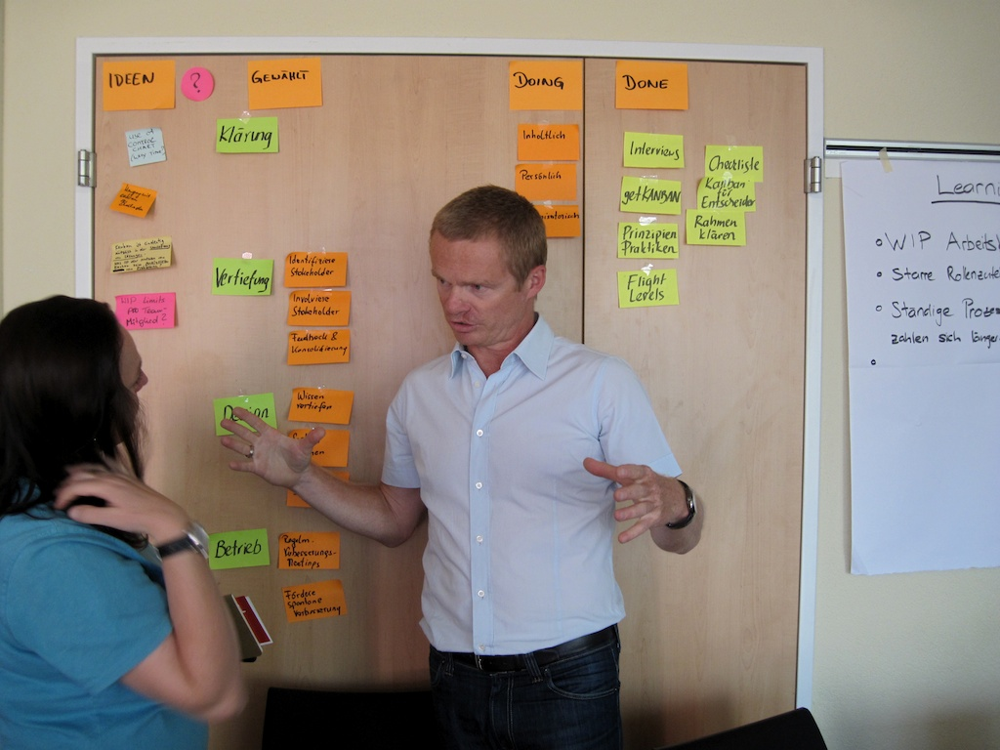

anchor:shared-mental-model[]

==== The shared mental model of the work to be done

[quote, Gary Klein et al, "Common Ground and Coordination in Joint Activity"]
Joint activity depends on interpredictability of the participants’ attitudes and actions. Such interpredictability is based on common ground — pertinent knowledge, beliefs and  assumptions that are shared among the involved parties. <<Klein2005>>

The above quote reflects one of the most foundations of team collaboration: a common ground, a base of "knowledge, beliefs, and assumptions" enabling collaboration and coordination. Common ground is an essential quality of successful teamwork, and we will revisit it throughout the book. There are many ways in which common ground is important, and we will discuss some of the deeper aspects in terms of information in xref:chap-ent-info-mgmt[chapter 11]. Whether you choose Scrum, Kanban, or choose not to label your work management at all, the important thing is that you are creating a shared mental model of the work: its envisioned form and content, and your progress towards it.

In this section, we'll discuss:

* Visualization of work
* The concept of Andon
* The definition of done
* Time and space shifting

Visualization is a good place to introduce the idea of common ground.

===== Visualization
[quote, Don Reinertsen, Principles of Product Development Flow]
As simple as the whiteboard is, it makes WIP continuously visible, it enforces WIP constraints, it creates synchronized daily interaction, and it promotes interactive problem solving. Furthermore, teams evolve methods of using whiteboards continuously, and they have high ownership in their solution. In theory, all this can be replicated by a computer system. In practice, I have not yet seen an automated system the replicates the simple elegance and flexibility of a manual system.

Why are shared visual representations important? Depending on how you measure, between 40% to as much as 80% of the human cortex is devoted to visual processing. Visual processing dominates mental activity, consuming more neurons than the other four senses combined <<Sells1957>>. Visual representations are powerful communication mechanisms, well suited to our cognitive abilities.

This idea of a common ground, a shared visual reference point, informing the mental model of the team, is essential.

.Two people and a Kanban board footnote:[_Image credit https://www.flickr.com/photos/visualpunch/9668342772/, downloaded 2016-11-17, commercial use permitted_]

This is why xref:card-wall[card walls] or Kanban boards located in the same room are so prevalent. They communicate and sustain the shared mental model of a human team. A shared card wall, with its two dimensions and tasks on cards or sticky notes, is more informative than a simple to-do list (e.g.  in a spreadsheet). The cards occupy two dimensional space and are  moved over time to signify activity, both powerful cues to the human visual processing system.

Similarly, monitoring tools for systems operation make use of various visual clues. Large monitors may be displayed prominently on walls, so that everyone can understand operational status. Human visual orientation is also why Enterprise Architecture persists. People will always draw to communicate. (More on xref:arch-visualization[visualization and enterprise architecture ]in Chapter 12.)

Card walls and publicly displayed monitors are both examples of _information radiators_. The information radiator concept derives from the Japanese concept of _Andon_, important in Lean thinking.

anchor:andon[]

===== Andon, and the Andon Cord

[quote, Wikipedia, https://en.wikipedia.org/wiki/Andon_(manufacturing)]
_Andon_ is a manufacturing term referring to a system to notify management, maintenance, and other workers of a quality or process problem. The centrepiece is a signboard incorporating signal lights to indicate which workstation has the problem. The alert can be activated manually by a worker using a pullcord or button, or may be activated automatically by the production equipment itself. The system may include a means to stop production so the issue can be corrected. Some modern alert systems incorporate audio alarms, text, or other displays.

The Andon _Cord_ (not to be confused with Andon in the general sense) is another well known concept in Lean Manufacturing. It originated with Toyota, where line workers were empowered to stop the production line if any defective materials or assemblies were encountered. Instead of attempting to work with the defective input, the entire line would shut down and all concerned would establish what had happened and how to prevent it. The concept of andon cord concisely summarizes the Lean philosophy of employee responsibility for quality at all levels <<Ohno1988>>. Where Andon is a general term for information radiator, the Andon Cord implies a dramatic reponse to the problems of flow - all progress is stopped, everywhere along the line, and the entire resources of the production line are marshalled to collaboratively solve the issue so that it does not happen again. As Toyota though leader Taiichi Ohno states:

[quote, Taiichi Ohno]
Stopping the machine when there is trouble forces awareness on everyone. When the problem is clearly understood, improvement is possible. Expanding this thought, we establish a rule that even in a manually operated production line, the workers themselves should push the stop button to halt production if any abnormality appears.

Andon and information radiators provide important stimulus for product teams, informing priorities and prompting responses. They do not prescribe what is to be done; they simply indicate operational status that may require attention.

===== Definition of done

As work flows through the system performing it, understanding its status is key to managing it. One of the most important mechanisms for doing this is to simply define what is meant by “done.” The Agile Alliance http://guide.agilealliance.org/guide/definition-of-done.html#sthash.6rSCZMyU.dpuf[states]:

“The team agrees on, and displays prominently somewhere in the team room, a list of criteria which must be met before a product increment, often a user story, is considered "done" <<Alliance2016>>. Failure to meet these criteria at the end of a sprint normally implies that the work should not be counted toward that sprint's velocity.” There are various patterns for defining "done," for example, Thoughtworks recommends that the business analyst and developer both must agree that some task is complete (it is not up to just one person). Other companies may require peer code reviews <<Narayam2015a>>. The important point is that the team must agree on the criteria.

This idea of defining “done” can be extended by the team to other concepts such as “blocked.” The important thing is that this is all part of the team’s shared mental model, and is best defined by the team and its customers. (However, governance and consistency concerns may arise if teams are too diverse in such definitions.)

===== Time and space shifting

At some point your team will be faced with the problems of time and/or space shifting. People will be on different schedules, or in different locations, or both. There are two things we know about such working relationships. First, they leads to sub-optimal team communications and performance. Second, they are inevitable.

The need for time and space shifting is one of the major drivers for more formalized IT systems. It is difficult to effectively use a physical Kanban board if people aren’t in the office. The outcome of the daily standup needs to be captured for the benefit of those who could not be there.

However, acceptance of time and space shifting may lead to more of it, even when it is not absolutely required. A constant pressure and questioning is recommended, given the superior bandwidth of face to face communication in the context of team collaboration.

But not all work requires the same degree of collaboration. While we are still not ready for full scale process management, at this point in our evolution we likely will encounter increasing needs to track customer or user service interations, which can become quite numerous even for small, single-team organizations. This brings us to the topic of the Help or Service Desk.
