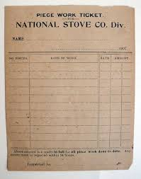

anchor:ticketing[]

==== The service desk and related tools
As a digital product starts to gain a user base, and as a company matures and grows, there emerges a need for human to human support. This is typically handled by a help desk or service desk. The Service Desk (aka Help Desk), is the human face of IT when the IT systems are not meeting people's expectations. We were first briefly introduced to the concept in our Service Lifecycle:

//this won't preview but will render correctly
.IT service lifecycle
image::images/1.01-ITStates.png[]

ifdef::collaborator-draft[]
 to be re-designed #designer
endif::collaborator-draft[]

The service desk is an interrupt-driven, task-oriented capability. It serves as a first point of contact for IT services that require some human support or intervention. As such its role can become broad, from provisioning access to assisting users in navigation & usage, to serving as an alert channel for outage reporting. The service desk ideally answers each user's request immediately, requiring no followup. If followup is required, a "ticket" is "issued."

As a “help desk,” it may be focused on end user assistance and reporting Incidents.
As a “service desk,” it may expand its purview to accepting provisioning or other requests of various types (and referring and tracking those requests). Note that in some approaches, Service Request and Incident are considered to be distinct processes.

The term "ticket" dates to paper-based industrial processes, where the "help desk" might actually be a physical desk, where a user seeking services might be issued a paper ticket. Such "tickets" were also used in field services:

.A "ticket" from early industry

In IT-centric domains, tickets are virtual; they are records in databases, not paper. The user is given a ticket "ID" or "number" for tracking (e.g., so they can inquire about the request's status.) The ticket may be "routed" to someone to handle, but again in a virtual world what really happens is that the person it's routed to is directed to look at the record in the database. (In paper based processes, the ticket might well be moved physically to various parties to perform the needed work.)

A Service Desk capability needs

* channels for accepting contacts (e.g. telephone, email, chat),
* staffing appropriate to the volume and nature of those requests,
* robust workflow capabilities to track their progress, and
* routing and escalation mechanisms, since clarifying the true nature of contacts and getting them serviced by the most appropriate means are nontrivial challenges.

There is extensive material on managing Service Desks; the reader is referred first to the http://www.thinkhdi.com/[Help Desk Institute]. See also https://en.wikipedia.org/wiki/Help_desk.

Work management in practice has divided between development and operations practices and tools. However, DevOps and Kanban are forcing a reconsideration and consolidation. Historically, here are some of the major tools and channels through which tasks and work are managed on both sides:

[cols="2*", options="header"]
|====
|Development      |Operations
|User story tracking system |Service or help desk ticketing system
|Issue/risk/action item log |Incident management system
|Defect tracker|Change management system
|====

All of these systems have common characteristics. All can (or should) be able to:

* Register a new task
* Describe the work to be done (development or break/fix/remediate)
* Represent the current status of the work
* Track who is currently accountable for it (individual and/or team)
* Indicate the priority of the work, at least in terms of a simple categorization such as high/medium/low

More advanced systems may also be able to:

* Link one unit of work to another (either as parent/child or peer to peer)
* Track the effort spent on the work
* Prioritize and order work
* Track the referral or escalation trail of the work, if it is routed to various parties
* Link to communication channels such as conference bridges and paging systems

The first automated system (computer-based) you may find yourself acquiring along these lines is a help desk system. You may be a small company, but when you start to build a large customer base, keeping them all happy requires more than a manual, paper-based card wall or Kanban board.
