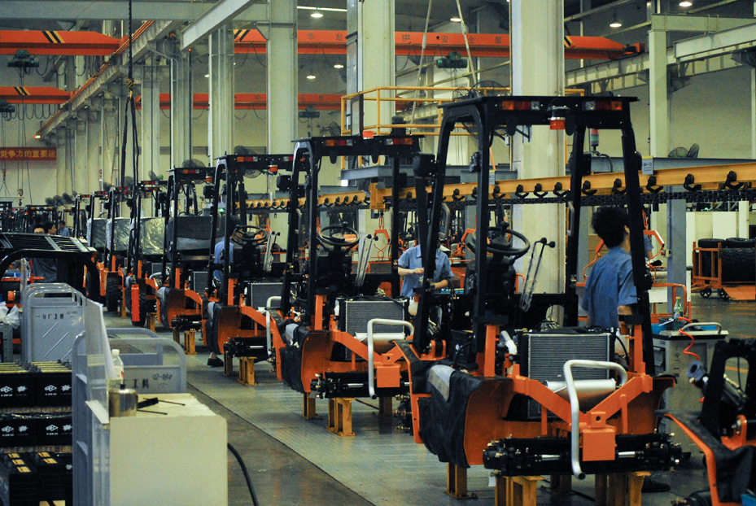
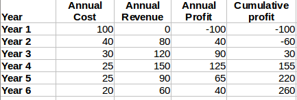
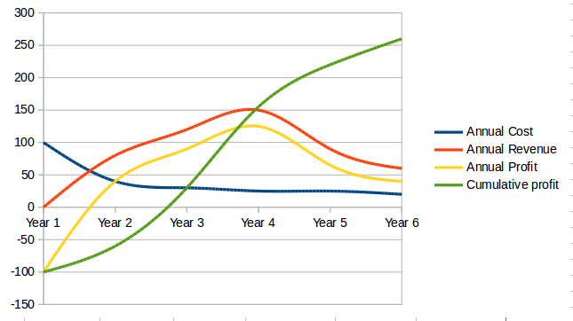
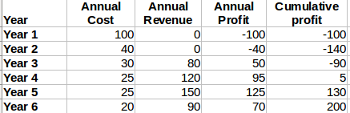
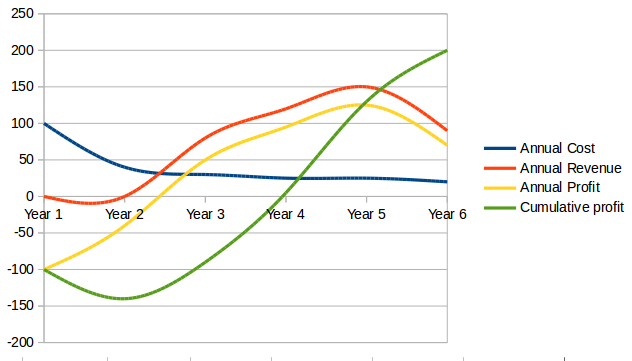
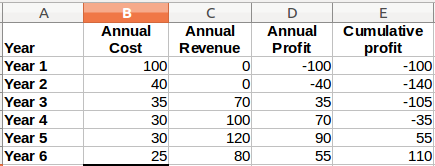
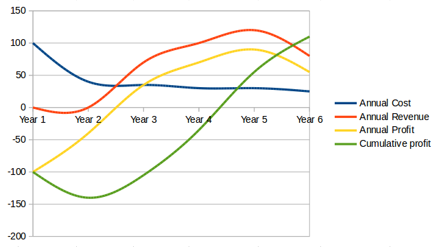
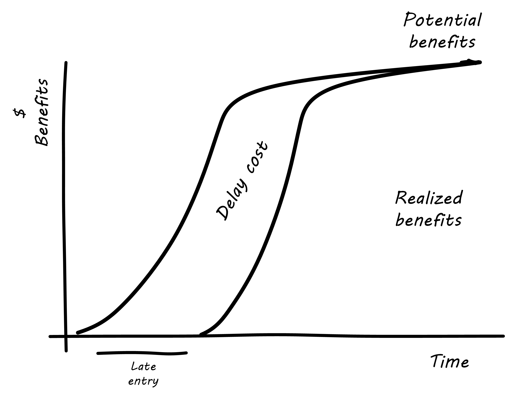
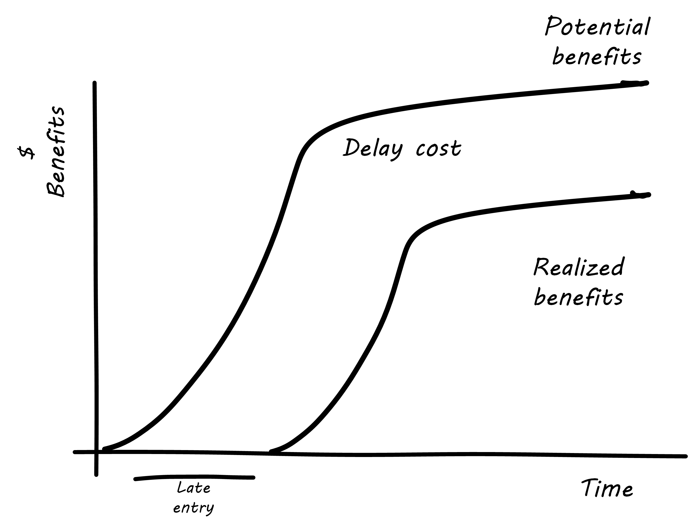

anchor:2.04.04-lean-product-dev[]

==== Lean product development and Don Reinertsen

===== Lean product development

[quote, Bjarne Stroustrup, C++ inventor]
The idea of software development as an assembly line manned by semi-skilled interchangeable workers is fundamentally flawed and wasteful <<Stroustrup2010>>.

One of the challenges with applying Lean to IT (as noted xref:lean[previously]) is that many IT professionals (especially software developers) believe that manufacturing is a "deterministic" field, whose lessons don't apply to developing technical products. "Creating software is like creating art, not being on an assembly line," is one line of argument.

.Production footnote:[_Image credit https://www.flickr.com/photos/psit/5605605412, downloaded 2016-11-19, commercial use permitted_]

The root cause of this debate is the distinction between product development and production. It is true that an industrial production line, for example producing forklifts by the thousands, may be repetitive. But how did the production line come to be? How was the forklift invented, or developed? It was created as part of a process of product development. It took mechanical engineering, electrical engineering, chemistry, materials science, and more.  Combining fundamental engineering principles and techniques into a new, marketable product is not a repetitive process; it is a highly variable, creative process, and always has been.

WARNING: Never confuse production with product development. The approaches, measures, and concerns are radically different. This book considers it an "original sin."

.Research and development footnote:[_Image credit https://www.flickr.com/photos/hamptonroadspartnership/5330640858, commercial use permitted_]

One dead end that organizations keeps pursuing is the desire to make _research and development_ (R&D) more "predictable"; that is, to reduce variation and predictably create innovations. This never works well; game-changing innovations are usually complex responses to complex market systems dynamics, including customer psychology, current trends, and many other factors. The process of innovating cannot, by its very nature, be made repeatable.

WARNING: The concept of a repeatable "software process" is at best a risky one, and an idea that has caused much waste in the industry.

In IT, simply developing software for a new problem (or even new software for an old problem) is an R&D problem, not a production line problem. It is iterative, uncertain, and risky, just like other forms of product development. That does not mean it is completely un-manageable, or that its creation is a mysterious, artistic process. It is just a more variable process with a higher chance of failure, and with a need to incorporate feedback quickly to reduce the risk of xref:2.00.1-open-loop[open loop]
control failure.  These ideas are well known to the Agile community and its authors. However, there is one thought leader who stands out in this field: an ex-Naval officer and former nuclear engineer named Donald Reinertsen, introduced above in our discussions xref:beneficial-variability[beneficial variability in product discovery] and xref:queuing[queuing].

There are many books on Agile development and management. Consider the following books, all well known and influential in the fields of software development and Agile:

* David Anderson, https://www.goodreads.com/book/show/8086552-kanban[_Kanban: Successful Evolutionary Change for Your Technology Business_]
* Craig Larman and Bas Vodde, https://www.goodreads.com/book/show/5247677-scaling-lean-agile-development[_Scaling Lean & Agile Development: Thinking and Organizational Tools for Large-Scale Scrum_]
* Jim Highsmith, https://www.goodreads.com/book/show/338541.Adaptive_Software_Development[_Adaptive Software Development: An Evolutionary Approach to Managing Complex Systems_]
* Jez Humble, Joanne Molesky and Barry O'Reilly, https://www.goodreads.com/book/show/18167218-lean-enterprise[_Lean Enterprise: How High Performance Organizations Innovate at Scale_]
* Dean Leffingwell, https://www.goodreads.com/book/show/8997772-agile-software-requirements[_Agile Software Requirements: Lean Requirements Practices for Teams, Programs, and the Enterprise_]
* Steve McConnell, https://www.goodreads.com/book/show/93892.Rapid_Development[_Rapid Development: Taming Wild Software Schedules_]
* Roman Pichler,  https://www.goodreads.com/book/show/7950745-agile-product-management-with-scrum[_Agile Product Management with Scrum: Creating Products That Customers Love_] https://www.goodreads.com/book/show/7950745-agile-product-management-with-scrum
* Mary and Tom Poppendieck, https://www.goodreads.com/book/show/194338.Lean_Software_Development[_Lean Software Development: An Agile Toolkit for Software Development Managers_]

What do they all have in common? They all cite Don Reinertsen. Reinertsen's work dates back to 1991, and (orginally as a co-author with Preston G. Smith) presaged important principles of the Agile movement <<Smith1991>>, from the general perspective of product development. Reinertsen's influence is well documented and notable. He was partnering with David Anderson when Anderson created Kanban. He wrote the introduction to Leffingwell's _Agile Software Requirements_, the initial statement of the Scaled Agile Framework. His influence is pervasive across the Agile community. His work is deep and based on fundamental mathematical principles such as queueing theory. One way of reading his work is as a series of interdependent principles:

. The flow, or throughput of product innovation is the primary driver of financial success. (Notice that innovation must be *accepted by the market* - simply producing new product is not enough.)
. Product development is essentially the creation of information.
. The creation of information requires fast http://dm-academy.github.io/aitm/#_a_brief_introduction_to_feedback[feedback]
. Feedback requires limiting work in process
. Limiting work in process in product design contexts requires rigorous prioritization capabilities
. Effective, economical prioritization requires understanding the http://www.leadingagile.com/2015/06/an-introduction-to-cost-of-delay/[cost of delay] for individual product features
. Understanding cost of delay requires smaller batch sizes, consisting of cohesive features, not large projects.

These can be summarized in the accompanying pyramid figure.

image::images/2.05-pyramid3.png[pyramid, 400,,float="right"]

If a company wishes to produce innovation faster than competitors, it requires fast xref:2.00.01-feedback[feedback] on its experiments (whether traditionally understood, laboratory-based experiments, or market-facing validation as in xref:lean-startup[Lean Startup].)

In order to achieve fast feedback, xref:work-in-process[work in process]
*must* be reduced in the system, otherwise xref:queuing[high-queue] states will slow feedback down.

But how do we reduce work in process? We have to _prioritize_. Do we rely on the xref:HIPPO[Highest Paid Person's Opinion], or do we try something more rational? This brings us to the critical concept of _Cost of Delay_.

anchor:cost-of-delay[]

===== Cost of Delay
[quote, Don Reinertsen, Principles of Product Development Flow]
If you measure only one thing, measure Cost of Delay.

Don Reinertsen is well known for advocating the concept of "Cost of Delay" in understanding product economics. The term is intuitive; it represents the loss one experiences by delaying the delivery of some value. For example, if a delayed product misses a key trade show, and therefore its opportunity to launch against competitors, the cost of delay might be the entire market. Understanding Cost of Delay is part of a broader economic emphasis that Reinertsen brings to the general question of product development. He suggests that product developers, in general, do not understand the fundamental economics of their decisions regarding resources and work in progress.

To understand Cost of Delay, it is first necessary to think in terms of a market-facing product (such as a smart phone application). Any market facing product can be represented in terms of its lifecycle revenues and profits:

.Product lifecycle economics by year

.Product lifecycle economics, charted

The numbers above represent a product lifecycle, from R&D through production to retirement. The first year is all cost, as the product is being developed, and net profits are negative. In year 2, a small net profit is shown, but cumulative profit is still negative, as it remains in year 3. Only into year 3 does the product break even, ultimately achieving lifecycle net earnings of 175.

But what if the product's introduction into the market is delayed? The consequences can be severe.

Simply delaying delivery by a year, all things being equal in our example, will reduce lifeycle profits by 30%:

.Product lifecycle, simple delay

.Product lifecycle, simple delay, charted

But all things are not equal. What if, in delaying the product for a year, we allow a competitor to gain a superior market position? That could depress our sales and increase our per-unit costs - both bad:

.Product lifecycle, aggravated delay

.Product lifecycle, aggravated delay, charted

Advanced Cost of Delay analysis argues that different product lifecycles have different characteristics. Josh Arnold of Black Swan Farming has visualized these as a set of profiles <<Arnold2013>>. The simple delay profile appears like this:

.Simple Cost of Delay

In this delay curve, while profits and revenues are lost due to late entry, it's assumed that the product will still enjoy its expected market share. We can think of this as the "iPhone versus Android" profile, as Android was later but still achieved market parity. The aggravated cost of delay profile, however, looks like this:

.Aggravated Cost of Delay

In this version, the failure to enter the market in a timely way results in long term loss of market share. We can think of this as the "Amazon Kindle versus Barnes & Noble Nook" profile, as the Nook has not achieved parity, and does not appear likely to. There are other delay curves imaginable, such as delay curves for tightly time limited products (e.g. such as found in the fashion industry) or cost of delay that's only incurred after a specific date (such as in complying with a regulation.)

Reinertsen observes that product managers may think that they intuitively understand Cost of Delay, but when he asks them to estimate the aggregate cost of (for example) delaying their product's delivery by a given period of time, the estimates provided by product team participants *in a position to delay delivery* may vary by up to 50:1. This is powerful evidence that a more quantitative approach is essential, as opposed to relying on "gut feel" or the xref:HIPPO[Highest Paid Person's Opinion].

Finally, Josh Arnold notes that Cost of Delay is much easier to assess on small batches of work. Large projects tend to attract many ideas for features, some of which have stronger economic justifications than others. When all these features are lumped together, it makes understanding Cost of Delay challenging, because it then becomes an average across the various features. But since features, ideally, can be worked on individually, understanding Cost of Delay at that level helps with the prioritization of the work.
