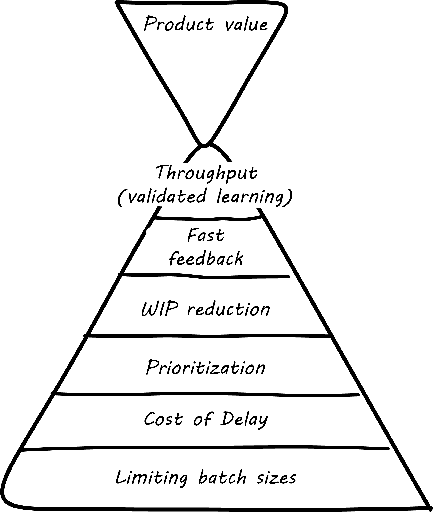

anchor:2.04.04-lean-product-dev[]

==== Lean, Lean product development, and Don Reinertsen

ifdef::collaborator-draft[]

****
*Collaborative*

Status 2016-10-08: This section needs expansion to about 3x as much content, primarily from Reinertsen and Black Swan.

include::../../../collab-links.adoc[]

****

endif::collaborator-draft[]

===== Lean product development

One of the challenges with applying Lean to IT (as noted previously) is that many IT professionals (especially software developers) believe that manufacturing is a "deterministic" field, whose lessons don't apply to developing technical products. "Creating software is like creating art, not being on an assembly line," is one line of argument.

The root cause of this debate is the distinction between product development and production. It is true that an industrial production line may be repetitive. But how did the production line come to be? It was created as part of a process of product development. *That* is not a repetitive process; it is a highly variable, creative process, and always has been.

WARNING: Never confuse production with product development. The approaches, measures, and concerns are radically different. This book considers it an "original sin."

One dead end that organizations keeps pursuing is the desire to make research and development (R&D) more "predictable"; that is, to reduce variation and predictably create innovations. This never works well; game-changing innovations are usually complex responses to complex market systems dynamics, including customer psychology, current trends, and many other factors. The process of innovating cannot, by its very nature, be made repeatable.

In IT, simply developing software for a new problem (or even new software for an old problem) is an R&D problem, not a production line problem. It is iterative, uncertain, and risky, just like other forms of product development. That does not mean it is completely un-manageable, or that its creation is a mysterious, artistic process. It is just a more variable process with a higher chance of failure, with a need to incorporate feedback quickly to reduce the risk of open-loop control failure. These ideas are well known to the Agile community and its authors. However, there is one thought leader who stands out in this field: an ex-Naval officer and former nuclear engineer named Donald Reinertsen.

There are many books on Agile development and management. Consider the following books, all well known and respected in the fields of software development and Agile:

image::images/2.05-books.png[]

What do they all have in common? They all cite Don Reinertsen:

image::images/2.05-books-dr.png[]

Reinertsen's work dates back to 1991, and (orginally as a co-author with Preston G. Smith) presaged much of the Agile movement <<Smith1991>>. Reinertsen was partnering with David Anderson when Anderson created Kanban. He wrote the introduction to Leffingwell's _Agile Software Requirements_, the initial statement of the Scaled Agile Framework. His influence is pervasive across the Agile community.

His work is deep and based on fundamental mathematical principles such as queueing theory (lightly touched on in _The Phoenix Project_). One way of reading his work is as a series of interdependent principles:

. The flow, or throughput of product innovation is the primary determinant of financial success.
. Product development is essentially the creation of information.
. The creation of information requires fast http://dm-academy.github.io/aitm/#_a_brief_introduction_to_feedback[feedback]
. Feedback requires limiting work in process
. Limiting work in process in product design contexts requires rigorous prioritization capabilities
. Effective, economical prioritization requires understanding the http://www.leadingagile.com/2015/06/an-introduction-to-cost-of-delay/[cost of delay] for individual product features
. Understanding cost of delay requires smaller batch sizes, consisting of cohesive features, not large projects.

These can be summarized in the following pyramid:

anchor:cost-of-delay[]

===== Cost of Delay
Don Reinertsen is well known for advocating the concept of "Cost of Delay" in understanding product economics. The term is intuitive; it represents the loss one experiences by delaying the delivery of some value. For example, if a delayed product misses a key trade show, and therefore its opportunity to launch against competitors, the cost of delay might be the entire market.

 see http://blackswanfarming.com/cost-of-delay/

 [TBW]

===== Beneficial variability
 belongs in Ch 8 investment

===== OODA sidebar
After the Korean War, the US Air Force wished to clarify why its pilots had performed in a superior manner to the opposing pilots who were flying aircraft viewed as more capable.

Boyd determined that humans go through a defined process in building their mental model of complex and dynamic situations. This has been formalized in the concept of the OODA loop. Standing for:

* Observe
* Orient
* Decide
*	Act

Because the US fighters were lighter, more maneuverable, and had better visibility, their pilots were able to execute the OODA loop more quickly than their opponents, leading to victory.

Boyd and others have extended this concept into various other domains including business strategy. The concept of the OODA loop is frequently mentioned in presentations on Agile methods. It is, of course, a feedback loop.

 CFDs - not important at team level? Move execution concepts to Part III - team of teams problems
