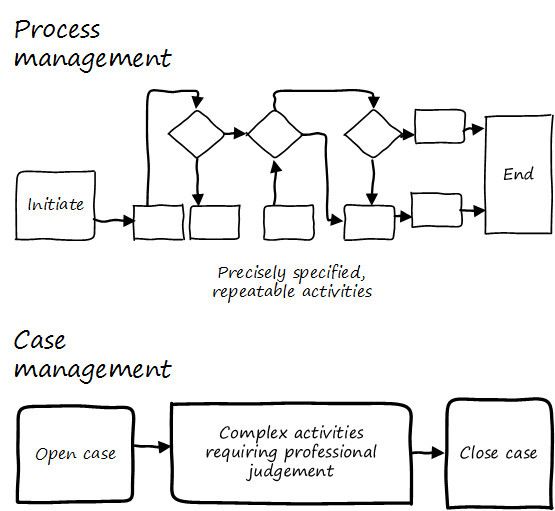
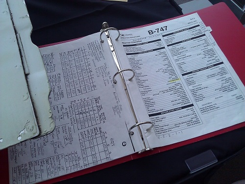

==== Towards process management

The kanban board has started to get complicated. We're seeing more and more work that needs to follow a sequence, or checklist, for the sake of consistency.

Process management is when we need to start managing

* multiple,
* repeatable,
* measurable sequences of activity,
* considering their interdependencies,
* perhaps using common methods to define them,
* and even common tooling to support multiple processes.

Sometimes, the process simply becomes too complex for humans to follow. Multi-page process models are rarely consulted, even if the team affected developed them. This is especially true when there are many optional or conditional steps in the process.

Before we get into full blown process management, let's look at two at two simpler responses:

* Case Management
* The Checklist Manifesto

anchor:case-mgmt[]

===== Case Management

NOTE: Do not confuse "Case" here with Computer Assisted Software Engineering.

Case management is a concept used in medicine, law, and social services. Case management can be thought of as a high-level process supporting the skilled knowledge worker applying their professional expertise.

To quote the Workflow Management Coalition:
****
[Business Process Modeling] and [Case Management] are useful for different kinds of business situations.

* Highly predictable and highly repeatable business situations are best supported with BPM.
** For example signing up for cell phone service: it happens thousands of times a day, and the process is essentially fixed.
* Unpredictable and unrepeatable business situations are best handled with ACM.
** For example investigation of a crime will require following up on various clues, down various paths, which are not predictable before hand. The are various tests and procedures to use, but they will be called only when needed.
<<WFMC2010>>, via <<England2013>>
****

Noted IT consultant and author Rob England contrasts "case management" with "standard process" in his book  _Plus! The Standard+Case Approach: See Service Response in a New Light_ <<England2013>>. Some processes are repeatable and can be precisely standardized, but it is critical for anyone working in complex environments to understand the limits of standard process.

anchor:checklist-manifesto[]

===== The Checklist Manifesto

.A Boeing 747 checklist footnote:[_Image credit https://www.flickr.com/photos/clemensv/7292988394, downloaded 2016-11-29, commercial use permitted_]

The Checklist Manifesto is the name of a notable book by author/surgeon Atul Gawande <<Gawande2010>>. The title can be misleading; the book in no way suggests that all work can be reduced to repeatable checklists. Instead, it is another in depth examination of the  relationship between standardization and complexity. Like case management, it addresses the problem of complex activities requiring professional judgement.

Unlike case management, it explores more time-limited and often urgent activities such as flight operations, large scale construction, and surgery. These activities, as a whole, cannot be reduced to one master process; there is too much variation and complexity.

However, within the overall bounds of flight operations, or construction, or surgery, there are critical sequences of events that MUST be executed, often in a specific order. Gawande discusses the airline industry as a key exemplar of this. Instead of one "master checklist" there are specific, clear, brief checklists for a wide variety of scenarios, such as a cargo hold door becoming unlatched.

There are similarities and differences between core BPM approaches and checklists. Often, business process management is employed to describe processes that are automated and whose progress is tracked in a database. Checklists, on the other hand, may be more manual, intended for use in a closely collaborative environment (such as a an aircraft cockpit or operating room), and may represent a briefer period of time.

We will revisit Gawande's work in Chapter 9 with the coordination technique of the xref:submittal-schedule[submittal schedule].
