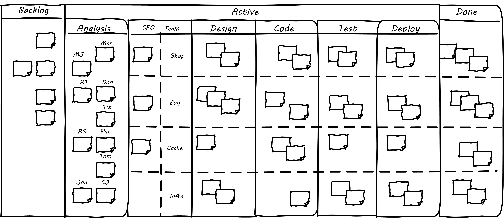
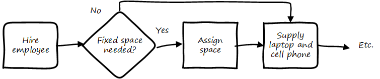

anchor:process-mgmt-emerges[]

==== Towards process management

[quote, Abbott and Fisher, The Art of Scalability]
...one of the principal purposes of processes [is] to manage work without needing a manager and to reduce the cost and increase the value of outcomes of repetitive tasks. Good processes supplement management, augment its reach, and ensure consistency of quality outcomes.

[quote, Don Reinertsen, Principles of Product Development Flow]
For a manufacturer, reducing variability always improves manufacturing economics. This is not true in product development.

.Medium-complex Kanban board footnote:[Loosely based on image from <<Kos2016>> which was even more complicated]

The kanban board has started to get complicated. We're seeing more and more work that needs to follow a sequence, or checklist, for the sake of consistency. Process management is when we need to start managing

* multiple,
* repeatable,
* measurable sequences of activity,
* considering their interdependencies,
* perhaps using common methods to define them,
* and even common tooling to support multiple processes.

===== Process basics

We've discussed some of the factors leading to the need for process management, but we haven't yet come to grips with what it *is*. To start, think of a repeatable series of activities, such as when a new employee joins:

.Simple process flow
image::images/5_04-ordering1.png[flow steps, 600,,]

Process management can represent conditional logic:

Process models can become extremely complex, and are seen describing both human and automated activity. Sometimes, the process simply becomes too complex for humans to follow. Notice how different the process models are from the card wall or Kanban board. In Kanban, everything is a work item, and the overall flow is some simple version of "to do, doing, done." This can become very complex when the flow gets more elaborate (e.g. various forms of testing, deployment checks, etc.) In a process model, the activity is explicitly specified, on the assumption it will be repeated. The boxes representing steps are essentially equivalent to the columns on a Kanban board, but since sticky notes are not being used, process models can become very complex -- like a Kanban board with dozens or hundreds of columns! Process modeling is discussed in detail in the xref:process-modeling[appendix]. Process management as a practice is discussed extensively in Part III. However, before we move on, two simple variations on process management are:

* Checklists
* Case Management

anchor:checklist-manifesto[]

===== The Checklist Manifesto

.A Boeing 747 checklist footnote:[_Image credit https://www.flickr.com/photos/clemensv/7292988394, downloaded 2016-11-29, commercial use permitted_]
image::images/2_05-747-checklist.jpg[checklist, 400, 200, float="right"]

The Checklist Manifesto is the name of a notable book by author/surgeon Atul Gawande <<Gawande2010>>. The title can be misleading; the book in no way suggests that all work can be reduced to repeatable checklists. Instead, it is an in depth examination of the  relationship between standardization and complexity. Like case management, it addresses the problem of complex activities requiring professional judgement.

Unlike case management (discussed below), it explores more time-limited and often urgent activities such as flight operations, large scale construction, and surgery. These activities, as a whole, cannot be reduced to one master process; there is too much variation and complexity. However, within the overall bounds of flight operations, or construction, or surgery, there are critical sequences of events that MUST be executed, often in a specific order. Gawande discusses the airline industry as a key exemplar of this. Instead of one "master checklist" there are specific, clear, brief checklists for a wide variety of scenarios, such as a cargo hold door becoming unlatched.

There are similarities and differences between core BPM approaches and checklists. Often, business process management is employed to describe processes that are automated and whose progress is tracked in a database. Checklists, on the other hand, may be more manual, intended for use in a closely collaborative environment (such as a an aircraft cockpit or operating room), and may represent a briefer period of time.

Full process management specifies tasks and their flow in precise detail. We have not yet got to that point with our Kanban board, but when we start adding checklists, we are beginning to differentiate the various processes at a detailed level. We will revisit Gawande's work in Chapter 9 with the coordination technique of the xref:submittal-schedule[submittal schedule].

anchor:case-mgmt[]

===== Case Management

NOTE: Do not confuse "Case" here with Computer Assisted Software Engineering.

Case management is a concept used in medicine, law, and social services. Case management can be thought of as a high-level process supporting the skilled knowledge worker applying their professional expertise. Cases are another way of thinking about the relationship between the Kanban board and process management.

.Process management versus case management
image::images/2_05-casemgmt.png[]

To quote the Workflow Management Coalition:
****
[Business Process Modeling] and [Case Management] are useful for different kinds of business situations.

* Highly predictable and highly repeatable business situations are best supported with BPM.
** For example signing up for cell phone service: it happens thousands of times a day, and the process is essentially fixed.
* Unpredictable and unrepeatable business situations are best handled with ACM.
** For example investigation of a crime will require following up on various clues, down various paths, which are not predictable before hand. The are various tests and procedures to use, but they will be called only when needed.
<<WFMC2010>>, via <<England2013>>
****

Noted IT consultant and author Rob England contrasts "case management" with "standard process" in his book  _Plus! The Standard+Case Approach: See Service Response in a New Light_ <<England2013>>. Some processes are repeatable and can be precisely standardized, but it is critical for anyone working in complex environments to understand the limits of standard process. Sometimes, a large "case" concept is sufficient to track the work. The downside may be that there is less visibility into the progress of the case -- the person in charge of it needs to provide a status that can't be represented as a simple report. We will see process management again in Chapter 6 in our discussion of anchor:ops-day-in-life[operational process emergence].
