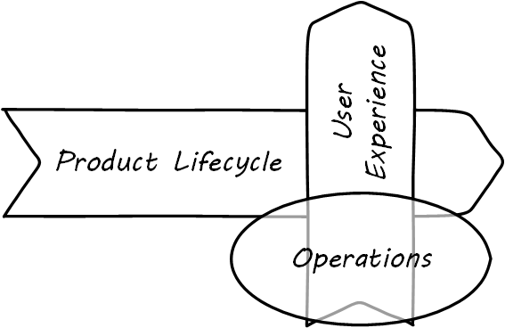
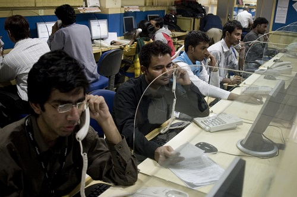

==== An overview of operations management

===== Defining operations

[quote, Mike Cohn, Agile Estimating and Planning]
...those unpredictable but required parts of many teams' lives—supporting a production website or database, taking support calls from key customers or first-tier technical support, and so on...

.Network operations center footnote:[_Image credit https://www.flickr.com/photos/cogdog/537486932/, downloaded 2016-11-20, commercial use permitted_]
image::images/2_06-NOC.jpg[network operations center, 400, , float="right"]

What do we mean by operations? Operations management is a broad topic in management theory, with whole programs dedicated to it in both business and engineering schools. Companies frequently hire Chief Operations Officers to run the organization. We started to cover operations management in chapter 5, as we examined the topic of “work management” - in traditional operations management, the question of work and who is doing it is critical. For the digital professional, “operations” tends to have a more technical meaning than the classic business definition, being focused on the immediate questions of systems integrity, availability and performance, and feedback from the user community (i.e., the service or help desk). We see such a definition from Limoncelli et al:

_operations is the work done to keep a system running in a way that meets or exceeds operating parameters specified by a service level agreement (SLA). Operations includes all aspects of a service’s life cycle: from initial launch to the final decommissioning and everything in between._ <<Limoncelli2014>>, p. 147.

Operations often can mean, “everything but development” in a digital context. In the classic model, developers built systems and "threw them over the wall" to operations. Each side had specialized processes and technology supporting their particular concerns. However, recall our discussion of xref:design[design thinking] -- the entire experience is part of the product. This applies to both those consuming it as well as running it. Companies undergoing digital transformation are experimenting with many different models; as we will see in xref:Part-III-coordination[Part III], up to and including the complete merging of Development and Operations-oriented skills under common product management.

IMPORTANT: In a digitally transformed enterprise, Operations is part of the Product.

.Operations supports the digital moment of truth

Since we have a somewhat broader point of view covering all of digital management, for this chapter we'll use the following definition of operations:

_Operations is the direct support of the digital value experience._

What do we mean by this? In terms of our xref:dual-axis-vc[dual-axis] value chain, operations supports the day to day delivery of the digital "moment of truth."

.Call center operators footnote:[_Image credit https://www.flickr.com/photos/iloasiapacific/8391859530, downloaded 2016-11-21, commercial use permitted_]

Consider the following various examples of “operations” in an IT context. Some are relevant to a “xref:amazon-productization[two pizza product team]” scenario, some might be more applicable to larger environments:

* Systems operators sitting in 24x7 operations centers, monitoring system status and responding to alerts.
* Help desk representatives answering phone calls from users requiring support. They may be calling because a system or service they need is malfunctioning. They may also be calling because they do not understand how to use the system for the value experience they have been led to expect from it. Again, this is part of their product experience.
* Developers and engineers serving "on call" on a rotating basis to respond to systems outages referred to them by the operations center.
* Data center staff performing routine work, such as installing hardware, granting access, or running or testing backups. Such routine work may be scheduled, or it may be on request (e.g. ticketed).
* Field technicians physically dispatched to a campus or remote site to evaluate and if necessary update or fix IT hardware and/or software (install a new PC, fix a printer, service a cell tower antenna).
* Security personnel ensuring security protocols are followed, e.g. access controls.

.Field technician footnote:[_Image credit https://www.flickr.com/photos/98773380@N05/9447360721, downloaded 2016-11-21, commercial use permitted_]

As above, the primary thing that operations does NOT do is develop new systems functionality. Operations is process-driven and systematic, where research and development fails the "systematic" part of the definition (review the definitions in xref:process-project-product[process, product, and project management]). However, new functionality usually has operational impacts. In manufacturing and other traditional industries, product development was a minority of work, while operations was where the bulk of work happened. Yet when an operational task involving information becomes well defined and repetitive, it can be automated with a computer.

This continuous cycle of innovation and commoditization has driven closer and closer ties between “development” and “operations.” This cycle also has driven confusion around exactly what is meant by “operations.” In many organizations, there is an “Infrastructure and Operations” function. Pay close attention to the naming. A matrix may help, because we have two dimensions to consider here.

anchor:i-o-matrix[]

.Application, infrastructure, development, operations.
[cols="h,2*", options="header"]
|====
||Development phase
|Operations phase
|Application layer
|Application developers. Handle demand, proactive and reactive, from product and operations. Never under I&O.
|Help desk. Application support and maintenance (provisioning, fixes not requiring software development). Often under I&O.
|Infrastructure layer
|Engineering team. Infrastructure platform engineering and development (design and build typically of externally sourced products). Often under I&O.
|Operations center. Operational support, including monitoring system status. May monitor both infrastructure and application layers. Often under I&O.
|====

Notice that we distinguish carefully between the application and infrastructure layers. Review our pragmatic xref:what-is-IT-infrastructure[definitions]:

* applications are consumed by people who are NOT primarily concerned with IT
* infrastructure is consumed by people who ARE primarily concerned with IT

Infrastructure services and/or products, as we discussed in Chapter 2, need to be designed and developed before they are operated, just like applications. This may all seem obvious, but there is an industry tendency to lump three of the four cells in the table into the "Infrastructure and Operations" (or "I&O") function, when in fact each represents a distinct set of concerns.

===== The concept of "service level"

A digital system is either available and providing a service, or it isn't. The concept of "service level" was mentioned above by Limoncelli. A level of service is typically defined in terms of criteria such as:

* What % of time will the service be available?
* If the service suffers an outage, how long until it will be restored?
* How fast will the service respond to requests?

A _service level agreement_, or SLA, is a form of contract between the service consumer and service provider, stating the above criteria in terms of a business agreement. When a service's performance does not meet the agreement, this is sometimes called a "breach" and the service provider may have to pay a penalty (e.g., the customer gets a 5% discount on that month's services.) If the service provider exceeds the SLA, perhaps a credit will be issued.

SLAs drive much operational behavior. They help prioritize Incidents and Problems, and the risk of proposed Changes are  understood in terms of the SLAs.

anchor:ops-day-in-life[]

===== Operational process emergence
[quote, Limoncelli/Chalup/Hogan]
Process is what makes it possible for teams to do the right thing, again and again.

Limoncelli, Chalup, and Hogan, in their excellent _Cloud Systems Administration_, emphasize the role of the "oncall" and "onduty" staff in the service of operations <<Limoncelli2014>>. _Oncall_ staff have a primary responsibility of emergency response, and the term oncall refers to their continuous availability, even if they are not otherwise working (e.g., they are expected to pick up phone calls and alerts at home and dial into emergency communications channels). _Onduty_ staff are responsible for responding to non-critical incidents and maintaining current operations.

What is an emergency? It's all a matter of expectations. If a system (by its SLA) is supposed to be available 24 hours a day, 7 days a week, an outage at 3 AM Saturday morning is an emergency. If it is only supposed to be available between Monday through Friday, the outage may not be as critical (although it still needs to be fixed in short order, otherwise there will soon be an SLA breach!)

anchor:IT-process-emergence[]

IT systems have always been fragile and prone to malfunction. "Emergency" management is documented as a practice in "data processing" as early as 1971 (<<Ditri1971>>, pp. 188-189). By the 1990s, a terminology had been formalized, by vendors such as IBM (in their "Yellow Book" series), the United Kingdom's IT Infrastructure Library (ITIL), and other guidance such as the Harris Kern library (popular in the United States before ITIL gained dominance). These processes include:

* Request management
* Incident management
* Problem management
* Change management

Even as a single-product team, these processes are a useful framework to keep in mind as operational work increases. Here are some simple definitions:

.Basic operational processes
[cols="2*", options="header"]
|====
|Process |Definition
|Request management| Respond to routine requests such as providing systems access.
|Incident management | Identify service outages and situations that could potentially lead to them, and restore service and/or mitigate immediate risk.
|Problem management | Identify the causes of one or more Incidents and remedy them (on a longer-term basis)
|Change management  | Record and track proposed alterations to critical IT components. Notify potentially affected parties and assess changes for risk; ensure key stakeholders exercise approval rights.
|====

These processes have a rough sequence to them:

. Give the user access to the system.
. If the system is not functioning as expected, identify the issue and restore service by any means necessary. Don't worry about why it happened yet.
. Once service is restored, investigate why the issue happened (sometimes called a post-mortem) and propose longer-term solutions.
. Inform affected parties of the proposed changes, collect their feedback and approvals, and track the progress of the proposed change through successful completion.

At the end of the day, we need to remember that operational work is just one form of work. In a single-team organization, these processes might still be handled through basic xref:task-mgmt[task management] (although user provisioning would need to be automated, if the system  is scaling significantly.) Perhaps the simple task management is supplemented with checklists, as repeatable aspects of the work become more obvious. We'll continue on the assumption of basic task management for the remainder of this chapter, and go deeper into the idea of defined, repeatable processes as we scale to a "team of teams" in xref:Part-III-coordination[Part III].
