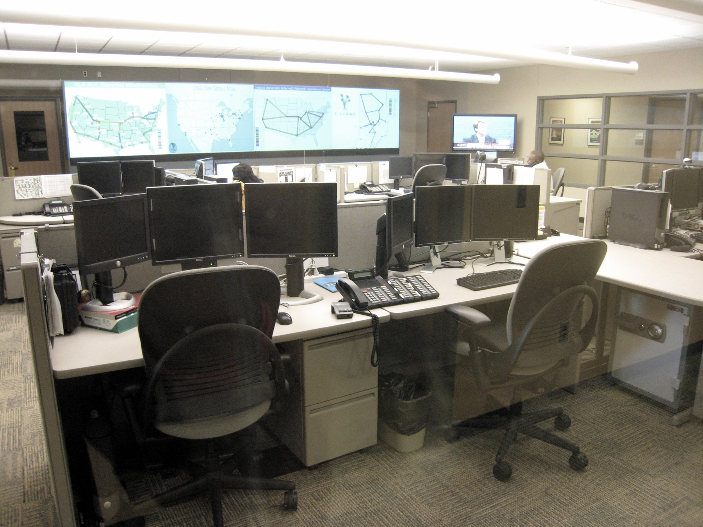

==== Introducing operations management

===== Defining operations

.Network operations center footnote:[_Image credit https://www.flickr.com/photos/cogdog/537486932/, downloaded 2016-11-20, commercial use permitted_]

What do we mean by operations? Operations management is a broad topic in management theory, with whole programs dedicated to it. Companies frequently hire Chief Operations Officers to run the organization. We started to cover operations management in chapter 5, as we examined the topic of “work management” - in traditional operations management, the question of work and who is doing it is critical. However, for the digital professional, “operations” tends to have a more technical meaning, being focused on the immediate questions of systems integrity, availability and performance, and feedback from the user community (i.e., the service or help desk).

Operations often can mean, “everything but development” in a digital context. When merged with Development into “DevOps,” one gets Product Management. Recall our discussion of xref:design[product design] -- the entire experience is part of the product. This applies to both those consuming it as well as running it.

IMPORTANT: In a digitally transformed enterprise, Operations is part of the Product.

A duty-oriented, physical presence in the service of executing particular tasks is an unchanging aspect of operational responsibility. The tasks may support broader goals and strategies, and need to be systematically discharged.

What do we mean by this?

Consider the following various examples of “operations” in an IT context. Some are relevant to a “xref:amazon-productization[two pizza product team]” scenario, some might be more applicable to larger environments:

* Systems operators sitting in 24x7 operations centers, monitoring system status and responding to alerts.
* Help desk representatives answering phone calls from users requiring support. They may be calling because a system or service they need is malfunctioning. They may also be calling because they do not understand how to use the system for the value experience they have been led to expect from it.
* Field technicians physically dispatched to a campus or remote site to evaluate and if necessary update or fix IT hardware and/or software (install a new PC, fix a printer, service a cell tower antenna).
* Developers and engineers serving "on call" on a rotating basis to respond to systems outages referred to them by the operations center.
* Data center staff performing routine work, such as installing hardware, granting access, or running or testing backups. Such routine work may be scheduled, or it may be on request (e.g. ticketed).
* Security personnel ensuring security protocols are followed, e.g. access controls.

As above, the primary thing that operations does NOT do is develop new systems functionality. However, new functionality usually has operational impacts. In manufacturing and other traditional industries, product development was a minority of work, while operations was where the bulk of work happened. Yet when an operational task involving information becomes well defined and repetitive, it can be automated with a computer. This continuous cycle of innovation and commoditization has driven closer and closer ties between “development” and “operations.” This cycle also has driven confusion around exactly what is meant by “operations.” In many organizations, there is an “Infrastructure and Operations” function. Pay close attention to the naming. A matrix may help, because we have two dimensions to consider here.

.Application, infrastructure, development, operations.
[cols="h,2*", options="header"]
|====
||Development phase
|Operations phase
|Application layer
|Application developers. Handle demand, proactive and reactive, from product and operations.
|Help desk. Application support and maintenance (provisioning, fixes not requiring software development).
|Infrastructure layer
|Engineering team. Infrastructure platform engineering and development (design and build typically of externally sourced products).
|Operations center. Operational support, including monitoring system status. May monitor both infrastructure and application layers.
|====

Notice that we distinguish carefully between the application and infrastructure layers. Review our xref:what-is-IT-infrastructure[definitions]:

* applications are consumed by people who are NOT primarily concerned with IT
* infrastructure IS consumed by people who ARE primarily concerned with IT

Infrastructure services and/or products, as we discussed in Chapter 2, need to be designed and developed before they are operated, just like applications. This may all seem obvious, but there is an industry tendency to lump three of the four cells in the table into the "Infrastructure and Operations" (or "I&O") function, when in fact each represents a distinct set of concerns.

anchor:ops-day-in-life[]

===== A day in the life

Limoncelli, Strata, and Hogan, in their excellent _Cloud Systems Administration_, emphasize the role of the "oncall" and "onduty" staff in the service of operations <<Limoncelli2014>>. _Oncall_ staff have a primary responsibility of emergency response, and the term oncall refers to their continuous availability, even if they are not otherwise working (e.g., they are expected to pick up phone calls and alerts at home and dial into emergency communications channels). _Onduty_ staff are responsible for responding to non-critical incidents and maintaining current operations.

 Emergency vs non-emergency - it's all a matter of expectations
 The classic processes (Incident, Problem, Change) - also Issue, Defect, Request

At the end of the day, we need to remember that operational work is just one form of work. In the classic model, developers built systems and "threw them over the wall" to operations. Each side had specialized processes and technology supporting their particular concerns.

Now, companies undergoing digital transformation are experimenting with many different models; as we will see in Part III, up to and including the complete merging of Development and Operations-oriented skills under common product management.
