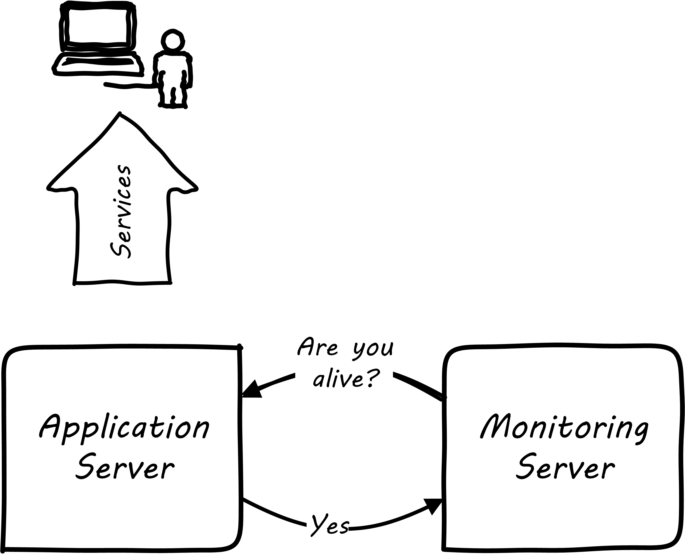
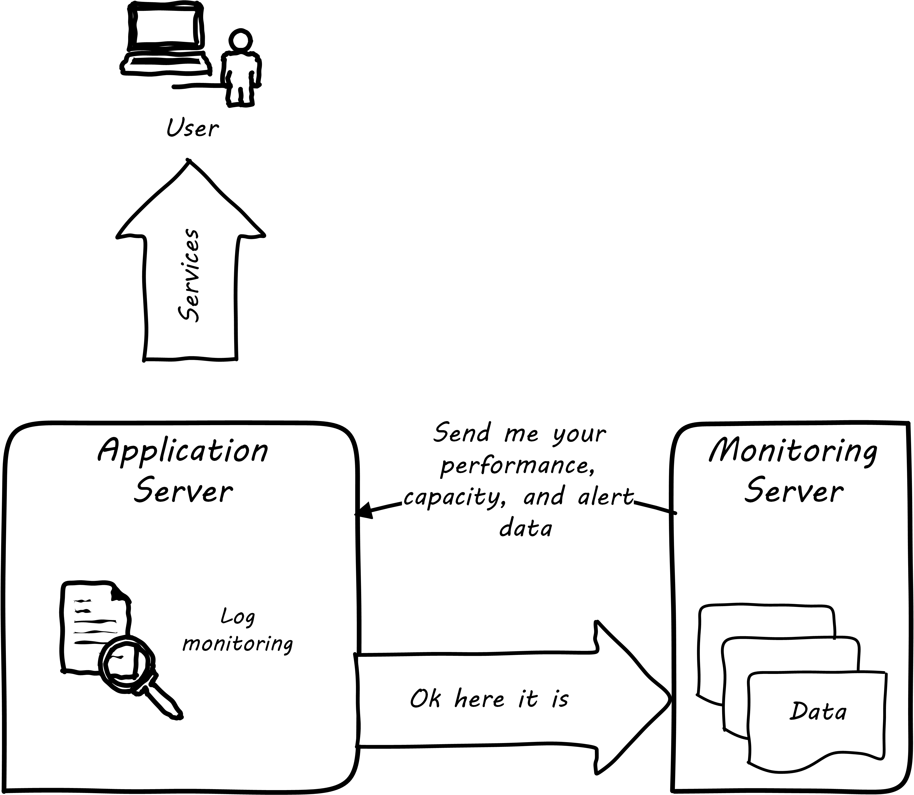
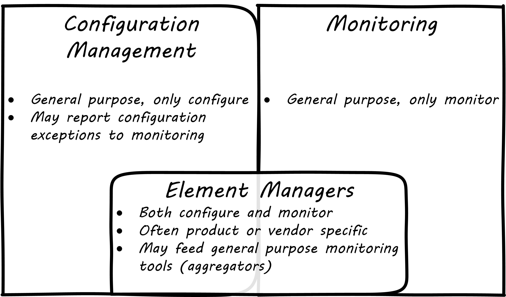
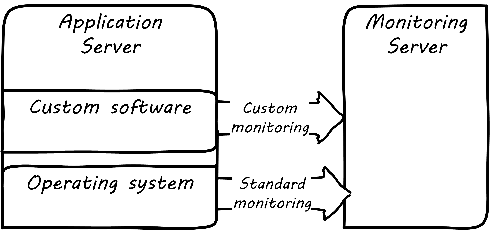
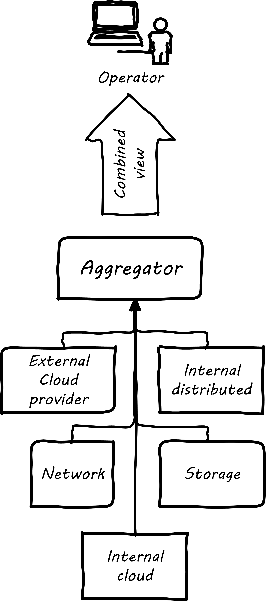

anchor:monitoring[]

==== Monitoring

[quote, Wikpedia,https://en.wikipedia.org/wiki/Telemetry]
Telemetry is an automated communications process by which measurements are made and other data collected at remote or inaccessible points and transmitted to receiving equipment for monitoring. The word is derived from Greek roots: 'tele' = remote, and 'metron' = measure.

Computers run in large data centers, where physical access to them is tightly controlled. Therefore, we need telemetry to manage them. The practice of collecting and initiating responses to telemetry is called monitoring.

===== Monitoring techniques
Limoncelli et al define monitoring this way:

_Monitoring is the primary way we gain visibility into the systems we run. It is the process of observing information about the state of things for use in both short-term and long-term decision making_ <<Limoncelli2014>>.

.Simple monitoring

But how does one “observe” computing infrastructure? Clearly, sitting in the data center (assuming you could get in) and looking at the lights on the faces of servers will not convey much useful information, beyond whether they are off or on. Monitoring tools are the software that watches the software (and systems more broadly).

A variety of techniques are used to monitor computing infrastructure. Typically these involve communication over a network with the device being managed. Often, the network traffic is over the same network carrying the primary traffic of the computers. Sometimes, however, there is a distinct "out of band" network for management traffic. A simple monitoring tool will interact on a regular basis with a computing node, perhaps by “pinging” it periodically, and will raise an alert if the node does not respond within an expected time frame.

.Extended monitoring

More broadly, these tools provide a variety of mechanisms for monitoring and controlling operational IT systems; they may monitor:

* processes and their return codes
* performance metrics (e.g. memory and CPU utilization)
* events raised through various channels
* network availability
* log file contents (searching the files for messages indicating problems)
* a given component's interactions with other elements in the IT infrastructure
* and more.

.User experience monitoring
image::images/2_06-monitoring-3.png[application server and monitor, 350,,float="left"]

Some monitoring covers low level system indicators not usually of direct interest to the end user. Other simulates end user experience; service level agreements are often defined in terms of the response time as experienced by the end user. See <<Limoncelli2014>>, chapters 16-17.

All of this data may then be forwarded to a central console and be integrated, with the objective of supporting the organization’s service level agreements in priority order. Enterprise monitoring tools are notorious for requiring agents (small, continuously-running programs) on servers; while some things can be detected without such agents, having software running on a given computer still provides the richest data. Since licensing is often agent-based, this gets expensive.

NOTE: Monitoring systems are similar to source control systems in that they are a critical point at which xref:commit-as-metadata[metadata] diverges from the actual system under management.

.Configuration, monitoring, and element managers

Related to monitoring tools is the concept of an element manager. Element managers are low-level tools for managing various classes of digital or IT infrastructure. For example, Cisco provides software for managing network infrastructure, and EMC provides software for managing its storage arrays. Microsoft provides a variety of tools for managing various Windows components. Notice that such tools often play a dual role, in that they can both change the infrastructure configuration as well as report on its status. Many however are reliant on graphical user interfaces, which are falling out of favor as a basis for configuring infrastructure.

anchor:custom-monitoring[]

===== Designing operations into products

[quote, Abbott and Fisher, The Art of Scalability]
Just as Agile software development methods attempt to solve the problem associated
with not knowing all of your requirements before you develop a piece of software,
so must we have an agile and evolutionary development mindset for our monitor
ing platforms and systems.

Monitoring tools, out of the box, can provide ongoing visibility to well understood aspects of the digital product: the performance of infrastructure, the capacity utilized, and well understood, common failure modes (such as a network link being down.) However, the digital product or application also needs to provide its own specific telemetry in various ways. This can be done through logging to output files, or in some cases through raising alerts via the network.

.Custom software requires custom monitoring

A typical way to enable custom monitoring is to first use a standard logging library as part of the software development process. The logging library provides a consistent interface for the developer to create informational and error messages. Often, multiple "levels" of logging are seen, some more verbose than others. The monitoring tool is then configured to scan the logs for certain information. For example, if the application writes:

 APP-ERR-SEV1-946: Unresolvable database consistency issues detected, terminating application.

into the log, the monitoring tool can be configured to recognize the severity of the message and immediately raise an alert.

Finally, as the quote at the beginning of this section suggests, it is critical that the monitoring discipline be based on continuous improvement. Keeping monitoring techniques current with your operational challenges is a never-ending task. Approaches that worked well yesterday, today generate too many false positives, and your operations team is now overloaded with all the noise. Ongoing questioning and improvement of your approaches is essential to keeping your monitoring system optimized for managing business impact as efficiently and effectively as possible.

===== Aggregation and operations centers

.Aggregated monitoring

It is not possible for a 24 x 7 operations team to access and understand the myriads of element managers and specialized monitoring tools present in the large IT environment. Instead, these teams rely on aggregators of various kinds to provide an integrated view into the complexity. These aggregators may focus on  status events, or specifically on performance aspects related either to the elements or to logical transactions flowing across them. They may incorporate dependencies from configuration management to provide a true “business view” into the event streams. This is directly analogous to the concept of xref:andon[Andon] board from Lean practices, or the idea of “information radiator” from Agile principles.

A monitoring console may present a rich and detailed set of information to an operator. Too detailed, in fact, as systems become large. Raw event streams must be filtered for specific events or patterns of concern. Event de-duplication starts to become an essential capability, which leads to distinguishing the monitoring system from the event management system. Also, for this reason, monitoring tools are often linked directly to ticketing systems; on certain conditions, a xref:ticketing[ticket]
 (e.g. an xref:IT-process-emergence[Incident]) is created and assigned to a team or individual.

Enabling a monitoring console to auto-create tickets however, needs to be carefully considered and designed. A notorious scenario is the “ticket storm,” where a monitoring system creates multiple (perhaps thousands) of tickets, all essentially in response to the same condition.

===== Understanding business impact

At the intersection of event aggregation and operations centers is the need to understand business impact. It is not, for example, always obvious what a server is being used for. This may be surprising to new students, and perhaps those with experience in smaller organizations. However, in many large “traditional” IT environments, where the operations team is distant from the development organization, it is not necessarily easy to determine what a given hardware or software resource is doing or why it is there. Clearly, this is unacceptable in terms of security, value management, and any number of other concerns. However, from the start of distributed computing, the question “what is on that server?” has been all too frequent in large IT shops.

In mature organizations, this may be documented in a Configuration Management Database or System (CMDB/CMS). Such a system might start by simply listing the servers and their applications:

[cols="2*", options="header"]
|====
| Application |Server
| Quadrex  |SRV0001
| PL-Q  |SRV0002
| Quadrex |DBSRV001
| TimeTrak |SRV0003
| HR-Portal |SRV0003
| _etc_ | _etc_
|====

(Imagine the above list, 25,000 rows long.)

This is a start, but still doesn't tell us enough. A more elaborate mapping might include business unit and contact:

[cols="4*", options="header"]
|====
|Org|Contact |Application |Server
|Logistics|Mary Smith | Quadrex  |SRV0001
|Finance |Aparna Chaudry |PL-Q  |SRV0002
|Logistics |Mary Smith | Quadrex |DBSRV001
|Human Resources |William Jones |TimeTrak |SRV0003
|Human Resources |William Jones |HR-Portal |SRV0003
| _etc_| _etc_|_etc_ | _etc_
|====

The above lists are very simple examples of what can be extensive record-keeping. But the key user story is implied: if we can't ping SRV0001, we know that the Quadrex application supporting Logistics is at risk, and we should contact Mary Smith ASAP, if she hasn't already contacted us. (Sometimes, the user community calls right away; in other cases, they may not, and proactively contacting them is a positive and important step.)

The above approach is relevant to older models still reliant on servers (whether physical or virtual) as primary units of processing. The trend to xref:containers[containers and serverless] computing is challenging these traditional practices, and what will replace them is currently unclear.

anchor:capacity-mgmt[]

===== Capacity and performance management

.Capacity management on Star Trek
****
_"The tank can't handle that much pressure."_

_"Where'd you get that idea?"_

_"What do you mean, where did I get that idea? It's in the impulse engine specifications."_

_"Regulations 42/15: 'Pressure Variances in IRC Tank Storage'?"_

_"Yeah."_

_"Forget it. I wrote it...A good engineer is always a wee bit conservative, at least on paper."_

Conversation between Geordi LaForge and Montgomery Scott, _Star Trek: The Next Generation_, "Relics"
****

Capacity and performance management are closely related, but not identical terms encountered as IT systems scale up and encounter significant load.

A capacity management system may include large quantities of data harvested from monitoring and event management systems, stored for long periods of time so that history of system utilization is understood and some degree of prediction can be ventured for upcoming utilization.

.Black Friday at Macy's footnote:[_Image credit https://www.flickr.com/photos/diariocriticove/8211477590, downloaded 2016-10-31, commercial use permitted_]

The classic example of significant capacity utilization is the https://en.wikipedia.org/wiki/Black_Friday_(shopping)[Black Friday/Cyber Monday] experience of retailers. Both physical store and online ecommerce systems are placed under great strain annually around this time, with the year's profits potentially on the line.

Performance management focuses on the responsiveness (e.g. speed) of the systems being used. Responsiveness may be related to capacity utilization, but some capacity issues don't immediately affect responsiveness. For example, a disk drive may be approaching full. When it fills, the system will immediately crash, and performance is severely affected. But until then, the system performs fine. The disk needs to be replaced on the basis of capacity reporting, not performance trending. On the other hand, some performance issues are not related to capacity. A mis-configured router might badly affect a web site's performance, but the configuration simply needs to be fixed - there is no need to handle as a capacity-related issue.

At a simpler level, capacity and performance management may consist of monitoring CPU, memory, and storage utilization across a given set of nodes, and raising alerts if certain thresholds are approached. For example, if a critical server is frequently approaching 50% CPU utilization (leaving 50% "headroom"), engineers might identify that another server should be added. Abbot and Fisher suggest, "As a general rule of thumb, we like to start at 50% as the ideal usage percentage
and work up from there as the arguments dictate" <<Abbott2015>>, p 204.

So, what do we do when a capacity alert is raised, either through an automated system or through the manual efforts of a capacity analyst? There are a number of responses that may follow:

* Acquire more capacity
* Seek to use existing capacity more efficiently
* Throttle demand somehow

Capacity analytics at its most advanced (i.e. across hundreds or thousands of servers and services) is a true Big Data problem domain, and starts to overlap with IT asset management, capital planning, and budgeting in significant ways. As your organization scales up and you find yourself responding more frequently to the kinds of operational issues described in this section, you might start asking yourself whether you can be more pro-active. What steps can you take when developing or enhancing your systems, so that operational issues are minimized? You want systems that are stable, easily upgraded, and that can scale quickly on demand. Fortunately, there is a rich body of experience on how to build such systems, which we will discuss in a subsequent section.
