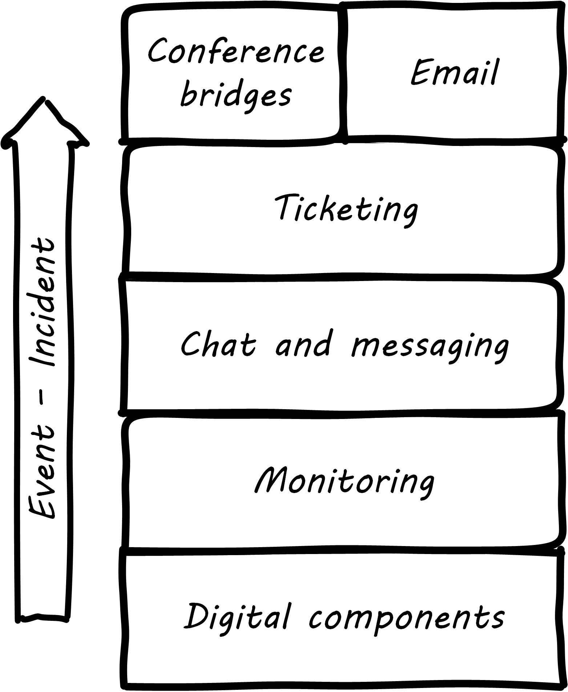

==== Operations practices

Monitoring communicates the state of the digital systems to the professionals in charge of them. Acting on that telemetry involves additional tools and practices, some of which we'll review in this section.

===== Communication channels

When signals emerge from the lower levels of the digital infrastructure, they pass through a variety of layers and cause assorted, related behavior among the responsible digital professionals. The accompanying illustration shows a typical hierarchy, brought into action as an event becomes apparently more significant.

.Layered communications channels

The digital components send events to the monitoring layer, which filters them for significant concerns, for example a xref:custom-monitoring[serious application failure]. The monitoring tool might automatically create a ticket, or perhaps it first provides an alert to the systems operators, who might instant message each other, or perhaps join a chat room.

If the issue can't be resolved operationally before it starts impacting users, an xref:ops-day-in-life[Incident] ticket might be created, which has several effects:

* First, the situation is now a matter of record, and management may start to pay attention
* Accountability for managing the Incident is defined, and expectations are that responsible parties will start to resolve it.
* If assistance is needed, the Incident provides a common point of reference (it is a common xref:representation[reference point]), in terms of xref:2.05.00-work-management[Work Management].

Depending on the seriousness of the Incident, further communications by IM, chat, cell phone, email, and/or conference bridge may continue. Severe incidents in regulated industries may require recording of conference bridges.

anchor:ChatOps[]

.What is ChatOps?
****
ChatOps is the tight integration of instant communications with operational execution. As Eric Sigler of PagerDuty describes it, "_While in a chat room, team members type commands that the chat bot is configured to execute through custom scripts and plugins. These can range from code deployments to security event responses to team member notifications. The entire team collaborates in real-time as commands are executed_" <<Sigler2014>>.

Properly configured ChatOps provides a low-friction collaborative environment, enabling a powerful and immediate collective mental model of the situation and what is being done. It also provides a rich audit trail of who did what, when, and who else was involved. Fundamental governance objectives of accountability can be considered fulfilled in this way, on par with paper or digital forms routed for approval (and without their corresponding delays).
****

anchor:simian-army[]

====== Drills, game days, and Chaos Monkeys

[quote, Izrailevsky and Tseitlin, Netflix Tech Blog]
...just designing a fault tolerant architecture is not enough. We have to constantly test our ability to actually survive these "once in a blue moon" failures. +
 +
Imagine getting a flat tire. Even if you have a spare tire in your trunk, do you know if it is inflated? Do you have the tools to change it? And, most importantly, do you remember how to do it right? One way to make sure you can deal with a flat tire on the freeway, in the rain, in the middle of the night is to poke a hole in your tire once a week in your driveway on a Sunday afternoon and go through the drill of replacing it. This is expensive and time-consuming in the real world, but can be (almost) free and automated in the cloud. +
 +
This was our philosophy when we built Chaos Monkey, a tool that randomly disables our production instances to make sure we can survive this common type of failure without any customer impact. The name comes from the idea of unleashing a wild monkey with a weapon in your data center (or cloud region) to randomly shoot down instances and chew through cables -- all the while we continue serving our customers without interruption. By running Chaos Monkey in the middle of a business day, in a carefully monitored environment with engineers standing by to address any problems, we can still learn the lessons about the weaknesses of our system, and build automatic recovery mechanisms to deal with them.

As noted above, it is difficult to fully reproduce complex production infrastructures as "lower" environments. Therefore, it is difficult to have confidence in any given change until it has been run in production.

The need to emulate "real world" conditions is well understood in the military, which relies heavily on drill and exercises to ensure peak operational readiness. Analogous practices are emerging in digital organizations, such as the concept of "Game Days" -- defined periods when operational disruptions are simulated and the responses assessed. A related set of tools is the Netflix Simian Army.

The Netflix Simian Army is a collection of resiliency tools developed by the online video-streaming service Netflix. It represents a significant advancement in digital risk management, as previous control approaches too often were limited by poor scalability or human failure (e.g. forgetfulness or negligence in following manual process steps).

Chaos Monkey is one of a number of tools developed to continually "harden" the Netflix system, including:

* Latency Monkey -- introduces arbitrary network delays
* Conformity Monkey -- checks for consistency with architectural standards, and shuts down non-conforming instances
* Doctor Monkey -- checks for longer-term evidence of instance degradation
* Janitor Monkey -- checks for and destroys unused running capacity
* Security Monkey -- an extension of Conformity Monkey, checks for correct security configuration
* 10-18 Monkey -- checks internationalization
* Finally, Chaos Gorilla simulates the outage of an entire Amazon availability zone

On the whole, the Simian Army behaves much as antibodies do in an organic system. One notable characteristic is that the monkeys as described do not generate a report (a xref:secondary-artifacts[secondary artifact]) for manual followup. They simply shut down the offending resources.

Such direct action may not be possible in many environments, but represents an ideal to work toward. It keeps the security and risk work "front and center" within the mainstream of the digital pipeline, rather than relegating it to the bothersome "additional work" it can so easily be seen as.

===== Post-mortems, blamelessness, and operational demand

We briefly mentioned xref:IT-process-emergence[Problem Management] as a common operational process. After an Incident is resolved and services are restored,

We have discussed xref:psych-safety[psychological safety] previously. Psychological safety takes on an additional and even more serious aspect when we consider major systems outages, many of which are caused by human error. There has been a long history of management seeking individuals to "hold accountable" when complex systems fail. This is an unfortunate approach, as complex systems are always prone to failure. Cultures that seek to blame do not promote a sense of psychological safety.

The definition of "counterfactual" is important. A "counterfactual" is seen in statements of the form, "If only Joe had not re-indexed the database, then the outage would not have happened." It may be true that if Joe had not done so, the outcome would have been different. But there might be other such counterfactuals. They are not helpful in developing a continual improvement response. The primary concern in assessing such a failure is, how was Joe put in a position to fail? Put differently, how is it that the system was designed to be vulnerable to such behavior on Joe's part? How could it be designed differently, and in a less sensitive way?

This is, in fact, how aviation has become so safe. Investigators with the unhappy job of examining large scale airplane crashes have developed a systematic, clinical, and rational approach for doing so. They learned that if the people they were questioning perceived a desire on their part to blame, the information they provided was less reliable. (This of course is obvious to any parent of a 4 year old.)

John Allspaw, CTO of Etsy, has pioneered the application of modern safety and incident investigation practices in digital contexts, and notably has been an evangelist for the work of human factors expert and psychologist Sidney Dekker. Dekker summarizes attitudes towards human error as falling into either the Old or New Views. He summarizes the old view as the Bad Apple theory:

* _Complex systems would be fine, were it not for the erratic behavior of some unreliable people (Bad Apples) in it_;
* _Human errors cause accidents: humans are the dominant contributor to more than two thirds of them;_
* _Failures come as unpleasant surprises. They are unexpected and do not belong in the system. Failures are introduced to the system only through the inherent unreliability of people._

Dekker contrasts this with the New View:

* _Human error is not a cause of failure. Human error is the effect, or symptom, of deeper trouble._
* _Human error is not random. It is systematically connected to features of people's tools, tasks and operating environment._
* _Human error is not the conclusion of an investigation. It is the starting point._ <<Dekker2006>>

Dekker's principles are an excellent starting point for developing a culture that supports blameless investigations into incidents. We will talk more systematically of culture in Chapter 7.

Finally, once a post-mortem or Problem analysis has been conducted, what is to be done? If work is required to fix the situation (and when is it not?), this work will compete with other priorities in the organization. xref:the-product-team[Product teams] typically like to develop new features, not solve operational issues that may call for reworking existing features. Yet serving both forms of work is essential from an holistic, xref:design-thinking[design thinking] point of view.

In terms of queuing, operational demand is too often subject to the equivalent of https://en.wikipedia.org/wiki/Starvation_(computer_science)[queue starvation] - which as Wikipedia notes is usually the result of "naive scheduling algorithms." If we always and only work on what we believe to be the "highest priority" problems, operational issues may never get attention. One result of this is the concept of xref:technical-debt[technical debt], which we discuss in Part IV.
