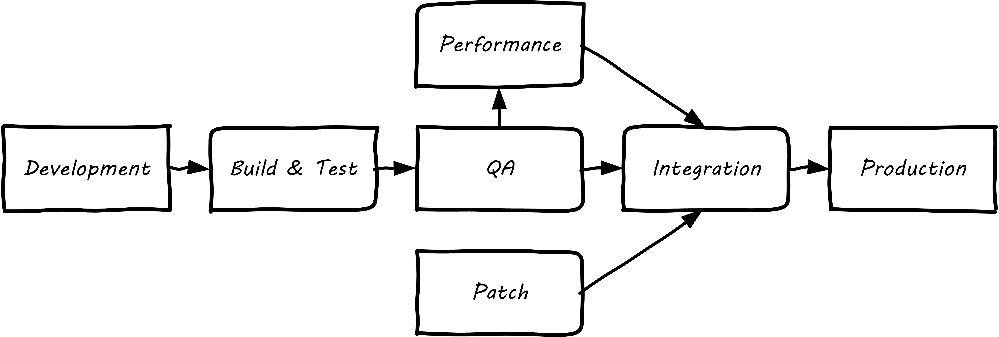

==== Configuration management and operations

anchor:state-config-discovery[]
anchor:2.06.03-state[]

===== State, configuration, and discovery

[quote, Wikipedia,https://en.wikipedia.org/wiki/State_(computer_science)]
In computer science and automata theory, the state of a digital logic circuit or computer program is a technical term for all the stored information, at a given instant in time, to which the circuit or program has access.[1] The output of a digital circuit or computer program at any time is completely determined by its current inputs and its state.

In all of IT (whether “infrastructure” or “applications” there is a particular concern with managing state. IT systems are remarkably fragile. One incorrect bit of information - a “0” instead of a “1” - can completely alter a system’s behavior, to the detriment of business operations depending on it.

Therefore, any development of information technology - starting with the initial definition of the computing platform - depends on robust management of state.

The following are examples of state:

* The name of a particular server
* The network address of that server
* The software installed on that server, in terms of the exact version and bits that comprise it.

State also has more transient connotations:

* The current processes listed in the process table
* The memory allocated to each process
* The current users logged into the system

Finally, we saw in the previous section some server/application/business mappings. These are also a form of state.

It is therefore not possible to make blanket statements like “we need to manage state.” Computing devices go through myriads of state changes with every cycle of their internal clock. (Analog and quantum computing are out of scope for this book.)

The primary question in managing state is “what matters”? What aspects of the system need to persist, in a reliable and reproducible manner? xref:policy-config[Policy-aware] tools are used extensively to ensure that the system maintains its configuration, and that new functionality is constructed (to the greatest degree possible) using consistent configurations throughout the digital pipeline.

===== Environments and the fierce god of "Production"

[quote, unknown]
“Don’t mess with that server! It’s … Production!!!”

“Production” is a term that new IT recruits rapidly learn has forbidding connotations. To be “in production” means that the broader enterprise value stream is directly dependent on that asset. Breakage or mishandling will result in questions and concerns from powerful forces. Be Very Scared.

How do things get to be “in production”? What do we mean by that?

First, let’s get back to our fundamental principle that there is an IT system delivering some "moment of truth" to someone. This system can be of any scale, but as above we are able to conceive of it having a xref:state-config-discovery[“state.”] When we want to change the behavior of this system, we are cautious. We reproduce the system at varying levels of fidelity (building "lower" environments with xref:infracode[Infrastructure as Code] techniques) and experiment with potential state changes. This is called development. When we start to gain confidence in our experiments, we increase the fidelity and also start to communicate more widely that we are contemplating a change to the state of the system. We may increase the fidelity along a set of traditional names:

* Development
* Testing
* QA
* Integration
* Performance Testing

The final state, where value is realized, is “Production.” Moving functionality in smaller and smaller batches, with increasing degrees of automation, is called xref:continuous-delivery[continuous delivery].

There is nothing sacred about the environments listed above. You will see many variations, especially at scale.

The idea that one sequentially moves (”promotes”) new system functionality through a series of states to gain confidence before finally changing the state of the production system is historically well established. However, the production state is notoriously difficult to reproduce fully, especially in highly distributed environments. While infrastructure as code has simplified the problem, lower environments simply can't match production completely in all its complexity, especially interfaced interactions with other systems or when large, expensive pools of capacity are involved. Therefore *there is always risk in changing the state of the production system.* Mitigating strategies include:

* Extensive automated test harnesses that can quickly determine if system behavior has been unfavorably altered.
* Ensuring that changes to the production system can be easily and automatically reversed. For example, code may be deployed but not enabled until a "feature toggle" is set. This allows quick shutdown of that code if issues are seen.
* Increasing the fidelity of lower environments with strategies such as service virtualization to make them behave more like production.
* Hardening services against their own failure in production, or the failure of services on which they depend.
* Reducing the size (and therefore complexity and risk) of changes to production (a key DevOps strategy). Variations here include:
** Small functional changes ("one line of code")
** Small operational changes (deploying a change to just one node out of 100, and watching it, before deploying to the other 99 nodes.)
* Using policy-aware infrastructure management tools.

Another important development in environmental approaches is A/B testing. In this approach, the “production” environment is segregated into two or more discrete states, with different features or behaviors exposed to users in order to assess their reactions. Netflix uses this as a key tool for xref:prod-discovery-techniques[product discovery], testing the user reaction to different user interface techniques for example.

.Do we need environments at all?
****
I have heard it recommended that the term “environment” be eliminated, as it tends to result in turf wars and empire building, and potentially the waste of fixed assets. Performance environments (that can emulate production at scale) are particularly in question.

Instead, in a dynamic infrastructure environment (private or public), one simply defines the kind of test one wants to perform and provisions that capacity on-demand.
****

===== “Development is production”

It used to be that the concept of “testing in production” was frowned upon. Now, with these mitigating strategies, and the recognition that complex systems cannot ever be fully reproduced, there is more tolerance for the idea. But with older systems that may lack automated testing, incremental deployment, or easy rollback, it is strongly recommended to retain existing promotion strategies, as these are battle-tested and known to reduce risk. Often, their cycle time can be decreased.

On the flip side, development systems must never be treated casually.

* The xref:pipeline[development pipeline] itself represents a significant operational commitment.
* The failure of a source code repository, if not backed up, could wipe out a company (see <<Marks2014>>).
* The failure of a build server or package repository could be almost as bad.
* In the digital economy, dozens or hundreds of developers out of work represents a severe operational and financial setback, even if the “production” systems continue to function.

It’s therefore important to treat “development” platforms with the same care as production systems. This requires nuanced approaches: with infrastructure as code, particular virtual machines or containers may represent experiments, expected to fail often and be quickly rebuilt. No need for burdensome change processes when virtual machine base images and containers are being set up and torn down hundreds of times each day! However, the platforms supporting the instantiation and teardown of those VMs are production platforms, supporting the business of new systems development.
