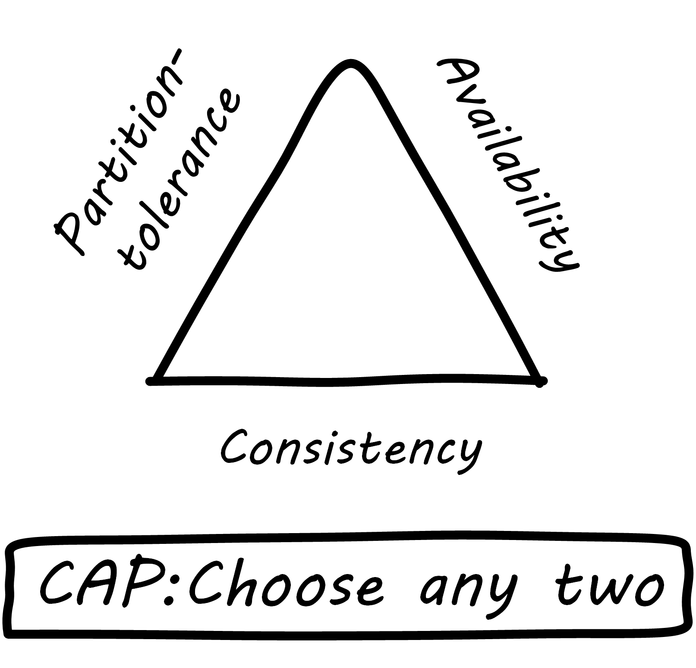
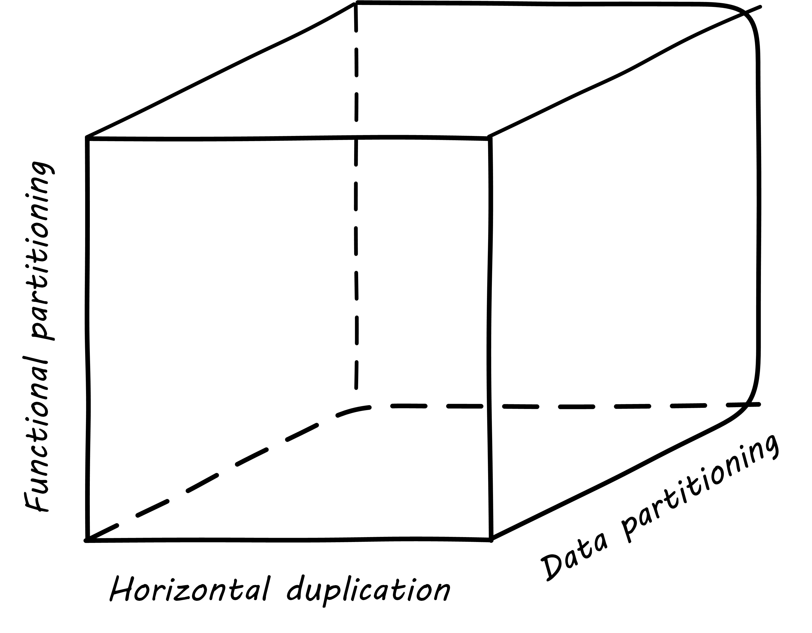
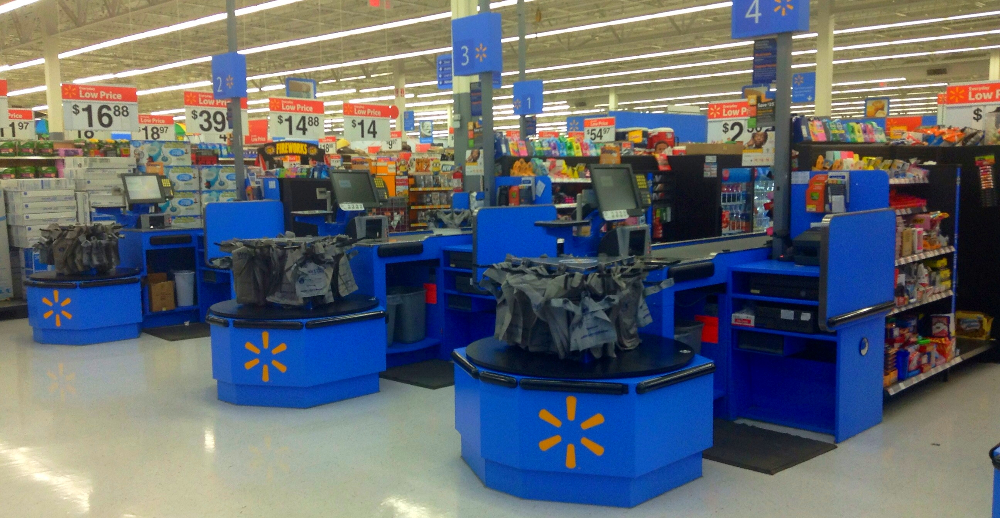

==== Designing for scale

[quote, Limoncelli/Chalup/Hogan]
Building a scalable system does not happen by accident.

[quote, Abbott and Fisher, The Art of Scalability]
Unfortunately, because of misinformation and hype, many people believe that the cloud provides instant high availability and unlimited scalability for applications.

Designing complex systems that can scale effectively and be operated efficiently is a challenging topic. Many insights have been developed by the large-scale public-facing Internet sites, such as Google, Facebook, Netflix, and others. The recommended reading at the end of this chapter provides many references.

A reasonable person might question why systems *design* questions are appearing here in the chapter on operations. We have discussed certain essential factors for system scalability previously: xref:cloud[Cloud], xref:infracode[infrastructure as code], xref:version-control[version control], and xref:continuous-delivery[continuous delivery]. These are all necessary, but not sufficient to scaling digital systems. Once a system starts to encounter real load, further attention must go to how it *runs*, as opposed to what it *does*. It's not easy to know when to focus on scalability. If xref:prod-discovery-techniques[product discovery] is not on target, the system will never get the level of use that requires scalability. Insisting that the digital product have a state of the art scalable design might be wasteful, if the team is still searching for a xref:lean-startup[Minimum Viable Product] (in Lean Startup terms). Of course, if you are doing systems engineering and  xref:flower-and-cog[building a "cog," not growing a "flower,"] you may need to be thinking about these factors earlier.

So, what often happens is that the system goes through various prototypes until something with market value is found, and at that point, as use starts to scale up, the team scrambles for a more robust approach. Chapter 2  xref:scale-matters[warned of this], and mentioned the https://gist.github.com/jboner/2841832[Latency Numbers]; now would be a good time to review those.

There are dozens of books and articles discussing many aspects of how to scale systems. In this section, we will discuss two important principles (the CAP Principle and the AKF Scaling Cube). If you are interested in this topic in depth, check out the references in this chapter.

anchor:CAP-theorem[]

===== The CAP principle

.CAP principle

Scaling digital systems used to imply acquiring faster and more powerful hardware and software. If a 4-core server with 8 gigabytes of RAM isn't enough, get a 32-core server with 256 gB of RAM (and upgrade your database software accordingly, for millions of dollars more). This kind of scaling is termed "vertical" scaling. However, web-scale companies such as Facebook and Google determined that this would not work indefinitely. Infinitely scaling vertically is not physically (or financially) possible. Instead, these companies began to experiment aggressively with using large numbers of inexpensive commodity computers.

ifdef::collaborator-draft[]
 easy illustration here of scaling approaches
endif::collaborator-draft[]

The advantage to scaling vertically is that all your data can reside on one server, with fast and reliable access. As soon as you start to split your data across servers, you run into the practical implications of the CAP principle.

CAP stands for:

* Consistency
* Availability
* Partition-tolerance

and the CAP Principle (or Theorem) states that it is not possible to build a distributed system that guarantees all three  <<Fox1999>>. What does this mean? First, let's define our terms:

*Consistency* means that all the servers (or "nodes") in the system see the same data at the same time. If an update is being processed, no node will see it before any other. This is often termed a transactional guarantee, and it is the sort of processing relational databases excel at.

For example, if you change your flight, and your seat opens up, a consistent reservation application will show the free seat simultaneously to anyone who inquires, even if the reservation information is replicated across two or more geographically distant nodes. If the seat is reserved, no node will show it available, even if it takes some time for the information to replicate across the nodes. The system will simply not show anyone any data until it can show everyone the correct data.

*Availability* means what it implies: that the system is available to provide data on request. If we have many nodes with the same data on them, this can improve availability, since if one is down, the user can still reach others.

*Partition-tolerance* is the ability of the distributed system to handle communications outages. If we have two nodes, both expected to have the same data, and the network stops communicating between them, they will not be able to send updates to each other. In that case, there are two choices: either stop providing services to all users of the system (failure of availability) or accept that the data may not be the same across the nodes (failure of consistency).

In the earlier years of computing, the preference was for strong consistency and vendors such as Oracle profited greatly by building database software that could guarantee it, when properly configured. Such systems could be consistent and available, but could not tolerate network outages - if the network was down, the system, or at least a portion of it, would also be down.

Companies such as Google and Facebook took the alternative approach. They said, "We will accept inconsistency in the data so that our systems are always available." Clearly, for a social media site such as Facebook, a posting does not need to be everywhere at once before it can be shown at all. To verify this, simply post to a social media site using your computer. Do you see the post on your phone, or your friend's, as soon as you submit it on your computer? No, although it is fast, you can see some delay. This shows that the site is not strictly consistent; a strictly consistent system would always show  the same data across all the accessing devices.

The challenge with accepting inconsistency is how to do so. Eventually, the system needs to become consistent, and if conflicting updates are made they need to be resolved. Scalable systems in general favor availability and partition-tolerance as principles, and therefore must take explicit steps to restore consistency when it fails. The approach taken to partitioning the system into replicas is critical to managing eventual consistency, which brings us to the AKF scaling cube.

For further discussion, see <<Limoncelli2014>>, section 1.5.

anchor:AKF-cube[]

===== The AKF scaling cube

.AKF scaling cube footnote:[_Similar to <<Abbott2015>>, p. 376_]

Another powerful tool for thinking about scaling systems is the AKF Scaling Cube. AKF stands for Abbott, Keeven, and Fisher, authors of _The Art of Scalability_ <<Abbott2015>>. The AKF cube is a visual representation of the three basic options for scaling a system:

* Replicate the complete system (x-axis)
* Split the system functionally into smaller layers or components (y-axis)
* Split the system's data (z-axis)

.Point of sale terminals - horizontal scale footnote:[_Image credit https://www.flickr.com/photos/jeepersmedia/14061759587, downloaded 2016-11-21, commercial use permitted_]

A *complete system replica* is similar to the Point of Sale terminals in a retailer. Each is a self-contained system with all the data it needs to handle typical transactions. POS terminals do not depend on each other and therefore you can keep increasing the capacity of your store's checkout lines by simply adding more fo them.

*Functional splitting* is when you separate out different xref:feature-v-component[features or components]. To continue the retail analogy, this is like a department store; you view and buy electronics, or clothes, in those specific departments. The store "scales" by adding departments, which are self-contained in general; however, in order to get a complete outfit, you may need to visit several. In terms of systems, separating web and database servers is commonly seen - this is a component separation. E-commerce sites often separate "show" (product search and display) from "buy" (shopping cart and online checkout); this is a feature separation. Complex distributed systems may have large numbers of features and components, all orchestrated together into one common web or smartphone app experience.

.Partitioning by data range at a conference footnote:[_Image credit https://www.flickr.com/photos/abragad/2531511657, downloaded 2016-11-21, commercial use permitted_]

*Data splitting* is the concept of "partitioning" from the CAP discussion, above. Have you ever checked into a large event, and the first thing you see is check-in stations divided by alphabet range? For example:

* A-H register here
* I-Q register here
* R-Z register here

This is a good example of splitting by data. In terms of digital systems, we might split data by region; customers in Minnesota might go to the Kansas City data center, while customers in New Jersey might go to a North Carolina data center. Obviously, the system needs to handle situations where people are traveling or move.

There are many ways to implement and combine the 3 axes of the AKF scaling cube to meet the CAP constraints (consistency, availability, and partition-tolerance). With further study of scalability, you will encounter discussions of:

* Load balancing architectures and algorithms
* Caching
* Reverse proxies
* Hardware redundancy
* Designing systems for continuous availability during upgrades

and much more. For further information, see <<Abbot2015>> and <<Limoncelli2014>>.

ifdef::collaborator-draft[]

 work in process

 ===== Principles and techniques for scaling
 [quote, Abbott and Fisher, The Art of Scalability]
There may be no other principle as important to scaling a product as the ensuring that one can always scale horizontally (or out, rather
than up).

  A & F:

  N + 1
  Design for rollback
  Design to be disabled
  Design to be monitored (discussed previously)
  Live-live
  Tech lifecycle mgmt (forward ref)
  Asynch & stateless
  scaleout
  buy not build when non-core
  use commodity hw
  small batches
  fault isolation
  automate everything

 Technology agnostic arch & design - important for this stage -

 fault isolation terms
 * swim lane  / pod
 * shard/sliver
 * pool

 principles:

 * shared nothing
 * no blocking across lanes
 * tx w/in swim lanes

 * segregate money maker
 * segregate incidents
 * "natural" boundaries (e.g. customers)

 The fundamental questions of the Y-axis split - where architecture emerges (!!  insight)

endif::collaborator-draft[]
