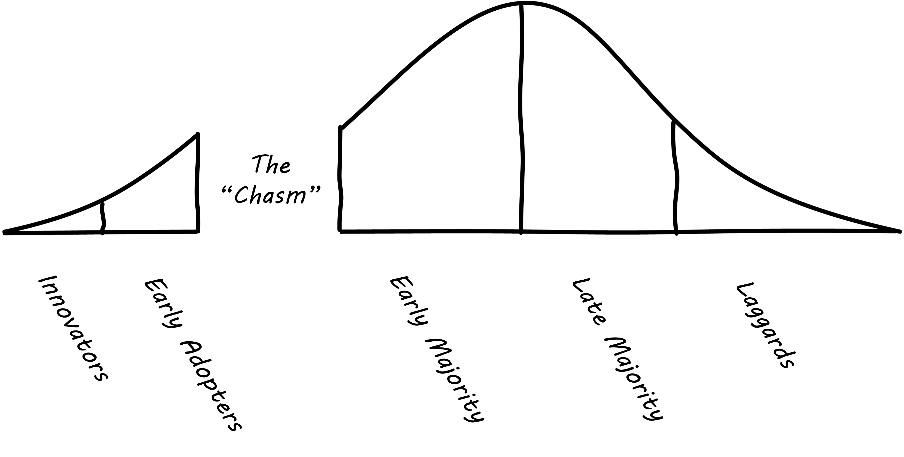

==== Product discovery

[quote, Herbert Simon]
Everyone designs who devises courses of action aimed at changing existing situations into preferred ones <<Simon1988>>.

[quote, Jacques Murphy, Pragmatic Marketing]
 What is a Product Manager? A Product Manager is the one person in the whole organization who owns the product Requirements effort. Requirements focuses on the WHAT, which means it isn't Development, which focuses on the HOW. And Marketing traditionally talks about the WHAT, but cannot necessarily decide what the WHAT should be. At least not at any useful level of detail. <<Murphy2007>>

Now that we have discussed the overall concept of product management, we can turn more specifically to the topic of product discovery and design.

NOTE: In this book, we favor the idea that products are "discovered" as much or more than they are "designed." But you will see both terms used throughout this chapter. See the parable xref:flower-and-cog[the Flower and the Cog] for an illustration of the difference.

The presence of a section entitled "product discovery" in this book is a  departure from other IT management textbooks. "Traditional" models of IT delivery focus on projects and deliverables, concepts we touched on in the  xref:2.04.01-process-project-product[last chapter section] but that we will not explore in depth until later in the book.

However, the idea of "product discovery" *within* the large company is receiving more and more attention. Even large companies xref:fowler-quote[benefit] when products are developed with tight-knit teams using fast feedback.

NOTE: The term "intrapreneurship" means "entrepreneurship inside a large company."

For our discussion here, the challenge with the ideas of projects and deliverables is that they represent approaches that are more xref:2.00.1-open-loop[open loop], or at least delayed in xref:2.00.01-feedback[feedback]. Design processes do not perform well when feedback is delayed. xref:system-intent[System intent], captured as a user story or requirement, is only an hypothesis until tested via implementation and user confirmation.

anchor:product-context[]

===== Product context

 move this section to Chapter 1 after  10/1/2016

As you consider embarking on a journey of IT value, you need to orient to your surroundings and create an initial proposal or plan for how you will proceed. If you are actually a startup, you need a business plan. If you are working as an intrapreneur in a larger organization, you will still need some kind of formal proposal. This section describes some tools and thinking approaches that may be useful at this very earliest stage. There are more focused, product-specific techniques in the chapter section on anchor:prod-discovery-techniques[product discovery techniques].

====== Diffusion theory and other approaches

As you start to think about digital value, you must think about the context for your startup or product idea. A well known approach for this is the idea of the "diffusion theory," first researched by Everett Rogers and proposed in his _Diffusion of Innovations,_ <<Rogers2003>>.

Rogers' research proposed the idea of "Adopter Categorization on the Basis of Innovativeness," with a well-known graphic:

image:images/2.04-adoption.png[]
_Technology adoption categories, similar to <<Rogers2003>>, figure 7-3, page 281._

Rogers went on to characterize the various stages:

* Innovators: Venturesome risk-takers
* Early adopters: Opinion leaders
* Early majority: Deliberative, numerous
* Late majority: Skeptical, also numerous
* Laggards: Traditional, isolated, conservative

The above figure was popularized in the following variation by Geoffrey Moore <<Moore2014>> in his bestseller _Crossing the Chasm_:

_Purported "chasm" between adopter categories, similar to <<Moore2004>>, page 21._

You'll see this diagram often, but you should be aware that Rogers himself (the person who has researched the data) says that (p.282)

_Past research shows no support for this claim of a “chasm” between certain adopter categories. On the contrary, innovativeness, if measured properly, is a continuous variable and there are no sharp breaks or discontinuities between adjacent adopter categories (although there are important differences between them)_.

The idea of technology diffusion frames the problem for us, but we need more. Steve Blank, in his influential book _The Four Steps to Epiphany_ <<Blank2013>>, argues there are four categories for startups (p.31):

* Startups that are entering an existing market
* Startups that are creating an entirely new market
* Startups that want to resegment an existing market as a low-cost entrant
* Startups that want to resegment an existing market as a niche player

Understanding which category you are attempting is critical, because "the four types of startups have very different rates of customer adoption and acceptance."

Another related and well known categorization of competitive strategies comes from Michael Treacy and Fred Wiersma <<Treacy1997>>:

* Customer intimacy
* Product leadership
* Operational excellence

It is not difficult to categorize well known brands in this way:

[cols="3*", options="header"]
|====
|Customer intimacy|Product leadership|Operational excellence
|Nordstrom +
Home Depot
|Apple +
Nike
|Dell Computer +
Wal-Mart
|====

However, deciding which strategy to pursue as a startup may require some experimentation.

====== Market facing, supporting, back office
In Chapter 1 we discussed the question of "who pays/who benefits" for the service, http://dm-academy.github.io/aitm/#_defining_consumer_customer_and_sponsor[proposing that] the service consumer, the service customer, and the service sponsor might be three distinct roles (sometimes collapsing into 2 or 1 individual.)

We see this again in how we can categorize the "customers" of IT services and systems. Roughly, such services can be:

* Directly market- and consumer-facing (e.g. Facebook), to be used by external consumers and paid for by either them or closely associated customers (e.g. Netflix, or an online banking system).
* Customer "supporting" systems, such as the online system that a bank teller uses when interacting with a customer. Customers do not interact directly with such systems, but customer-facing representatives do, and problems with such systems may be readily apparent to the end customer.
* Completely "back-office" systems (HR, payroll, marketing, etc)

Note however, that (especially in the current digitally transforming market) a service previously thought of as "back office" (when run internally) becomes "market-facing" when developed as a profit-seeking offering. For example, an HR system built internally is "back office," but Workday is a directly market-facing product, even though the two services may be similar in functionality.

In other words, it's all relative.

Especially when products are *not* market facing, we start to run into the problem of distinguishing xref:discovery-v-design[discovery versus design], as we discuss below.

anchor:prod-discovery-techniques[]

===== Product discovery techniques
[quote, Steve Blank, The Four Steps to Epiphany]
Startups that survive the first few tough years do not follow the traditional product-centric launch model espoused by product managers or the venture capital community...In particular, the winners invent and live by a process of customer learning and discovery. I call this process “Customer Development,” a sibling to “Product Development,” and each and every startup that succeeds recapitulates it, knowingly or not.

In Chapter 3, we needed to consider the means for describing system intent. Even as a bare-bones startup, some formalization of this starts to emerge, at the very least in the form of acceptance tests. As a team, we now need to expand "upstream" of the core delivery pipeline, so that we can collaborate and discover more effectively.

 graphic showing expansion of concern

There are a wide variety of techniques and even "schools" of product discovery and design; we will consider a few representatives in this chapter section.

Of course, when you first started your journey in Chapter 1, you might also have used some of these techniques. But now that you are a team, you are formalizing and relying on these techniques.

These techniques are not mutually exclusive; they may be complementaary. 

anchor:lean-startup[]

====== Lean Startup
[quote, Eric Ries, The Lean Startup]
The goal of a startup is to figure out the right thing to build— the thing customers want and will pay for— as quickly as possible. In other words, the Lean Startup is a new way of looking at the development of innovative new products that emphasizes fast iteration and customer insight, a huge vision, and great ambition, all at the same time.

Lean Startup is a philosophy of entrepreneurship developed by Eric Ries <<Ries2011>>. It is not specific to information technology; rather, it is broadly applicable to all attempts to understand a product and its market. (Remember according to our xref:prod-mgmt-definition[definition of product management] that a workable market position is essential to any product.)

The idea of the Lean Startup has had profound influence on product design, including market-facing and even internal IT systems. It is grounded in Agile concepts such as:

"Do the simplest thing that could possibly work."

Lean Startup calls for an iterative, "Build-Measure-Learn" cycle. Repeating this cycle frequently is the essential process of building a successful startup (whatever the digital proportion).

* Develop an idea for a Minimum Viable Product (MVP)
* Measure its effectiveness in the market (internal/external)
* Learn from the experiment
* Decide to persevere or pivot (change direction while leveraging momentum)
* New idea development, evolution of MVP

anchor:impact-mapping[]

====== Impact mapping

anchor:biz-model-canvas[]

====== Business model canvas

anchor:biz-analysis-ch1[]

====== Business analysis and architecture
  Foreshadow BPM

====== Others

 [TBW]
 * INVEST
 * MoSCoW
 * 5 Whys
 * JTBD
 https://medium.com/@zbigniewgecis/8-things-to-use-in-jobs-to-be-done-framework-for-product-development-4ae7c6f3c30b#.w4d6fgqhx

anchor:discovery-v-design[]

===== Discovery versus design

 Some of the most contentious discussions related to IT management and Agile come at the intersection of software and systems engineering, especially when large investments are at stake. We call this the "discovery versus design" problem.

 Frequent criticisms of Lean Startup and related trends are:

 * They are relevant only for non-critical Internet-based products (e.g. Facebook and Netflix)
 * Some IT products must fit much tighter specifications and do not have the freedom to "pivot" (e.g. control software written for aerospace & defense systems)

 anchor:flower-and-cog[]

 ****
 *Parable: The flower and the cog*

 *THUNK!*

 _Hello. Where did you come from?_

 *I fell. From that machine.*

 _Machine?_

 *Yes, that big loud thing that just passed by. And is now stopped over there.*

 _Why is it stopped?_

 *Because I am no longer with it. The machine needs me to function. I am called a "cog." Where did you come from?*

 _I am a flower. I grew from a seed._

 *You ... grew?*

 _Yes._

 *You mean, no-one planned or designed you?*

 _Not that I know of. What does it mean to be "designed" or "planned"?_

 *I am part of a greater whole. The need for me was understood when that greater whole was conceived. I was designed to fit a very particular place. +
  +
  They had to try making me out of different metals, and different ways to make me. This took some time and effort -- longer than was planned, in fact. But it was always understood that there would need to be a cog in a certain place in the machine.*

 _Interesting. So you will never be more than you are?_

 *No. I will always be a cog. They might make a different machine, with different cogs, but they will not be me. Are you part of a machine?*

 _No. I grew here because it suited me. I have continued to grow for a couple years. Eventually I may grow 20 feet tall, if the conditions remain good. I can adapt to other plants, and find my way around them to the sunlight and the water I need. Or I may stay smaller, if I can't get the sunlight I need. Or I may die._

 *Aren't you part of a system that defines your purpose?*

 _Not that I know of. Sometimes I think I am a system myself, made up of my roots, stem, leaves, and flower. There are insects living on me who rely on me for food and shelter.  And I have the freedom to grow into one of the largest trees in this area.  That is worth it to me._

 *Interesting. Well, it is good you are growing where you are, and not twenty feet further in that direction.*

 _Why?_

 *Because when they find me, or replace me and fix the machine, it will continue to clear all the land over there.*

 _Oh._

 VOICES: "Hey Joe, here's that gear the tractor must have thrown."

 "Good, grab it and I'll see if I can't get it back in place at least temporarily until we can figure out why it happened."

 *Bye.*

 _Goodbye. Nice talking to you. Good luck._

 *Thanks. You too.*

 ****

 The above parable is meant to illustrate two very different product development worlds. Some product development is constrained by the overall system it takes place within. Other product development has more freedom to grow in different directions.

 The cog represents the world of classic systems engineering -- a larger objective frames the effort, and the component occupies a certain defined place within it. And yet, it may still be challenging to design and build the component, which can be understood as a product in and of itself. Fast feedback is still required for the design and development process, even when the product is only a small component with a very specific set of requirements.

 The flower represents the market-facing digital product that may "pivot," grow and adapt according to conditions. It also is constrained, by available space and energy, but within certain boundaries has greater adaptability.

 Neither is better than the other, but they do require different approaches. In general, we are coming from a world that saw digital systems strictly as cogs, and moving towards a world in which digital systems are more flexible, dynamic, and adaptable.

 And, when digital components have very well understood requirements, usually we purchase them from specialist providers (increasingly "as a service"). This results in increasing attention to the "flowers" of digital product design, as acquiring the "cogs" is relatively straightforward (more on this in the chapter 8 section on sourcing.).

===== Product architecture

 a little more architecture

anchor:feature-v-component[]

====== Features vs. components

anchor:2.04.02-features-v-components[]
As your product evolves, you may see an increasing differentiation of concerns, between features and components.

Features are *what* your product *does*. They are what the customers perceive as valuable. “Scope as viewed by the customer” as <<Kennaley2010>> says (p. 169).

Components are *how* your product is *built*, such as database vs. Web components. In other words, they are a form of infrastructure (but infrastructure you may need to build yourself, rather than just spin up in the Cloud).

Feature teams are dedicated to a clearly defined functional scope, while component teams are defined by their technology platform. Component teams may become shared services, which need to be carefully understood and managed (more on this in Section 3).

It may be easy to say that features are more important than components, but this can easily be carried too far. Do you want each feature team choosing its own database? Not recommended. Allowing feature teams to define their own technical direction can result in brittle, fragmented architectures, technical debt, and rework.

Software product management needs to be a careful balance between these two perspectives. Some http://blog.octo.com/en/feature-team-beyond-the-buzzword/[recommend] a ratio of:

* 70-80% Feature teams to

* 20-30% Component teams

We will be revisiting this more systematically in chapter 7.
