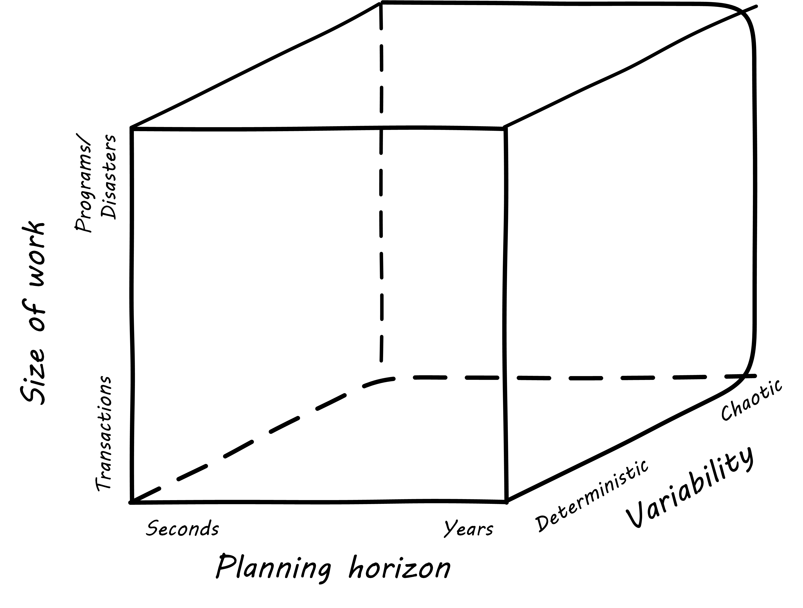
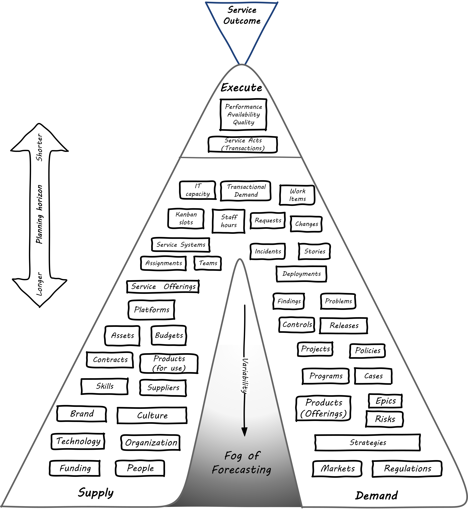
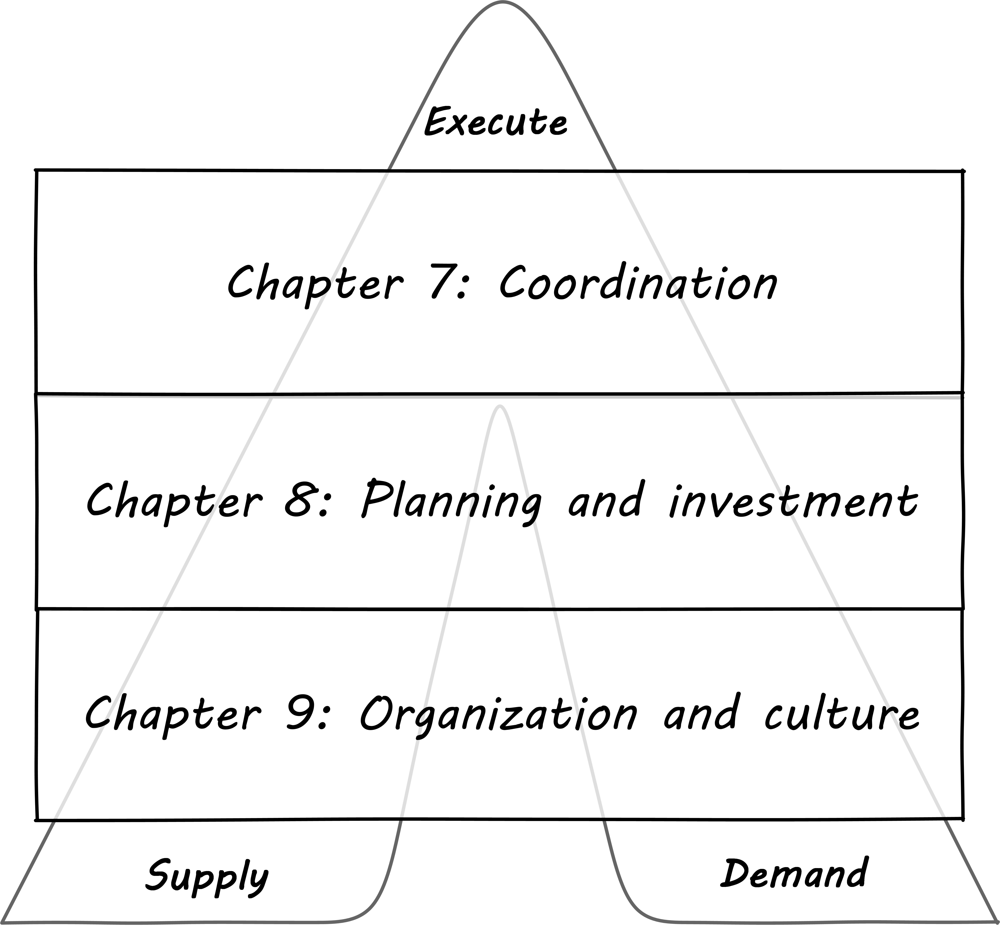

anchor:scaling-org[]

=== Special section: Scaling the organization and its work
[quote, Roman Pichler, Agile Product Management with Scrum]
here's a general warning: Avoid large projects. Start small and quickly develop a product with the minimum functionality... If you have to employ a large project, scale slowly and grow the project organically by adding one team at a time. Starting with too many people causes products to be overly complex, making future product updates time-consuming and expensive.

As we begin the second half of this book, Pichler's advice above is important. We have spent chapters 1-6 (the first half of the book) thinking mainly in terms of one product and its dimensions. We are  scaling now because we must; we have increasingly diverse product opportunities, or one product that has become so large it must be  xref:AKF-cube[partitioned] in some manner. Or both.

==== The two dimensions of demand management
To provide a framework for Part III, let's start with this two-dimensional analysis:

image::images/3_00-2d-demand.png[complex 2d figure, 800,]

You should spend some time reviewing the graphic, which provides a unique way of understanding the work you are now experiencing as a "team of teams" or "manager of managers" in an IT-dependent environment of increasing size and complexity. We've come a long ways since our discussion of xref:work-management[work management]. Still, regardless of the label we put on a given activity, it represents some set of tasks or objectives that real people are going to take time to perform, and expect to be compensated for. Remembering this is essential to maintaining truly business-aligned IT management.

NOTE: _Demand Management_ is a term meaning "understanding and planning for required or anticipated services or work." Planning for next year's project portfolio (if you use projects) is demand management.

Let's consider the various forms that demand may take. Understanding these demand forms will also help you develop a deeper understanding of an *architecture of IT management*, a topic I have explored in other works <<Betz2011>>.

The diagram has two dimensions:

* Planning
* Granularity

The bubbles represent a "space" where one is likely to find that kind of work. As indicated by the central diagonal, it reflects an assumption that larger amounts of work are more likely to be planned further in advance. However, this is not always true. A large, unwelcome amount of required work that shows up with no planning is probably a disaster. Desired work (in the form of aggregate transactional demand) may also spike unexpectedly. Transactional demand considered across a long timeframe is xref:capacity-mgmt[capacity management]. The following table lists various examples:

[cols="2*", options="header"]
|===
|Type of work |Description
|Core transactional demand
|This is the demand on the fully automated IT system for a given moment of truth: a banking account lookup, a streaming movie, a Human Resources record update
|Routine service requests and incidents
|Service requests are predefined, process-driven work items, rarely requiring creative thought or analysis. Incidents span a spectrum, but some are simpler and more routine than others, especially those stemming from user misunderstanding or error.
|Changes
|Changes represent modifications of established IT functionality or xref:state-config-discovery[state]. They represent some definite risk to one or more IT services, which is why they are planned on a longer lead time. However, they ideally remain relatively granular, which helps reduce their risk.
|Routine releases, stories, reports
|Releases and (in the Agile world) stories represent larger increments of functionality
|Projects
|A Project is a large, planned amount of work with a defined end date. It might create a Service, which also represents a commitment to a large, ongoing amount of work, perhaps comparable in scope to the Project.
|Major incidents
|Major incidents by definition are not planned. But they represent a significant amount of work to overcome.
|===

Some forms of work may lead to other forms of work. For example, Projects may manifest as Stories, Releases, and Changes. This complicates the diagram a bit; we don't want to "double-count" work effort. But not all Releases derive from Projects, and not all Project work (especially in complex environments) can be cleanly reduced to a set of smaller tasks.

The final point of this diagram: you only have so much capacity to execute the work it implies. If you have a disaster, it may impact your ability to deliver user stories, changes, or even meet transactional demand. Trade-offs must be considered.

==== Adding a third dimension

The two dimension model above does not describe how uncertain work is, however. You might have two projects, both taking the same effort. One of them you were able to predict easily, while the other one was not predictable - more precisely, your expected time, effort and cost was a long way off from what you wound up spending. (Usually in an unfavorable direction.)

.Part II: increasing certainty footnote:[Similar to figure from <<Cantor2016>>.]

Part II (Chapters 4-6, which we just finished) can be viewed as a logical progression from the uncertainty of developing a novel product, to the day to day work of building its features, to its predictable operation. The "predictability curve" illustrated in the associated figure increases as the digital product stabilizes and moves to a fully operational state.

This question of predictability, of *the degree to which actuals track estimates* and can be known in advance, will be an ongoing theme throughout Part III. As we scale up, our organization takes on more and more work of all kinds, from highly uncertain to very predictable. Understanding the differences in this "portfolio" of work is essential to managing it correctly. There has always been an element of risk; as a startup, your success was not guaranteed! You now find that you are managing different classes of risk simultaneously, and "one size fits all" approaches do not work.

Furthermore, as an organization scales, there is an increasing span in your time horizon and the scope of work you are considering and executing. From the immediate, "hand-to-mouth" days of your startup, you now must take concern for longer and longer time frames: contracts, regulations, and your company's strategy as it grows all demand this.

Finally, the very terminology you use to describe your work becomes more diverse, reflecting in some ways the broader time horizons you are concerned with. Requests, changes, incidents, work orders, releases, stories, epics, problems, major incidents, refreshes, programs, strategies... there is a continuum of how you think about your organization's work efforts. Mostly, the range of work seems tied to how much planning time you have, but there are exceptions: disasters take a lot of work, but you don't get much advance warning! So size of work is independent of planning horizon.

The predictability of the work is also independent. You might have a program to upgrade the memory on 80,000 identical Point of Sale terminals across 2,000 retail stores. It's going to take a lot of work; you'll be "rolling trucks" in all 50 states! But you are sure that you can estimate this work with a high degree of accuracy; it has high predictability. On the other hand, creating a completely new Point of Sale system for your stores is an unpredictable effort. Your original estimate for this large program might be off by orders of magnitude. Its predictability is low.

anchor:betz-org-scale-cube[]

.Betz organization scaling cube footnote:[Author's note: I believe this to be original; it is being published here for the first time.]

Therefore, there are three dimensions we'll consider throughout Part III:

* Size of work
* Time horizon
* Predictability

The accompanying cube shows these dimensions visually. It will be applied to examples in subsequent sections.

==== Demand, supply, and execution

Finally, in order to understand the concept of execution, we need to think about supply versus demand. Think about the kinds of demand described above. Each form of demand implies some kind of supply to meet it. For example, the demand that an automated transaction be executed requires the supply of appropriate computing capacity at the necessary place and time. The demand that a new story be supported as part of a software product feature requires the supply of a software development team's time and attention. And a major product or project requires the supply perhaps of many teams as well as other resources (hardware and software assets, for example).

In the xref:betz-org-scale-cube[Betz organization scaling cube], work and execution converges to the origin at front lower left. An alternate view that helps us describe the chapter structure is with the convergence point at the top of a pyramid. This rotated approach is compatible with the xref:dual-axis-vc[dual-axis value chain].

.Demand-supply-execute model

Bottom to top, this diagram tells a story of demand and supply as they progress through increasingly refined understandings to the very specific execution of work and delivery of value.

We have markets and regulations, which define and constrain the potential demand for the digital product. Markets are met with strategies and product offerings, which lead to programs of work, projects, and platform decisions. These in turn lead to identifying user stories, writing software, configuring platforms, and executing changes, service requests and work tasks.

That finer and finer grained demand stream converges with a finer and finer grained supply stream. Large blocks of capital are translated into strategic technology choices and vendor relationships, organizational structures and investments in skilled people. More detailed budgets and planning culminate ultimately in the availability of people, hardware, and software for given assignments, e.g, an empty slot on a Kanban board.

The journey can start anywhere, with a large block of traditionally managed programmatic capital or a small round of seed funding translated directly into a two-pizza team with maximum autonomy, which then grows and leads to  larger investments.

Ultimately the deployed IT service system is available for fulfilling transactional service demand which can be measured in terms of quality, availability and performance. Execution, in this model, is defined as the irrevocable combination of demand with supply.

The gap between the legs of the V is filled with the "Fog of Forecasting." With the lower level, larger grained abstractions it is more difficult to understand demand and supply, especially when product development (e.g. novel software engineering) is involved. As demand and supply converge to the point of execution, a finer and finer grained awareness is created of the impending work and whether it is likely to be successful - that is, if demand will effectively and efficiently be paired with supply.

Notice how the fog lifts as you get closer to actual execution. We only start to really get a feel for how execution is going to work when we get down to team and individual level assignments across all queues and ultimately actual Kanban slots or their equivalent (e.g. assigned and accepted work orders, and ultimately actual usage of the automated digital system's capacity).

==== Part III chapter structure
The chapter structure of Part III can be visualized thus:

.Part III Chapter structure

In thinking about how organizations develop as they scale, it is helpful to consider various time frames:

* Ongoing execution is the actual day to day work, however conceived. It can include defined process activities, project deliverables, the flow of new product functionality, or ongoing improvement and governance. Ongoing execution is the "moment of truth" where estimate becomes actual and supply meets demand.
* Investment decisions are required to charter new products, even in those companies that may be moving away from a traditional project cycle. Investments are usually understood in terms of budget planning, which traditionally has driven the project funding cycle. They represent some statement of intent for a larger scope of work to be performed and/or sustained, based on the organizational platform, which should be able to support multiple investments.
* Organizational changes may take years, and require considerable effort and thought if they are to succeed. One does not change organizational structures lightly or (hopefully) frequently.  Employee tenure is in general even longer.
* Culture takes longest and is most difficult to change; it easily outlasts both organizational forms and even individual employees coming and going. Both culture and organization have self-reinforcing xref:feedback[feedback] loops which add complexity to any deliberate attempts to transform them.

==== The delivery models

In Chapter 4 we introduced the : xref:process-project-product["3 Ps"]:

* Product management
* Project management
* Process management

It is important that you review them. Sometimes, the concept of "program" is also used. We will call these delivery models: they are organizing paradigms for getting work done. They may depend on each other, but they each have clear industry identity and bodies of knowledge associated with them:

* Product management has the Product Development and Marketing association and authors like Steve Blank and Marty Cagan.
* Program management has the Axelos Managing Successful Programmes guidance
* Project management has the Project Management Body of Knowledge and the PRINCE2 guidance from Axelos.
* Process management has the BPMN and BPEL standards and authors like Geary Rummler, Roger Burlton and Paul Harmon.

.Product versus program management
****
Program management is a term seen in government efforts and military contracting to describe major efforts of uncertain duration and (sometimes) uncertain outcome. Product management is also uncertain of duration and outcome, and the industry does not clearly distinguish between the two. Some companies use concepts of both product and program management; others use one or the other. Stanley Portny describes:

_Program: This term can describe two different situations. First, a program can be a set of goals that gives rise to specific projects, but, unlike a project, a program can never be completely accomplished. For example, a health-awareness program can never completely achieve its goal (the public will never be totally aware of all health issues as a result of a health-awareness program), but one or more projects may accomplish specific results related to the program’s goal (such as a workshop on minimizing the risk of heart disease). Second, a program sometimes refers to a group of specified projects that achieve a common goal_ <<Portny2013>>.

Where both terms are used, program management may be more about delivery and execution (shading into project management's domain), while product management is more about vision and outcome.
****

We order the delivery models by their _variability_. What does that mean? Products and programs have the highest variability. Their outcome may differ considerably from the initial vision that drove them. Projects, in theory, should be reasonably plannable -- their schedule and cost are managed in terms of "plan versus actual" and differences, ideally, should be well controlled and understandable. Finally, process management strives to minimize variation and in its most rigorous form uses statistical control to do so. If we matrix the delivery models with the time frames we get:

.Time frame matrixed to delivery
image::images/3_01-layers.png[matrix, 600,,align="left"]

The relationships between the timeframes and delivery models are complex:

* Investments are made in products first, which may or may not need projects and/or processes. Rigorous planned projects or detailed, repeatable processes are not, in fact, how product discovery takes place - a mistake the digital industry has fallen into over and over again.
* Products are best thought of in terms of discovery and empirical hypothesis-testing. If the hypothesis fails, the investment should be cancelled. So, the "product" concept is both shorter and longer lived than the average project, which is typically understood on an annual cycle.
* Project management also may take place without processes, as it may be based on one-time "deliverables" that are not repeatedly produced.
* To support a process requires portfolio investment and organizational structure, but no project may ever be involved. Whether a product is implied by the existence of a process is an interesting question we will think about.

Clearly, we must think carefully about the relationships between these dimensions. That, in a nutshell, is the purpose of part III.
