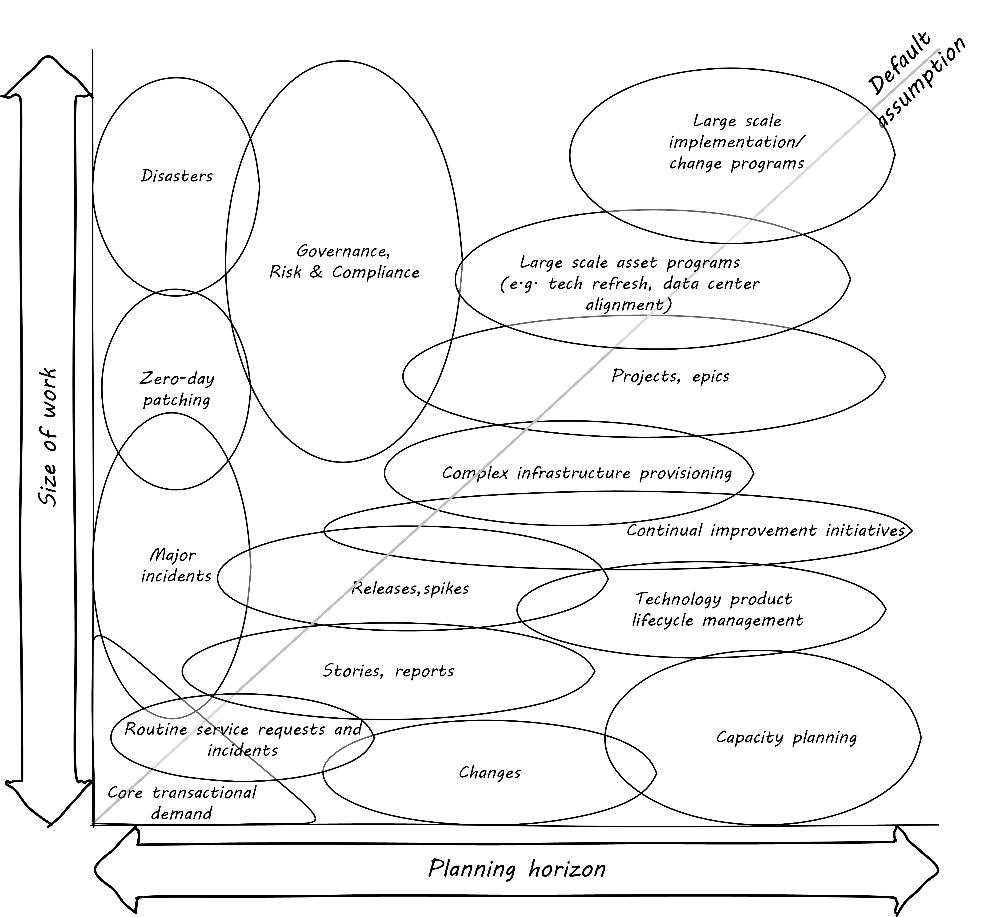

=== Special section: The two dimensions of demand management
Project management is our first major specialization of xref:work-management[Chapter 5]'s general concept of "work management." (We will turn to process management in the next chapter.) In the interest of keeping project management firmly in context, consider the following two-dimensional analysis:

You should spend some time considering the graphic, which provides a unique way of understanding the work you are now experiencing as a "team of teams" or "manager of managers" in an IT-dependent environment of increasing size and complexity.

We've come a long ways from the last section's insistence that "it's all just work." But there still is an essential truth there. Regardless of the abstract label we put on a given activity, it represents some set of tasks or objectives that real people are going to take time to perform, and expect to be compensated for. Retaining a clear realization of this is essential to maintaining truly business-aligned IT management.

Let's consider the various forms that demand may take. While this may not be project management per se, it's essential to putting project management in a broader context. Understanding these demand forms will also help you develop a deeper understanding of an *architecture of IT management*, a topic the author has explored in other works <<Betz2011>>.

The diagram has two dimensions:

* Planning
* Granularity

The bubbles represent a "space" where one is likely to find that kind of work. As indicated by the central diagonal, it reflects an assumption that larger amounts of work are more likely to be planned further in advance. However, this is not always true. A large, unwelcome amount of required work that shows up with no planning is probably a disaster. Desired work (in the form of aggregate transactional demand) may also spike unexpectedly.

 [The following table is work in process, currently with just a few examples filled in]

[cols="2*", options="header"]
|===
|Type of work |Description
|Core transactional demand
|This is the demand on the fully automated IT system for a given moment of truth: a banking account lookup, a streaming movie, a Human Resources record update
|Routine service requests and incidents
|Service requests are predefined, process-driven work items, rarely requiring creative thought or analysis. Incidents span a spectrum, but some are simpler and more routine than others, especially those stemming from user misunderstanding or error.
|Changes
|Changes represent modifications of established IT functionality or xref:state-config-discovery[state]. They represent some definite risk to one or more IT services, which is why they are planned on a longer lead time. However, they ideally remain relatively granular, which helps reduce their risk.
|Routine releases, stories, reports
|Releases and (in the Agile world) stories represent larger increments of functionality
|Services and Projects
|A Project is a large, planned amount of work with a defined end date. It might create a Service, which also represents a commitment to a large, ongoing amount of work, perhaps comparable in scope to the Project.
|Severe incidents
|Severe incidents by definition are not planned. But they represent a significant amount of work to overcome.
|===

Some forms of work may lead to other forms of work. For example, Projects may manifest as Stories, Releases, and Changes. This complicates the diagram a bit; we don't want to "double-count" work effort. But not all Releases derive from Projects, and not all Project work (especially in complex environments) can be cleanly reduced to a set of smaller tasks.

The final point of this diagram: you only have so much capacity to execute the work it implies. If you have a disaster, it may impact your ability to deliver user stories, changes, or even meet transactional demand. Trade-offs must be considered.
