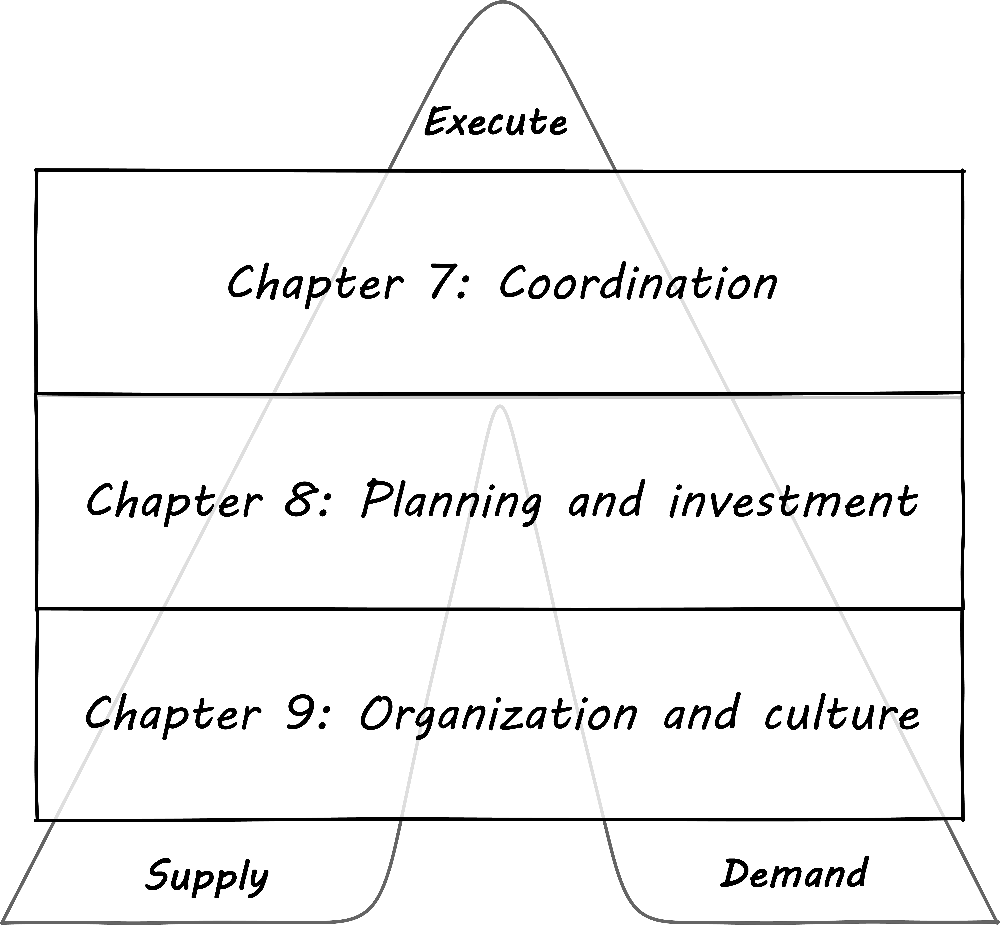
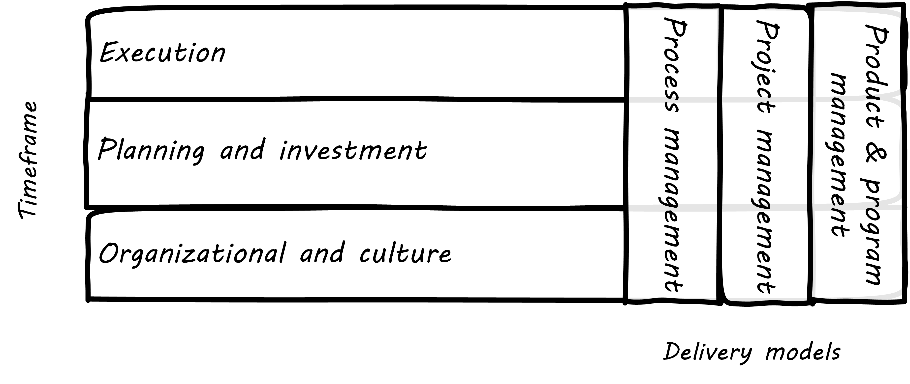

=== Special section: Scaling the organization and its work

==== Time frames

In general, as an organization scales, there is increasing variation in both size and type of work being considered and executed. This leads to increasing complexity. Let's consider two dimensions: time frames and variability of the work. First, the chapter structure of Part III can be visualized thus:

.Different time frames

In thinking about how organizations develop as they scale, it is helpful to consider various time frames. Think of these levels in terms of how difficult and long it takes to change them:

* Culture is the longest and most difficult to change.
* Organizational changes don't take as long as changing culture, but still require considerable effort and thought if they are to succeed. One does not change organizational structures lightly or (hopefully) frequently.
* Investment decisions are required to charter new products, even in those companies that may be moving away from a traditional project cycle. Investments are usually understood in terms of budget planning, which traditionally has driven the project funding cycle. They represent some statement of intent for a larger scope of work to be performed and/or sustained, regardless of the delivery model
* Ongoing execution is the actual day to day work, however conceived. It can include defined process activities, project deliverables, the flow of new product functionality, or ongoing improvement and governance.

==== The delivery models
In Chapter 4 we introduced the "3 Ps": xref:process-project-product[process, product, and project management]. It is important that you review them. Sometimes, the concept of "program" is also used. We will call these delivery models: they are organizing paradigms for getting work done. They may depend on each other, but they each have clear industry identity and bodies of knowledge associated with them:

* Product management has the Product Development and Marketing association and authors like Steve Blank and Marty Cagan.
* Program management has the Axelos Managing Successful Programmes guidance
* Project management has the Project Management Body of Knowledge and the PRINCE2 guidance from Axelos.
* Process management has the BPMN and BPEL standards and authors like Geary Rummler, Roger Burlton and Paul Harmon.

.Product versus program management
****
Program management is a term seen in government efforts and military contracting to describe major efforts of uncertain duration and (sometimes) uncertain outcome. Product management is also uncertain of duration and outcome, and the industry does not clearly distinguish between the two. Some companies use concepts of both product and program management; others use one or the other. Stanley Portny describes:

_Program: This term can describe two different situations. First, a program can be a set of goals that gives rise to specific projects, but, unlike a project, a program can never be completely accomplished. For example, a health-awareness program can never completely achieve its goal (the public will never be totally aware of all health issues as a result of a health-awareness program), but one or more projects may accomplish specific results related to the program’s goal (such as a workshop on minimizing the risk of heart disease). Second, a program sometimes refers to a group of specified projects that achieve a common goal_ <<Portny2013>>.

Where both terms are used, program management may be more about delivery and execution (shading into project management's domain), while product management is more about vision and outcome.
****

We order the delivery models by their _variability_. What does that mean? Products and programs have the highest variability. Their outcome may differ considerably from the initial vision that drove them. Projects, in theory, should be reasonably plannable -- their schedule and cost are managed in terms of "plan versus actual" and differences, in theory, should be well controlled and understandable. Finally, process management strives to minimize variation and in its most rigorous form uses statistical control to do so. If we matrix the delivery models with the time frames we get:

.Urgency matrixed to delivery

It is tempting to see a correlation between the time frames and delivery models:

* Culture and organization at a product and program level
* Investment at a project level
* Execution at a process level

However, this correlation is too simplistic.

* Product management can and does take place without projects or defined processes. Detailed, repeatable processes are not, in fact, how product discovery takes place - a mistake the digital industry has fallen into over and over again.
* Project management also may take place without processes
* To support a process requires portfolio investment and organizational structure, regardless of the existence of projects

Clearly, we must think carefully about the relationships between these dimensions. That, in a nutshell, is the purpose of part III.
