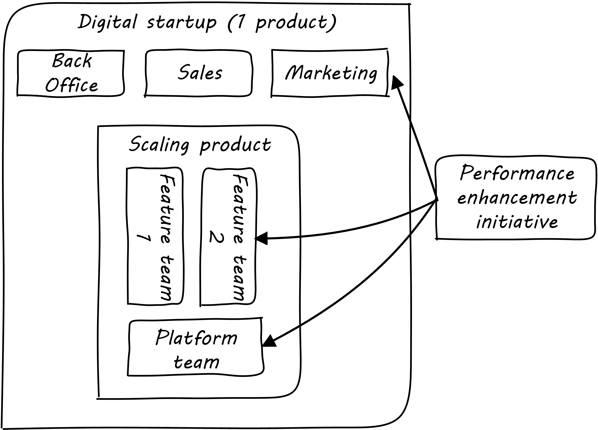

==== Defining coordination

[quote, Online Etymology Dictionary]
coordination (n.)  co-ordination, c. 1600, "orderly combination," from French coordination (14c.) or directly from Late Latin coordinationem (nominative coordinatio), noun of action from past participle stem of Latin coordinare "to set in order, arrange," from com- "together" (see com-) + ordinatio "arrangement," from ordo "row, rank, series, arrangement" (see order (n.)). Meaning "action of setting in order" is from 1640s; that of "harmonious adjustment or action," especially of muscles and bodily movements, is from 1855.

===== Examples
We've xref:demand-supply-execute[defined execution] as the point at which supply and demand are combined, and of course we've been executing since the start of our journey. Now, however, we are executing in a more complex environment; we have started to scale along the xref:AKF-cube[AKF scaling cube] y-axis, and we have either multiple teams working on one product, and/or multiple products. Execution becomes more than just "pull another story off the Kanban board." As multiple teams are formed, dependencies arise, and we need coordination. Let's start with a couple of examples.

====== Scaling one product
[quote, Mike Cohn, Succeeding with Agile]
Good team structure can go a long way toward reducing dependencies but will not eliminate them.

[quote,  Gary Hamel, preface to the Open Organization: Igniting Passion and Performance]
What’s typically underestimated is the complexity and indivisibility of many large-scale coordination tasks.

As a consequence of scaling, we are introducing multiple teams as our product scales up:

.Multiple feature teams, one product
image::images/3_08-multi-feature.png[multi-feature, 350,,float="left"]

We may be using various techniques such as the AKF scaling cube to identify the features. The term "architecture" is likely emerging through these discussions. (We will discuss organizational structure directly in Chapter 9.)

As noted in the discussion of xref:amazon-productization[Amazon's product strategy], some needs for coordination may be mitigated through the design of the product itself. This is why APIs and microseervices are popular architecture styles. If the features and components have well defined protocols for their interaction and clear contracts for matters like performance, development on each team can move forward with some autonomy.

.Coordinated initiative across timeframes

But at scale, complexity is inevitable. What happens when a given business objective requires coordinated effort across multiple teams? For example, an online e-commerce site might find itself overwhelmed by business success. Upgrading the site to accommodate the new demand might require distinct development work to be performed by multiple teams.

As the quote from Gary Hamel above indicates, a central point of coordination and accountability is advisable, otherwise the objective is at risk. (It becomes "someone else's problem.") We will return to the investment and organizational aspects of multi-team and multi-product scaling in Chapters 8 and 9. For now, we will focus on dependencies and operational coordination.

===== A deeper look at dependencies
[quote, Malone & Crowston]
...coordination can be seen as the process of managing dependencies among activities.

What is a "dependency"? We need to think carefully about this. According to the well-accepted definition above (from <<Malone1994>>), without dependencies, we do not need coordination. Diane Strode and her associates (<<Strode2012>>) have described a comprehensive framework for thinking about dependencies and coordination, including a dependency taxonomy, an inventory of coordination strategies, and an examination of coordination effectiveness criteria.

To understand dependencies, Strode et al. propose the following framework <<Strode2012a>>:

.Dependency taxonomy footnote:[adapted from <<Strode2012a>>]
[cols="3*", options="header"]
|====
|Type|Dependency|Description
.4+|*Knowledge.* A knowledge dependency occurs when a form of information is required in order for progress.
|Requirement|Domain knowledge or a requirement is not known and must be located or identified.
|Expertise|Technical or task information is known only by a particular person or group.
|Task allocation|Who is doing what, and when, is not known.
|Historical|Knowledge about past decisions is needed.
.2+|*Task.* A task dependency occurs when a task must be completed before another task can proceed.
|Activity|An activity cannot proceed until another activity is complete.
|Business process|An existing business process causes activities to be carried out in a certain order.
.2+|*Resource.* A resource dependency occurs when an object is required for progress.
|Entity|A resource (person, place or thing) is not available.
|Technical|A technical aspect of development affects progress, such as when one software component must interact with another software component.
|====

We can see examples of these dependencies throughout digital products. In the next section, we will talk about coordination techniques to manage across dependencies.

===== Organizational tools and techniques

[quote, Mark Kennaley, SDLC 3.0]
Where leveraging yellow stickies or index cards makes sense in conjunction with practices like big visible charts and co-location, such formats become ridiculous for a large constituency of challenging projects . . . When faced with these challenges, rather than proclaim that Agile won't work or doesn't scale, the preferable approach is to understand and acknowledge the nature of collaboration, the nature of distributed workflow, and the complexity of modern product development.

Our previous discussion of xref:work-management[work management]was a simple, idealized flow of uniform demand (new product functionality, issues, etc). Tasks in general did not have dependencies, or dependencies were handled through ad-hoc coordination within the team. We also in general assumed that resources (people) were available to perform the tasks; resource contention, while it certainly may have come up, was again handled through ad-hoc means. However, as we scale, simple xref:kanban[Kanban] and visual xref:andon[Andon] is no longer sufficient, given the nature of the coordination we now require. We need a more diverse and comprehensive set of techniques.

As we scale up, we see that dependencies and resource management have become defining concerns. However, we retain our xref:lean-product-dev[Lean product development] concerns for fast feedback and adaptability, as well as a critical approach to the idea that complex initiatives can be precisely defined and simply executed through xref:open-loop[open loop] approaches. In this section, we will discuss some of the organizational responses (techniques and tools) that have emerged as proven responses to these emergent issues.

IMPORTANT: The discussion of particular techniques is always hazardous. People will tend to latch on to a promising approach without full understanding. As noted by Craig Larman (<<Larman2009>>, p.44), the risk is one of xref:cargo-cult[cargo cult] process adoption. In Chapter 9 we will discuss the Mike Rother book xref:Toyota-Kata[Toyota Kata]. Toyota does not implement any procedural change without fully understanding the "target operating condition" -- the nature of the work and the desired changes to it.

anchor:cargo-cult[]

.Sidebar: Cargo cult thinking
****
Processes and practices are always at risk of being used without full understanding. This is sometimes called https://en.wikipedia.org/wiki/Cargo_cult[cargo cult] thinking. What is a cargo cult?

During World War II, South Pacific native peoples had been exposed abruptly to modern technological society with the Japanese and US occupations of their islands. Occupying forces would often provide food, tobacco, and luxuries to the natives to ease relations. After the war, various tribes were observed creating simulated airports and airplanes, and engaging in various rituals that superficially looked like air traffic signaling and other operations associated with a military air base.

On further investigation, it became clear that the natives were seeking more “cargo” and had developed a magical understanding of how goods would be delivered. By imitating the form of what they had seen, they hoped to recreate it.

In 1974, the noted physicist Richard Feynman gave a speech at Caltech in which he coined the immortal phrase “cargo cult science” <<Feynman1974>>. His intent was to caution against activities which appear to follow the external form of science, but lack the essential understanding at its core. Similar analogies are seen in business and IT management, as organizations adopt tools and techniques because they have seen others do so, without having fundamental clarity about the problems they are trying to solve and how a given technique might specifically help.

As with many stories of this kind, there are questions around the accuracy of the original anthropological accounts and Western interpretations and mythmaking around what was seen. However there is no question that “cargo cult thinking” is a useful cautionary metaphor.
****

Strode et al provide a useful framework for understanding coordination mechanisms, excerpted and summarized into the following table:

.Coordination taxonomy footnote:[adapted from <<Strode2012>>]
[cols="3*", options="header"]
|====
|Strategy|Component|Definition
.3+|*Structure*
|Proximity|Physical closeness of individual team members.
|Availability|Team members are continually present and able to respond to requests for assistance or information
|Substitutability|Team members are able to perform the work of another to maintain time schedules

.2+|*Synchronization*
|Synchronization activity|Activities performed by all team members simultaneously that promote a common understanding of the task, process, and or expertise of other team members
|Synchronization artifact|An artifact generated during synchronization activities.

.3+|*Boundary spanning*
|Boundary spanning activity|Activities (team or individual) performed to elicit assistance or information from some unit or organization external to the project
|Boundary spanning artifact|An artifact produced to enable coordination beyond the
team and project boundaries.
|Coordinator role|A role taken by a project team member specifically to support interaction with people who are not part of the project team but who provide resources or information to the project.
|====

NOTE: We introduced the idea of _artifact_ in Chapter 5. For our purposes here, an artifact is a xref:representation[representation] of some idea, activity, status, task, request, or system. Artifacts can represent or describe other artifacts. Artifacts are frequently used as the basis of communication.

The following sections expand the three strategies (structure, synchronization, boundary spanning) with examples.

====== Structure
Don Reinertsen (<<Reinertsen2009>> p. 230) proposes "The Principle of Colocation" which asserts that "Colocation improves almost all aspects of communication." In order to scale this beyond one team, one logically needs what Mike Cohn (<<Cohn2010>>, p. 346) calls "The Big Room."

In terms of communications, this has significant organizational advantages. Communications are as simple as walking over to another person's desk, or just shouting out over the room. It is also easy to synchronize the entire room, through calling for everyone's attention. However, there are limits to scaling the "Big Room" approach:

* Contention for key individual's attention
* "All hands" calls for attention that actually interest only a subset of the room
* Increasing ambient noise in the room
* Distracting individuals from intellectually demanding work requiring concentration, driving xref:multi-tasking[multi-tasking and context-switching], and ultimately interfering with their personal sense of flow - a destructive outcome. (See <<Csikszentmihalyi1990>> for more on flow as a valuable psychological state.)

The tension between team coordination and individual focus will likely continue. It is an ongoing topic in facilities design.

anchor:synchronization[]

====== Synchronization

If the team cannot work all the time in one room, then perhaps they can at least be gathered periodically. There is a broad spectrum of synchronization approaches:

* Ad-hoc xref:ChatOps[chats] (in person or virtual)
* Daily standups (e.g. from xref:Scrum[Scrum])
* Weekly status meetings
* Coordination meetings (e.g. Scrum of Scrums, see below)
* xref:release-mgmt[Release] kickoffs
* Quarterly "all-hands" meetings
* Cross-organizational advisory and review boards
* Open Space inspired "unmeetings" and "unconferences"

All of them are essentially similar in approach and assumption: build a shared understanding of the work, objectives, or mission among smaller or larger sections of the organization, through limited-time face to face interaction, often on a defined time interval.

*Cadenced approaches.* When a synchronization activity occurs on a timed interval, this can be called a xref:cadence[cadence]. Sometimes, cadences are layered; for example, a daily standup, a weekly review, and a monthly Scrum of Scrums. Reinertsen calls this harmonic cadencing (<<Reinertsen2009>> pp. 190-191). Harmonic cadencing has been used in financial management for a long time (monthly, quarterly, and annual financial reporting).

anchor:boundary-spanning[]

====== Boundary spanning
[quote, Atul Gawande, The Checklist Manifesto]
The philosophy is that you push the power of decision making out to the periphery and away from the center. You give people the room to adopt, based on their experiences and expertise. All you ask is that they talk to one another and take responsibility. That is what works.

Examples of boundary-spanning liaison and coordination structures include:

* Shared team members
* Integration teams
* Communities of practice
* Scrum of scrums
* Submittal schedules
* API standards

*Shared team members* are suggested when two teams have a persistent interface requiring focus and ownership. When a product has multiple interfaces that emerge as a problem requiring focus, an *integration team* may be called for. *Communities of practice* will be introduced in Chapter 9 when we discuss the xref:spotify-model[Spotify model]. Considered here, they may also play a coordination role as well as a practice development/maturity role.

Finally, the idea of a *Scrum of Scrums* is essentially a representative or delegated model, in which each individual Scrum team sends one individual to a periodic coordination meeting where matters of cross-team concern can be discussed and decisions taken. (<<Cohn2010>>, Chapter 17)

<<Cohn2010>> (p342) cautions: "A scrum of scrums meeting will feel nothing like a daily scrum despite the similarities in names. The daily scrum is a synchronization meeting: individual team members come together to communicate about their work and synchronize their efforts.The scrum of scrums, on the other hand, is a problem-solving meeting and will not have the same quick, get-in-get-out tone of a daily scrum."

anchor:submittal-schedule[]
Another technique mentioned in The Checklist Manifesto <<Gawande2010>> is the *submittal schedule*. Some work, while detailed, can be planned to a high degree of detail (i.e. the "checklists" of the title). However, emergent complexity requires different approach - no checklist can anticipate all eventualities. To handle all the emergent complexity, the coordination focus must shift to structuring the right communications. In examining modern construction industry techniques, Gawande noted the concept of the "submittal schedule," which "didn't specify construction tasks; it specified _communication_ tasks" (p. 65, emphasis supplied). With the submittal schedule, the project manager tracks that the right people are talking to each other to resolve problems - a key change in focus from activity-centric approaches.

We have previously discussed APIs in terms of xref:amazon-productization[Amazon's product strategy]. They are also important as a product scales into multiple components and features; API standards can be seen as a boundary-spanning mechanism.

The above discussion is by no means exhaustive. A wealth of additional techniques relevant for digital professionals is to be found in <<Larman2009>> and <<Cohn2010>>. New techniques are continually emerging from the front lines of the digital industry; the interested student should consider attending industry conferences such as those offered by the Agile Alliance.

In general, the above approaches imply synchronized meetings and face to face interactions. When the boundary-spanning approach is based on artifacts (often a requirement for larger, decentralized enterprises), we move into the realms of process and project management. Approaches based on routing artifacts into xref:queues[queues] often receive criticism for introducing too much latency into the product development process. When artifacts are routed via work  orders and tickets for action by independent teams, prioritization may be arbitray (not based on business value, e.g. xref:cost-of-delay[Cost of Delay]), and sometimes the work must flow through multiple queues in an uncoordinated way, as we warned in Chapter 5. Such approaches can add dangerous latency to high-value processes. We will look in more detail at process management in a future section.

===== Coordination effectiveness

Diane Strode and her colleagues propose that coordination effectiveness can be understood as the following taxonomy:

* Implicit
** Knowing why (shared goal)
** Know what is going on and when
** Know what to do and when
** Know who is doing what
** Know who knows what
* Explicit
** Right place
** Right thing
** Right time

Coordinated execution means that teams have a solid xref:shared-mental-model[common ground] of what they are doing and why, who is doing it, when to do it, and where to go for information. They also have the material outcomes  of the right people being in the right place doing the right thing at the right time. These coordination objectives must be achieved with a minimum of waste, and with a speed supporting an xref:OODA[OODA loop] tighter than the competition's. Tall order!
