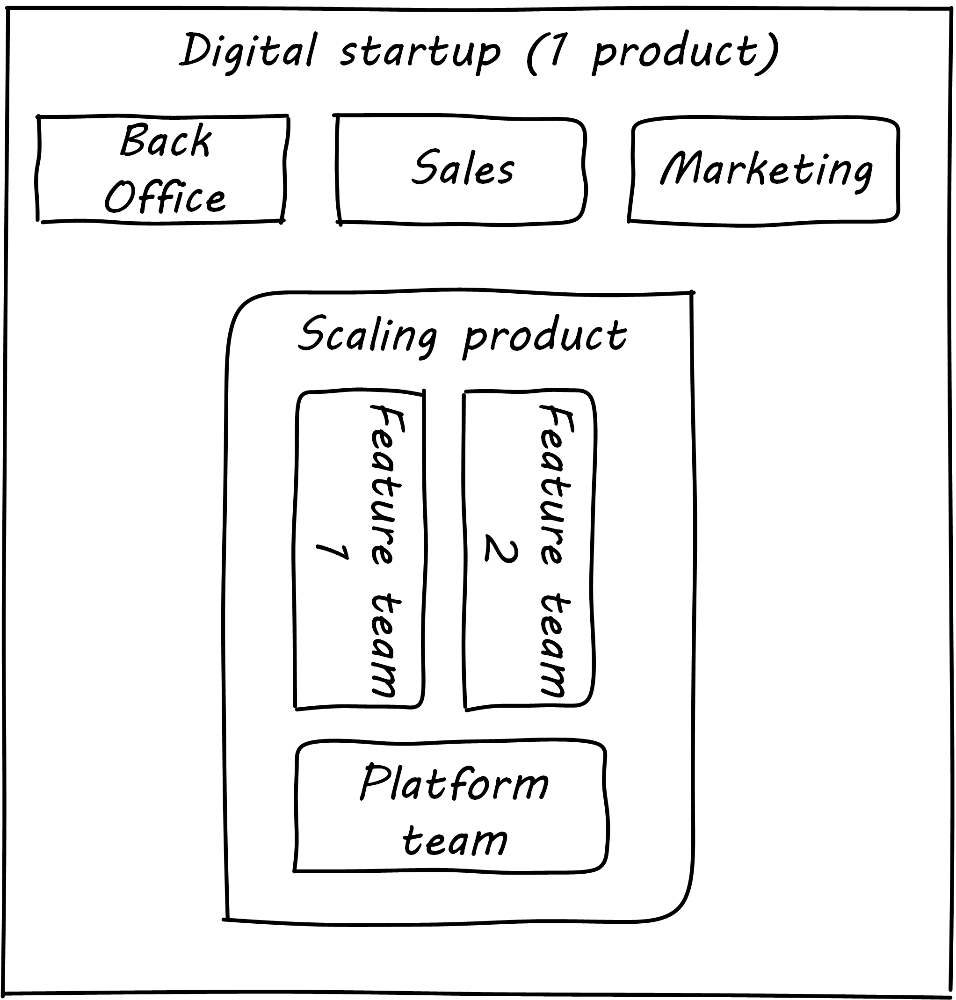
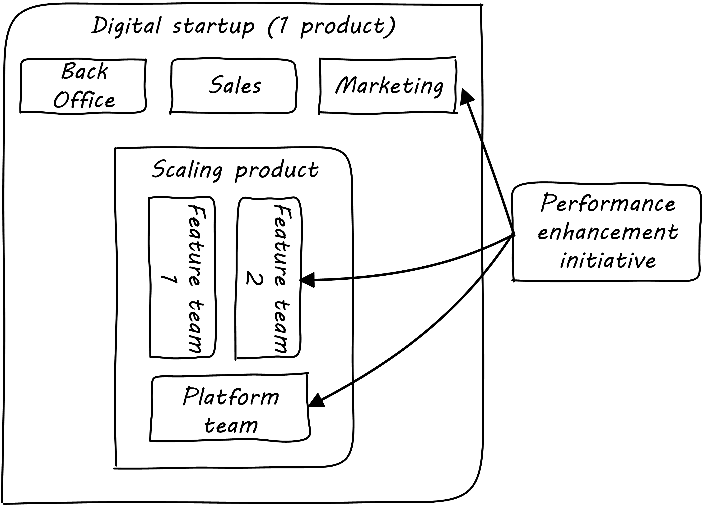
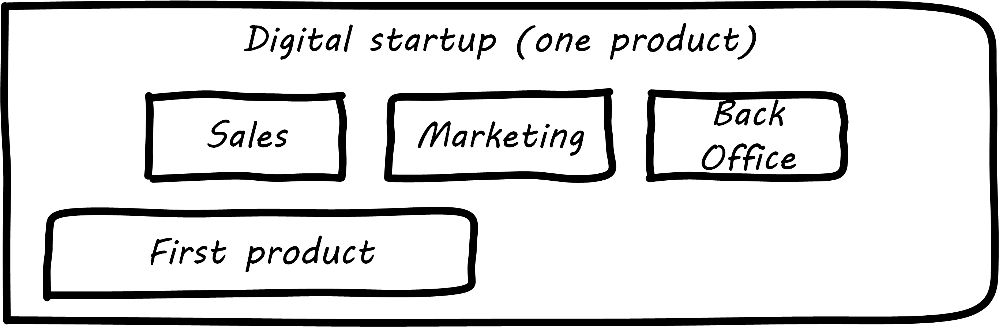
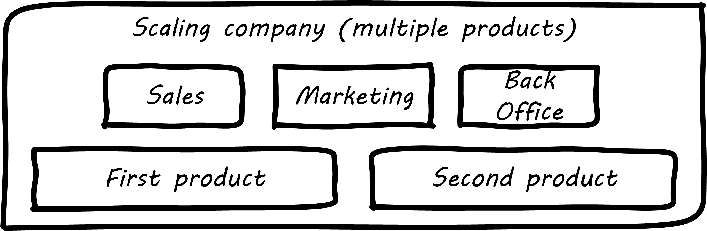

==== Defining execution

[quote, Online Etymology Dictionary]
execution (n.) 14c., "a carrying out, a putting into effect; enforcement; performance (of a law, statute, etc.), the carrying out (of a plan, etc.)," from Anglo-French execucioun (late 13c.), Old French execucion "a carrying out" (of an order, etc.), from Latin executionem (nominative executio) "an accomplishing," noun of action from past participle stem of exequi/exsequi "to follow out" (see execute).

We've xref:demand-supply-execute[defined execution] as the point at which supply and demand are combined, and of course we've been executing since the start of our journey. Now, however, we are executing in a more complex environment; we have started to scale along the xref:AKF-cube[AKF scaling cube] y-axis, and we have either multiple teams working on one product, and/or multiple products. Execution becomes more than just "pull another story off the Kanban board." Let's start with a couple of examples.

===== Example: Scaling one product
[quote, Mike Cohn, Succeeding with Agile]
Good team structure can go a long way toward reducing dependencies but will not eliminate them.

[quote,  Gary Hamel, preface to the Open Organization: Igniting Passion and Performance]
What’s typically underestimated is the complexity and indivisibility of many large-scale coordination tasks.

We will discuss team structure in more detail in Chapter 9. For now, understand that as a consequence of scaling, we are introducing multiple teams as our product scales up:

The decision process by which the features are identified is still informal (we will not formalize this until Chapter 12.) However, the term "architecture" is likely emerging through these discussions.

As noted in the discussion of xref:loose-coupling-project[loose coupling and project management], some needs for coordination may be mitigated through the design of the product itself. If the features and components have well defined protocols for their interaction and clear contracts for matters like performance, development on each team can move forward with some autonomy.

https://github.com/FocusedObjective/FocusedObjective.Resources/blob/master/Canvas%20and%20Forms/Dependencies.pdf

anchor:google-chubby[]

****
*The reality of microservices and loose coupling: the case of Chubby at Google*

The idea that architecture can "emerge" across a set of smaller grained services ("microservices"), without explicit coordination, is attractive. Coordinating designs across products is expensive and ideally products should be able to evolve independently.

Mike Burrows of Google provides a detailed description of the Chubby lock service <<Burrows2006>>, which is a prototypical example of a broadly-available internal service usable by a wide variety of other products.

The purpose of a lock service is to "allow its clients to synchronize their activities and to agree on basic information about their environment." Chubby was built from the start with objectives of reliability, availability to a "moderately large set of clients," and ease of understanding.

Burrows notes that even with such a cohesive and well-designed internal service, they still encounter coordination problems requiring human intervention. Such problems include:

* Use ("abuse") in unintended ways by clients
* Invalid assumptions by clients regarding Chubby's availability

Because of this, the Chubby team (at least at the time writing of the case study) instituted a review process when new clients wished to start using the lock manager.

In terms of this chapter's topic, this means that someone on the product team needed to coordinate the discussions with the Chubby team and ensure that any concerns were resolved. This might conceivably have involved multiple iterations and reviews of designs describing intended use.

In short, even the most sophisticated microservice environments may require some level of  human coordination across the teams. Project management provides a framework for doing this and encourages the development of appropriate skills.
****

But at scale, complexity is inevitable. What happens when a given business objective requires coordinated effort across multiple teams? For example, an online ecommerce site might find itself overwhelmed by business success. Upgrading the site to accommodate the new demand might require distinct development work to be performed by most or all of the teams:

As the quote from Gary Hamel above indicates, a central point of coordination and accountability is advisable, otherwise the objective is at risk. (It becomes "someone else's problem.")

anchor:multi-product-scaling[]

===== Example: Scaling to more than one product
[quote, ISO 38500:2008]
Directors should monitor the progress of approved IT proposals to ensure that they are achieving objectives in required timeframes using allocated resources.

 disclaimer: the "fairness" driver is hypothetical

In keeping with the xref:emergence-model[emergence model] thought experiment, another key state transition is from one product to multiple products.

This is substantially distinct from scaling one product through subdividing it into multiple features.

Consider our hypothetical startup company:

Establishment of a second product team raises issues:

When everyone on the team is supporting one product and dedicated to its success, there is less sense of contention with "others" in the organization. This changes dramatically with the addition of a second product. Concerns for fair allocation and a sense of internal competition naturally arise out of this diversification.

Beecause resources are always limited, it is critical that the demands of each product be managed using objective criteria, requiring formalization.  This was a different problem when you were a tight-knit startup; you were constrained, but everyone knew they were "in it together." Now you need some ground rules to support your increasingly diverse activities. This leads to new concerns:

* Managing scope and preventing unintended creep or drift from the product's original charter
* Managing contention for enterprise resources
* Execution to timeframes (e.g. the critical trade show)
* Coordinating dependencies (e.g. achieving larger, cross-product goals)
* Accountability for results

Fairness is deeply wired into the human brain [cites], and the creation of a new product (and associated team) provokes new dynamics in the growing company.

===== A deeper look at dependencies

===== Organizational tools and techniques

[quote, Mark Kennaley, SDLC 3.0]
Where leveraging yellow stickies or index cards makes sense in conjunction with practices like big visible charts and co-location, such formats become ridiculous for a large constituency of challenging projects . . . When faced with these challenges, rather than proclaim that Agile won't work or doesn't scale, the preferable approach is to understand and acknowledge the nature of collaboration, the nature of distributed workflow, and the complexity of modern product development.

Our previous discussion of xref:work-management[work management]was a simple, idealized flow of uniform demand (new product functionality, issues, etc). Tasks in general did not have dependencies, or dependencies were handled through ad-hoc coordination. We also in general assumed that resources (people) were available to perform the tasks; resource contention, while it certainly may have come up, was again handled through ad-hoc means.

As we progress on our journey and continue to scale up, we see that dependencies and resource management have become defining concerns, and the concept of "project management" is a primary response. However, we retain our concern for fast feedback and adaptability, as well as a critical approach to the idea that complex initiatives can be precisely defined and simply executed through xref:open-loop[open loop] approaches.

Above, we've discussed a few aspects of the coordination problem including the emergent issues when needed capabilities span feature teams, and when new product lines are introduced. In this section, we will discuss some of the organizational responses (techniques and tools) that have emerged as proven responses to these emergent issues.

The general problem is, "how do I facilitate the adaptive generation of information under conditions of time and space shifting." That is to say:

* digital product development (as all R&D) is essentially xref:lean-product-dev[information generation]
* as it scales up, we encounter emergent coordination needs
* that present rapidly increasing combinatoric complexity
* that may be exacerbated by time and space shifting

We have seen earlier versions of this problem in our discussions of work management. However, simple Kanban and visual Andon is no longer sufficient, given the nature of the coordination we now require. We need a more diverse and comprehensive set of techniques.

IMPORTANT: The discussion of particular techniques is always hazardous. People will tend to latch on to a promising approach without fully discussing the "target operating condition." Review the discussion of xref:Toyota-Kata[Toyota Kata]. As noted by <<Larman2009>> (p.44), the risk is one of xref:cargo-cult[cargo cult] process adoption.

The primary objective remains one of "coordination" (as suggested by the overall name of this section, xref:Part-III-coordination[Coordination].)

Here are a few techniques suggested by various Agile authors (primarily <<Cohn2010>>)

====== Co-location

Don Reinertsen (<<Reinertsen2009>>, p. 230), proposes "The Principle of Colocation" which asserts that "Colocation improves almost all aspects of communication." In order to scale this, one logically needs what Mike Cohn (<<Cohn2010>>, p. 346) calls "The Big Room."

In terms of communications, this has significant organizational advantages. Communications are as simple as walking over to another person's desk, or just shouting out over the room. It is also easy to synchronize the entire room, through calling for everyone's attention.

However, there are limits to scaling the "Big Room" approach:

* Contention for key individual's attention
* "All hands" calls for attention that actually interest only a subset of the room
* Increasing ambient noise in the room
* Distracting individuals from intellectually demanding work requiring concentration, and ultimately interfering with their personal
 sense of flow - a destructive outcome. (See <<Csikszentmihalyi1990>> for more on flow as a valuable psychological state.)

The tension between team coordination and individual focus will likely continue. It is an ongoing topic in facilities design.

 [recent popular press about problems of open space working, and responsive facilities with various workspace types available on reservation]

====== Synchronization points
If the team cannot work all the time in one room, then perhaps they can at least be gathered periodically. There is a broad spectrum of synchronization approaches:

* Daily standups
* Weekly status meetings
* Coordination meetings (e.g. Scrum of Scrums, see below)
* Release kickoffs
* Quarterly "all-hands" meetings
* Cross-organizational advisory and review boards
* Open Space inspired "unmeetings" and "unconferences"

All of them are essentially similar in approach and assumption: build a shared understanding of the work, objectives, or mission among smaller or larger sections of the organization, through limited-time face to face interaction, often on a defined time interval.

 Meetings bloody meetings

 Sidebar: Practical collaboration at scale (Chapter 7??)
 Unmeetings/unconferences/Open space

 reconsider relationship w/next section - isn't this a specific instance of a coordination structure

anchor:coord-struct[]

====== Liaison and coordination structures
[quote, Atul Gawande, The Checklist Manifesto]
The philosophy is that you push the power of decision making out to the periphery and away from the center. You give people the room to adopt, based on their experiences and expertise. All you ask is that they talk to one another and take responsibility. That is what works.

A variety of liaison and coordination approaches are suggested by Mike Cohn (<<Cohn2010>>, Chapter 17, "Scaling Scrum") including:

* Shared team members
* Integration teams
* Communities of practice
* Scrum of scrums

 1 execution in context - feedback loops between levels - differing cadences (Anderson cadences)

 Refactor this. Include submittal schedules in list. Find out Cohn's original sources. Other techniques?

*Shared team members* are suggested when two teams have a persistent interface requiring focus and ownership. When a product has multiple interfaces that emerge as a problem requiring focus, an *integration team* may be called for. *Communities of practice* were introduced in Chapter 7 as we discussed the xref:spotify-model[Spotify model]. Considered here, they may also play a coordination role as well as a practice development/maturity role.

Finally, the idea of a "scrum of scrums" is essentially a representative or delegated model, in which each individual Scrum team sends one individual to a periodic coordination meeting where matters of cross-team concern can be discussed and decisions taken.

<<Cohn2010>> (p342) cautions: "A scrum of scrums meeting will feel nothing like a daily scrum despite the similarities in names. The daily scrum is a synchronization meeting: individual team members come together to communicate about their work and synchronize their efforts.The scrum of scrums, on the other hand, is a problem-solving meeting and will not have the same quick, get-in-get-out tone of a daily scrum."

anchor:submittal-schedule[]
Another perspective on this is found in The Checklist Manifesto <<Gawande2010>>. Some work, while detailed, can be planned to a high degree of detail (i.e. the "checklists" of the title). However, emergent complexity requires different approach - no checklist can anticipate all eventualities. To handle all the emergent complexity, the coordination focus must shift to structuring the right communications. In examining modern construction industry techniques, Gawande noted the concept of the "submittal schedule," which "didn't specify construction tasks; it specified _communication_ tasks" (p. 65, emphasis supplied).

====== Planning techniques
Techniques of co-location, synchronization, and liaison all support to varying degrees a concept of planning. Fundamentally, we plan so that the work progresses effectively and efficiently. We seek to optimize the following contradictory goals:

* Delivering results quickly
* Minimizing the waste of un-utilized resources

To meet these goals, we

* estimate so that we have some understanding of our resource needs
* plan so that we understand dependencies (e.g. when one team *must* complete a task before another team can start theirs)

The above discussion is by no means exhaustive. A wealth of additional techniques is to be found in <<Larman2009>> and <<Cohn2010>>. New techniques are continually emerging from the front lines of the digital industry; the interested student should consider attending industry conferences such as those offered by the Agile Alliance.

*** Trad PM
*** clinical terminology (Reinertsen)
*** protecting team (pigs & chickens)
*** release train??
*** Flow & variability
*** chatops / common ground
*** RACI
*** risk

shared resources and services
global CoD - process eval

** internal market econ
** the cost accounting problem

At an execution level, project managers retain important roles and (sometimes re-labled Scrum masters or release managers) are employed in both traditional and new digital companies as overall orchestrators of complex initiatives.
