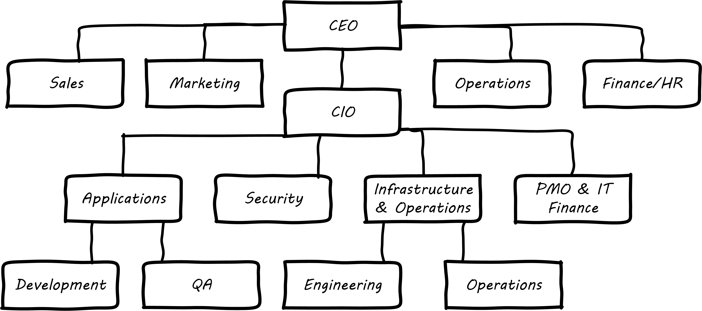

anchor:organization[]

==== Why organization matters

[quote, Matt Blumberg, Scaling Up]
In the early stages, you have to hire generalists who are both willing and able to take on dozens of tasks at once. Your developers will have to speak with potential customers; your accountants will have to give advice on product direction; and the born salesman on your team will need to put the phone down a few hours a day and set up a new employee’s computer. This is the exciting, four-people-and-an-idea stage popularly associated with startups— but it doesn’t last very long. +
 +
For a lot of your employees, growing out of this phase will be a welcome development: programmers don’t want to be in accounting meetings, and salespeople don’t want to sit in a dark, quiet room with the engineers. People have talents and skills they want to develop, and a healthy degree of specialization allows them to do that.

[quote, Abbot and Fisher, The Art of Scalability]
Some of the most important factors that organizational structure can affect are communication, efficiency, standards, quality, and ownership.

So, you are getting bigger now, and are no longer one single team. As the quote from Matt Blumberg's Scaling Up indicates, you are becoming more specialized.

How are you going to organize? More importantly, how are you going to think about organizing? This is a hard question. It’s important to get organization right, and the question never goes away. There is a lot of theory, history, and advice available on to how to organize your company. Even as a cohesive, single team you had specialized support services. You needed legal and accounting advice to get the startup going. When you started hiring people, you needed HR and payroll. You also are buying things and paying bills, so you need bookkeeping, and you’ve got sales people and marketing people and you need to support your customers and collect money they have promised to pay. At some point you need an internal person whose daily job is money (they’ll become the CFO someday).

As you grow and split into teams, the overall sense of mission you felt as a single team is at risk of fading. How can you keep your "eyes on the prize" when there are mulitple teams, who all see the world slightly differently? It's critical, as you start to explore various coordination mechanisms, to remember that the team remains the highest-value logical unit, and must be protected. As we discussed in xref:the-product-team[Chapter 4], product value is created by co-located, cross-functional, highly collaborative teams.

In keeping with our xref:0.01-emergence[evolutionary approach], let’s assume you’ve been fairly ad-hoc in your organizational structure up to now, doing your best to avoid specialization. Perhaps you’ve even been working as a collective. Nevertheless, you’ve needed a variety of skills to get this far in your journey: you are certainly not all Java programmers!

There are two major themes current in discussions of digital and IT organization:

* The product organization versus the "IT" organization
* Organizing teams by features versus components

===== Product organization versus "IT" organization

There are two major models that digital professionals may encounter in their career:

* The traditional centralized back-office "IT" organization
* Digital technology as a component of market-facing product management

The traditional IT organization started decades ago, with "back-office" goals like replacing file clerks and filing cabinets with faster and more accurate computers. (We will go into further detail in anchor:paper-to-digital[Chapter 11].) At that time, computers were not particularly flexible or reliable, business did not move as fast, and there was a lot of value to be gained in relatively simple efforts like converting massive paper filing systems into digital systems. As these kinds of efforts grew and became critical operational dependencies for companies, the role of Chief Information Officer was created, to head up increasingly large organizations of application developers, infrastructure engineers, and operations staff.

The business objectives for such organizations centered on stability and efficiency. Replacing 300 file clerks with a system that didn't work, or wound up costing *more* was obviously not a good business outcome! On the other hand, it was generally accepted that designing and implementing these systems would take some time. They were complex and many times the problem had never been solved before. New systems might take years -- including delays -- to come online, and while executives might be unhappy, oftentimes the competition wasn't doing much better. CIOs were conditioned to be risk-averse; if systems were running, changing them was scrutinized with great care and rarely rushed.

The culture and practices of the modern IT organization became more established, and while it retained a reputation for being slow, expensive, and inflexible, no-one seemed to have any better ideas. It didn't hurt that the end customer wasn't interested in computers.

Then along came Apple, Microsoft, and the dot-com boom. Suddenly everyone had personal computers at home, and was on the Internet. Buying things! Computers continued to become more reliable and powerful as well. Companies realized that their back-office IT organizations were not able to move fast enough to keep up with the new e-commerce challenge, and in many cases organized their Internet team *outside* of the CIO's control (which sometimes made the traditional IT organization very unhappy). Silicon valley startups such as Google and Facebook in general did not even have a separate "CIO" organization, because (and this is a critical point) *the digital systems _were_ the product.* Going to market against tough competitors (Alta Vista and Yahoo against Google, Friendster and MySpace against Facebook) wasn't a question of maximizing efficiency. It was about product innovation and effectiveness, and taking appropriate risks in the quest for these rapidly growing new markets.

Let's go back to our example of the traditional CIO organization. A typical structure under the CIO might look like this:

.Classic IT organization

(We had some related discussion in xref:i+o-matrix[Chapter 4].) Such a structure was perceived to be "efficient" because all the server engineers would be in one organization, while all the Java developers would be in another, and their utilization could be managed for efficiency. It was also believed that organizing into "centers of excellence" (sometimes called _organizing by function_) would make the practices of each center more and more effective, and therefore more valuable to the organization as a whole.

However, the new digital organizations perceived that there was too much friction between the different functions on the organization chart. Skepticism also started to emerge that "centers of excellence" were living up to their promise. Instead, what was too often seen was the emergence of an "us versus them" mentality, as developers argued with server and network engineers.

One of the first companies to try a completely different approach was Intuit. As Intuit started selling its products increasingly as services, it re-organized to divide infrastructure individual contributors, e.g. storage engineers and database administrators, to become part of the product teams with which they worked <<Abbot2015>>, p 103.

.New IT organization

The consequences of this transition in organizational style are still being felt and debated. Sriram Narayan, in his book _Agile Organization Design_ (<<Narayam2015>>), points out that "IT work is labor-intensive and highly specialized," and therefore managing IT talent is a particular organizational capability it may not make sense to distribute. Furthermore, he observes that IT work is performed on medium to long time scales, and  "IT culture" differs from "business culture." But Abbott and Fisher in _The Art of Scalability_ argue that "...The difference in mindset, organization, metrics, and approach between the IT and product models is vast. Corporate technology governance tends to significantly slow time to market for critical projects...IT mindsets are great for internal technology development, but disastrous for external product development."" <<Abbott2015>> pp 122-124

Attentive readers will ask, "What happened to the PMO? and what about security?" There are various answers to these questions, which we will continue to explore in Part III.

anchor:2.04.02-features-v-components[]
anchor:feature-v-component[]

===== Features versus components
At a lower level, the discussion revolves around segmenting along feature lines, versus segmenting along component lines. What do we mean by this?

Features are *what* your product *does*. They are what the customers perceive as valuable. “Scope as viewed by the customer” as <<Kennaley2010>> says (p. 169). They may be "xref:flower-and-cog[flowers]" -- defined by the value they provide externally, and encouraged to evolve with some freedom.

Components are *how* your product is *built*, such as database vs. Web components. In other words, they are a form of infrastructure (but infrastructure you may need to build yourself, rather than just spin up in the Cloud). They are more likely to be "xref:flower-and-cog[cogs]" -  more constrained and engineered to specifications.

.Features versus components
image::images/3_07-feature-v-component.png[feature component matrix,400,,float="right"]

Feature teams are dedicated to a clearly defined functional scope, while component teams are defined by their technology platform. Component teams may become shared services, which need to be carefully understood and managed (more on this to come). It may be easy to say that features are more important than components, but this can easily be carried too far. Do you want each feature team choosing its own database? This might not be the best idea. Allowing feature teams to define their own technical direction can result in brittle, fragmented architectures, technical debt, and rework.

Software product management needs to be a careful balance between these two perspectives. The Scaled Agile Framework suggests that components are relatively

* more technically focused
* more generally re-usable

than features. SAFE also recommends a ratio of roughly 20-25% component teams to 75%-80% feature teams <<SAFE2016>>.

.Conway's law
****
So who was Conway and why is his law so important as we move to a team of teams? Melvin Conway is a computer programmer who worked on early compilers and programming languages. In 1967 he proposed the thesis that:

_Any organization that designs a system (defined broadly) will produce a design whose structure is a copy of the organization's communication structure_ <<Conway1968>>.

What does this mean? If we establish two teams, each team will build a piece of functionality (a feature or component). They will think in terms of "our stuff" and "their stuff" and the interactions (or _interface_) between the two. Perhaps this seems obvious, but as you scale up it's critical to keep in mind. In particular, as you segment your organization along the xref:AKF-cube[AKF z-axis], you will need to keep in mind the difference between features and components. You are on a path to have dozens or hundreds of such teams. The decisions you make today on how to divide functionality and work will determine your operating model far into the future.
****

===== Defining the organization

There are many permutations and variations on traditional functional organizing versus product-oriented organizing, and features versus components. How does one begin to decide these questions?

====== Splitting teams
inevitable

* failure domains (abbott p 49)

architects need to be able to reason about and lead conversation about such matters

retain impact mapping - impact mapping re-visited for internal purposes - build on previous impact map?

====== Hard v soft teams
Long-tenured and highly experi
enced teams require less overhead from management and less communication inter
nally to perform their responsibilities. (abbott p 45)

====== Team size

====== Norms and standards

importance of -
increase effectiveness and efficiency

xref to architecture

===== Team relationship to artifacts
 (move to coordination chapter??)
everyone can work on everything - changing Rs into Is.

we didn't talk about pigs / chickens previously

....
This is all off base ... need to start with product teams... also, R&D vs back office IT...

Perhaps the first question you need to ask is to what extent you wish to centralize your digital organization. This is a significant one. The current trend is towards decentralizing IT, but there are good reasons to maintain IT as a separate organizational entity. (The last may be debatable in the long run, in the digitally transforming world.)

****
*Centralized versus decentralized IT*

What do we mean by "centralized" versus "decentralized," anyways? There are many models for structuring IT, but at one end of the spectrum is when everyone doing anything significant with configuring computers, developing software, or supporting IT networking reports up through a powerful Chief Information Officer, who may report to the CEO, COO, CFO, or other senior executive.

By contrast, in a "decentralized" model, computing is procured and managed by diverse managers in other functional units. So, the Human Resource VP might have an IT manager, the Marketing director would have one, and so on. The IT managers might know each other but they report to different managers and may have a very limited ability to share resources and learnings.
****
....
