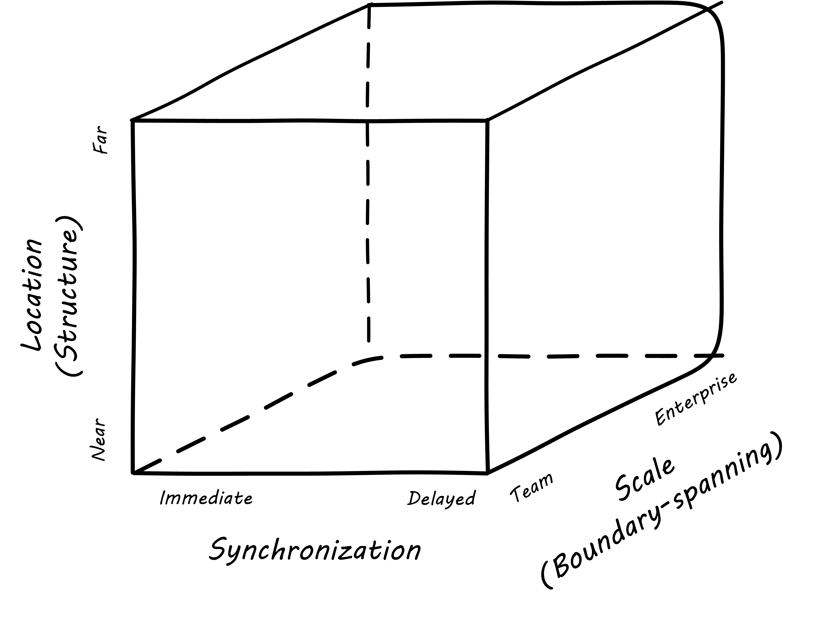
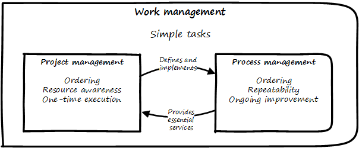

==== Coordination, execution, and the delivery models

.Coordination cube inspired by Strode footnote:[derived from <<Strode2012>>.]

If we take the strategies proposed by Strode et al and think of them as three orthogonal dimensions, we can derive another useful 3-dimensional cube.

* At the origin point we have practices like face to face meetings at at various scales.
* Geographically distant, immediate coordination is achieved with messaging and other forms of telecommunications.
* Co-located but ansynchronous coordination is achieved through shared artifacts like Kanban boards.
* Distant and asynchronous coordination again requires some kind of telecommunications

The Z-axis is particularly challenging, as it represents scaling from a single to multiple and increasingly organizationally distant teams. Where a single team may be able to maintain a good sense of xref:shared-mental-model[common ground] even when geographically distant, or working asynchronously, adding the third dimension of organizational boundaries is where things get hard. Larger-scale coordination strategies include:

* Business processes
* Release trains (a form of process)
* Projects and project managers
* Specified decision rights
* Shared services and expertise (Chapter 8)
* Organization structures (Chapter 9)
* Cultural norms (Chapter 9)
* Architecture standards (Chapters 11 and 12)

All of these coping mechanisms risk compromising to some degree the effectiveness of co-located, cross-functional teams. Remember that the high-performing xref:the-product-team[product team] is likely the highest-value resource known to the modern organization. Protecting the value of this resource is *critical* as the organization scales up. The challenge is that models for coordinating and sustaining complex digital services are not well understood. IT organizations have tended to fall back on older supply-chain thinking, with xref:waterfall[waterfall-derived] ideas that work can be sequenced and routed between teams of specialists.

NOTE: Recommend you review the definitions of the "xref:process-project-product[3 P's]": product, project, and process management.

===== Product management and coordination

Where project and process management are explicitly coordination-oriented, product management is broader, and focused on outcomes. As noted xref:process-project-product[previously], it might use either project or process management to achieve its outcomes, or it might not.

Release management was introduced in xref:release-mgmt[Part I], and has remained a key concept we'll return to now. Release management is a common coordination mechanism in product management, even in environments that don't otherwise emphasize processes or projects. At scale, the concept of a "release train" is seen. The Scaled Agile Framework considers it the "primary value delivery construct" <<SAFE2016a>>.

The train is a xref:synchronization[cadenced synchronization] strategy. It "departs the station" on a reliable schedule. As with xref:Scrum[Scrum], date and quality are fixed, while scope is variable. SAFe emphasizes that "being on the train" in general is a full-time responsibility, so the train is also a temporary organizational or programmatic concept. The release train "engineer" or similar role is an example of the _coordinator role_ seen in the Strode xref:coord-tools[coordination tools and techniques matrix].

The release train is a useful concept for coordinating large, multi-team efforts, and is applicable in environments that have not fully adopted Agile approaches. As author Joanna Rothman notes, "You can de-scope features from a particular train, but you can never allow a train to be late. That helps the project team focus on delivering value and helps your customer become accustomed to taking the product on a more frequent basis" <<Rothman2011>>.

===== Project management as coordination

NOTE: We'll talk about project management as an investment strategy in the next chapter. In this chapter, we look at it as a coordination strategy. If you are completely unfamiliar with project management, see the xref:project-mgmt[brief introduction in the appendix] and the xref:PMBOK[PMBOK summary].

Project management adds concerns of task ordering and resource management, for efforts typically executed on a one-time basis. Project management groups together a number of helpful coordination tools which is why it is widely used. These tools include:

* Sequencing tasks
* Managing task dependencies
* Managing resource dependencies of tasks
* Managing overall risk of interrelated tasks
* Planning complex activity flows to complete at a given time

However, project management also has a number of issues:

* Projects are by definition temporary, while products may last as long as there is market demand.
* Project management methodology, with its emphasis on predictability, scope management, and change control often conflicts with the product management objective of discovering information (see the discussion of xref:lean-product-dev[Lean Product Development].)

(But not all large management activities involve the creation of new information! Consider the previous example of upgrading the RAM in 80,000 POS terminals in 2000 stores.)

The project paradigm has a benefit in its explicit limitation of time and money, and the sense of urgency this creates. In general, scope, execution, limited resources, deadlines, and dependencies exist throughout digital business. A product manager with no understanding of these issues, or tools to deal with them, will likely fail. Product managers should therefore be familiar with the basic concepts of project management. However, the way in which project management is implemented, the degree of formality, will vary according to need.

A project manager may still be required, to facilitate discussions, record decisions, and keep the team on track to its stated direction and commitments. Regardless of whether the team considers itself "Agile," people are sometimes bad at taking notes or being consistent in their usage of tools such as Kanban boards and standups.

It is also useful to have a third party who is knowledgeable about the product and its development, yet has some emotional distance from its success. This can be a difficult balance to strike, but the existence of the role of Scrum coach is indicative of its importance.

===== Process management as coordination

NOTE: If you are completely unfamiliar with business processes, see the xref:process-modeling[overview in the appendix].

As we saw in the xref:strode-dependency-taxonomy[Strode dependency taxonomy], waiting on a business process is a form of dependency. But business processes are more than just dependency sources and obstacles; _they themselves are a form of coordination_. In Strode's terms, they are a xref:coord-tools[boundary spanning activity]. It is ironic that a coordination tool itself might be seen as a dependency and blockage to work; this shows at least the risk of assuming that all problems can or should be solved by tightly-specified business processes!

Process management is also concerned with ordering, but less so with the resource load (more on this below), and instead is concerned with repeatability and ongoing improvement.

Processes are much more than repeatable activities. Many leading thinkers (such as Michael Porter, quoted at the start of this chapter section) see organizations primarily as sets of interacting processes, supporting fundamental end to end value chains or value streams. We will talk more about this in the next chapter section.

The concept of process is often contrasted with that of function or organization. We have seen in previous chapters how product development and project management must drive results across organizational boundaries. Process management has a similar challenge; its goal is to drive *repeatable* results across organizational boundaries. As we know from our discussion of xref:product-mgmt[Product Management], developing new products is not a particularly repeatable process. The Agile movement in some ways arose in opposition to attempts to apply process concepts of "repeatability" to developing software. These concerns remain. However, this book is not only about digital R&D processes. It is also about a spectrum of operations and effort that spans from the unique to the highly repeatable. There is an interesting middle ground, of processes that are at least semi-repeatable. Examples often found in the large digital organization include:

* Assessing, approving, and completing changes
* End user equipment provisioning
* Resolving incidents and answering user inquiries
* Troubleshooting problems

And many others. We discuss variety of such processes in the chapter section on process frameworks.

Just as the traditional IT project is under pressure, there are similar challenges for the traditional IT process. Continuous deployment techniques are eroding the need for formal change management. Consumerization is challenging traditional internal IT provisioning practices. And self-service help desks are eliminating some traditional support activities. Nevertheless, any rumors of an "end to process" are probably greatly exaggerated. There will likely always be complex combinations of automated, semi-automated, and manual activity in digital organizations. Some of this activity will be repeatable enough that the "process" construct will be applied to it. Measurability remains a concern; the Lean philosophy underpinning much Agile thought emphasizes this.

It is therefore useful to understand more fundamentally what processes are, how they operate, and how they are managed and improved.

NOTE: In Chapter 10, we will discuss IT governance in depth. The concept of "control" is critical to IT governance, and processes often play an important role in terms of control.

===== Projects and processes

Project management and process management interact in 2 primary ways:

* Projects often are used to create and deploy processes. A large system implementation (e.g. of a Enterprise Resource Planning module such as Human Resource Management) will often be responsible for process implementation including training.
* As environments mature, product and/or project teams require process support.

The following diagram illustrates:

.Process and project

As Richardson notes in _Project Management Theory and Practice_, "there are many organizational processes that are needed to optimally support a successful project." <<Richardson2010>> For example, the project may require predictable contractor hiring, or infrastructure provisioning, or security reviews. The same is true for product teams that may not be using a "project" concept to manage their work. To the extent these are managed as repeatable, optimized processes, risk is reduced.
