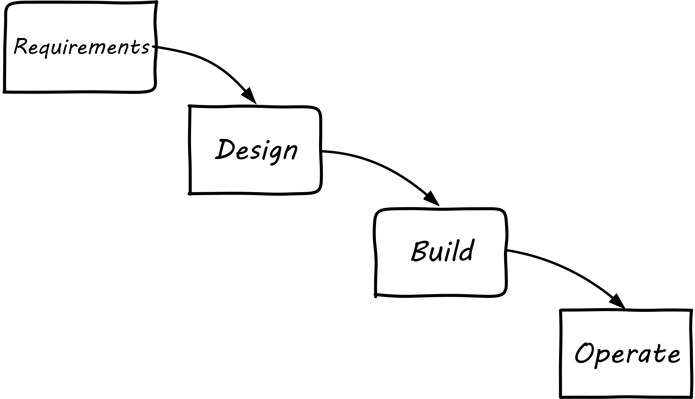
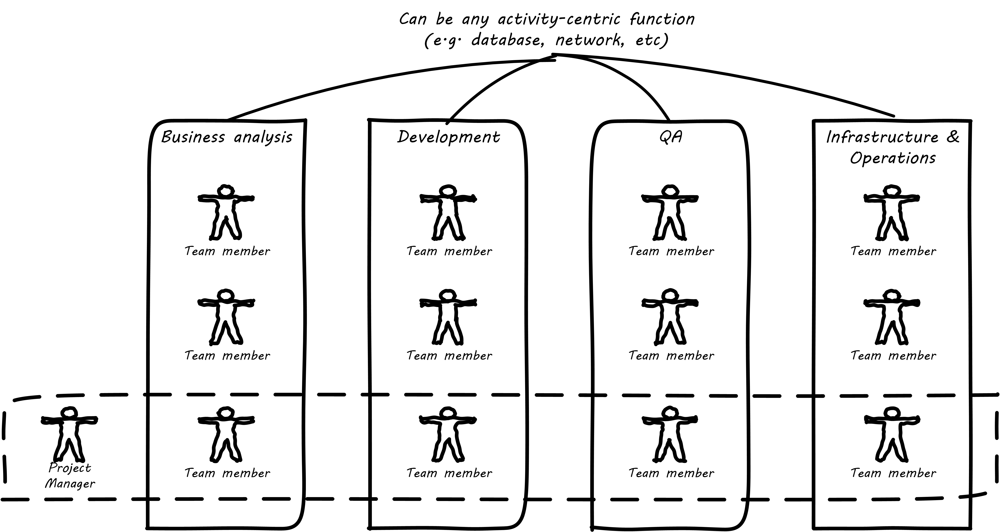
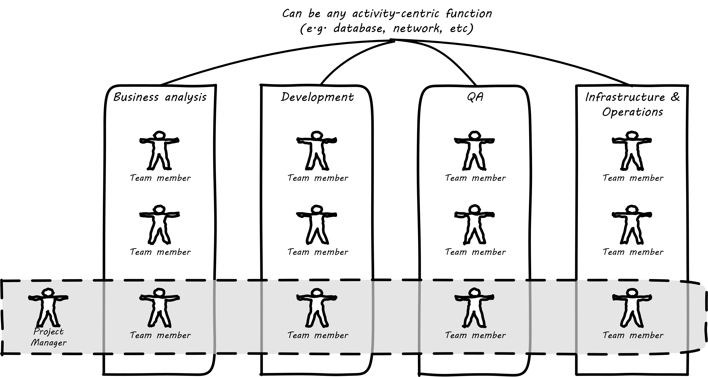
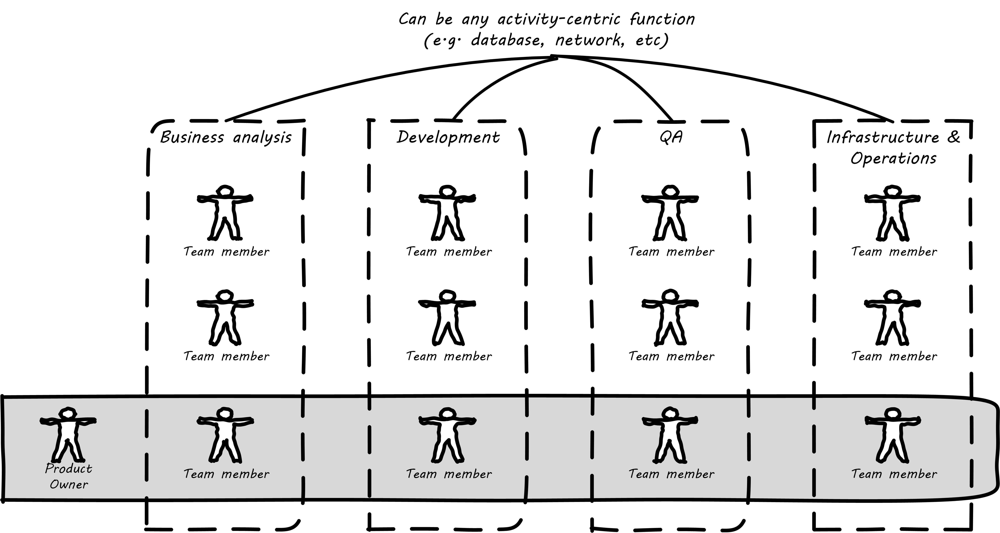
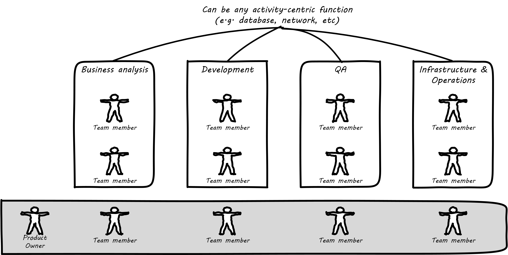

anchor:product-v-function[]

==== Product and function

[quote, Sriram Narayan, Agile IT Organization Design]
Even where they are not part of a value stream, activity-oriented teams tend to standardize their operations over time. Their appetite for offering custom solutions begins to diminish. Complaints begin to surface—“They threw the rule book at us,” “What bureaucracy!”

[quote, Abbot and Fisher, The Art of Scalability]
When teams are aligned by services, are autonomous, and are cross-functionally composed, there is a significant decrease in affective conflict. When team members are aligned by shared goals and no longer need to argue about who is responsible or who should perform certain tasks, the team wins or loses together. Everyone on the team is responsible for ensuring the service provided meets the business goals.

By this time, you probably detect that there is a fundamental tension between functional specialization and end to end value delivery. The tension may go by different names:

* Product versus function
* Value stream versus activity
* Process versus silo

As we saw xref:2.04.01-process-project-product[previously], there are three major concepts used to achieve end to end flow across functional specialties:

* Process
* Project
* Product

NOTE: We will go into detail on project management in chapter 8 and process management in chapter 9. But we need to understand how they influence organizational forms.

===== Waterfall drives functional organization

For example, some manufacturing can be represented as a very simple, sequential process model:

.Simple sequential manufacturing
image::images/3.07-naive-mfg.png[manufacturing sequence,500]

The product is already defined and the need to generate information (i.e. through feedback) is at an absolute minimum. Functional areas can continually increase their efficiency and economies of scale through deep specialization.

NOTE: Even in this simplest model, feedback is important. Much of the evolution of 20th century manufacturing has been in challenging this naive, open-loop model. (Remember our brief discussion of xref:2.00.1-open-loop[open-loop]?)

The original, xref:2.00.1-open-loop[open-loop] waterfall model of IT systems implementation was arguably based on just such a naive concept:

.Waterfall

(Review xref:1.03.02-Agile-history[chapter 3] on waterfall development and Agile history.)

There are two primary disadvantages to this model:

* It discourages closed-loop feedback
* There is transactional friction at each handoff

Go back and review: the waterfall model falls into the "original sin" of IT management, xref:2.04.04-lean-product-dev[confusing production with product development]. As a repeatable production model, it may work, assuming that there is little or no information left to generate regarding the production process (an increasingly questionable assumption in and of itself). But when applied to product development, where the *primary goal* is the experiment-driven generation of information, the model is inappropriate and has led to innumerable failures. This includes software development, and even implementing purchased packages in complex environments.

anchor:org-continuum[]

===== The continuum of organizational forms

NOTE: The following discussion and accompanying set of diagrams is derived from Preston Smith and Don Reinertsen's thought regarding this problem in  _Developing Products in Half the Time_ <<Smith1998>> and _Managing the Design Factory._ <<Reinertsen1997>>. Similar themes are found in the _Guide to the Project Management Body of Knowledge_ (<<PMI2013>>) and Abbott and Fisher's _The Art of Scalability_ <<Abbott2015>>.

There is a spectrum of alternatives in structuring organizations for flow across functional concerns. First, a lightweight "matrix" project structure may be implemented, in which the project manager has limited power to influence the activity-based work, where people sit, etc.

.Lightweight project management across functions

Work flows across the functions, perhaps called "centers of excellence," and there may be contention for resources within each center. Often, simple "first in, first out" xref:queuing[queuing] approaches are used to manage the xref:ticketing[ticketed]
 work, rather than more sophisticated approaches such as xref:cost-of-delay[Cost of Delay]. It is the above model that Reinertsen was thinking of when he said: "The danger in using specialists lies in their low involvement in individual projects and the multitude of tasks competing for their time."

anchor:heavyweight-pm[]

Second, a heavyweight project structure may specify much more, including dedicated time assignment, modes of work, standards, etc. The vertical functional manager may be little more than a resource manager, but does still have reporting authority over the team member and crucially still writes their annual performance evaluation (if the organization still uses those.) This has been the most frequent operating model in the xref:trad-cio-org[traditional CIO organization].

.Heavyweight project management across functions

If even more focus is needed -- the now-minimized influence of the functional areas is still deemed too strong --  the organization may move to completely product-based reporting. With this, the team member reports to the product owner. There may still be communities of interest (Spotify guilds and tribes are good examples) and there still may be standards for technical choices:

.Product team, virtual functions

Finally, in the skunkworks model, all functional influence is deliberately blocked, as distracting or positively injurious to the product vision:

.Skunkworks model

The product team has complete autonomy, and can move at great speed. It is also free to:

* re-invent the wheel, developing new solutions to old and well-understood problems
* bring in new components on a whim (regardless of whether they are truly necessary) adding to sourcing and long-term support complexity,
* ignore safety and security standards, resulting in risk and expensive retrofits.

Early e-commerce sites were often set up as skunkworks to keep the interference of the traditional CIO to a minimum, and this was arguably necessary. However, ultimately, skunkworks is not scalable. Research by the Corporate Executive Board suggests that "Once more than about 15% of projects go through the fast [skunkworks] team, productivity starts to fall away dramatically." It also causes issues with morale, as a two-tier organization starts to emerge with elite and non-elite segments <<Goodwin2015>>.

Because of these issues, Don Reinertsen (<<Reinertsen1997>>) observes that "Companies that experiment with autonomous teams learn their lessons, and conclude that the disadvantages are significant. Then they try to combine the advantages of the functional form with those of the autonomous team."

The Agile movement is an important correction to dominant IT management approaches employing xref:2.00.1-open-loop[open-loop] delivery across centralized functional centers of excellence. However, the ultimate extreme of the skunkworks approach cannot be the basis for organization across the enterprise. We will examine the various adaptations and approaches for balancing the two organizational extremes further in Chapter 9 (Execution Management).
