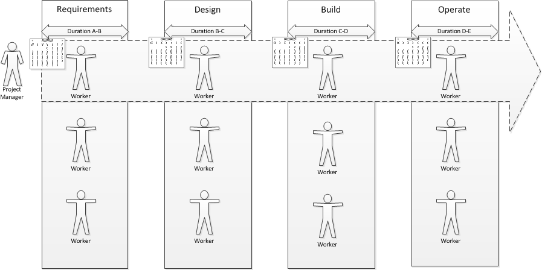

==== Topics in coordination and execution

.Essay: The idea of PMDB and PIs
****
Originally published at http://www.lean4it.com/2014/06/in-search-of-the-pcmdb-and-pcis.html.

In search of the PMDB and PIs

As I was preparing chicken piccata last night, I had one of those flashes.

In the IT industry, why don't we care about process information the same way we care about configuration information?

We've had a 15-year conversation about CMDBs. It's a well known idea that all configuration data should be put in a repository, or short of that, should be seen as part of an federated system. Applications, servers, databases, files, queues, executables, services, racks, switches, etc, etc, etc should all be seen as Configuration Items, or "CIs."

But, if you ask ITSM advocates about processes, they will talk specifically about Incidents, Problems, Changes, Releases, etc as if they all are fundamentally different.

I think we need the concept of a Process Item - just as a specific Server and an Application can both be CIs, so can a specific Incident and a Change both be PIs. They could inhabit the same PMDB, or be federated in a common PMS. [Yes, I recognize the unfortunate acronym :-) Let's figure out better naming later.]

This in fact is how many actual implementations of IT management tools work. But at a framework level, it is NOT how people are educated in IT management - the education and mental model continues to be that Incidents, Changes and Problems are very distinct and at best cross-reference each other.

In the world of Process, we have a series of related terms that indicate a

"potentially recurring series of events with various complexity (parallelism, sequentially related or not, and so on)"

as the Oracle Communications Model states. Under this general heading we have:

* Program
* Project
* Release
* Change
* Service Request
* Incident
* Problem (and other Improvement Opportunity)

But (as I have pointed out elsewhere) the way these are currently implemented is too often as distinct queues of work with no coordination and understanding of aggregate demand. There is no awareness or concern when people who are critical to a Project also wind up handling high criticality Incidents.

I think there is much justification for promoting the ideas of Process Item and a unified PMDB as  industry guidance.

First, it aligns well with the growing interest in Kanban and limiting work in process. All these Process types compete for resources. If all are seen as fundamentally similar then it is possible to understand the aggregate demand.

My coverage as an analyst of the Professional Services Automation tool sector (e.g. Tigerpaw) suggests that this class of tooling is already moving in this direction.

There are complex dependencies between PIs just as with CIs - larger grained PIs such as Project may contain any number of smaller grained PI types such as Release, Change, and Request.

The above-mentioned Oracle Communications Model (which is now conformant with eTOM) requires that the PROCESS entity be used as the overarching parent for all process activity.

During one large program I was part of, all Releases, Project milesones, and Changes were consolidated into a single timeline view which was praised by senior executives as one of the best orienting mechanisms they had seen.
I have seen various attempts and interest along these lines, but always company or vendor specific. I wonder if the lack of a PI/PMDB concept in fact may be why the concept of CMDB has had such struggles.

People have often said to me, "Isn't the CMDB the basis of ERP for IT"?

My view is no, no more than the Bill of Materials is the basis for manufacturing ERP. The core of ERP systems is about process and execution, and that is what we are missing in large scale IT management. We've spent years struggling with the data-centric orientation the CMDB discussion gave us, while shortchanging the process and execution side of the work.

I realize the red flags that come up with any suggestion of a centralized system, which is why I am more in favor of seeing the PI concept as a logical interface. If all Process Items had some degree of overarching consistency, they could be exchanged and federated as part of execution activities, without requiring a monolithic centralized data store.

Thoughts?
****

===== Scheduling and execution

To understand how project management works across a functionally organized system, consider the internals of each functional area:

image::images/3_07-mfg-w-resource.png[]

Each combination of worker and equipment can be considered a workstation in this simplified model. If there is concern for flow across the functional areas, one technique used in manufacturing is that of expediting. An individual in the role of  "expeditor" tracks the process across the work stations and ensures that any friction or blockages are overcome so that the entire process completes and value is delivered. This can be seen as a preliminary form of project management.

As the production line evolves, scheduling may be used as well: the assignment of work to each workstation (combination of worker and equipment) may have its timing and duration specified in advance. While this is not an optimal approach according to Lean philosophy (which emphasizes "pull" techniques), https://en.wikipedia.org/wiki/Scheduling_(production_processes)[production scheduling] is widely used in manufacturing.

NOTE: Production scheduling is a large topic in and of itself. It is part of the domain of interest of the professional organization, The American Production and Inventory Control Society (APICS).

IT systems development, when crossing functions, is rarely if ever considered as a simple end to end process that can run itself, with only a lightweight expeditor. Instead, since there is substantially increased complexity, a project paradigm is used across the functions. The project manager plays the role of expanded expeditor:

The above diagram, which you should study carefully, is a more detailed representation of the classic "waterfall" project. It still bears strong similarities to the idealized manufacturing model presented just previously. In particular, notice that the default model is that *the need for the resource is tightly bounded by the calendar*. In the above model, the following resource requirements are apparent:

. One Requirements analyst is needed between times A and B (e.g, from May 1 through 15).
. One Architect is needed between times B and C (e.g., from May 16 through 31)
. One Developer is needed between times C and D (e.g., from June 1 through 15)
. One Release Engineer is needed between times D and E (e.g., from June 15 through 30)

*This is a deliberately unworkable model for illustration.* (But the author can attest it has been tried...) Sometimes, the terms "mechanistic," "deterministic," or "linear" are used to describe waterfall project methods. This shows them at their extreme, insofar as they are essentially translations of a manufacturing model.

The basic problem: if the Developer is released from the project on June 15, and issues were to arise on June 20 with the release, flow would be interrupted and the system would not be delivered successfully.

Because of this, the project may retain some residual claim on all the engaged resources, but their utilization may be low or zero at certain points.

If we re-imagine the diagram with the different functional areas along the horizontal, we start to develop an understanding of the interrelatedness of product development. The following is one representation of the Rational Unified Process, an early depiction of this interrelatedness:

.Rational Unified Process footnote:[_Image credit By Dutchguilder - Own work, Public Domain, https://commons.wikimedia.org/w/index.php?curid=37249677, downloaded 2016-10-31, fair use]
image::images/3_07-development-iterative.png[Rational Unified Process, 493,,float="right"]

One interesting aspect of the diagram is that it shows just how difficult it can be to staff a project. Demand for given functional roles ebbs and flows unpredictably. The project manager is expected to manage the uncertain handoffs between the various functional areas, and anticipate resource requirements stemming from unexpected feedback demands. This is why "T-shaped" professionals (see Chapter 7) are desirable, because they can move from area to area in response to demand.

Ultimately, the reason classical production scheduling is inappropriate for delivering new IT functionality is that there is simply too much variability in xref:product-mgmt[product development] . (Again see Chapter 4 for further discussion of this.) However, this does not change the fact that some level of planning and estimation is needed. To what extent this more variable IT work can be quantitatively managed is an active area of discussion in the software, Agile, and related communities.

====== Critical chain

Goldratt in the above-cited book Critical Chain develops a sophisticated critique of project estimation and the dysfunctions it promotes.

In a project requiring contributions from multiple skilled resources, a common practice is to ask each person, "how long will this take you?" The project manager then works the resulting estimates into the overall project plan.

The problem with this is that most people will estimate their time conservatively; they will forecast a longer duration than they actually require. When all these "padded" estimates are added together, the project may be unacceptably long. The agreed work will tend to expand to fill the time available (Parkinson's Law). Furthermore, most people will wait until the end of their window to perform their task - a person who asks for 3 weeks to perform one week of work will often not start until week 3. (Otherwise known as Student Syndrome.)

One of the reasons that people estimate conservatively is that project managers tend to be quite concerned if committed tasks are not performed on time. Failure to make the "deliverable" by the committed date may result in negative feedback to the employee's manager and resulting poor performance reviews.

Coupled with the above-cited drive to multi-tasking, these factors result in poor project performance, despite the array of modern project management techniques.

Goldratt suggested an alternate approach, in which the idea of "critical path" is enhanced with resource awareness. That is to say, the issue of timing and dependencies (itself a complex problem) is further enriched with the availability of resources to perform the work. (In general, the availability of assigned project resources is assumed, but this is not a wise assumption in project-centric environments.)

Estimation is handled more probabilistically, and the "critical chain" is *the combination of the critical path plus the resource assigned to complete the most critical task.* The theory is that a person performing such a task must be protected from distraction, and in fact project managers must expand their tools to effectively forecast and plan the critical chain.

This leads to some complex math, in particular a known problem called the Resource-Constrained Scheduling Problem. (e.g. http://www.iste.co.uk/data/doc_dtalmanhopmh.pdf) The fact that this problem is so notoriously difficult is indicative of the need for adaptive approaches; ultimately, rigorous analytic methods fail to cope with the complexity of such problems.

Craig Larman, in Scaling Lean and Agile Development, is sympathetic to the overall insights and goals of Critical Chain. However, with respect the full blown analytical approach it implies, he states

"We have seen two very large official "project management TOC" adoption attempts (and heard of one more) in companies developing software-intensive embedded systems... The practice was clearly heavy, not agile, and not lean. In all three cases, the approach was eventually found cumbersome and not very effective, and was dropped." <<Larman2009>>

ifdef::collaborator-draft[]

****
*Collaborative*

_20160609 Status: Like most topics sections, this one will remain rough until 2nd draft. Suggestions appreciated._

include::../../../collab-links.adoc[]

****

 Openspace sidebar in 3.07.01

 idea: put coordination strategies into 3d cube

 [recent popular press about problems of open space working, and responsive facilities with various workspace types available on reservation]

 ===== RACI
 RACI stands for

 * Responsible
 * Accountable
 * Consulted
 * Informed

 A RACI analysis is often used when accountability must be defined for complex activities. It is used in process management, and also is seen in  project management and general organizational structure.

 Since it is a precursor of both process and project management, it's therefore appropriate to cover it as part of generic work management.

  bring in reinertsen discussion (MDF or DPHT):

  focus on specific decisions rather than abstract concepts like empowerment and strong vs. weak teams. It is much more useful for teams to know which product features they can change without outside approval than it is to find out they are "empowered."

AKF 5%-95% rule for planning & execution - goes to the top of this chapter - Abbott2015 p 105, spend 5% plnning and 95% considering contingencies

"The focus is on the customer, and there is the general belief that to pursue that principle efficiently a process-oriented approach has to be adopted" Van Bon et al ITSM guide - badly flawed... scope of relevant process is narrowing...

 commander's intent

 ===== Management cadencing - e.g. kanban - LKI & Reinertsen

 ===== ITSM core processes

- Incident, Change, etc

 ===== Team relationship to artifacts
 (move to coordination chapter??)
everyone can work on everything - changing Rs into Is.

 ===== KPIs and metrics

  In the 1970s, social scientist Donald Campbell wrote that any metric of quality can become corrupted if people start prioritizing the metric itself over the traits it supposedly reflects. “We realized that his argument works even if individuals aren’t trying to maximize their metrics,” says Smaldino. [http://www.theatlantic.com/science/archive/2016/09/the-inevitable-evolution-of-bad-science/500609/?utm_source=fbia]

anchor:shared-services[]
 ===== The shared services problem

 Lifecycle: collaboration, internal commoditization, external commoditization
 Effectiveness, efficiency, governance

 Examples of shared services for digital teams - layered nature

 Service catalog: act, offering, system

 Infrastructure vs business

 Benchmarkable

 Deeper discussion of virtual server provisioning as example (backref to ch2, forward to ch10)

example of service-ized process dysfunction

Adapting a services model to improve flow

(Notice that the services a functional area provides can be viewed as a form of product in and of themselves.)

Degree of automation
perils of "take a number" service-ization

* SLAs and the service catalog
** Service-izing functions: pros and cons

Scenario: repetitive yet error prone work
team to team interactions that become "servicized"

 Implication in various IT governance texts that the shared services team is accountable for optimal use of the shared resource. A very dangerous guideline when multiplied by numerous  COEs/SSs.

 The folly of local process optimization... CRITICAL to look at process in context

 ===== The BPM community

 ===== Tooling

BPMN, BPEL, and more

simulations:  systems dynamics & DES

ITSM tooling: process PLUS what is being acted on (portfolio)

 ===== The ERP problem
Where IT management diverges from Agile

 ===== ISO 9000 http://www.iso.org/iso/pub100080.pdf

 ===== Digital services playbook  https://playbook.cio.gov/#play10

 ===== Measurement & ongoing execution
 Normalize costs to value adding activities (Abbott2015 p 112) - related to cost accounting??

 ===== Deeper theory

"best practice"
Cost of delay of aggregate process - research idea

formalisms
 state charts, Petri nets

  Process as a Mintzberg liaison mechanism

  http://blogs.forrester.com/jean_pierre_garbani/09-06-26-my_issue_itil

  CPRET is a mnemonic for the basic definition of process in process engineering: it stands for Constraints, Product, Resources, input Elements and Transformation which are the basic components of a process. In process engineering, a process is a suite of transformations of elements into a given output (product) given a set of constraints and resources. From this definition, we can see that technology has a strong influence on the process: the transformation part is a clear function of the technology available as input and resources in IT are strongly influenced by the technology used. As we mostly deal with information and data in IT management processes, the type of data available is either helping or impeding the transformation part.

  Kennelay - PID model

 formal process control
 the emergence of governance and assurance - Standards and processes are  meaningless without assurance. (chapt 10 foreshadow)

 ****
 Sidebar: Lessons from manufacturing, operations research, etc

 Controversy of application to IT

 Will this have been foreshadowed?
 ****

 review & incorporate more grounding from http://www.computing.dcu.ie/~mcrane/CA441/BPMLectureNotes.pdf[BPM Lecture Notes]

  Process capability is the inherent variation of the process in relation to the specification limits. The smaller the process variation, the better the process's capability. <<Kan1995>>

  http://jeffreymbradshaw.net/publications/Common_Ground_Single.pdf & allspaw commentary - the basic questions underlying various current arguments such as "DevOps v ITIL" and "No Projects"

  critical importance of self-service

   Cumulative flow diagrams - not important at team level? Move execution concepts to Part III - team of teams problems

 devops CLD - goes here - discussion that optimizing for speed has counter-intuitive effects - does *not* de-optimize the other 2 necessarily - Edwards -

   Synchronization

   I think there is a fundamental abstract model here of tasks and synch points - OS scheduling analogs? Mutexes/semaphores? emergent dependencies?

   Velocity

   contention for resources, alternatives to setting up queues

   Saddington 2012 IEEE paper on scaling Agile in Air Force - sent email 7/30

endif::collaborator-draft[]
