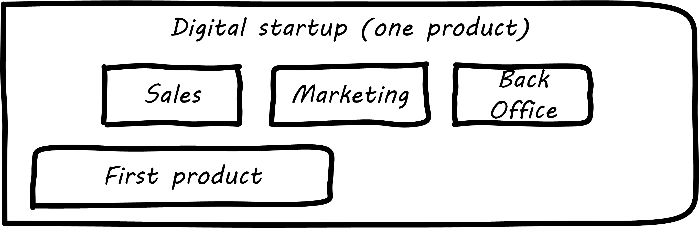
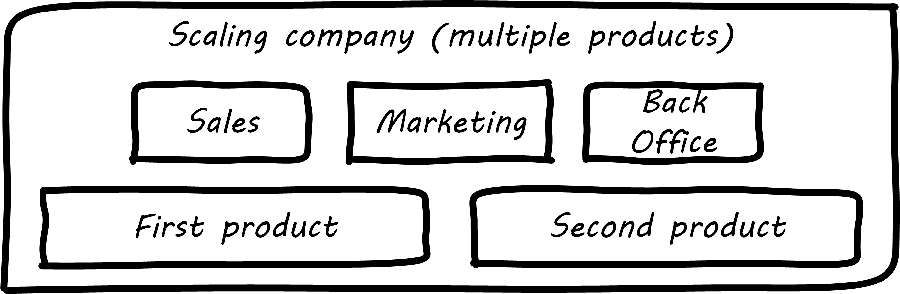
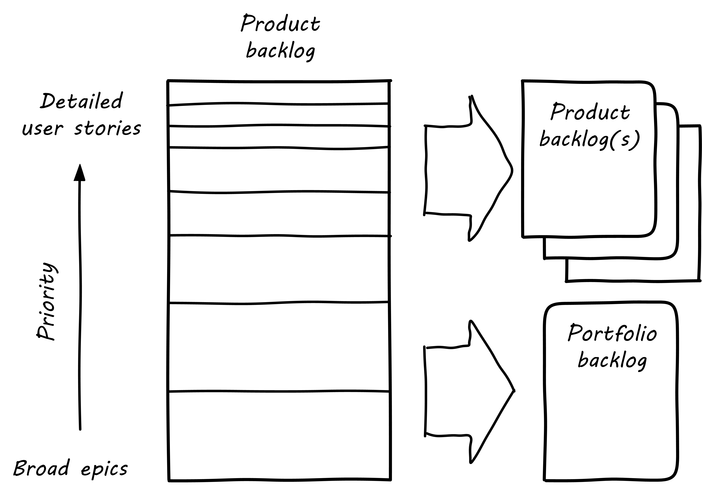

anchor:structuring-investment[]

==== Structuring the investment
[quote, ISO 38500:2008]
Directors should monitor the progress of approved IT proposals to ensure that they are achieving objectives in required timeframes using allocated resources.

Now that we understand the xref:chap-coordination[coordination problem] better, we are prepared to make longer term commitments to a more complicated organizational structure. As we stated in the xref:chap-invest-mgmt[chapter introduction], one way of looking at these longer term commitments is as investments. We start them, we decide to continue them, or we decide to halt (exit) them. In fact, we could use the term "portfolio" to describe these various investments; this is not a new concept in IT management.

NOTE: The first comparison of IT investments to a portfolio was in 1974, by Richard Nolan <<Nolan1974>>.

Whatever the xref:digital-context[context for your digital products] (external or internal), they are intended to provide value to your organization and ultimately your end customer. Each of them in a sense is a "bet" on how to realize this value (review the xref:DIBB[Spotify DIBB model]), and represents in some sense a form of xref:prod-discovery[product discovery]. As you deepen your abilities to understand investments, you may find yourself applying xref:business-case-analysis[business case analysis techniques] in more rigorous ways, but as always retaining a xref:lean-startup[Lean Startup] experimental mindset is advisable.

As you strengthen a hypothesis in a given product or feature structure, you increasingly xref:formalization[formalize] it: a clear product vision supported by dedicated resources. We'll discuss the IT portfolio concept further in xref:portfolio-management[Chapter 12]. In your earliest stages of differentiating your portfolio, you may first think about features versus components.

anchor:feature-v-component[]

===== Features versus components
As you consider your options for partitioning your product, in terms of the xref:AKF-cube[AKF scaling cube], a useful and widely-adopted distinction is that between "features" and "components."

Features are *what* your product *does*. They are what the customers perceive as valuable. “Scope as viewed by the customer” according to Mark Kennaley (<<Kennaley2010>> p. 169). They may be "xref:flower-and-cog[flowers]" -- defined by the value they provide externally, and encouraged to evolve with some freedom. You may be investing in new features using xref:lean-startup[Lean Startup], the xref:DIBB[Spotify DIBB model] or some other hypothesis-driven approach.

Components are *how* your product is *built*, such as database and Web components. In other words, they are a form of infrastructure (but infrastructure you may need to build yourself, rather than just spin up in the Cloud). They are more likely to be "xref:flower-and-cog[cogs]" -  more constrained and engineered to specifications. Mike Cohn defines a component team as "a team that develops software to be delivered to another team on the project rather than directly to users" (<<Cohn2010>>, p.183).

.Features versus components
image::images/3_07-feature-v-component.png[feature component matrix,400,,float="right"]

Feature teams are dedicated to a clearly defined functional scope (such as "item search" or "customer account lookup"), while component teams are defined by their technology platform (such as "database" or "rich client"). Component teams may become shared services, which need to be carefully understood and managed (more on this to come). A component's failure may affect multiple feature teams, which makes them more risky.

It may be easy to say that features are more important than components, but this can be carried too far. Do you want each feature team choosing its own database product? This might not be the best idea; you'll have to hire specialists for each database product chosen. Allowing feature teams to define their own technical direction can result in brittle, fragmented architectures, technical debt, and rework. Software product management needs to be a careful balance between these two perspectives. The Scaled Agile Framework suggests that components are relatively

* more technically focused
* more generally re-usable

than features. SAFE also recommends a ratio of roughly 20-25% component teams to 75%-80% feature teams <<SAFE2016>>.

Mike Cohn suggests the following advantages for feature teams (<<Cohn2010>>, pp.183-184):

* They are better able  to evaluate the impact of design decisions
* They reduce hand-off waste (a coordination problem)
* They present less schedule risk
* They maintain focus on delivering outcomes

He also suggests  (<<Cohn2010>>, pp.186-187) that component teams are justified when:

* Their work will be used by multiple teams
* They reduce the sharing of specialists across teams
* The risk of multiple approaches outweighs the disadvantages of a component team

Ultimately, the distinction between "feature versus component" is similar to the xref:what-is-IT-infrastructure[distinction between "application" and "infrastructure"]. Features deliver outcomes to people whose primary interests are *not* defined by digital or IT. Components deliver outcomes to people whose primary interests *are* defined by digital or IT.

anchor:multi-product-scaling[]

===== Epics and new products

In the xref:defining-coord[last chapter], we talked of one product with multiple feature and/or component teams. Features and components as we are discussing them here are large enough to require separate teams (with new xref:coord-tools[coordination requirements]). At an even larger scale, we have new product ideas, perhaps first seen as xref:roadmap-backlog-estimation[epics in a product backlog].

.One company, one product

Eventually, larger and more ambitious initiatives lead to a key organizaitonal state transition: from one product to multiple products. Consider our hypothetical startup company. At first, everyone on the team is supporting one product and dedicated to its success. There is little sense of contention with "others" in the organization. This changes with the addition of a second product team with different incentives. Concerns for fair allocation and a sense of internal competition naturally arise out of this diversification. Fairness is deeply wired into human (and animal) brains, and the creation of a new product with an associated team provokes new dynamics in the growing company.

.One company, multiple products

Because resources are always limited, it is critical that the demands of each product be managed using objective criteria, requiring formalization.  This was a different problem when you were a tight-knit startup; you were constrained, but everyone knew they were "in it together." Now you need some ground rules to support your increasingly diverse activities. This leads to new concerns:

* Managing scope and preventing unintended creep or drift from the product's original charter
* Managing contention for enterprise or shared resources
* Execution to timeframes (e.g. the critical trade show)
* Coordinating dependencies (e.g. achieving larger, cross-product goals)
* Maintaining good relationships when a team's success depends on another team's commitment.
* Accountability for results

Structurally, we might decide to separate a portfolio backlog from the product backlog. What does this mean?

* The portfolio backlog is the list of potential new products that the organization might invest in
* Each product team still has its own backlog of stories (or other xref:representation[representations] of their work)

The xref:roadmap-backlog-estimation[DEEP backlog] we discussed in Chapter 5 gets split accordingly:

.Portfolio versus product backlog

The decision to invest in a new product should not be taken lightly. When the decision is made, the actual process is as we xref:product-mgmt-chap[covered in Chapter 4]: ideally, a closed-loop, iterative process of xref:prod-discovery-techniques[discovering] a product that is
xref:vuf[valuable, usable, and feasible].

There is one crucial difference: the investment decision is formal, and internal. While we started our company with an understanding of our xref:digital-context[investment context], we looked primarily to market feedback and grew incrementally from a small scale. (Perhaps there was venture funding involved, but this book doesn't go into that.)

Now, we may have a set of competing ideas that we are thinking about placing bets on. In order to make a rational decision, we need to understand the costs and benefits of the proposed initiatives. This is difficult to do precisely, but how can we rationally choose otherwise? We have to make some assumptions, and  estimate the likely benefits and the effort it might take to realize them.
