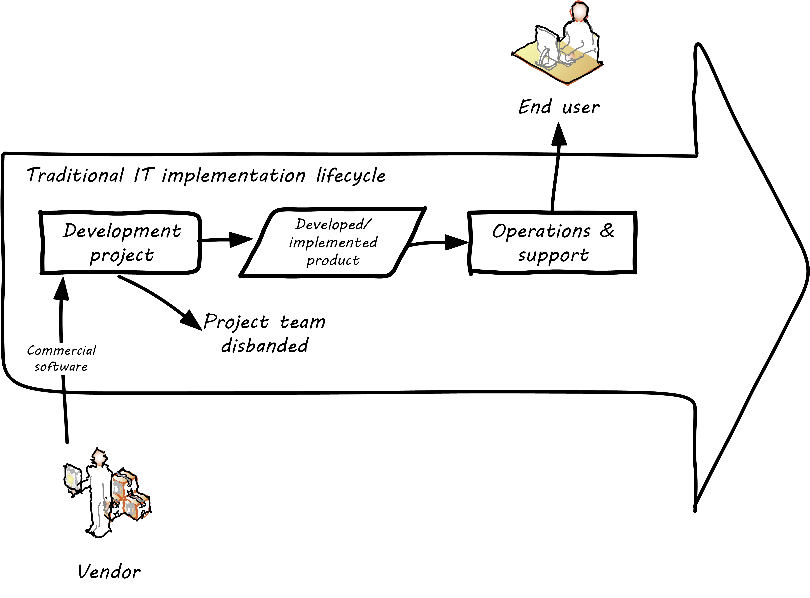
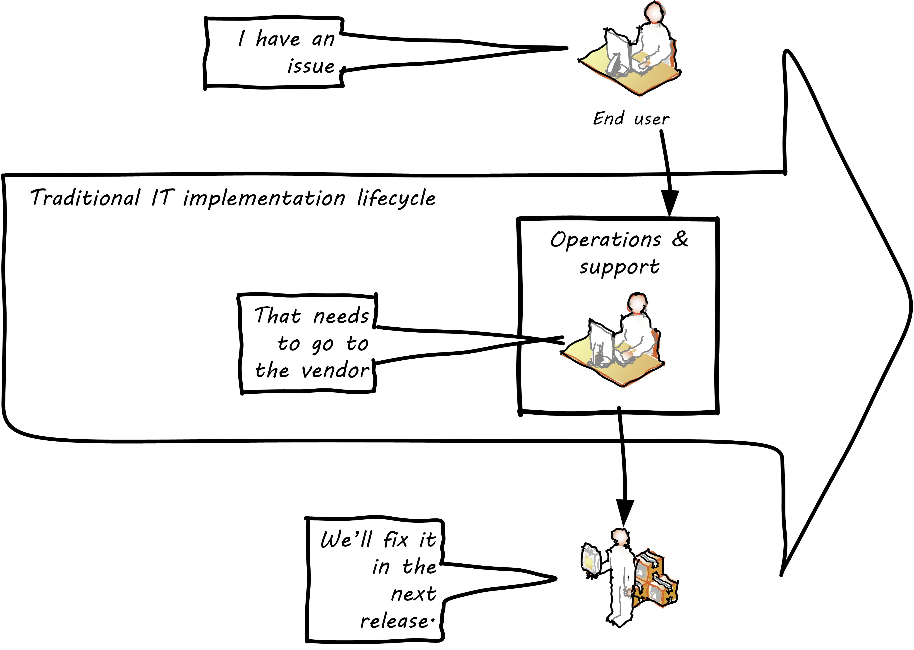
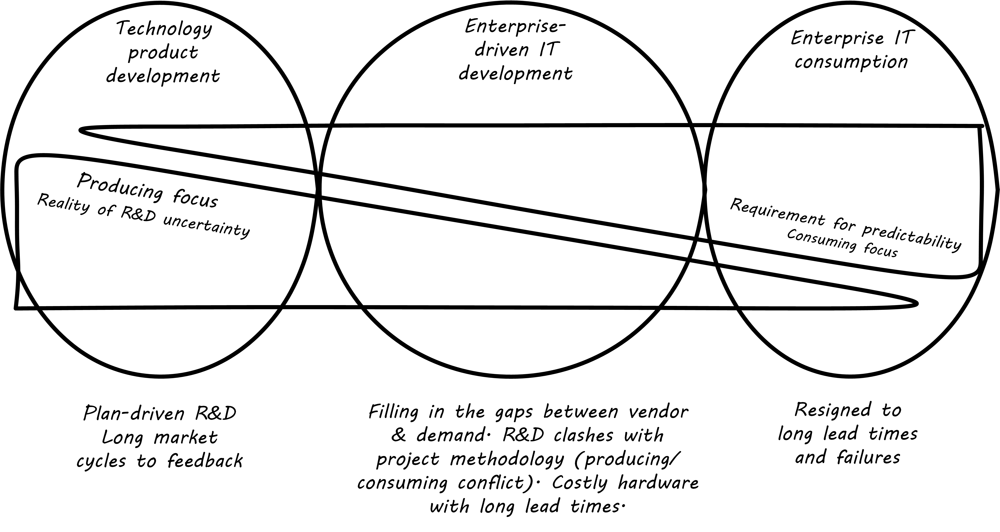
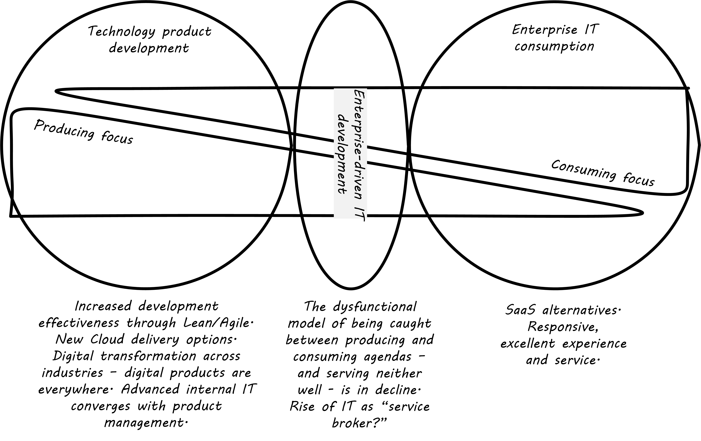

==== Why project management?
[quote, Project Management Body of Knowledge, version 5]
An ongoing work effort is generally a repetitive process that follows an organization's existing procedures. In contrast, because of the unique nature of projects, there may be uncertainties or differences in the products, services, or results that the project creates.

[quote, Stanley Portny, Project Management for Dummies 4th ed.]
Projects of all types and sizes are now *the* way that organizations accomplish their work [emphasis added].

[quote, Sriram Narayan, "Scaling Agile: Problems and Solutions"]
...the project as a vehicle of IT execution has by and large, failed to live up to its promise of predictable delivery.

[quote, Roman Pichler, "Agile Product Management with Scrum"]
Project management responsibilities are no longer exercised by one person. They are split across the members of the Scrum team instead.

[quote, Charles G. Cobb, The Project Manager's Guide to Mastering Agile: Principles and Practices for an Adaptive Approach]
Agile is having a profound impact on the project management profession and will cause us to fundamentally rethink many of the well-established notions of what a project manager is...

In our xref:emergence-model[emergence model], we always seek to make clear *why* we need a new concept or practice. It is not sufficient to say, "we need project management because companies of our size use it." Many authoritative books on Agile software development assume that some form of project management is going to be used. Other authors question the need for it, or at least raise various cautions.

Project management, like many other areas of IT practice, is undergoing considerable transformation in response to the Agile transition. However, it will likely remain an important tool for value delivery at various scales.

Fundamentally, project management is a means of understanding and building a shared mental model of a given scope of work. In particular, planning the necessary tasks gives a basis for estimating the time and cost of the work as a whole, and therefore understanding its value. Even though industry practices are changing, value remains a critical concern for the digital professional.

As the above quotes indicate, there are diverse opinions on the role and importance of traditional project management in the enterprise. Clearly it is under pressure from the Agile movement. Project management professionals are advised to not deny or diminish this fact. One of the primary criticisms of project management as a paradigm is that it promotes large "batches" of work. It is possible for a modern, IT-centric organization to make considerable progress on the basis of xref:product-mgmt[product management] plus simple, continuous xref:work-management[work management], without the overhead of the formalized project lifecycle suggested by PMBOK.

xref:cloud[Cloud computing] is having impacts on traditional project management as well. As we will see in the section on the xref:trad-IT-decline[decline of traditional IT], projects were often used to install vendor-delivered commodity software, such as for payroll or employee expense. Increasingly, that kind of functionality is delivered by online service providers, leaving "traditional" internal IT with considerably reduced responsibilities.

Some of the IT capability may remain in the guise of an internal "service broker," to assist with the sourcing and procurement of online services. The remainder moves into digital product management, as the only need for internal IT is in the area of revenue-generating, market-facing strategic digital product.

So, this section will examine the following questions:

* Given the above trends, under what circumstances does formalized project management make economic sense?
* Assuming that formalized project management is employed, how does one continue to support objectives such as fast feedback and adaptability?

===== A traditional information technology project
So, what does all this have to do with information technology? As we have discussed in previous chapters, project management is one of the main tools used to deliver value across specialized skill-based teams, especially in traditional IT organizations.

A "traditional" IT project would usually start with the "sponsorship" of some executive with authority to request funding. For example, suppose that the VP of Logistics under the Chief Operating Officer (COO) believes that a new supply chain system is required. With the sponsorship of the COO, she puts in a request (possibly called a "demand request" although this varies by organization) to implement this system. The assumption is that a commercial software package will be acquired and implemented. The IT department serves as an overall coordinator for this project. The "demand request" in many cases is registered with the enterprise Project Management Office, which may report under the CIO.

NOTE: Why might the Enterprise Project Management office report under the CIO? IT projects in many companies represent the single largest type of internally managed capital expenditure. The other major form of projects, building projects, are usually outsourced to a general contractor.

The project is initiated by establishing a charter, allocating the funding, assigning a project manager, establishing communication channels to stakeholders, and a variety of other activities. One of the first major activities of the project will be to select the product to be used. The project team (perhaps with support from the architecture group) will help lead the RFI/RFQ processes by which vendors are evaluated and selected.

NOTE: RFI stands for https://en.wikipedia.org/wiki/Request_for_information[Request for Information]; RFQ stands for https://en.wikipedia.org/wiki/Request_for_quotation[Request for Quote]. See the links for definitions.

Once the product is chosen, the project must identify the staff who will work on it, perhaps a combination of full time employees and contractors, and the systems implementation lifecycle can start.

We might call the above, the *systems implementation lifecycle*, not the *software development lifecycle*. This is because most of the hard software development was done by the third party who created the supply chain software. There may be some configuration or customization (adding new fields, screens, reports) but this is lightweight work in comparison to the software engineering required to create a system of this nature.

The system requires its own hardware (servers, storage, perhaps a dedicated switch) and specifying this in some detail is required for the purchasing process to start. The capital investment may be hundreds of thousands, or millions of dollars. This in turn requires extensive planning and  senior executive approval for the project as a whole.

It would not have been much different for a fully in house developed application, except that more money would have gone to developers. The slow infrastructure supply chain still drove much of the behavior, and correctly "sizing" this infrastructure was a challenge particularly for in-house developed software. (The vendors of commercial software would usually have a better idea of the infrastructure required for a given load.) Hence much attention to up-front planning. Without requirements, no analysis or design; without design, how to know how much server to buy?

Ultimately, the project comes to an end, and the results (if a product such as a digital service) are transitioned to a "production" state. <<fig-ProdLifecycleA-700-c>> presents a  graphical depiction.

[[fig-ProdLifecycleA-700-c]]
.Traditional IT implementation lifecycle

There are a number of problems with this classic model, starting with the lack of responsiveness to consumer needs (see <<fig-ProdLifecycleB-700-c>>).

[[fig-ProdLifecycleB-700-c]]
.Customer responsiveness in traditional model

This might be OK for a non-competitive function, but if the "digital service consumer" has other options they may go elsewhere. If they are an internal user within an enterprise, they might be engaged in critical competitive activities.

anchor:trad-IT-decline[]

====== The decline of the "traditional" IT project
The above scenario is in decline, and along with it a way of life for many "IT" professionals. One primary reason is Cloud, and in particular Software as a Service.  Another reason is the increasing adoption of the Lean/Agile product development approach for digital services. <<fig-ProdLifecycleC-700-c>> presents one view of the classic model.

[[fig-ProdLifecycleC-700-c]]
.Traditional enterprise IT "space"

Notice the long triangles labeled "Producing focus" and "Consuming focus." These represent the perspectives of (for example) a software vendor versus their customer. Traditionally, the research and development (R&D) function was most mature in the product companies. What was less well understood was that internal IT development was also a form of R&D. Because of the desire for scope management (predictability and control), the IT department performing systems development was often trapped in the worst of both worlds - having neither good quality product, nor high levels of certainty. For many years, this was accepted by industry as the best that could be expected. However, the combination of Lean/Agile and Cloud is changing this situation (see <<fig-ProdLifecycleD-700-c>>).

[[fig-ProdLifecycleD-700-c]]
.Shrinking space for traditional IT

There is diminishing reason to run commodity software (e.g. payroll, expenses, HR, etc) in-house. Cloud providers such as Workday, Concur, Salesforce, and others provide ready access to the desired functionality "as a service." The responsiveness and excellence of such products is increasing, due to the increased tempo of market feedback (note that while a human resource management system may be commodity for *your* company, it is *strategic* for Workday) and concerns over security and data privacy are rapidly fading.

What is left internal to the enterprise, increasingly, are those initiatives deemed "competitive" or "strategic." Usually, this means that they are going to contribute to a revenue stream. This in turn means they are "products" or significant components of them. (See Chapter 4, xref:product-mgmt[Product Management].) A significant market-facing product initiative (still calling for project management per se) might start with the identification of a large, interrelated set of features, perhaps termed an "epic." Hardware acquisition is a thing of the past, due to either private or public cloud. The team starts with analyzing the overall structure of the epic, decomposing it into stories and features, and organizing them into a logical sequence.

Because capacity is available on demand, new systems do not need to be nearly as precisely "sized," which meant that implementation could commence without as much up front analysis. Simpler architectures suffice until real load is proven. It might then be a scramble to refactor software to take advantage of new capacity, but the overall economic effect is positive, as over-engineering and over-capacity are increasingly avoided. So, IT moves in two directions - its most forward-looking elements align to the enterprise product management roadmap, while its remaining capabilities may deliver value as a "service broker." (More on this in the section on xref:sourcing[IT sourcing].)

Let's return to the question of project management in this new world.

===== How is a project different from simple "work management"?

In xref:work-management[Chapter 5], we covered a simple concept of "work management" that deliberately did not differentiate product, project, and/or process-based work. As was noted at the time, for smaller organizations, most or all of the organization would be the "project team," so what would be the point?

The project is starting off as a list of tasks, that is essentially identical to a product backlog. Even in Kanban, we know who is doing what, so what is the difference? Here are key points:

* The project is explicitly time-bound. As a whole, it is lengthier and more flexible than the repetitive, time-boxed sprints of Scrum, but more fixed than the ongoing flow of Kanban.

* Dependencies. You may have had a concept of one task or story blocking another, and perhaps you used a whiteboard to outline more complex sequences of work, but project management  has an explicit concept of dependencies in the tasks, and powerful tools to manage them. This is essential in the most ambitious and complex product efforts.

* Project management also has more robust tools for managing people's time and effort, especially as they translate to project funding. While estimation and ongoing re-planning of spending can be a contentious aspect of project management, it remains a critical part of management practice in both IT and non-IT domains.

At the end of the day, people expect to be paid for their time, and investors expect to be compensated through the delivery of results. Investment capital only lasts as a function of an organization's "burn rate;" the rate at which the money is consumed for salaries and expenses. Some forecasting of status (whether that of a project, organization, product, program, or what have you) is therefore an essential and unavoidable obligation of management, unless funding is unlimited (a rare situation to say the least.)

Project accounting, at scale, is a deep area with considerable research and theory behind it. In particular, the concept of Earned Value Management is widely used to quantify the performance of a project portfolio.

===== The "iron triangle"

[[fig-triad-constraints-300-i]]
.Project "Iron Triangle"
image::images/3_08-triad-constraints.jpg[Iron triangle, 300, , float="left"]

The project management https://en.wikipedia.org/wiki/Project_management_triangle["Iron Triangle"] represents the interaction of cost, time, scope, and quality on a project (see <<fig-triad-constraints-300-i>> footnote:[Image credit https://commons.wikimedia.org/w/index.php?curid=4282986, "By I, John Manuel Kennedy T., CC BY-SA 3.0," downloaded 2016-10-31, fair use]). The idea is that, in general, one or more of these factors may be a constraint. The "Pick any Two" sign is often seen in service organizations (see <<fig-good-cheap-fast-400-o>> footnote:[Image credit https://www.flickr.com/photos/centralasian/4534292595, downloaded 2016-10-31, commercial use permitted]).

[[fig-good-cheap-fast-400-o]]
.Pick any two

The same applies to project management and reflects well the "iron triangle" of tradeoffs. However, more recent thinking in the DevOps movement suggests that optimizing for continuous flow and speed tends to have beneficial impacts on quality as well. As digital xref:pipeline[pipelines] increase their automation and thus speed to delivery, quality increases because testing and building become more predictable. Conversely, the idea that stability increases through injecting delay into the deployment process (i.e. through formal Change Management) is also under question (see cite:[Forsgren2014]).

===== Project practices

Project management (NOT restricted to IT) is a defined area of study, theory, and professional practice. This section provides a (necessarily brief) overview of these topics.

We will first discuss the Project Management Body of Knowledge, which is the leading industry framework in project management, at least in the United States. (PRINCE2 is another framework, originating from the UK, which will not be covered in this edition.) We will spend some time on the critical issues of scope management which drive some of the conflicts seen between traditional project management and Agile product management.

PMBOK details are easily obtained on the web, and will not be repeated here. (See the xref:PMBOK[PMBOK summary] and xref:project-mgmt[project management overview].) It's clear that the Agile critiques of waterfall project management have been taken seriously by the PMBOK thought leaders. There is now a PMI Agile certification and much explicit recognition of the need for iterative and incremental approaches to project work.

PMBOK remains extensive and complex when considered as a whole. This is necessary, as it is used to manage extraordinarily complex and costly efforts in domains such as construction, military/aerospace, government, and others. Some of these efforts (especially those involving systems engineering, over and above software engineering) do have requirements for extensive planning and control that PMBOK meets well.

However, in Agile domains that seek to be more adaptive to changing business dynamics, full use of the PMBOK framework may be unnecessary and wasteful. The accepted response is to "tailor" the guidance, omitting those plans and deliverables that are not needed.

IMPORTANT: Part of the problem with extensive frameworks such as PMBOK is that knowing how and when to tailor them is hard-won knowledge that is not part of the usual formalized training. And yet, without some idea of "what matters" in applying the framework, there is great risk of wasted effort. The Agile movement in some ways is a reaction to the waste that can result from overly detailed frameworks.

====== Scope management
Scope management is a powerful tool and concept, at the heart of the most challenging debates around project management. PMBOK uses the following definitions cite:[PMI2013]:

*Scope.* The sum of the products, services, and results to be provided as a project. See also project scope and product scope.

*Scope Change.* Any change to the project scope. A scope change almost always requires an adjustment to the project cost or schedule.

*Scope Creep.* The uncontrolled expansion to product or project scope without adjustments to time, cost, and resources.

anchor:change-control[]
*Change Control* A process whereby modifications to documents, deliverables, or baselines associated with the project are identified, documented, approved, or rejected.

In the  xref:lean-startup[Lean Startup] world, products may pivot and pivot again, and their resource requirements may flex rapidly based on market opportunity. Formal project change control processes are in general not used. Even in larger organizations, product teams may be granted certain leeway to adapt their "products, services, and results" and while such adaptations need to be transparent, formal project change control is not the vehicle used.

On the other hand, remember our xref:emergence-model[emergence model]. The simple organizational change from one to multiple products may provoke certain concerns and a new kind of contention for resources. People are inherently competitive and also have a sense of fairness. A new product team that seems to be unaccountable for results, consuming "more than its share" of budget while failing to meet the original vision for their existence, will cause conflict and concern among organizational leadership.

It is in the tension between product autonomy and accountability that we see project management techniques such as the work breakdown structure and project change control employed. The work breakdown structure is defined by the Project Management Body of Knowledge as

_...a hierarchical decomposition of the total scope of work to be carried out by the project team to accomplish the project objectives and create the required deliverables. The WBS organizes and defines the total scope of the project, and represents the work specified in the current approved project_ cite:[PMI2013].

cite:[Portny2013] recommends "Subdivide your WBS component into additional deliverables if you think either of the following situations applies: The component will take much longer than two calendar weeks to complete. The component will require much more than 80 person-hours to complete."

This may seem reasonable, but in iterative product development, it can be difficult to "decompose" a problem in the way project management seems to require. Or to estimate in the way Portny suggests. This can lead to two problems.

First, the WBS may be created at a seemingly appropriate level of detail, but since it is created before key information is generated, it is inevitably wrong and needing ongoing correction. If the project management approach requires a high-effort "project change management" process, much waste may result as "approvals" are sought for each  xref:feedback[feedback] cycle. This may result in increasing disregard by the development team for the project manager and his/her plan, and corresponding cultural risks of disengagement and lowering of trust on all sides.

Second, we may see the creation of project plans that are too high level, omitting information that is in fact known at the time - for example, external deadlines or resource constraints. This happens because the team develops a cultural attitude that is averse to all planning and estimation.

====== Project risk management
Project management is where we see the first formalization of risk management (which will be more extensively covered in Chapter 10). Briefly, risk is classically defined as the probability of an adverse event times its cost. Project managers are alert to risks to their timelines, resource estimates, and deliverables.

Risks may be formally identified in project management tooling. They may be accepted, avoided, transferred, or mitigated. Unmanaged risks to a project may result in the project as a whole reporting an unfavorable status.

====== Project assignment

Enterprise IT organizations have evolved to use a mix of project management, processes, and ad-hoc work routing to achieve their results. Often, resources (people) are assigned to multiple projects, a practice sometimes called "fractional allocation."

In fractional allocation, a database administrator will work 25% on one project, 25% on another, and still be expected to work 50% on ongoing production support. This may appear to work mathematically, but practically it is an ineffective practice. Both Gene Kim in The Phoenix Project cite:[Kim2013] and Eli Goldratt in Critical Chain cite:[Goldratt1997] present dramatized accounts of the overburden and gridlock that can result from such approaches.

As previously discussed, human beings are notably bad at xref:multi-tasking[multi-tasking], and the mental "context-switching" required to move from one task to another is wasteful and ultimately not scalable. A human being fractionally allocated to more and more projects will get less and less done in total, as the transactional friction of task switching increases.

====== Governing outsourced work
A third major reason for the continued use of project management and its techniques is governing work that has been outsourced to third parties. This is covered in detail in the section on xref:sourcing[sourcing].

===== The future of project management

Recall our three "Ps":

* Product
* Project
* Process

Taken together, the three represent a coherent set of concerns for value delivery in various forms. But in isolation, any one of them ultimately is limited. This is a particular challenge for project management, whose practitioners may identify deeply with their chosen field of expertise.

Clearly, formalized project management is under pressure. Its methods are perceived by the Agile community as overly heavyweight; its practitioners are criticized for focusing too much on success in terms of cost and schedule performance and not enough on business outcomes. Because projects are by definition temporary, project managers have little incentive to care about xref:technical-debt-1[technical debt] or operational consequences. Hence the rise of the product manager.

However, a product manager who does not understand the fundamentals of project execution will not succeed. As we have seen, modern products, especially in organizations scaling up, have dependencies and coordination needs, and to meet those needs, project management tools will continue to provide value.

anchor:loose-coupling-project[]

====== Loose coupling to the project plan rescue?

While this book does not go into systems architectural styles in depth, a project with a large number of dependencies may be an indication that the system or product being constructed also has significant interdependencies. Recall xref:amazon-productization[Amazon's product strategy] including its API mandate.

Successful systems designers for years have relied on concepts such as encapsulation, abstraction, and loose coupling to minimize the dependencies between components of complex systems, so that their design, construction, and operation can be managed with some degree of independence. These ideas are core to the software engineering literature. Recent expressions of these core ideas are Services-Oriented Architecture and microservices.

Systems that do not adopt such approaches are often termed "monolithic" and have a well deserved reputation for being problematic to build and operate. Many large software failures stem from such approaches. If you have a project plan with excessive dependencies, the question at least should be asked: does my massive, tightly-coupled project plan indicate I am building a monolithic, tightly-coupled system that will not be flexible or responsive to change?

Again, many digital companies build tremendously robust integrated services from the combination of many quasi-independent, microservice-based "product" teams, each serving a particular function. However, when a particular organizational objective requires changes to more than one such "product," the need for cross-team coordination emerges. Someone needs to own this larger objective, even if its actual implementation is carried out across multiple distinct teams. We will discuss this further in Chapter 9.

ifdef::collaborator-draft[]
 xref Chubby sidebar
endif::collaborator-draft[]
