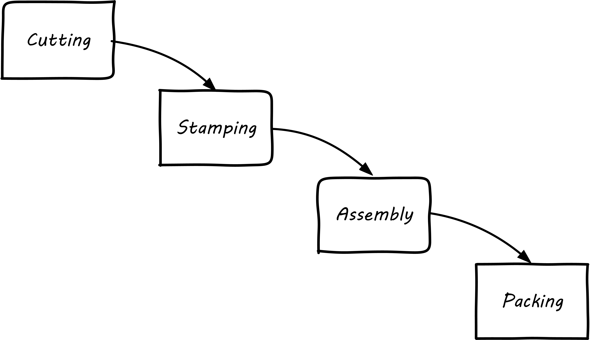
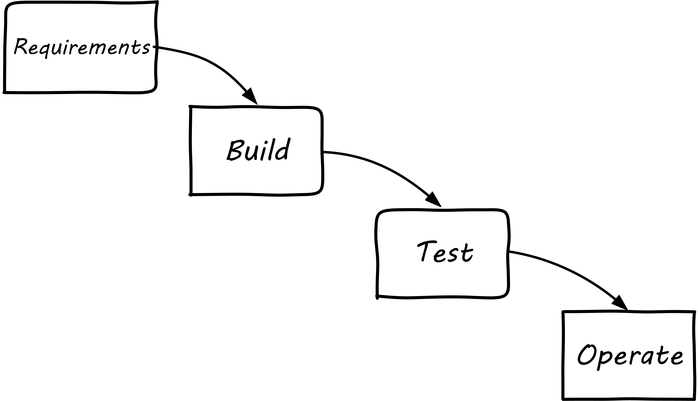
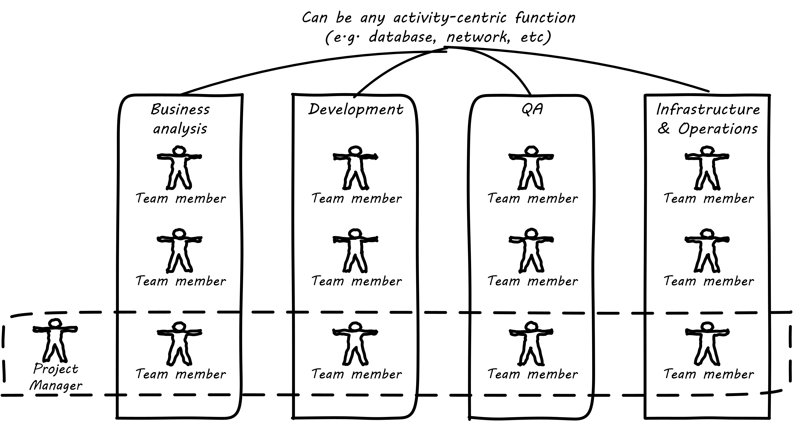
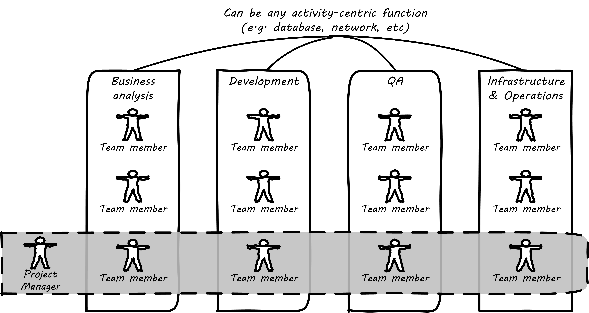
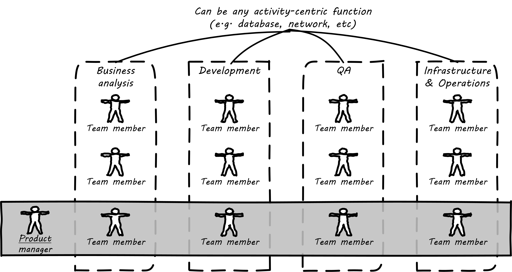
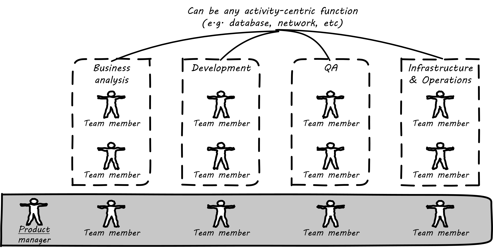
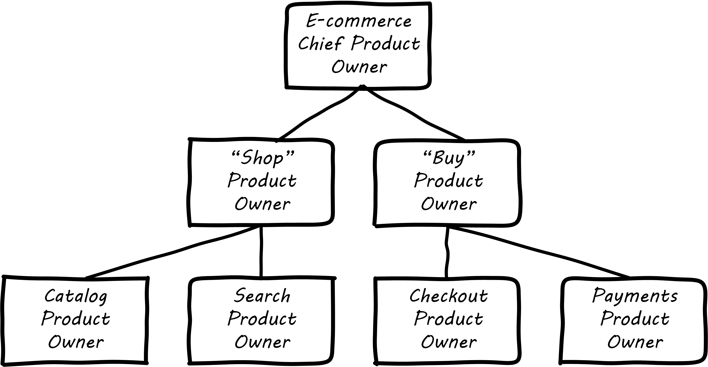

anchor:product-v-function[]

==== Product and function

[quote, Sriram Narayan, Agile IT Organization Design]
Even where they are not part of a value stream, activity-oriented teams tend to standardize their operations over time. Their appetite for offering custom solutions begins to diminish. Complaints begin to surface—“They threw the rule book at us,” “What bureaucracy!”

[quote, Abbot and Fisher, The Art of Scalability]
When teams are aligned by services, are autonomous, and are cross-functionally composed, there is a significant decrease in affective conflict. When team members are aligned by shared goals and no longer need to argue about who is responsible or who should perform certain tasks, the team wins or loses together. Everyone on the team is responsible for ensuring the service provided meets the business goals.

By this time, you probably detect that there is a fundamental tension between functional specialization and end to end value delivery. The above two quotes reflect this tension - the tendency for specialist teams start to identify with their specialty and not the overall mission. The tension may go by different names:

* Product versus function
* Value stream versus activity
* Process versus silo

As we saw xref:process-project-product[previously], there are three major concepts used to achieve end to end flow across functional specialties:

* Product
* Project
* Process

These are not mutually exclusive models, and may interact with each other in complex ways. (See the scaling discussion in the xref:scaling-org[Part III introduction].)

NOTE: We will go into detail on project management in chapter 8 and process management in chapter 9. But first we need to understand how they influence organizational forms.

===== Waterfall and functional organization

For example, some manufacturing can be represented as a very simple, sequential process model (see <<fig-naive-mfg-500-c>>).

[[fig-naive-mfg-500-c]]
.Simple sequential manufacturing

The product is already defined and the need to generate information (i.e. through xref:feedback[feedback]) is at an absolute minimum.
NOTE: Even in this simplest model, feedback is important. Much of the evolution of 20th century manufacturing has been in challenging this naive, open-loop model. (Remember our brief discussion of xref:open-loop[open-loop]?) The original, open-loop waterfall model of IT systems implementation (see <<fig-waterfallB-500-c>>) was arguably based on just such a naive concept.

[[fig-waterfallB-500-c]]
.Waterfall

(Review xref:Agile-history[chapter 3] on waterfall development and Agile history.) Functional, or _practice_, areas can continually increase their efficiency and economies of scale through deep specialization.

.What is a "practice"?
****
A "practice" is synonymous with "discipline" -- it is a set of interrelated precepts, concerns, techniques, often with a distinct professional identity. "Java programming," "security," or "capacity management" are practices. When an organization is closely identified with a practice, it tends to act as a functional silo (more on this to come). For example, in a traditional IT organization, the Java developers might be in a separate team from the HTML, CSS and Javascript specialists. The database administrators might have their own team, and also the architects, business analysts, and quality assurance groups. Each practice or functional group develops a strong professional identity as the custodians of "best practices" in their area. They may also develop a strong set of criteria for when they will accept work, which tends to slow down xref:lean-product-dev[product discovery].
****

There are two primary disadvantages to the model of projects flowing in a waterfall sequence across functional areas:

* It discourages closed-loop feedback
* There is transactional friction at each handoff

Go back and review: the waterfall model falls into the "original sin" of IT management, xref:lean-product-dev[confusing production with product development]. As a repeatable production model, it may work, assuming that there is little or no information left to generate regarding the production process (an increasingly questionable assumption in and of itself). But when applied to product development, where the *primary goal* is the experiment-driven generation of information, the model is inappropriate and has led to innumerable failures. This includes software development, and even implementing purchased packages in complex environments.

anchor:org-continuum[]

===== The continuum of organizational forms

NOTE: The following discussion and accompanying set of diagrams is derived from Preston Smith and Don Reinertsen's thought regarding this problem in  _Developing Products in Half the Time_ cite:[Smith1998] and _Managing the Design Factory_ cite:[Reinertsen1997]. Similar discussions are found in the _Guide to the Project Management Body of Knowledge_ (cite:[PMI2013]) and Abbott and Fisher's _The Art of Scalability_ cite:[Abbott2015].

There is a spectrum of alternatives in structuring organizations for flow across functional concerns. First, a lightweight "matrix" project structure may be implemented, in which the project manager has limited power to influence the activity-based work, where people sit, etc (see <<fig-lightweight-pm-800-c>>).

[[fig-lightweight-pm-800-c]]
.Lightweight project management across functions

Work flows across the functions, perhaps called "centers of excellence," and there may be contention for resources within each center. Often, simple "first in, first out" xref:queuing[queuing] approaches are used to manage the xref:ticketing[ticketed] work, rather than more sophisticated approaches such as xref:cost-of-delay[Cost of Delay]. It is the above model that Reinertsen was thinking of when he said: "The danger in using specialists lies in their low involvement in individual projects and the multitude of tasks competing for their time." Traditional xref:i-o-matrix[Infrastructure and Operations] organizations, when they implemented defined service catalogs, can be seen as attempting this model. (More on this in Chapter 9's discussion of ITIL and xref:shared-services[shared services].)

anchor:heavyweight-pm[]

Second, a heavyweight project structure may specify much more, including dedicated time assignment, modes of work, standards, and so forth (see <<fig-heavy-pm-800-c>>). The vertical functional manager may be little more than a resource manager, but does still have reporting authority over the team member and crucially still writes their annual performance evaluation (if the organization still uses those.) This has been the most frequent operating model in the xref:trad-cio-org[traditional CIO organization].

[[fig-heavy-pm-800-c]]
.Heavyweight project management across functions

If even more focus is needed -- the now-minimized influence of the functional areas is still deemed too strong --  the organization may move to completely product-based reporting (see <<fig-product-mgmt-800-c>>). With this, the team member reports to the product owner. There may still be communities of interest (Spotify guilds and tribes are good examples) and there still may be standards for technical choices.

[[fig-product-mgmt-800-c]]
.Product team, virtual functions

anchor:skunkworks[]

Finally, in the skunkworks model, all functional influence is deliberately blocked, as distracting or destructive to the product team's success (see <<fig-skunk-800-c>>).

[[fig-skunk-800-c]]
.Skunkworks model

The product team has complete autonomy, and can move at great speed. It is also free to:

* re-invent the wheel, developing new solutions to old and well-understood problems
* bring in new components on a whim (regardless of whether they are truly necessary) adding to sourcing and long-term support complexity,
* ignore safety and security standards, resulting in risk and expensive retrofits.

Early e-commerce sites were often set up as skunkworks to keep the interference of the traditional CIO to a minimum, and this was arguably necessary. However, ultimately, skunkworks is not scalable. Research by the Corporate Executive Board suggests that "Once more than about 15% of projects go through the fast [skunkworks] team, productivity starts to fall away dramatically." It also causes issues with morale, as a two-tier organization starts to emerge with elite and non-elite segments cite:[Goodwin2015].

Because of these issues, Don Reinertsen (cite:[Reinertsen1997]) observes that "Companies that experiment with autonomous teams learn their lessons, and conclude that the disadvantages are significant. Then they try to combine the advantages of the functional form with those of the autonomous team."

The Agile movement is an important correction to dominant IT management approaches employing xref:open-loop[open-loop] delivery across centralized functional centers of excellence. However, the ultimate extreme of the skunkworks approach cannot be the basis for organization across the enterprise. While xref:product-v-function[functionally specialized organizations] have their challenges, they do promote understanding and common standards for technical areas. In a product-centric organization, communities of interest or practice are important counterbalances.  We will examine the various adaptations and approaches for balancing the two organizational extremes further in Chapter 9 (Execution Management).

===== Scaling the product organization
The functional organization scales well. Just keep hiring more Java programmers, or DBAs, or security engineers and assign them to xref:heavyweight-pm[projects] as needed. Scaling product organizations requires more thought however. The most advanced thinking in this area is found in the work of xref:scrum[Scrum] authors such as Ken Schwaber, Mike Cohn, Craig Larman and Roman Pichler. Scrum, as we have discussed, is a strict, prescriptive framework calling for self-managing teams with a minimum number of roles:

* Product owner
* Scrum master
* Team member

[[fig-SoS-POs-500-o]]
.Product owner hierarchy

Let's accept Scrum and the xref:amazon-productization[2-pizza team] as our organizing approach. A large scale Scrum effort is based on multiple small teams, e.g. representing xref:AKF-cube[AKF scaling cube partitions] (see <<fig-SoS-POs-500-o>> footnote:[Similar to cite:[Pichler2010], p. 12; cite:[Schwaber2007]). If we want to minimize xref:multi-tasking[multi-tasking and context-switching], we need to ask "how many product teams can a given product owner handle?" In _Agile Product Management with Scrum_, Roman Pichler says, "My experience suggests that a product owner usually cannot look after more than two teams in a sustainable manner" (cite:[Pichler2010], p. 12). Scrum authors therefore suggest that larger scale products be managed as aggregates of smaller teams. We'll discuss how the product structure is defined in Chapter 8.

anchor:shared-services[]

===== From functions to components to shared services
We have previously discussed xref:feature-v-component[feature vs component teams]. As a reminder, features are functional aspects of software (things people find directly valuable) while components are how software is organized (e.g. shared services and platforms such as data management).

As an organization grows, we see both the feature and component sides scale. Feature teams start to diverge into multiple products, while component teams continue to grow in the guise of shared services and platforms. Their concerns continue to differentiate and communication friction may start to emerge between the teams. How an organization handles this is critical.

In a world of digital products delivered as services, both feature and component teams may be the recipients of ongoing investment. An ongoing objection in discussions of Agile is, "We can't put a specialist on every team!" This objection reflects the increasing depth of specialization seen in the evolving digital organization. Ultimately, it seems there are two alternatives to handling deep functional specialization in the modern digital organization:

* Split it across teams
* Turn it into an internal product

We've discussed the first option above (split the specialty across teams). But for the second option consider for example the traditional role of server engineer (a common infrastructure function). Such engineers historically have had a consultative, order-taking relationship to application teams:

. An application team would identify a need for computing capacity ("we need four servers")
. The infrastructure engineers would get involved and provide recommendations on make, model, and capacity
. Physical servers would be acquired, perhaps after some debate and further approval cycles

Such processes might take months to complete, and often caused dissatisfaction. With the rise of Cloud technologies, however, we see the transition from a consultative, order-taking model to an automated, always-on, self-service model. Infrastructure organizations move their activities from consulting on particular applications, to designing and sustaining the shared, self-service platform. At that point, are they a function or a product?
