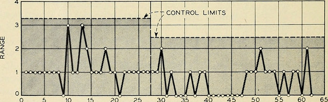

anchor:continuous-improvement[]

==== Process control and continuous improvement

ifdef::collaborator-draft[]

****
*Collaborative*

 Status: This Part Is in first draft as of 8 Jun 2016. Comments appreciated.

include::../../../collab-links.adoc[]

****

endif::collaborator-draft[]

[quote, Martin Fowler, preface to Agile Software Development with Scrum]
a process can still be controlled even if it can't be defined.

In this chapter section, we take a deeper look at the concept of process and how processes are managed and controlled. In particular, we will explore the concept of continuous (or continual) improvement and its rich history and complex relationship to Agile.

You are now at a stage in your company's evolution, or your career, where an understanding of continuous improvement is helpful. Without this, you will increasingly find you don't understand the language and motivations of leaders in your organization, especially those with business degrees or background.

NOTE: There is a debate over whether to use the term "continuous" or "continual" improvement. We will use "continuous" here as it is the more commonly seen. Advocates of "continual" argue it is the more grammatically correct.

The scope of the word "process" is immense. Examples include:

* The end to end flow of chemicals through a refinery
* The set of activities across a manufacturing assembly line, resulting in a product for sale
* The steps expected of a customer service representative in handling an inquiry
* The steps followed in troubleshooting a software-based system
* The general steps followed in creating and executing a project
* The overall flow of work in software development, from idea to operation

This breadth of usage requires us to be specific in any discussion of the word "process." In particular, we need to be careful in understanding the concepts of efficiency, variation, and effectiveness. These concepts lie at the heart of understanding process control and improvement and how to correctly apply it in the digital economy.

Companies institute processes because it has been long understood that repetitive activities can be optimized when they are better understood, and if they are optimized, they are more likely to be economical and even profitable.

We have emphasized throughout this book that the process by which complex systems are created is not repetitive. Such creation is a process of *product development*, not *production.* And yet, the entire digital organization covers a broad spectrum of process possibilities, from the repetitive to the unique. You need to be able to identify what kind of process you are dealing with, and to choose the right techniques to manage it.

(For example, the employee provisioning process flow shown in the previous chapter is simple and prescriptive. Measuring its efficiency and variability would be possible, and perhaps useful.)

There are many aspects of continuous improvement we won't cover in this brief section. Some of them (systems thinking, culture, and others) have already been covered in this book. This book is based in part on Lean and Agile premises, and continuous improvement is one of the major influences on Lean and Agile, so in some ways we come full circle.

We are focusing on continuous improvement in the context of processes and process improvement. We'll therefore scope this to a few concerns: efficiency, variation, effectiveness, and process control.

===== History of continuous improvement
NOTE: History is important. You may think your career is far removed from the early days of the industrial revolution, but the influence of early management thinkers such as Frederick Taylor remains. You need to be able to recognize when his ideas are being applied, especially if they are being applied inappropriately (as can easily happen in modern digital organizations).

The history of continuous improvement is intertwined with the history of 20th century business itself. Before the industrial revolution, goods and services were produced primarily by local farmers, artisans, and merchants. Techniques were jealously guarded, not shared. A given blacksmith might have two or three workers, who might all forge a pan or a sword in a different way. The term "productivity" itself was unknown.

Then the Industrial Revolution happened.

As steam and electric power increased the productivity of industry, requiring greater sums of capital to fund, a search for improvements began. Blacksmith shops (and other craft producers such as grain millers and weavers) began to consolidate into larger organizations, and technology became more complex and dangerous. It started to become clear that allowing each worker to perform the work as they preferred was not feasible.

Enter the scientific method. Thinkers such as Frederick Taylor and Frank and Lillian Gilbreth (of "Cheaper by the Dozen" fame) started applying careful techniques of measurement and comparison, in search of the "one best way" to dig ditches or assemble vehicles. An entire profession of industrial engineering was established, along with the formal study of business management itself.

anchor:taylorism[]

===== Frederick Taylor and efficiency

Frederick Taylor (1856-1915)  was a mechanical engineer and one of the first industrial engineers. In 1911, he wrote _Principles of Scientific Management_.

One of Taylor's primary contributions to management thinking was a systematic approach to efficiency. To understand this, let's consider some fundamentals.

Human beings engage in repetitive activities. These activities consume inputs and produce outputs. It is often possible to compare the outputs against the inputs, numerically, and understand how "productive" the process is.

For example, suppose you have two factories producing identical kitchen utensils (pizza cutters, say).

If one factory can produce 50,000 pizza cutters for $2,000, while the other requires $5,000, the first factory is more productive.

Assume for a moment that the workers are all earning the same across each factory. There is possibly a "process" problem. The first factory is more _efficient_ than the second; it can produce more given the same set of inputs. Why?

There are many possible reasons. Perhaps the second factory is poorly laid out and the work in progress must be moved too many times in order for workers to perform their tasks. Perhaps the workers are using tools that require more manual steps. Understanding the differences between the two factories, and recommending the "best way," is what Taylor pioneered, and what industrial engineers do to this day.

As Peter Drucker, one of the most influential management thinkers, says of Frederick Taylor:

****
The application of knowledge to work explosively increased productivity. For hundreds of years there had been no increase in the ability of workers to turn out goods or to move goods . . . But within a few years after Taylor began to apply knowledge to work, productivity began to rise at a rate of 3.5 to 4 percent compound a year—which means doubling every eighteen years or so. Since Taylor began, productivity has increased some fiftyfold in all advanced countries. On this unprecedented expansion rest all the increases in both standard of living and quality of life in the developed countries. <<Drucker1993>>, pp.37-38.
****

===== W.E. Deming and variation
The quest for effiency leads to the long-standing management interest in variability and variation. What do we mean by this?

If you expect a process to take 5 days, what do you make of occurrences when it takes 7 days? 4 days? If you expect a manufacturing process to yield 98% usable product, what do you do when it falls to 97%? 92%?

In highly repeatable manufacturing processes, statistical techniques can be applied. Analyzing such "variation" has been a part of management for decades, and is an important part of disciplines such as Six Sigma. This is why Six Sigma is of such interest to manufacturing firms.

\W. Edwards Deming (1900-1993) is noted for (among many other things) his understanding of variation and organizational responses to it. Understanding variation is one of the major parts of his "System of Profound Knowledge." He emphasizes the need to distinguish special causes from  common causes of variation; special causes are those requiring management attention.

Deming in particular was an advocate of the control chart, a technique to understand whether a process was within statistical control:

_image from https://www.flickr.com/photos/internetarchivebookimages/14775750673/, no known copyright restrictions_

However, using techniques of this nature makes certain critical assumptions about the nature of the process. Understanding variation and when to manage it requires care. These techniques were defined to understand *physical* processes that in general follow https://en.wikipedia.org/wiki/Normal_distribution[normal distributions].

IMPORTANT: Learning some statistics is essential, if you want to progress in your career. This section assumes you are comfortable with the concept of a "distribution" and in particular what the "normal distribution" is.

For example, let's say you are working at a large manufacturer, in their IT organization, and you see the a metric of "variance from project plan." The idea is that your actual project time, scope and resources should be the same, or close to, what you planned. In practice, this tends to become a discussion about time, as resources and scope are often fixed.

The assumption is that, for your project tasks, you should be able to estimate to a meaningful degree of accuracy. Your estimates are equally likely to be too low, or too high. Furthermore, it should be somehow possible to improve the accuracy of your estimates. Your annual review depends on this, in fact.

The problem is that neither of these are true. Despite heroic efforts, you cannot improve your estimation. In process control jargon, there are too many causes of variation for "best practices" to emerge. Project tasks remain unpredictable, and the variability does not follow a normal distribution. Very few tasks get finished earlier than you estimated, and there is a https://en.wikipedia.org/wiki/Long_tail[long tail] to the right, of tasks that take 2x, 3x or 10x longer than estimated.

In general, applying statistical process control to variable, creative product development processes is inappropriate. For software development, Steven Kan states: "Many assumptions that underlie control charts are not being met in software data. Perhaps the most critical one is that data variation is from homogeneous sources of variation." That is, the causes of variation are knowable and can be addressed. This is in general not true of development work. <<Kan2003>>

Deming (along with Juran) is also known for "continuous improvement" as a cycle, e.g. "Plan/Do/Check/Act." Such cycles are akin to the scientific method, as they essentially engage in the ongoing development and testing of hypotheses, and the implementation of validated learning. We have touched on similar cycles in our discussions of xref:lean-startup[Lean Startup] and xref:Toyota-Kata[Toyota Kata].

===== Lean Product Development and cost of delay
[quote, Don Reinertsen, Managing the Design Factory]
the purpose of controlling the process must be to influence economic outcomes. There is no other reason to be interested in process control.

Discussions of efficiency usually focus on productivity given a certain set of inputs. Time can be one of those inputs. Everything else being equal, a company that can produce the pizza cutters more quickly is also viewed as more efficient. Customers may pay a premium for early delivery, and may penalize late delivery; such charges typically would be some percentage (say plus or minus 20%) of the final price of the finished goods.

However, the question of time becomes a game-changer in the "process" of new product development. As we have discussed previously: Starting with a series of influential articles starting in the early 1980s, Don Reinertsen developed the idea of "cost of delay" for product development (<<Reinertsen1997>>).

Where the cost of a delayed product shipment might be some percentage, the cost of delay for a delayed product could be much more substantial. For example, if a new product launch misses a key trade show where competitors will be presenting similar innovations, the cost to the company might be millions of dollars of lost revenue - many times the product development investment. (Perhaps even orders of magnitude larger.)

This is not really a question of "efficiency;" of comparing inputs to outputs and looking for a few percentage points improvement. It is more a matter of effectiveness; of the company's ability to execute on complex knowledge work.

anchor:empirical-process-control[]

===== Scrum and empirical process control
[quote, Ken Schwaber, Agile Software Development with Scrum]
process theory experts . . . were amazed and appalled that my industry, systems development, was trying to do its work using a completely inappropriate process control model.

Ken Schwaber, inventor of the Scrum methodology (along with Jeff Sutherland), like many other software engineers in the 1990s, experienced discomfort with the process control approach at the time. Mainstream software development processes sought to make software development predictable and repeatable in the sense of a defined process.

As Schwaber discusses (<<Schwaber2002>>, pp. 24-25), defined processes are completely understood, which is not the case with creative processes. Highly automated industrial processes run predictably, with consistent results. By contrast, complex processes that are not understood require the *empirical model.*

NOTE: The defined and empirical models of process control are concepts from formal https://en.wikipedia.org/wiki/Process_control[process control theory]. We touched on some related topics in our discussion of systems theory and xref:feedback[feedback].

Empirical process control relies on frequent inspection and adaptation. After exposure to Dupont process theory experts who clarified the difference between defined and empirical process control, Schwaber went on to develop the influential Scrum methodology. As he notes:

_During my visit to DuPont . . . I realized why [software development] was in such trouble and had such a poor reputation. We were wasting our time trying to control our work by thinking we had an assembly line when the only proper control was frequent and first-hand inspection, followed by immediate adjustments._ <<Schwaber2002>>, p. 25.

anchor:metrics-KPIs[]

===== Metrics, measurements, and KPIs

 needs work

We've deferred discussion of metrics and KPIs until now, due to the risk of their mis-application.

Operations (often in the form of business processes) generate data, and data can be aggregated and reported on. Examples of metrics might include:

* Quarterly sales as a dollar amount
* Percentage of time a service or system is available
* Number of successful releases or pushes of code (new functionality)

Such reporting serves as a form of feedback for management, and even governance. A variety of terms and practices exist, such as:

* The Balanced Scorecard
* The concept of a metrics hierarchy
* Leading versus lagging indicators

====== Balanced Scorecard
The balanced score card is a commonly-seen approach for measuring and managing organizations. First proposed by Kaplan and Norton <<Kaplan1992>> in the Harvard Business Review, the Balanced Scorecard groups metrics into the following subject areas:

* Financial
* Customer
* Internal business processes
* Learning and growth

====== Metrics Hierarchy
Metrics can be seen as "lower" versus "higher" level. For example, the metrics from a particular product might be aggregated with the metrics from all products, to provide an overall metric of product success.

====== Leading & Lagging Indicators
Metrics can indicate past performance (lagging), or predict future performance (leading).

anchor:frameworks[]

==== Process frameworks
ifdef::collaborator-draft[]

****
*Collaborative*

_Status: This Part Is in first draft as of 9 Jun 2016. Comments appreciated._

include::../../../collab-links.adoc[]

****

endif::collaborator-draft[]

We will now turn to a critical examination of the IT management frameworks. While there is much of value in them, there are many places where they may lead you into the "defined process" trap, and they may not provide enough support for the alternative approach of empirical process control.

===== Defining frameworks

NOTE: There are other usages of the term "framework," especially in terms of software frameworks. Process and management frameworks are non-technical.

So, what is a "framework?"

The term "framework," in the context of business process, is used for comprehensive and systematic representations of a major business area's activities. In general, an industry framework is a structured artifact that seeks to articulate a professional consensus regarding a domain of practice. The intent is usually that the guidance be mutually exclusive and collectively exhaustive within the domain, so that persons knowledgeable in the framework have a broad understanding of domain concerns.

The first goal of any framework, for a given conceptual space, is to provide a "map" of its components and their relationships. Doing this serves a variety of goals:

* Develop and support professional consensus on the business area
* Support training and orientation of professionals new to the area (or its finer points)
* Support governance and control activities related to the area (more on this in Chapter 10)

===== Observations on the frameworks
ifdef::collaborator-draft[]

****
*Collaborative*

_Status: This Part Is in first draft as of 9 Jun 2016. Comments appreciated._

include::../../../collab-links.adoc[]

****

endif::collaborator-draft[]

In terms of the new digital delivery approaches, there are a number of issues and concerns with the xref:frameworks[frameworks]:

* The fallacy of statistical process control
* Local optimization temptation
* Lack of execution model
* Proliferation of secondary artifacts, compounded by batch orientation
* Confusion of process definition

 Add failure of risk management quote from Hubbard p 73

anchor:problem-statisical-process[]

====== The problem of statistical process control

CMM author Watts Humphrey's original vision was to apply full statistical process control to the software process. As he stated at the time:

_Dr. W. E. Deming, in his work with the Japanese after World War II, applied the concepts of statistical process control to many of their industries. While there are important differences, these concepts are just as applicable to software as they are to producing consumer goods like cameras, television sets, or auto mobiles._ (<<Humphrey1989>>, p. 3)

The overall CMM/CMMI idea (in the well-known staged model) is that a process cannot be improved and optimized until it is fully under control. Perhaps well-defined industrial processes should not be optimized until they are fully "managed." However, as we discussed in the previous section,  process control theorists see creative, knowledge-intensive processes as requiring xref:empirical-process-control[empirical control]. SPC applied to software has therefore been criticized as inappropriate <<Racynski2008>>.

In CMM terms, empirical process control starts by measuring and immediately optimizing (adjusting). To restate the Martin Fowler quote from the last section: "a process can still be controlled even if it can't be defined."<<Schwaber2002>> They need not -- and *cannot* -- be fully defined. One of the most questionable aspects of CMMI therefore, is its implication that process optimization is _something only done at the highest levels of maturity_.

*In short, the CMMI staged model encourages the thought that process improvement (optimization) only  is possible at Level 5. Many companies implementing CMMI stages however will pragmatically say "Maybe we only need to get to level 3." This implies that they define and manage their processes, but never improve them.*

This runs against much current thinking and practice, especially that deriving from Lean philosophy, in which processes are seen as always under improvement. (See discussion of xref:Toyota-Kata[Toyota Kata].) All definition, measurement, and control must serve that end.

The CMMI has evolved since Humphrey's initial vision, but between its  mis-applicaton of statistical process control, and the idea that that process optimization is only relevant at the highest maturity, it is (in the view of this author) badly out of step with current digital trends.

The other frameworks do not embrace statistical process control to the same extent as the CMMI. PMBOK suggests that "control charts may also be used to monitor cost and schedule variances, volume, and frequency of scope changes, or other management results to help determine if the project management processes are in control" (<<PMI2013>>, Kindle Locations 4108-4109). This also contradicts the insights of empirical process control, unless the project were also a fully defined process -- unlikely from a process control perspective.

====== Local optimization temptation
[quote, Eli Goldratt, The Goal]
We must not seek to optimize every resource in the system … A system of local optimums is not an optimum system at all; it is a very inefficient system.

IT capability frameworks can be harmful if they lead to fragmentation of improvement effort and lack of focus on the flow of IT value.

The digital delivery system at scale is a complex socio-technical system, including people, process, and technology. Frameworks help in understanding it, by breaking it down into component parts in various ways. This is all well and good, but the danger of *reductionism* emerges.

NOTE: There are various definitions of "reductionism." This discussion reflects one of the more basic versions.

A reductionist view implies that a system is nothing but the sum of its parts. Therefore, if each of the parts is attended to, the system will also function well.

This can lead to a compulsive desire to do "all" of a framework. If ITIL calls for 25 processes, then a large, mature organization by definition should be good at all of them. But the 25 processes (and dozens more sub-processes and activities) called for by ITIL, or the 32 called for by COBIT, are somewhat arbitrary divisions. They overlap with each other.

Furthermore, there are many digital organizations that do not use the full ITIL or COBIT process portfolio and yet deliver value as well as organizations that do use ITIL.

This temptation for local, process-level optimization runs counter to core principles of Lean and Systems Thinking. Many management thinkers, including W.E. Deming, Eli Goldratt, and others have emphasized the dangers of local optimization, and the need for taking a systems view.

As this book's structure suggests, delivering IT value requires different approaches at different scales. There is recognition of this among framework practitioners; however, the frameworks themselves provide insufficient guidance on how they scale up and down.

 Sutton observations on CMM: stipulates/strongly advocates functional specialization

anchor:lack-execution-model[]

====== Lack of execution model
It is also questionable whether even the largest actual IT organizations on the planet could fully implement the frameworks. Specifying too many interacting processes has its own complications.

Consider: Both ITIL and COBIT devote considerable time to documenting possible process inputs and outputs. As a part of every process definition, ITIL has a section entitled "Triggers, inputs, outputs, and interfaces." The Service Level Management Process (<<TSO2011b>>, pp 120-122) for example, lists:

* 7 triggers (e.g. "service breaches")
* 10 inputs (e.g. "customer feedback")
* 10 outputs (e.g. "reports on OLAs")
* 7 interfaces (e.g. "Supplier management")

COBIT similarly details process inputs and outputs. In the Enabling Processes guidance, each management practice suggests inputs and outputs. For example, the APO08 process "Manage Relationships" has an activity of "Provide input to the continual improvement of services," with

* 6 inputs
* 2 outputs

But processes do not run themselves. These process inputs and outputs require staff attention. They often imply xref:queuing[queues] and therefore Work in Process, often invisible. They impose demand on the system and each handoff represents transactional friction. Some handoffs may be implemented within the context of an IT management suite; others may require procedural standards, which themselves need to be created and maintained. The industry currently lacks understanding of how feasible such fully elaborated frameworks are, in terms of the time, effort, and organizational structure they imply.

We have discussed the issue of overburden previously. Too many organizations have contending execution models, where projects, processes, and miscellaneous work all compete for people's attention. In such environments, the overburden and wasteful xref:multi-tasking[multi-tasking] can reach crisis levels. With ITIL in particular, because it does not cover project management or architecture, we have a very large quantity of potential process interactions that is nevertheless incomplete.

anchor:secondary-artifacts[]

====== Secondary artifacts, compounded by batch orientation
[quote, Jeff Gothelf, Lean UX]
We move away from heavily documented handoffs to a process that creates only the design artifacts we need to move the team’s learning forward.

The process handoffs also imply that artifacts (documents of various sorts, models, software, etc.) are being created and transferred in between teams, or at least between roles on the same team with some degree of formality.

Primary artifacts are executable software and any additional content intended directly for value delivery. Secondary artifacts are anything else.

An examination of the ITIL and COBIT process interactions shows that many of the artifacts are secondary concepts such as "plans," "designs," or "reports:"

* Design specifications (high level and detailed)
* Operation and use plan
* Performance reports
* Action plans
* Consideration and approval

and so on. (Note that actually executable artifacts are not included here.)

Again, artifacts do not create themselves. Hundreds of artifacts are implied in the process frameworks. Every artifact implies:

* Some template or known technique for performing it
* People trained in its creation and interpretation
* Some capability to store, version, and transmit it

Unstructured artifacts such as plans, designs, and reports in particular impose high cognitive load. As digital organizations automate their pipelines, it becomes essential to identify the key events and elements they may represent, so that they can be embedded into the automation layer.

Finally, even if a given process framework does not specifically call for waterfall, one can sometimes still see its legacy. For example:

* Calls for thorough project planning and estimation
* Cautions against "cutting corners"
* "Design specifications" moving through approval pipelines (and following a progression from general to detailed)

All of these tend to signal a large batch orientation, even in frameworks making some claim of supporting Agile.

Good system design is a complex process. We introduced xref:technical-debt-1[technical debt] in Chapter 3, and will revisit it in technical-debt[Chapter 12]. But the slow xref:feedback[feedback] signals resulting from the batch processes implied by some frameworks are unacceptable in current industry. This is in part why new approaches are being adopted.

====== Confusion of process definition

One final issue with the "process" frameworks is that, while they use the word "process" prominently, they are not aligned with Business Process Management best practices. <<Betz2011b>>

All of these frameworks provide useful descriptions of major ongoing capabilities and functions that the large IT organization must perform. But in terms of our preceding discussion on process method, they in general are developed from the perspective of steady-state functions, as opposed to a value stream or defined process perspective.

This can be seen by looking above at ITIL, for example. A Business Process Management consultant would see the term "Capacity Management" and observe that it is not countable or event-driven. "How many Capacities did you do today?," might be the question.

The BPM community is clear that processes and countable and event-driven (see <<Sharp2009>>). Naming them with a strong active verb is seen as essential. "True" IT processes therefore might include:

* Accept Demand
* Deliver Release
* Complete Change
* Resolve Incident
* Improve Service

The lack of countability throughout the IT frameworks' conception of "process" has caused confusion and lack of alignment with BPM professionals for years, and remains an ongoing problem.

In the next chapter section, we'll consider some of these concerns further, and responses consistent with current Agile, Lean, and digital approaches.
