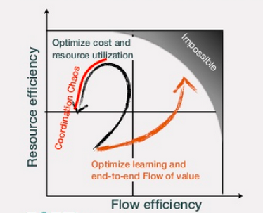

ifdef::collaborator-draft[]

==== Topics in organization and culture

****
*Collaborative*

_ 20160609 Status: Like most topics sections, this one will remain rough until 2nd draft. Suggestions appreciated._

include::../../../collab-links.adoc[]

****
2nd ed ideas

 Implication in various IT governance texts that the shared services team is accountable for optimal use of the shared resource. A very dangerous guideline when multiplied by numerous  COEs/SSs. Consumer is accountable for what they consume.

 combining agile and "non-agile" teams - plan-centricity can be a mask for poor demand management & multi-tasking

 (from Cohn) In paper describing Scrum, Takeuchi and Nonaka identified
 "subtle control" as one of its six principles. They list staffing decisions as .1 key  management responsibility.  Selecting the right people for the project team while monitor ing shifts in group dynamics and adding or dropping members when necessary [is a key management responsibility].'"We would add an older and more conservative member to the team should the balance shift too much toward radicalism," said a Honda...

 minimal friction to spin teams up/down (Abbott mentioned i think)
 even when you can easily form teams - this is a big deal
 represents what might become a long term high value investment
 NOT a VM to be torn down and spun up repeatedly - also consistent w/Josh Arnold's thoughts in fund team not project

 Mintzberg coordination approaches - chapter 9

 Process as a Mintzberg liaison mechanism

 1 execution in context - feedback loops between levels - differing cadences (Anderson cadences)

 incorporate _Work Rules_

Dojo approach!

Culture change - lighthouse projects

 incorporate Carol Dweck

 Abbott 4-box p 110, performance/behavior

 Resource management is a terrible name. We will use it anyways.
 Todo: get permission for Dilbert cartoon "We're human beings not resources" http://dilbert.com/strip/1995-09-22

 ===== Efficiency versus flow

Here is a depiction of one dysfunctional pattern, from an interesting presentation by Ari Tikka <<Tikka2013>>, that can emerge in navigating this tension:

The above slide is worth a careful examination. The idea is that the more effective you are at product flow, the further to the right you are. The more efficient you are with your resources, the further up you are. It is easy to be completely efficient with resources, and have no flow. It is also possible to be very good at flow, but at the cost of little resource efficiency. Being excellent at both, however, is impossible - there is an outer boundary.

Also, there is an interesting dynamic if you seek too much resource efficiency. Loading staff more and more heavily has counterproductive results, in which flow actually decreases, and the resulting "coordination chaos" also decreases resource efficiency in a vicious reinforcing feedback loop.

 The mainstreaming of IT into the business- "Rogue" IT - Convergence diagram.

 ad-hoc & governance structures, committees

 Communities of practice
originated by Wenger, McDermott, and Snyder2002.

Types of COPs

 (forward ref to chap 9 shared svcs, Part IV lifecycles)

 Adam Smith and Frederick Taylor
- Taylor & cultural antipatterns (including the 'you just don't get X' antipattern)

 Bi-modal IT, a critique

 [to be written]

reference http://www.computerweekly.com/feature/How-CIOs-can-ramp-up-their-IT-clock-speed-as-pressure-grows[How CIOs can raise their 'IT clock speed' as pressure to innovate grows]

 Solving for decisionmaking & governance
No choice but to allocate fine-grained decision rights between product lines & guilds. See Reinertsen/Smith.

 Org change management -
 ProSci/ADKAR, Lean Change Mgmt

 the limits to "you build it, you run it" - employees are not owners...

 culture leads, compliance lags

 The problem of epistemic closure

 Toyota Way quadrant as cited in <<Cohn2010>> p145

 IT and learning (Langer)

 The business within a business paradigm has failed

 Microservices.... important - how multiple services interact.

 The rise of coaching

 incentives - making across the board incentives work, Knez 2002, harvard biz review

 Etsy : designated vs dedicated - Kevin M discussion - mentioned there was talk @ DevOpsDays MSP 2015

 Training Within Industry

 Github abandoning flat structure http://www.bloomberg.com/news/articles/2016-09-06/why-github-finally-abandoned-its-bossless-workplace

  Connor:Discussing Design: Improving Communication and Collaboration through Critique

   include http://www.slideshare.net/meetfelipe/slides-agile2016-stop-using-agile-with-waterfall-goals-goal-agility-with-okr
   https://www.amazon.com/dp/1119252393/ref=cm_sw_r_tw_awdo_x_YQKZxb3GM0P4P

   think more about whether OKR belongs Part II or III

   allspaw on joint activity. requires common ground of understanding and a compact of joint action http://paperswelove.org/2016/video/john-allspaw-common-ground/?utm_content=buffer893c4&utm_medium=social&utm_source=twitter.com&utm_campaign=buffer

   Permanent versus temporary are only two types of teams; others include committees, task forces, virtual teams, and more <<Management2016>>.

[quote, Alan Turing, Lecture on the Automated Computing Engine -- 1947]
Roughly speaking those who work in connection with the [Automated Computing Engine] will be divided into its masters and its servants. Its masters will plan out instruction tables for it, thinking up deeper and deeper ways of using it. Its servants will feed it with cards as it calls for them. They will put right any parts that go wrong. They will assemble data that it requires. In fact the servants will take the place of limbs... +
 +
As time goes on the calculator itself will take over the functions both of masters and of servants. The servants will be replaced by mechanical and electrical limbs and sense organs… The masters are liable to get replaced because as soon as any technique becomes at all stereotyped it becomes possible to devise a set of instruction tables which will enable the electronic computer to do it for itself…”

 ===== Basic ingredients & factors
* communication norms
* decision making norms
* conflict resolution norms
** causes
*** facts
*** methods
*** goals
*** values
** resolution mech
*** competition
*** collaboration
*** accommodation

getting to yes, etc - conflict resolution processes/lit

forming/storming/norming/performing

 == more on frameworks
 *** The broken ITOM
   NOW we are ready to talk about the frameworks, which have implications across all of Part III and are dangerous power tools without a governing framework to control them and intrepret them. My framework as "requisite variety."

   "The focus is on the customer, and there is the general belief that to pursue that principle efficiently a process-oriented approach has to be adopted" Van Bon et al ITSM guide - badly flawed... scope of relevant process is narrowing...

   Process capability is the inherent variation of the process in relation to the specification limits. The smaller the process variation, the better the process's capability. <<Kan1995>> - in light of CMMI

   http://blogs.forrester.com/jean_pierre_garbani/09-06-26-my_issue_itil

  CPRET is a mnemonic for the basic definition of process in process engineering: it stands for Constraints, Product, Resources, input Elements and Transformation which are the basic components of a process. In process engineering, a process is a suite of transformations of elements into a given output (product) given a set of constraints and resources. From this definition, we can see that technology has a strong influence on the process: the transformation part is a clear function of the technology available as input and resources in IT are strongly influenced by the technology used. As we mostly deal with information and data in IT management processes, the type of data available is either helping or impeding the transformation part.

  Digital services playbook  https://playbook.cio.gov/#play10

  Add failure of risk management quote from Hubbard p 73 - use of scoring methods
  Sutton observations on CMM: stipulates/strongly advocates functional specialization

endif::collaborator-draft[]
