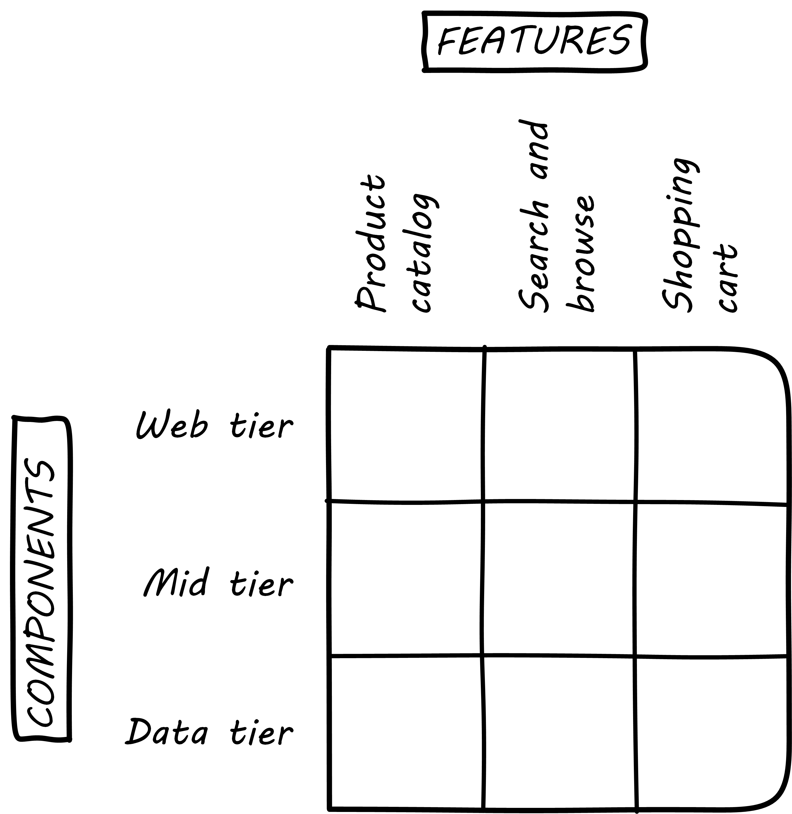

==== Conway's law

===== The importance of team structure

This chapter is titled "Conway's law." So who was Conway and why is his law so important as we move to a team of teams? Melvin Conway is a computer programmer who worked on early compilers and programming languages. In 1967 he proposed the thesis that:

_Any organization that designs a system (defined broadly) will produce a design whose structure is a copy of the organization's communication structure_ <<Conway1968>>.

What does this mean? If we establish two teams, each team will build a piece of functionality (a feature or component). They will think in terms of "our stuff" and "their stuff" and the interactions (or _interface_) between the two. Perhaps this seems obvious, but as you scale up it's critical to keep in mind. In particular, as you segment your organization along the xref:AKF-cube[AKF z-axis], you will need to keep in mind the difference between features and components. You are on a path to have dozens or hundreds of such teams. The decisions you make today on how to divide functionality and work will determine your operating model far into the future.

The most important choice at this point is between segmenting along feature lines, versus segmenting along component lines. What do we mean by this?

anchor:2.04.02-features-v-components[]
anchor:feature-v-component[]

====== Features vs. components

Features are *what* your product *does*. They are what the customers perceive as valuable. “Scope as viewed by the customer” as <<Kennaley2010>> says (p. 169). They may be "xref:flower-and-cog[flowers]" -- defined by the value they provide externally, and encouraged to evolve with some freedom.

Components are *how* your product is *built*, such as database vs. Web components. In other words, they are a form of infrastructure (but infrastructure you may need to build yourself, rather than just spin up in the Cloud). They are more likely to be "xref:flower-and-cog[cogs]" -  more constrained and engineered to specifications.

.Features versus components

Feature teams are dedicated to a clearly defined functional scope, while component teams are defined by their technology platform. Component teams may become shared services, which need to be carefully understood and managed (more on this to come). It may be easy to say that features are more important than components, but this can easily be carried too far. Do you want each feature team choosing its own database? This might not be the best idea. Allowing feature teams to define their own technical direction can result in brittle, fragmented architectures, technical debt, and rework.

Software product management needs to be a careful balance between these two perspectives. The Scaled Agile Framework suggests that components are relatively

* more technically focused
* more generally re-usable

than features. SAFE also recommends a ratio of roughly 20-25% component teams to 75%-80% feature teams <<SAFE2016>>.
