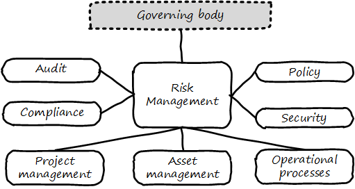

anchor:risk-management[risk management]

==== Risk management

===== Risk management fundamentals

[quote, Committee of Sponsoring Organizations of the Treadway Commission, Internal Control - Integrated Framework]
Risk is defined as the possibility that an event will occur and adversely affect the achievement of objectives.

Risk is a fundamental concern of governance. Management (as we have defined it in this chapter section) may focus on effectiveness and efficiency well enough, but too often disregards risk.

As we noted above, the shop manager may have incentives to maximize income, but usually does not stand to lose their life savings. The owner, however, does. Fire, theft, disaster - without risk management, the owner does not sleep well.

For this reason, risk management is a large element of governance, as indicated by the popular GRC acronym: Governance, Risk, and Compliance.

****
*Defining "Risk"*

The definition of "risk" is surprisingly controversial. The ISO 31000 standard <<ISO2009>> and the Project Management Institute's PMBOK <<PMI2013>>  both define risk as including positive outcomes (benefits).  This definition has been strongly criticized by (among others) Douglas Hubbard in _The Failure of Risk Management_ <<Hubbard2009>>. Hubbard points out that traditionally, risk has meant the chance and consequences of loss.

As this is an an overview text, we will use the more pragmatic, historical definition. Practically speaking, Operational Risk Management  as a function focuses on loss. The possibility ("risk") of benefits is eagerly sought by the organization as a whole and does not need "management" by a dedicated function.

"Loss," however, can also equate to "failure to achieve anticipated gains." This form of risk applies (for example) to product and project investments.

ifdef::collaborator-draft[]
 add risk v uncertainty Hubbard

endif::collaborator-draft[]

****

Risk management can be seen as both a xref:process-function[function and a process]. As a function, it may be managed by a dedicated organization (perhaps called Enterprise Risk Management or Operational Risk Management.) As a process, it conducts the following activities:

* Identifying risks
* Assessing and prioritizing them
* Coordinating effective responses to risks
* Ongoing monitoring and reporting of risk management

Risk impacts some asset. Examples in the digital and IT context would include:

* Operational IT systems
* Hardware (e.g. computers) and facilities (e.g. data centers)
* Information (customer or patient records)

It is commonly said that organizations have an "appetite" for risk (<<ISACA2013>>, p. 79), in terms of the amount of risk the organization is willing to accept. This is a strategic decision, usually reserved for organizational governance.

.Risk management context

Risk management typically has strong relationships with the following organizational capabilities:

* Enterprise governance (e.g. board-level committees)
* Security
* Compliance
* Audit
* Policy management

For example, security requires risk assessment as a input, so that security resources focus on the correct priorities.

Risk additionally may interact with:

* Project management
* Asset management
* Processes such as Change Management

and other digital activities.

More detail on core risk management activities follows, largely adopted from the COBIT for Risk publication (<<ISACA2013>>).

====== Risk identification

There are a wide variety of potential risks, and many accounts and anecdotes constantly circulating. It is critical that risk identification start with a firm understanding of the organization's objectives and context.

Risk identification can occur both in a "top down" and "bottom up" manner. Industry guidance can assist the operational risk management function in identifying typical risks. For example, the COBIT for Risk publication includes a useful 8 page "Generic Risk Scenarios" section (<<ISACA2013>>, pp. 67-74) identifying risks such as

* "Wrong programmes are selected for implementation and are misaligned with corporate strategy and priorities"
* "There is an earthquake."
* "Sensitive data is lost/disclosed through
logical attacks."

These are only three of dozens of scenarios. Risks of course extend over a wide variety of areas:

* Investment
* Sourcing
* Operations
* Availability
* Continuity
* Security

and so forth. The same guidance also strongly cautions against over-reliance on these generic scenarios.

====== Risk assessment

Risk management has a variety of concepts and techniques both qualitative and quantitative. Risk is often assumed to be the product of probability * impact. For example, if the chance of a fire in a facility is 5% over a given year, and the damage of the fire is estimated at $100,000, the annual risk is $5,000. An enterprise risk management function may attempt to quantify all such risks into an overall portfolio.

Where quantitative approaches are perceived to be difficult, risk may be assessed using simple ordinal scales (e.g. 1-5, where 1 is low risk and 5 is high risk.) COBIT for Risk expresses concern regarding "The use of ordinal scales for expressing risk in different categories, and the mathematical difficulties or dangers of using these numbers to do any sort of calculation." <<ISACA2013>>, p. 75. Such approaches are criticized by Doug Hubbard in _The Failure of Risk Management_ as misleading and potentially more harmful than not managing risk at all <<Hubbard2009>>.

Hubbard instead suggests that quantitative techniques such as Monte Carlo analysis are rarely infeasible, and recommends their application instead of subjective scales.

The enterprise can also consider evaluating scenarios that have a chance of occurring simultaneously. This is frequently referred to as ‘stress’ testing.

====== Risk response
[quote, Menander, 342 BC - 291 BC]
He who fights and runs away, lives to fight another day.

Risk response includes several approaches:

* Avoidance
* Acceptance
* Transference
* Mitigation

*Avoidance* means ending the activities or conditions causing the risk; e.g., not engaging in a given initiative or moving operations away from risk factors.

*Acceptance* means no action is taken. Typically, such "acceptance" must reside with an executive.

*Transference* means that some sharing arrangement, usually involving financial consideration, is established. Common transfer mechanisms include outsourcing and insurance. (Recall our discussion of Agile approaches to xref:contract-mgmt[contract management] and risk sharing.)

*Mitigation* means that some compensating mechanism -- one or more "controls" is established. This topic is covered in the next section, and comprises the remainder of the material on risk management.

_The above discussion was largely derived from <<ISACA2013>>_.

anchor:controls[]

====== Controls
[quote, ISACA, COBIT 5 for Assurance]
The term 'control objective' is no longer a mainstream term used in COBIT 5, and the word 'control' is used only rarely. Instead, COBIT 5 uses the concepts of process practices and process activities.

The term "control" is problematic.

It has distasteful connotations to those who casually encounter it, evoking images of "command and control" management, or "controlling" personalities.  COBIT, which once stood for Control Objectives for IT, now deprecates the term control (see the above quote). Yet it retains a prominent role in many discussions of enterprise governance and risk management, as we saw at the start of this chapter in the discussion of xref:COSO-control[COSO's general concept of control].

And (as discussed in our coverage of xref:empirical-process-control[Scrum's origins]) it is a technical term of art in systems engineering. As such it represents principles essential to understanding large scale digital organizations.

In this section, we are concerned with controls in a narrower sense, as risk mitigators.

As noted above, ISACA replaced the term "controls" with process practices & activities, which are specific examples of enablers. As controls, enablers such as policies, procedures, organizational structures, and the rest are used and intended to ensure that:

* investments achieve their intended outcomes;
* resources are used responsibly, and protected from fraud, theft, abuse, waste, and mismanagement;
* laws and regulations are adhered to; and
* timely and reliable information is employed for decision making.

NOTE: You will likely encounter the term control as "testing enablers" is not how security personnel and auditors talk.

But what are examples of "controls"? Take a risk, such as the risk of a service (e.g. ecommerce Web site) outage resulting in loss of critical revenues.

There are a number of ways we might attempt to mitigate this risk:

* Configuration management (a *preventative* control)
* Effective monitoring of system alerts (a *detective* control)
* Documented operational responses to detected issues (a *corrective* control)
* Clear recovery protocols that are practiced and well understood (a *recovery* control)
* System redundancy of key components where appropriate (a *compensating* control)

and so forth. Another kind of control appropriate to other risks is *deterrent* (e.g. an armed guard at a bank).

Other types of frequently seen controls include:

* Separation of duties
* Audit trails
* Documentation
* Standards and guidelines

A control type such as "Separation of duties" is very general and might be specified by activity type, e.g.

* Purchasing
* System development and release
* Sales revenue recognition

Each of these would require distinct approaches to separation of duties. Some of this may be explicitly defined; if there is no policy or control specific to a given activity, an auditor may identify this as a deficiency.

Policies and processes in their aspect as controls are often what auditors test. In the case of the web site above, an auditor might test the configuration management approach, the operational processes, inspect the system redundancy, and so forth. And risk management would maintain an ongoing interest in the system in between audits.

As with most topics in this book, risk management (in and of itself, as well as applied to IT and digital) is an extensive and complex domain, and this discussion was necessarily brief. The student is referred to the readings at the end of the chapter for further information.

anchor:business-continuity[]

====== Business continuity

Business continuity is an applied domain of IT risk, like security. Continuity is concerned with large scale disruptions to organizational operations, such as:

* Floods
* Earthquakes
* Tornadoes
* Terrorism
* Hurricanes
* Industrial catastrophes (e.g. large scale chemical spills)

A distinction is commonly made between:

* Business Continuity Planning
* Disaster Recovery

*Disaster recovery* is more tactical, including the specific actions taken during the disaster to mitigate damage and restore operations.

*Continuity planning* takes a longer term view of matters such as long-term availability of replacement space and computing capacity.

There are a variety of standards covering business continuity planning, including:

* NIST Special Publication 800-34
* ISO/IEC 27031:2011
* ISO 22301

In general, continuity planning starts with understanding business impact of various disaster scenarios and developing plans to counter them. Traditional guidance suggests that this be done in a centralized fashion; however, large, centralized efforts of this nature tend to struggle for funding.

While automation alone cannot solve problems such as "where do we put the people if our main call center is destroyed," it can help considerably in terms of recovering from disasters. If a company has been diligent in applying xref:infracode[Infrastructure as Code] techniques, and loses its data center, it can theoretically re-establish its system configurations readily, which can otherwise be a very challenging process, especially under time constraints. (Data still needs to have been backed up to multiple locations.)

anchor:compliance[]

===== Compliance

Compliance is a very general term meaning conformity or adherence to

* laws
* regulations
* policies
* contracts
* standards

and the like. Corporate compliance functions may first be attentive to legal and regulatory compliance, but the other forms of compliance are matters of concern as well.

A corporate compliance office may be responsible for the maintenance of organizational policies and related training and education, perhaps in partnership with the HR department. They also may monitor and report on the state of organizational compliance. Compliance offices may also be responsible for codes of ethics. Finally, they may manage channels for anonymous reporting of ethics and policy violations by whistleblowers (individuals who become aware of and wish to report violations while receiving guarantees of protection from retaliation).

Compliance uses techniques similar to risk management, and in fact non-compliance can be managed as a form of risk, and prioritized and handled much the same way. However, compliance is an information problem as well as a risk problem. There is an ongoing stream of regulations to track, which keeps compliance professionals very busy. In the U.S. alone, these include:

 * HIPAA
 * SOX
 * FERPA
 * PCI DSS
 * GLBA PII (NIST)

Some of these regulations specifically call for policy management, and therefore companies that are subject to them may need to institute formal governance earlier than other companies, in terms of the emergence model. Many of them provide penalties for the mis-management of data, which we will discuss further in the next chapter section and in Chapter 11. Compliance also includes compliance with the courts (e.g. civil and criminal actions). This will be discussed in the Chapter 11 section on cyberlaw.
