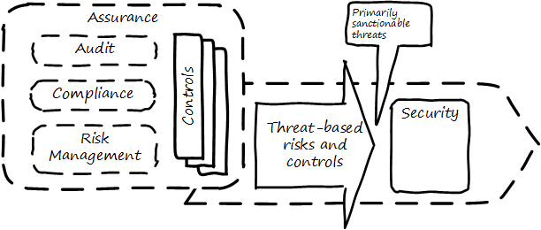
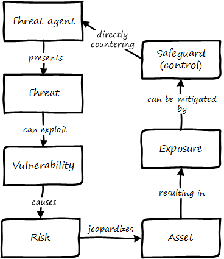
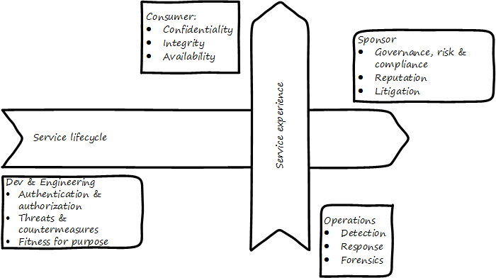

anchor:security[]

==== Security

[quote, Sandy Bacik, Enernex]
A measure of system’s ability to resist unauthorized attempts at usage or behavior modification, while still providing service to legitimate users.

[quote, Shon Harris, Guide to the CISSP]
In reality, organizations have many other things to do than practice security.

You have been practicing security since you first selected your initial choice of development platform in Chapter 2. But by now, your security capability is a well-established organization with processes spanning the enterprise, and a cross-functional steering committee composed of senior executives and with direct access to Board governance channels.

Security is a significant and well-known domain in and of itself. Ultimately, however, *security is an _application_ of the governance and risk management principles discussed in the previous sections*. Deriving ultimately from the stakeholder's desire to sustain and protect the enterprise (see <<fig-security-600-c>>), security relies on

* accurate xref:risk-management[risk]
 assessment,
* a clear xref:controls[controls] strategy, and
* effective xref:assurance[assurance] practices (e.g. security xref:audit[audits]).

[[fig-security-600-c]]
.Security context

So what distinguishes security from more general concepts of risk? The definition at the top of this chapter Part Is a good start, with its mention of "unauthorized attempts" to access or modify systems. The above graphic uses the term "sanctionable," meaning violations might lead to legal or at least organizational penalties.

Many risks might involve carelessness, or incompetence, or random technical failure, or accidents of nature. They might even involve fraud or misrepresentation. But security focuses on violations (primarily intentional, but also unintentional) of policies protecting organizational assets. In fact, "Assets Protection" is a common alternate name for corporate security.

"Authorization" is a key concept. Given some valuable resource, is access restricted to those who ought to have it? Are they who they say they are? Do they have the right to access what they claim is theirs? Are they conducting themselves in an expected and approved manner?

The security mentality is very different from the  mentality found in a startup. A military analogy might be helpful. Being in a startup is like engaging in missions: search, extract, destroy, etc. One travels to a destination and operates with a single-point focus on completion.

Security on the other hand is like defending a perimeter. You have to think broadly across a large area, assessing weaknesses and distributing limited resources where they will have the greatest effect.

anchor:security-taxonomy[]

This is where a systematic approach, including an accepted set of terminology, becomes key. The CISSP (Certified Information Systems Security Professional) guide proposes the following taxonomy:

* Vulnerability
* Threat agent
* Threat
* Risk
* Control
* Exposure
* Safeguard (e.g. control or enabler)

These terms are best understood in terms of their relationships, which are graphically illustrated <<fig-security-taxonomy-400-c>> footnote:[similar to CISSP, cite:[Harris2013].

[[fig-security-taxonomy-400-c]]
.Security taxonomy

In implementing controls, the primary principles are:

* Availability. The asset must be accessible to those entitled to it.
* Integrity. The asset must be protected from destruction or corruption.
* Confidentiality. The asset must not be accessible to those not entitled to it.

anchor:four-level-info-classification[]

===== Information classification
[quote, ISACA, Cobit 5 for Security]
At a time when the significance of information and related technologies is increasing in every aspect of business and public life, the need to mitigate information risk, which includes protecting information and related IT assets from ever-changing threats, is constantly intensifying.

Before we turn to security engineering and security operations, we need to understand the business context of security. The assets at risk are an important factor, and risk management gives us a good general framework. One additional technique associated with security is information classification. A basic hierarchy is often used, such as:

* Public
* Internal
* Confidential
* Restricted

The military uses the well known levels of:

* Unclassified
* Confidential
* Secret
* Top Secret

These classifications assist in establishing the security risk and necessary controls for a given digital system and/or process.

Information also can be categorized by subject area. This becomes important from a compliance point of view. This will be discussed in Chapter 11, in the chapter section on Records Management.

===== Security engineering
For the next two sections, we will adopt a "2-axis" view, first proposed in cite:[Betz2011a].

In this model, the systems lifecycle is considered along the horizontal access, and the user experience is considered along the vertical access (which also maps to the "stack.") In the following picture, we see the distinct concerns of the various stakeholders in the xref:dual-axis-vc[dual-axis model] (see <<fig-dual-axis-security-800-c>>).

[[fig-dual-axis-security-800-c]]
.Security and the dual-axis value chain

====== Consumer versus sponsor perspective
The consumer of the digital service has different concerns from the sponsor/customer (in our xref:consumer-customer-sponsor[3-party model]). The consumer (our woman xref:what-is-IT-value[checking her bank balance]) is concerned with immediate aspects of confidentiality, integrity, and availability:

* Is this communication private?
* Is my money secure?
* Can I view my balance and do other operations with it (e.g. transfer it) confident of no interference?

The sponsor on the other hand has derivative concerns:

* Are we safe from the bad publicity that would result from a breach?
* Are compliant with laws and regulations, or are we risking penalties for non-compliance (as well as risking security issues?)
* Are our security activities as cost-efficient as possible, given our risk appetite?

====== Security architecture

Security engineering is concerned with the fundamental security capabilities of the system, as well as ensuring that any initial principles established for the system are adhered to as development proceeds, and/or as vendors are selected and perhaps replaced over time.

There are multitudes of books written on security from an engineering, architecture and development perspective. The tools, techniques, and capabilities evolve quickly every year, which is why having a fundamental business understanding based in a stable framework of risk and control is essential.

This is a book on management, so we are not covering  technical security practices and principles, any more than we are covering specific programming languages or distributed systems engineering specifics. Studying for the Certified Information Systems Security Professional exam will provide both an understanding of security management, as well as current technical topics. A glance at the CISSP guide shows how involved such topics can be:

* The Harrison-Rizzo-Ullman security model
* The Diffie-Hellman Asymmetrical Encryption Algorithm
* Functions and Protocols in the OSI Model

Again, the issue is mapping such technical topics to the fundamentals of risk and control. Key topics we note here include:

* Authentication & authorization
* Network security
* Cryptography

*Authentication and authorization* are the cornerstones of *access*, i.e. the gateway to the asset. *Authentication* confirms that a person is who they say they are. *Authorization* is the management of their access rights (can they see the payroll? reset others' passwords?)

*Network security* is a complex sub-domain in and of itself. Because attacks typically transpire over the Internet and/or internal organizational networks, the structure and capabilities of networks are of critical concern, including topics such as:

* Routing
* Firewalls
* the Domain Name Service

Finally, *cryptography* is the "storage and transmission of data in a form that only those it is intended for can read and process" cite:[Harris2013].

All of these topics, and many more, require in depth study and staff development. At this writing (mid-2016), there is a notable shortage of skilled security professionals. Therefore, a critical risk is that your organization might not be able to hire people with the needed skills (consider our section on xref:resource-mgmt[resource management])

====== Security and SDLC
Security is a concern throughout the application lifecycle. You already know this, otherwise you would not have reached enterprise scale. But now you need to formalize it with some consistency, as that is what regulators and auditors expect, and it also makes it easier for your staff to work on various systems.

Security should be considered throughout the SDLC, including systems design, but this is easier said than done. Organizations will always be more interested in a system's functionality than its security. However, a security breach can ruin a company.

The CISSP recommends (among other topics) consideration of the following throughout the systems lifecycle:

* The role of environmental (e.g. operating system-level) safeguards versus internal application controls
* The challenges of testing security functionality
* Default implementation issues
* Ongoing monitoring

Increasingly important controls during the construction process in particular are:

* Code reviews
* Automated code analysis

We discuss the Netflix xref:simian-army[Simian Army] -- an important automated tool that can serve as a control -- in the next chapter section.

anchor:sourcing-and-security[]

====== Sourcing and security

Vendors come and go in the digital marketplace, offering thousands of software-based products across every domain of interest (we call this the xref:tech-prod-lifecycle[technology product lifecycle]). Inevitably, these products have security errors. A vendor may issue a "patch" for such an error, which must be applied to all instances of the running software. Such patches are not without risk, and may break existing systems; they therefore require testing under conditions of urgency.

Increasingly, software is offered as a service, in which case it is the vendor responsibility to patch their own code. But what if they are slow to do this? Any customer relying on their service is running risk, and other controls may be required to mitigate the exposure.

anchor:nist-nvd[]

One important source of vulnerabilities is the https://nvd.nist.gov/[National Vulnerability Database] supported by the National Institute for Standards and Technology. In this database, you can look up various products and see if they have known security holes. Using NVD is complex and not something that can be simply and easily "implemented" in a given environment, but it does represent an important, free, taxpayer-supported resource of use to security managers.

An important type of vulnerability is the "zero-day" vulnerability. With this kind of vulnerability, knowledge of a security "hole" becomes widespread before any patches are available (i.e., the software's author and users have "zero days" to create and deploy a fix). Zero-day exploits require fast and aggressive application of alternate controls, which leads us to the topic of security operations.

===== Security operations
[quote, Shon Harris, Guide to the CISSP]
Networks and computing environments are evolving entities; just because they are secure one week does not mean they are secure three weeks later.

Security requires ongoing xref:ops-day-in-life[operational attention]. Security operations is first and foremost a form of operations, as discussed in xref:ops-mgmt[Chapter 6]. It requires on-duty and on-call personnel, and some physical or virtual point of shared awareness (for example, a physical Security Operations Center, perhaps co-located with a Network Operations Center). Beyond the visible presence of a Security Operations Center, various activities must be sustained. These can be categorized into four major areas:

anchor:security-process[]

* Prevention
* Detection
* Response
* Forensics

====== Prevention

An organization's understanding for what constitutes a "secure" system is continually evolving. New threats continually emerge and the alert security administrator has an ongoing firehose of bulletins, alerts, patch notifications, and the like to keep abreast of.

These inputs must be synthesized by an organization's security team into a set of security standards for what constitutes a satisfactorily-configured ("hardened") system. Ideally, such standards are automated into policy-driven systems configuration approaches; in less ideal situations, manual configuration -- and double-checking -- is required.

Prevention activities include:

* maintaining signatures for intrusion detection and  and anti-virus systems
* software patching (e.g. driven by the xref:tech-prod-lifecycle[technology product lifeccyle] and updates to the xref:nist-nvd[National Vulnerability Database])
* ongoing maintenance of user authorizations and authentication levels
* ongoing testing of security controls (e.g., firewalls, configurations, etc.)
* updating security controls appropriately for new or changed systems

====== Detection

There are many kinds of events that might indicate some security issue; systems exposed to the open Internet are continually scanned by a wide variety of often-hostile actors. Internal events, such as unscheduled/unexplained system restarts, may also indicate security issues. The challenge with security monitoring is identifying patterns indicating more advanced or persistent threats. When formalized, such patterns are called "signatures."

One particular form of event that can be identified for systems under management are configuration state changes.

For example, if a core operating system file -- one that is well known and not expected to change -- changes in size one day with no explanation, this might be indicative of a security exploit. Perhaps an attacker has substituted this file with one containing a "backdoor" allowing access. Tools such as Tripwire are deployed to scan and inventory such files and key information about them ("metadata") and raise alerts if unexpected changes occur. Infrastructure managers such as Chef and Puppet may also serve as inputs into security event management systems; for example, they may detect attempts to alter critical configuration files and in their re-converging the managed resource back to its desired state, can be a source of valuable information about potential exploits. Such tools also may be cited as controls for various kinds of security risks.

We have discussed the importance of configuration management in both Chapter 2 and Chapter 6. In Chapter 2, we discussed the important concept of xref:infracode[Infrastructure as Code] and xref:policy-config[policy-driven configuration management]; we revisited the importance of configuration management from an operational perspective in xref:state-config-discovery[Chapter 6]. Configuration management also will re-appear in Chapters 11 and 12.

IMPORTANT: It should be clear by now that configuration management is one of the most critical enabling capabilities for digital management, regardless of whether you look to traditional IT service management practices or modern DevOps approaches.

Detection activities include:

* monitoring events and alerts from intrusion detection and related operational systems
* Analyzing logs and other artifacts for evidence of exploits

====== Response

Security incidents require responses. Activities include:

* Declaring security incidents
* Marshalling resources (staff, consultants, law enforcement) to combat
* Developing immediate tactical understanding of the situation
* Developing a response plan, under time constraints
* Executing the plan, including ongoing monitoring of effectiveness and tactical correction as needed
* Keeping stakeholders informed as to situation

====== Forensics

Finally, security incidents require careful after-the-fact analysis:

* Analyzing logs and other artifacts for evidence of exploits
* Researching security incidents to establish causal factors and develop new preventative approaches (thus closing the loop)

====== Relationship to other processes

As with operations as a whole, there is ongoing monitoring and reporting to various stakeholders, and interaction with other processes.

One of the most important operational processes from a security perspective is Change Management. Configuration state changes (potentially indicating an exploit in progress) should be reconciled first to Change Management records. Security response may also require emergency Change processes. ITSM Event and Incident Management may be leveraged as well.

NOTE: The particular concerns of security may interfere with cross-process coordination. This is a topic beyond the scope of this book.

===== Security and assurance
[quote, Latin for "Who watches the watchers?"]
Quis custodiet ipsos custodes?

Given the critical importance of security in digital organizations, it is an essential matter for governance attention at the highest levels.

Security management professionals are accountable to governance concerns just as any other manager in the digital organization. Security policies, processes, and standards are frequently audited, by both internal auditors as well as external xref:assurance[assurance] professionals (not only auditors, but other forms of assurance as well).

The idea that an "Assets Protection" group might itself be audited may be hard to understand, but security organizations such as police organizations have Internal Affairs units for just such purposes.

Security auditors might review the xref:security-process[security processes] mentioned above, or system configuration baselines, or log files, or any number of other artifacts, depending on the goals and scope of a security audit. Actual penetration testing is a frequently used approach: the hiring of skilled "white-hat" hackers to probe an organization's defenses. Such hackers might be given license to probe as far as they possibly can and return with comprehensive evidence of what they were able to access (customer records, payrolls, account numbers and balances, etc.)

ifdef::collaborator-draft[]

 acronym: DFIR, Digital Forensics and Incident Response

endif::collaborator-draft[]
