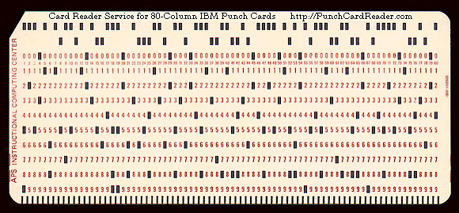

==== Information and value

[quote, William Kent, Data and Reality]
...life and reality are at bottom amorphous, disordered, contradictory, inconsistent, non-rational, and non-objective. Science and much of Western philosophy have in the past presented us with the illusion that things are otherwise. Rational views of the universe are idealized models that only approximate reality. The approximations are useful. The models are successful often enough in predicting the behavior of things that they provide a useful foundation for science and technology. But they are ultimately only approximations of reality...

[quote, The Data Management Body of Knowledge]
No enterprise can be effective without high quality data.

The two quotes above span the challenge of information management. Fundamentally, it is an illusion. We store data and records that are _representations_. They are merely partial reflections of reality, ambiguous and requiring interpretation.

And yet, these poor shadows of the real world are the basis for all digital business. Despite their limitations, the human race has been representing and recording information in myriad ways for thousands of years.

Suppose someone hands you a piece of paper with the following:

.Hashmarks

If you are of European descent, you might perceive this as the number twelve, or a count of twelve "somethings." What "somethings"? You don't know.

.How many trees? footnote:[_Image credit https://www.flickr.com/photos/bgreenlee/1389858104/, commercial use permitted_]

Someone might tell you that this is the number of trees on your neighbor's farm. That makes all the difference. But wait - you know for a fact that there are many more trees than 12! You inquire further and find out it is actually the number of producing apple trees, a very different concept.

But the number still isn't right; the person who counted the trees didn't know the proper boundaries of the farm, and counted some that didn't belong to your neighbor.

So what does this piece of paper represent?

anchor:writing-history[]

===== The origins of digital information

[quote, AncientScripts]
Writing provides a way of extending human memory by imprinting information into media less fickle than the human brain.

We've talked of xref:representation[representation] previously, in the context of task management. Common representation is essential to achieving xref:shared-mental-model[common ground], when human interactions are time or space shifted. Understanding representation is fundamental to understanding information.

.Sumerian cuneiform footnote:[_Image credit https://www.flickr.com/photos/auxesis/3920533954, commercial use permitted_]

Humans have been representing information since at least the creation of writing. As early as 3000 BCE, the ancient Sumerians used cuneiform to record -- among other things -- how much beer people got. (The more things change, the more they stay the same.)

Cuneiform was created by pressing wedge-shaped sticks into wet clay. A particular impression or set of impressions corresponded to a citizen, or how much grain they grew, or how much beer they received.

Certainly, the symbols below are not the same as the beer, or the grain, or the long-dead Sumerian. This may seem obvious, but it can be tempting to confuse the *representation* with the *reality*. This is known as the _reification fallacy_.

.Inca quipu footnote:[_Image credit https://www.flickr.com/photos/136041510@N05/24338977000, commercial use permitted_]

At around the same time as the Sumerians, the Inca empire in what is now Peru [?] also started to represent information. They used a radically different approach from the Sumerians: carefully knotted ropes:

We will talk more about *how* information is represented. But first we need to understand *why*.

NOTE: The website http://www.ancientscripts.com/[ancientscripts.com] has a wealth of comprehensive information on the history of writing (and therefore, information management) from its earliest techniques.

===== The measurable value of information
[quote, Doug Hubbard, How to Measure Anything]
Measurement: A quantitatively expressed reduction of uncertainty based on one or more observations.

Let's go back to our tree counting problem. Why do we want to count our apple trees?

We want to count them because we seek a higher level of confidence in our understanding of our assets. A quick visual scan of the trees might over or under estimate their quantity, and therefore the value of the land they are on.

We might count the neighbors' apple trees because we want to buy their orchard. We might count our sheep because we are thinking about going into business with our neighbor and we need to know what each side is bringing to the effort. All kinds of critical life and business decisions depend on having confidence in information.

In fact, there is often a cost to *not* having the information one needs. Suppose you are considering purchasing your neighbor's farm. You believe it has more trees on it, than it does in reality.  As a result you pay more than the land is worth, for example you pay 250 gold pieces when it was worth only 200. In this case, we can argue that the value of better information would have been 50 gold pieces.

If collecting the needed information (say, by bribing the local bartender who knows all the gossip) is 25 gold pieces, there would have been a 100% return in the investment of collecting the information.

How does this relate to data and information management? Let's consider another example.

Suppose you run the gas station in a small town. A very small town, so small that you know all your customers by name. Sometimes you extend them credit, but this is done on an honor system and neither you nor your customer writes anything down. (Yes, this is unrealistic, even for the smallest merchant, but consider it a thought experiment.)

.What do they owe you? footnote:[_Image credit https://www.flickr.com/photos/stevensnodgrass/6625148339, commercial use permitted_]

As the town grows, and your customers increase, you grow increasingly uncertain as to whether they all are paying you what they owe. You purchase a notebook and a pen (today's equivalent of clay tablets or knotted ropes) and start writing down the amounts owed you.

There is cost to this: both the paper and pen cost you money, as well as the time you are now spending on record keeping and not pumping gas or operating the cash register. The benefit however is that you are now certain that you are collecting money owed you. You might notice that your profit margins have gone up by 0.5%; that is the value of better record keeping.

There are opportunity costs. Perhaps you have to hire an attendant sooner. But there has clearly been return on your investment in better information management.

You expand further, and see that your paper-based system has gaps. The volume of transactions is now such that you again have uncertainty about whether you are receiving all the money owed you. You decide to automate, to invest in an electronic record keeping system. This might cost tens of thousands of dollars in one time and ongoing costs, but again you see that your profit margins on balance improve. Again, an increase in your certainty of information resulted in value.  (Of course in reality, you would stop extending credit personally and require your customers to use credit cards.)

The point of these examples is to emphasize that all information management can be understood in terms of the Doug Hubbard quote at the start of this chapter section: information is a reduction in uncertainty, whether regarding apple trees on a tract of land, or accounts receivable. And we can and should quantify the value of having the information, versus the cost of capturing and maintaining it.

Doug Hubbard, in the classic _How to Measure Anything_ <<Hubbard2010>>, asks the following questions when measurement is proposed (page 47):

1. What is the decision this measurement is supposed to support?
2. What is the definition of the thing being measured in terms of observable consequences?
3. How, exactly, does this thing matter to the decision being asked?
4. How much do you know about it now (i.e., what is your current level of uncertainty)?
5. What is the value of additional information?

As he states, "All measurements that have value must reduce the uncertainty of some that affects some decision with economic consequences." While Hubbard is proposing these questions in the context of particular analysis initiatives, they are also excellent questions to ask of *any* operational information management.

Information management, in the context of digital systems, adds value through improving efficiency, effectiveness, and optimizing risk (our three primary categories of value.) Since digital systems started off primarily as efficiency aids, we will discuss efficiency first.

===== Information, efficiency, and effectiveness

We have periodically discussed historical aspects of computing and digital systems, but not yet covered some of the fundamental motivations for their invention and development.

.Early "computers" (people not machines) footnote:[_Image credit https://www.flickr.com/photos/george_eastman_house/3334094680, downloaded 2016-11-27, no known restrictions_]

As technology progressed through the late 19th and early 20th centuries, applied mathematics became increasingly important in a wide variety of areas such as:

* Ballistics (e.g. artillery) calculations
* Cryptography
* Atomic weapons
* Aeronautics
* Stress and load calculations

Calculations were performed by "computers." These were not automated devices, but rather people, often women, tasked with endless, repetitive operation of simple adding machines, by which they manually executed tedious calculations to compile (for example) tables of trigonometric angles.

It was apparent at least since the mid-19th century that it would be possible to automate such calculation. In fact, mathematical devices had long existed, for example the abacus, Napiers' Bones, and the slide rule. But such devices had many limitations. The vision of automating digital calculations first came to practical realization through the work of Charles Babbage and Ada Lovelace.

.Babbage Difference Engine footnote:[_Image credit https://www.flickr.com/photos/tolomea/4847227935, commercial use permitted_]

****
*Charles Babbage, Ada Lovelace, and the Engines*

Charles Babbage (1791-1871) was a 19th century intellectual and inventor who devised the first practical apparatus for performing general purpose calculations. The ability to add sums and multiply limited numbers had long been automated [examples] but Babbage's "Difference Engine" was capable of more complex operations (calculating polynomials).

Babbage's Difference Engine (pictured in this chapter section) was not a general purpose computer, but as he was designing it he started to plan a more ambitious "Analytical Engine" which would have been a general purpose computer. However, designs for the Analytical Engine were never completed. Nor was even the Difference Engine successfully built during Babbage's lifetime, although its design was solid enough that at least one fully functioning examples has been constructed in recent years.

Ada Lovelace's (1815-1852) contribution was equally remarkable. She is generally credited with inventing the "algorithm," realizing that computation was a repeatable process that could be precisely specified, independently of its inputs and outputs - a signature intellectual moment for the human race.

To characterize these two remarkable historical figures affectionately in terms of this book, Babbage was the first infrastructure engineer, and Lovelace the first applications developer.

For a fun, accessible, and charming exploration of their activities, read _The Thrilling Adventures of Lovelace and Babbage: The (Mostly) True Story of the First Computer_ <<Padua2015>>.
****

After Babbage, the development of automated computation encountered a hiatus. Purely mechanical approaches based on gears and rods could not scale, and the manufacturing technology of Babbage's day was inadequate to his visions - the necessary precision and power could not be achieved for implementing a general purpose computer using his legions of gears, cams, and drive shafts.

However, mathematicians continued to explore these areas, culminating in the work of Alan Turing who established both the potential and the limits of computing, initially as a by-product of investigations into certain mathematical problems of interest at the time.

Around the same time, the legendary telecommunications engineer Claude Shannon had developed essential underpinning engineering in expressing Boolean logic in terms of electronic circuits and rigorous mathematical theory describing the fundamental characteristics and limitations of information transmission (e.g. the physical limits of copying one bit of data from one location from another) <<Shannon1949>>.

Advances in materials and manufacturing technique resulted in the vacuum tube, ideally suited to the combination of Shannon digital logic with Turing's theories of computation, and thus the computer was born. It's generally recognized that the first practical general purpose computer was developed by the German Konrad Zuse.

Turing and a fast-growing cohort of peers driven by (among other things) the necessities of World War II developed both theory and the necessary practical understandings to automate digital computation. The earliest machines were used to calculate artillery trajectories. During World War II, mathematicians and physicists such as John von Neumann recognized the potential of automated computation, and so computers were soon also used to  simulate nuclear explosions. This was a critical leap beyond the limits of manual "computers" pounding out calculations on adding machines.

anchor:paper-to-digital[]

.Punchcard footnote:[_Image credit https://www.flickr.com/photos/129953653@N05/16540457804, commercial use permitted_]

The business world was also attentive to the development of computers. Punched cards had been used for storing data for decades preceding the invention of automated computers. Record keeping at scale has always been challenging - the number of Sumerian clay tablets still in existence testifies to that! Industrial-era banks, insurers, and counting-houses managed massive repositories of paper journals and files, at great cost. A new form of professional, the "white collar worker" emerged.

Any means of reducing the cost of this record keeping was of keen interest. Paper files were replaced by punched cards. Laborious manual tabulation was replaced by mechanical and electro-mechanical techniques, that could for example calculate sums and averages across a stack of punched cards, or sort through the stack, compare it against a control card and sort the cards accordingly.

.Card Sorter footnote:[_Image credit https://www.flickr.com/photos/pargon/2444932424, commercial use permitted_]

During World War II, many business professionals found themselves in the military, and some encountered the new electronic computers being used to calculate artillery trajectories or decrypt enemy messages. Edmund Berkeley, the first secretary of the Association for Computing Machinery, was one such professional who grasped the the potential of the new technology <<Akera2007>>. After the war, Berkeley advocated for the use of these machines to the leadership of the Prudential insurance company, while others did the same in the United Kingdom.

What is the legacy of Babbage and Lovelace and their successors in terms of today's digital economy? The reality is that digital value for the first 60 years of fully automated computing systems was primarily in service of efficiency. In particular, record keeping was a key concern.

Business computing (as distinct from research computing) had one primary driver: efficiency. Existing business models were simply accelerated with the computer. 300 clerks could be replaced by a $10 million machine and a staff of 20 to run it (at least, that was what the sales representative promised.) And while there were notable failures, the value proposition held up such that computer technology continued to attract the necessary R&D spending, and new generations of computers started to march forth from the laboratories of Univac, IBM, Hewlett-Packard, Control Data, Burroughs, and others.

Efficiency ultimately is only part of business value. Digital technology relentlessly wrings out manual effort and this process of automation is now so familiar and widespread that it is not necessarily a competitive advantage. Harvard Business Review editor Nicholas Carr became aware of this in 2003. He wrote a widely discussed article, "IT Doesn't Matter," in which he argued that "When a resource becomes essential to competition but inconsequential to strategy, the risks its creates become more important than the advantages it provides" <<Carr2003>>.

Carr compared information technology to electricity, noting that companies in the early 20th century had Vice Presidents of Electricity and predicting the same for Chief Information Officers.

Carr's article provoked much discussion at the time, and continues to be influential. It remains important and insightful. Certainly, to the extent IT's value proposition is coupled only to efficiency (e.g. automating clerical operations), IT is probably less important to strategy.

But as we have discussed throughout this book, IT is permeating business operations, and the traditional CIO role is in question as mainstream product development becomes increasingly digital. The value of correctly and carefully applied digital technology is more variable than the value of electricity. At this 2016 writing, the four largest companies by market capitalization (Apple, Google, Facebook, and Microsoft) are digital firms, based on digital products, the result of digital strategies based on correct understanding and creative application of digital resources.

In this world, information enables effectiveness as much or more as efficiency.
