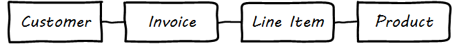
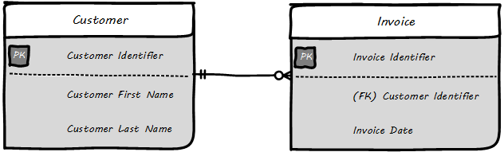
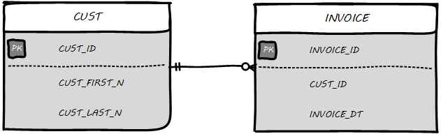
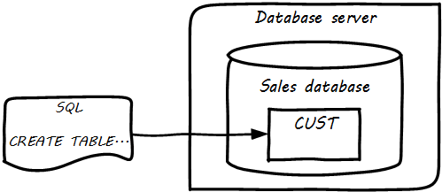
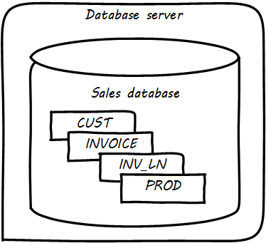

==== Data management basics

===== The importance of context

Information management as we will discuss in the rest of this chapter arises from the large scale absorption of data into highly efficient, miniaturized, automated digital infrastructures with capacity orders of magnitude greater than anything previously known.

But cuneiform and quipu, hash marks on paper, financial ledgers, punched cards, vacuum tubes, transistors, and hard disks represent a continuum, not a disconnected list. Whether we are looking at a scratch on a clay tablet, or the magnetic state of some atoms in a solid state drive, there is one essential question:

*What do we mean by that?*

Consider the state of those atoms on a solid state drive. They represent the numbers 547. But without context, that number is meaningless. It could be:

* The numeric portion of a street address
* A piece of a taxpayer identification number
* The balance on a bank account
* A piece of the data uniquely identifying DNA in a crime

The state of this data may have significant consequences. A destination address might be wrong, a tax return mis-identified. A credit card might be accepted or declined. A mortgage might be approved or denied. Or the full force of the law may be imposed on an offender, including criminal penalties resulting from a conviction on the evidence stored in the computer.

The COBIT Enabling Information guide cite:[ISACA2012b] proposes a layered approach to this problem:

.COBIT Enabling Information layers
[cols="2*", options="header"]
|====
|Layer|Implication
|Physical|The media (paper, electronic) storing the data
|Empirical|The layer that observes the signals from the physical, and distinguishes signal from noise
|Syntactic|The layer that encodes the data into symbols (e.g. ASCII)
|Semantic|The layer providing the rules for constructing meaning from syntactical elements
|Pragmatic|The layer providing larger, linguistic structuring
|Social|The layer that provides the context and ultimately consequence of the data (e.g. legal, financial, entertainment)
|====

Without all these layers, the magnetic state of those atoms is irrelevant.

The physical, empirical, and syntactic layers - (hardware and lowest level software) are  in general out of scope for this book. They are the concern of broad and deep fields of theory, research, development, market activity, and standards.  (Chapter 2 on infrastructure is the most closely related).

A similar but simpler hierarchy is

* Data
* Information
* Knowledge

*Data* is the context-less raw material.

*Information* is data + context, which makes it meaningful and actionable

*Knowledge* is the situational awareness to make use of information

Semantic, pragmatic, and social concerns (information and knowledge) are fundamental to this book and chapter. At digital scale - terabytes, petabytes, exabytes - establishing the meaning and social consequence of data is a massive undertaking.  Data management and records management are two practices by which such meaning is developed and managed operationally. We will start by examining data management as a practice.

===== Data management and the DMBOK

Data management is a long established practice in larger IT organizations. As a profession, it is represented by the Data Management Association (DAMA). DAMA developed and supports the Data Management Body of Knowledge (DMBOK), which is a primary influence on this chapter section.

====== The Data Management Body of Knowledge

anchor:DMBOK[]

The Data Management Body of Knowledge cite:[DAMA2009] is similar to other frameworks presented in this book (e.g. ITIL, COBIT, and PMBOK.) It includes ten major functions:

* Data Governance
* Data Architecture Management
* Data Development
* Data Operations Management
* Data Security Management
* Reference and Master Data Management
* Data Warehousing and Business Intelligence Management
* Document and Content Management
* Meta-data Management
* Data Quality Management

Attentive readers will notice some commonalities with general areas covered in this book: Governance, Architecture, Operations, and Security in particular. Data at scale is a significant problem area and so the DMBOK provides a data-specific interpretation of these broader concerns, as well as more specialized topics.

We won't go through each of the DMBOK functions in order, but we will be addressing most of them throughout this chapter.

===== Data architecture and development

====== Data and process
In order to understand data, we must understand how it is being used. We covered process management in Chapter 9. Data is often contrasted with process: processes take data inputs and produce data outputs. The fundamental difference between the two can be seen in the core computer science concepts of algorithms (process) and data structures.

Data emerges, almost unavoidably, when processes are conceived and implemented. A process such as "Hire Employee" implies that there is an employee, and also a concept of "hire" with associated date and other circumstances.

This may seem obvious, but data structures are surprisingly challenging to develop and gain consensus on.

anchor:ontology-problem[]

====== The ontology problem
[quote, Graeme Simsion, Preface to Kent's Data and Reality]
The boundaries of an entity are arbitrary, our selection of entity types is arbitrary, the
distinction between entities, attributes, and relationships is arbitrary.

Suppose you are discussing the concept of "customer" with a teammate. You seem to be having some difficulty understanding each other. (You are from Support and she is from Sales.) You begin to realize that you have two different definitions for the same word:

* You believe that "customer" means someone who has bought something
* She believes that "customer" includes sales leads

This is a classic issue in data management: when one term means two things. It can lead to serious confusion and technical difficulties, if these misunderstandings affect how systems are built and operated.

Because of this, it is critical to have rational and clear discussions about "what we mean." In a startup driven by one or two visionary founders, perhaps little or no time is needed for this. The mental model of the problem domain may be powerfully understood by the founder, who controls the key architectural decisions. In this way a startup can progress far with little formalized concern for data management.

But as a company scales, especially into multi-product operations, unspoken (tacit) understandings do not scale correspondingly. Team members will start to misunderstand each other, unless definitions are established. This may well be needed regardless of whether data is being held in a database.

The concept of a "controlled vocabulary" is therefore key to enterprise information management.

****
*Definition: Controlled Vocabulary*

"A controlled vocabulary is an information tool that contains standardized words and phrases used to refer to ideas, physical characteristics, people, places, events, subject matter, and many other concepts. Controlled vocabularies allow for the categorization, indexing, and retrieval of information." cite:[Harpring2010]
****

In many areas of business, the industry defines the vocabulary. Retailers are clear on terms like "supplier," "cost," and "retail" (as in amount to be charged for the item; they do not favor the term "price" as it is ambiguous.) The medical profession defines "patient," "provider," and so forth.

But in more flexible spaces, where a company may be creating its own business model, defining a controlled vocabulary may be essential. We see this even in books, which adopt glossaries. Why does a book have a glossary, when dictionaries exist? Because the book is defining a controlled vocabulary. General-purpose dictionaries may list multiple meanings for the same word, or not be very precise. The author, by developing a glossary, can make the book more consistent and accurate.

There are techniques for developing controlled vocabularies in efficient and effective ways. The term "ontology engineering" is sometimes used cite:[DeNicola216]. While specialists may debate the boundaries, another important practice is "conceptual data modeling."

All of these concepts (controlled vocabularies, glossaries, ontologies, conceptual data models) are independent of computers. But the initial development of controlled vocabulary is the first step towards automating the information with computers.

anchor:data-modeling[]

====== Data modeling
[quote, William Kent, Data and Reality]
An information system (e.g., database) is a model of a small, finite subset of the real world...We expect certain correspondences between constructs inside the information system and in the real world. We expect to have one record in the employee file for each person employed by the company. If an employee works in a certain department, we expect to find that department's number in that employee's record.

Databases are the physical representation of information within computing systems. As we discussed above, the data contained within them *corresponds* to some "real world" concept we hold.

There are well known techniques for translating concepts (e.g. controlled vocabularies) into technical database structures. The best known of these is relational data modeling.

Relational data modeling is often presented as having three layers:

* Conceptual
* Logical
* Physical

The following descriptions of the layers are typical:

.3 data modeling levels
[cols="2*", options=""]
|====
|Conceptual|Independent of computing platform - no assumption of any database. Does include simple relationships. Does not include attributes.
|Logical|Assumes a database, but not what kind. Includes more detailed relationships and attributes. Human-readable names.
|Physical|Intended for a specific database platform (e.g. Oracle or MySQL). Computer-compatible names. Can be used to generate data definition scripts.
|====

A simple conceptual model might look like as shown in <<fig-conceptual-600-c>>.

[[fig-conceptual-600-c]]
.Conceptual data model

The above model might be a fragment from a sales system. It shows that their are four major _entities_:

* Customer
* Invoice
* Line Item
* Product

This might be elaborated into a logical model (see <<fig-logical-600-c>>).

[[fig-logical-600-c]]
.Logical data model

The logical model includes _attributes_ (Customer First Name). The line between them has particular "adornments" representing a well known data modeling notation called "crow's foot." In this case, the notation is stipulating that one customer may have zero to many invoices, but any invoice must have one and only one customer. Notice also that the entity and attribute names are human-readable.

Then, the logical model might be transformed into physical (see <<fig-physical-600-c>>).

[[fig-physical-600-c]]
.Physical data model

The names are no longer human-readable in full, nor do they have spaces. Common data types such as "name" and "date" have been replaced with brief codes ("N" and "DT"). In this form, the physical data model can be (in theory) translated to data definition language that can result in the creation of the necessary database tables.

====== Database administration
Continuing from above: the data modeling work might have been performed by  a data architect or analyst, or a developer. Perhaps a pictorial representation is not even created (formal data modeling as above is less likely in a startup). But at some point (assuming a relational database) the following statement will be developed:

 CREATE TABLE SALES.CUST
 (CUST_ID NUMBER,
 CUST_FIRST_N VARCHAR2(32),
 CUST_LAST_N VARCHAR2(32))

In the above SQL (Structured Query Language) statement, the Customer entity has been finally represented as a series of encoded statements an Oracle database can understand, including specification of the data types needed to contain Customer Identifier (a Number type) and the customer's first and last names (a 32-character long string field, called "VARCHAR" in Oracle).

If a database administrator (DBA) issues that statement to the Oracle database, the table will be created. Once the structure is created, it can (within limits) hold any number of customers, in terms of knowing their first and last names and an ID number, which might or might not be assigned automatically by the system. (Of course, we would want many more attributes, e.g. customer address.)

IMPORTANT: Notice that this database would only work for regions where customers have "first" and "last" names. This may not be true in all areas of the world. See https://www.kalzumeus.com/2010/06/17/falsehoods-programmers-believe-about-names/[Falsehoods Programmers Believe about Names].

The Oracle software is installed on some node or machine, and receives the statement. The database adds the table suggested (see <<fig-1stTable-400-c>>).

[[fig-1stTable-400-c]]
.Database creates table

Further tables can easily be added in the same manner (see <<fig-multiTbl-400-c>>).

[[fig-multiTbl-400-c]]
.Multiple tables in database

What is a database in this sense? The important point is that it is a common query space - you can ask for data from either the CUST or INVOICE table, or ask the database to "join" them so you can see data from both. (This is how, for example, we would report on sales by customer.)

====== Patterns and reference architectures

Reference architectures and design patterns are examples of approaches that are known to work for solving certain problems. In other words, they are reusable (and usually free) solutions for commonly occurring scenarios. They apply to core software development, often suggesting particular class structures. cite:[Gamma1995] However, the concept can also be applied to data and system architectures, e.g. cite:[Fowler2003], cite:[Betz2011a]. David Hay cite:[Hay1996] and Len Silverston cite:[Silverston2001], cite:[Silverston2001a], cite:[Silverston2008] have documented data models for a variety of industries.

Reference architectures also can provide guidance on data structures, as they often contain industry learnings. Examples include:

.Reference architectures
[cols="3*", options="header"]
|====
|Organization|Domain|Standard(s)
|Tele-Management Forum|Telecommunications|Frameworx, ETom (Enhanced Telecommunications Operating Model), NGOSS, SIDS
|Association for Retail Technology Standards|Retail|ARTS model
|ACORD.org |Insurance|ACORD Framework
|Banking Industry Architecture Network|Banking|BIAN Service Landscape
|The Open Group Exploration, Mining, Metals and Minerals Forum|Exploration, Mining, and Minerals|Exploration and Mining Business Reference Model
|The Open Group IT4IT Forum|Information Technology Management|IT4IT Standard
|====

Patterns and reference architectures can accelerate understanding, but they also can over-complicate solutions. Understanding and applying them pragmatically is the challenge. Certainly, various well-known problems such as customer address management have surprising complexity, and can benefit from leveraging previous work.

====== Section conclusion

The above description is brief and "classic" - the techniques shown here date back decades, and there are many other ways the same problem might be represented, analyzed, and solved. But in all cases in data management, the following questions must be answered:

* What do we mean?
* How do we represent it?

The classic model shown here has solved many business problems at large scale. But there are critical limitations. Continuing to expand one "monolithic" database does not work past a certain point, but fragmenting the data into multiple independent systems and datastores also has challenges. We will discuss these further as the chapter progresses.
